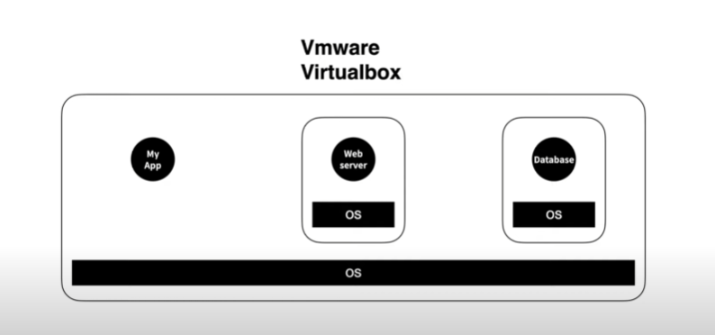
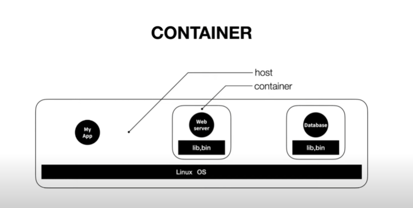
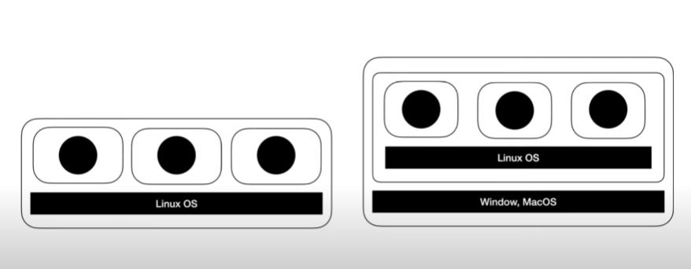
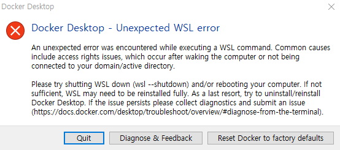

# Doker

## Doker 개념

- 하나의 컴퓨터에 가상 환경의 컴퓨터를 만들고 => 그위에 운영체제를 설치한 후 => 거기에 웹서버를 설치
  ex) Vmware, Virtual Box
  

- 근데 서버를 운용하기 위해 운영체제를 설치 하는것은 좀 아까운일 => 운영체제 용량이 굉장히 큼, 개느림
- 그냥 한대의 컴퓨터(host) 안에서 각각의 앱을 실행시킴 => 각각의 앱은 격리된 환경(container)에서 실행이됨 => 각각의 컨테이너에는 (운영체제 전체가 설치x, 앱을 실행하는데 필요한 라이브러리o, 실행파일o 포함)



- 리눅스 운영체제에는 이러한 실행방법이 내장되어있음 => 이러한 기술을 `Container` => 가장 잘나가는 기술이 `Docker`

## Docker 설치

- docker 와 같은 container 기술은 linux 운영체제 기술 위에서 동작한다고 보면된다.
- 그러면 window, macos 와 같은 운영체제에서는 사용을 할 수 없는 것일까? => No!
  => 로컬에 가상머신을 깔고 => linux 운영체제를 설치해서 그위에 띄우면 됨 => 번거로워 보이쥬? 하지만 `docker` 에서 다 처리를 해줌 => 가상머신을 사용하는것이라 어느정도의 속도저하를 감안하긴 해야함



- 다음 사이트에서 설치 가능하다. 본인 운영체제에 맞는 docker 를 설치
  <https://www.docker.com/get-started/>

- 다음과 같은 에러가 뜰때



1.  다운 받았던 도커를 삭제를 한다. (프로그램 제거)

```sh

```
