# Doker

## 1. Doker 개념

- 하나의 컴퓨터에 가상 환경의 컴퓨터를 만들고 => 그위에 운영체제를 설치한 후 => 거기에 웹서버를 설치
  ex) Vmware, Virtual Box
  

- 근데 서버를 운용하기 위해 운영체제를 설치 하는것은 좀 아까운일 => 운영체제 용량이 굉장히 큼, 개느림
- 그냥 한대의 컴퓨터(host) 안에서 각각의 앱을 실행시킴 => 각각의 앱은 격리된 환경(container)에서 실행이됨 => 각각의 컨테이너에는 (운영체제 전체가 설치x, 앱을 실행하는데 필요한 라이브러리o, 실행파일o 포함)


- 리눅스 운영체제에는 이러한 실행방법이 내장되어있음 => 이러한 기술을 `Container` => 가장 잘나가는 기술이 `Docker`

## 2. Docker 설치

- docker 와 같은 container 기술은 linux 운영체제 기술 위에서 동작한다고 보면된다.
- 그러면 window, macos 와 같은 운영체제에서는 사용을 할 수 없는 것일까? => No!
  => 로컬에 가상머신을 깔고 => linux 운영체제를 설치해서 그위에 띄우면 됨 => 번거로워 보이쥬? 하지만 `docker` 에서 다 처리를 해줌 => 가상머신을 사용하는것이라 어느정도의 속도저하를 감안하긴 해야함


- 다음 사이트에서 설치 가능하다. 본인 운영체제에 맞는 docker 를 설치
  <https://www.docker.com/get-started/>

- 다음과 같은 에러가 뜰때

=> 결정적으로는 wsl 버전이 안맞거나 가상화 설정이 안되어있어서 다음창이 떴을 가능성이 높다.


1.  다운 받았던 도커를 삭제를 한다. (프로그램 제거)

2.  `window + x` 누르고 `f` 누르면 앱 및 기능 설정으로 가게되는데

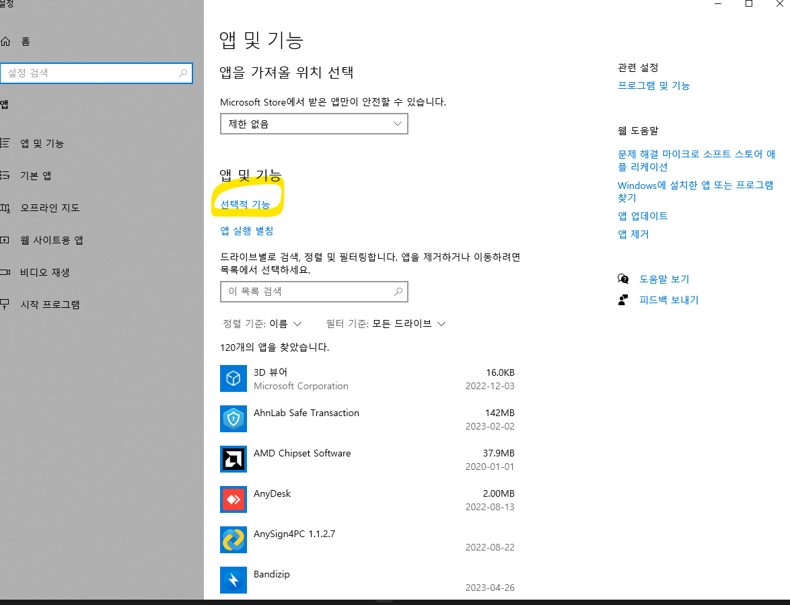

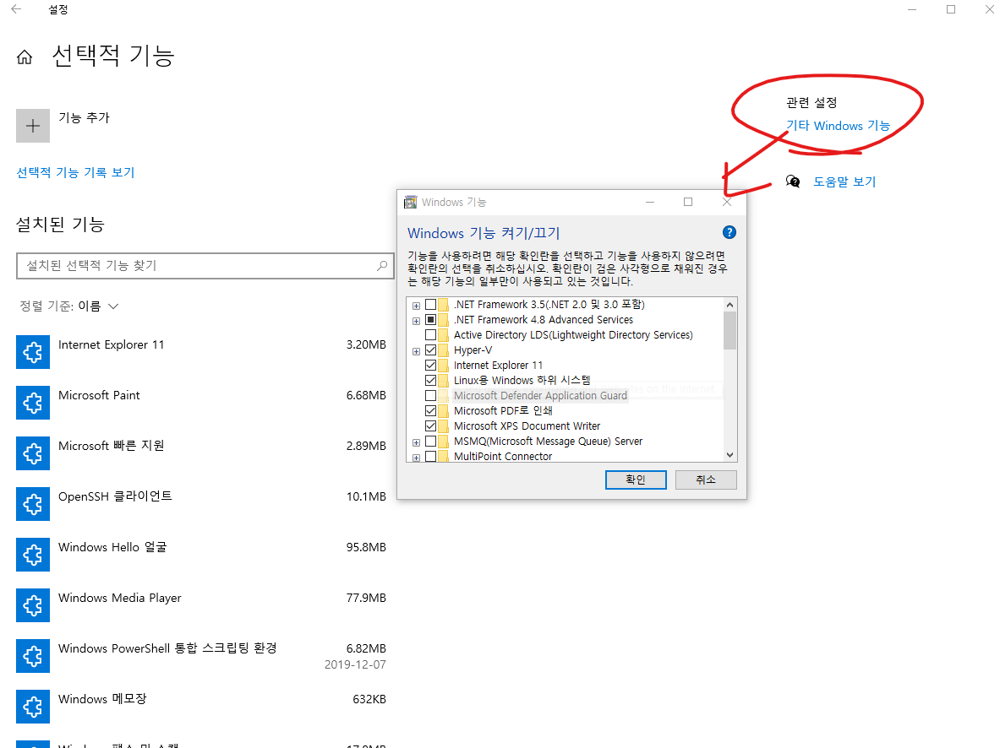

- 아니면 `Windows 기능 켜기/끄기` 를 검색한다.
- 여기서 아래와 같은 부분이 체킹 되어있어야함

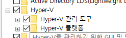

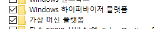

### MSI Bios에서 가상화 활성

- 근데 체킹되어있다고 가상화 설정이 된건 아닌듯 => 컴터를 끄고 검은 화면이 나왔을때 `del` 버튼을 계속 눌러준다.
- OC - Advanced CPU Configuration - SVM mode 활성화 를 시켜준다.

  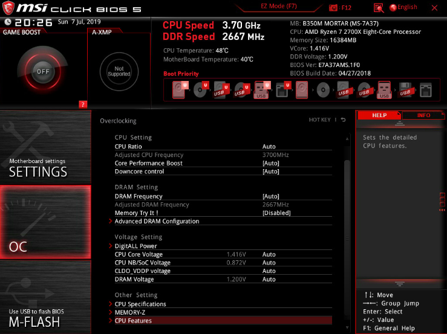

- 그리고 재부팅 ~

- 참고
  <https://velog.io/@jaylnne/WSL-Error-0x80370102-%ED%95%B4%EA%B2%B0>

## 3. image pull 받기

- docker 의 다음과 같은 시스템에서 `docker hub`에서 필요한 image를 다운 받아보자

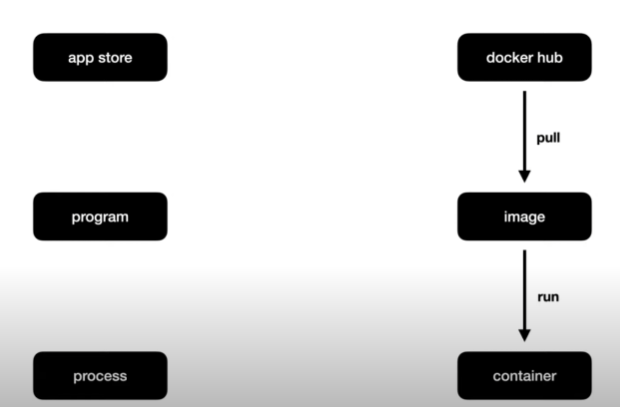

- `apache` 웹서버인 `httped` 를 다운받아보자.
- 저 `official` 이미지는 docker에서 공식적으로 관리한다는 뜻이다.

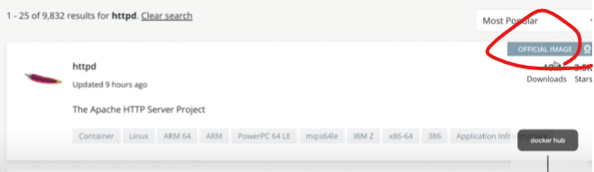

```sh
docker pull httpd
```

- 다음과 같이 cli ref 에서 확인 할 수 있다.

```sh
docker pull [OPTIONS] NAME[:TAG|@DIGEST]
```

<https://docs.docker.com/engine/reference/commandline/pull/>

- 다음과 같이 확인할 수 있다.

```sh
docker images
```

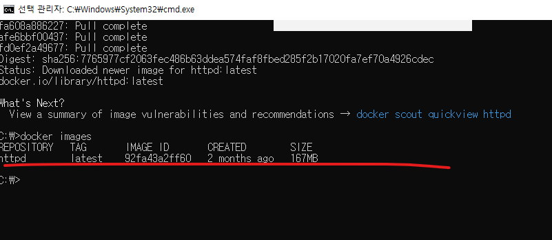

## 4. 컨테이너 run

- gui 에서는 다음과 같은 설정으로 `container` 를 만들수 있다.

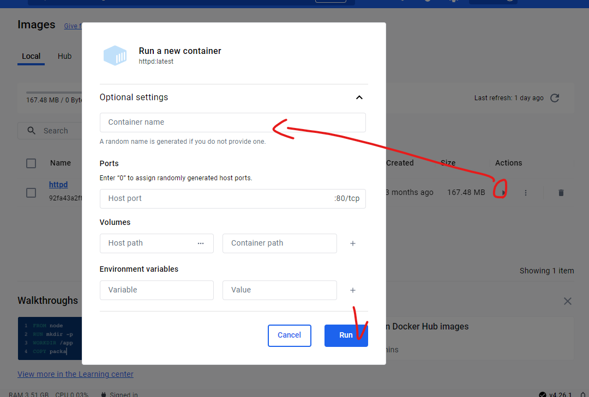

- cli 에서는 어떻게 실행 시킬 수 있을까

```sh
docker run [OPTIONS] IMAGE [COMMAND] [ARG...] #ex  docker run httpd
```

- 만든 container 를 보고 싶을때는 다음과 같이 입력한다.

```sh
docker ps
```

- 하나의 image는 여러개의 container를 만들수 있다. 새로운 container 를 만들려면?

```sh
docker run --name ws2 httpd
```

- container 끄고 싶다면?

```sh
docker stop ws2 # 해당 이름
```

- container 키고 싶다면?

```sh
docker start ws2 # 해당 이름
```

- log 보려면 ?

```sh
docker logs ws2  # 실시간 docker logs -f ws2
```

- 지우고 싶다면? => 실행중이면 못지움

```sh
docker rm ws3
```

- 이미지를 지우고 싶다면

```sh
docker rmi [OPTIONS] IMAGE [IMAGE...] # ex) docker rmi httpd
```

## 5. 네트워크

- 선행학습
  <https://opentutorials.org/course/3084>
  <https://opentutorials.org/course/3265>

### 도커 없이 웹서버를 사용하는 방법

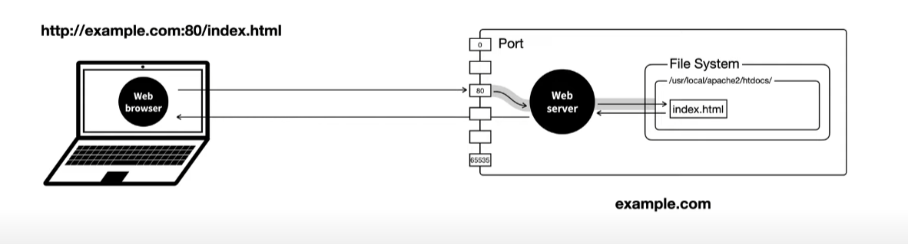

### 도커로 서버연결하는 방법

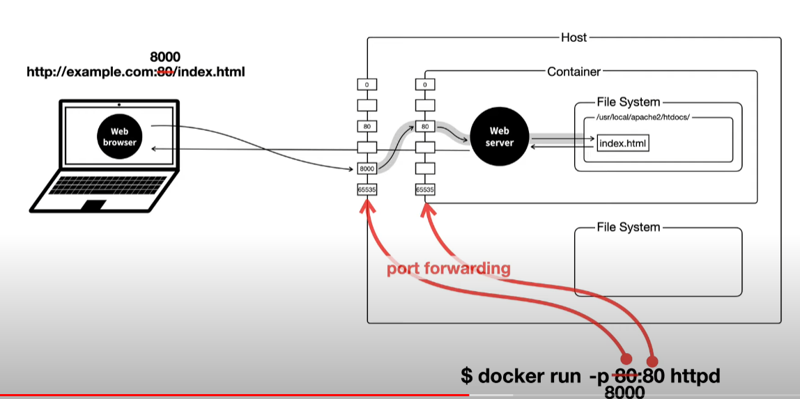

- 다음과 같이 cli 로 연결을 해보자

```sh
docker run --name ws3 -p 8081:80 httpd
```

- `http://localhost:8080/index.html` 접속시 다음과 같은 화면이 보여지며 log에 찍힘

  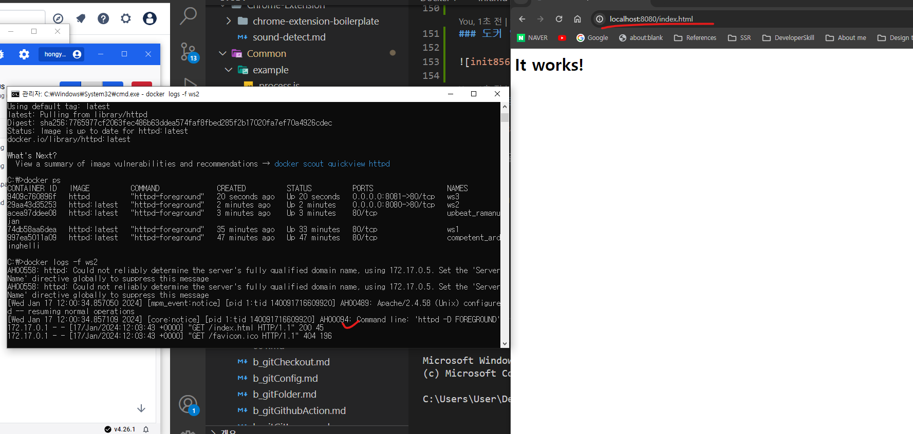

## 6. 명령어 실행

- gui 에서 container 에 들어가서 터미널을 켰다면 cli 에서는 다음과 같이 하면됨

```sh
docker exec [OPTIONS] CONTAINER COMMAND [ARG...] # docker exec ws2 pwd
```

- 지속적으로 연결을 하면서 명령을 전달하고 싶다면?

```sh
docker exec -it ws2 /bin/sh
```

- 다음 두개의 조합이다.

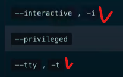

=> 사용자가 입력한 명령을 shell 프로그램이 받아서 운영체제에 전달하는 역활(일종의 창구 같은 역활이라 보면됨)

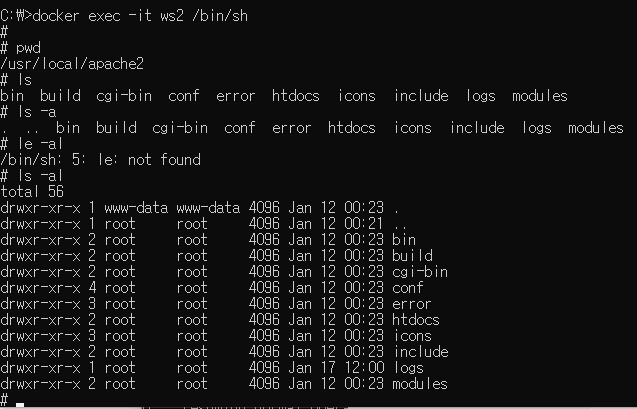

- 다음 디렉터리로 이동후, 파일 내역을 확인하면 `index.html` 을 확인할 수 있는데

```sh
cd /usr/local/apache2/htdocs
ls -al
```

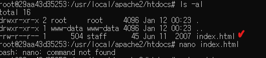

- 여기서 `nano` 에디터를 사용하려면 apt 를 사용하여 설치가능하다.

```sh
apt update # apt 를 최신상태로 업데이트 시킨다.
apt install nano
nano index.html # nano 에디터 킬수있음
```

- 필요부분 수정뒤 `ctrl + x`, `ctrl + y`, `enter` 누른뒤 저장

- 이런식으로 container 내에 안에있는 파일을 바꿀수 있다.

## 7. 호스트와 컨테이너의 파일시스템 연결
