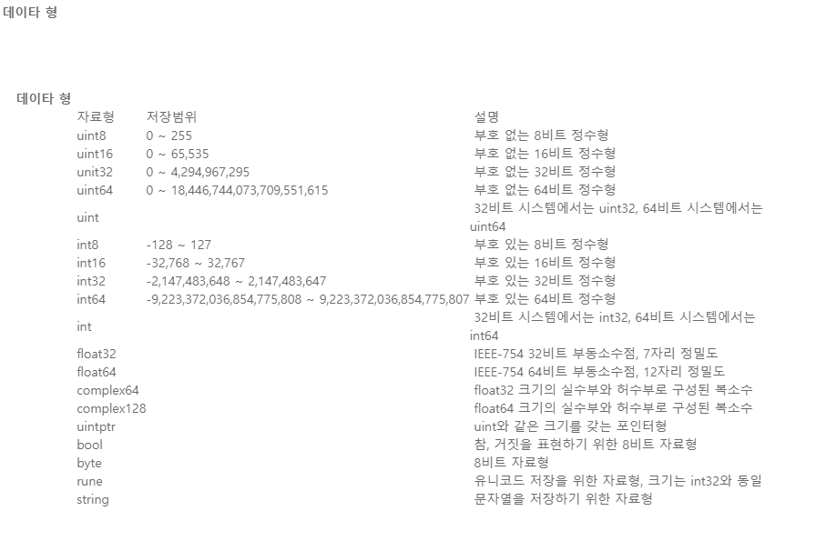

# 01. 변수와 데이터형

- 변수명 안되는거
  > 맨앞숫자x, 공백포함x, 특수문자x, 이미 사용하는 `name` x

```go
    var test1 string // var 변수명 자료형
    test1 = "hello world"
```

```go
package main

import "fmt"

func main() {
    var test1 string
    test1 = "hello world"
    fmt.Println("Hello World")
}

```

- 자료형에는 어떤게 있을까 ?
  

- 만약 자료형 `unit8` 에 그이상의 숫자를 할당한다면

```go
package main

import "fmt"

func main() {
	var number uint8 = 2900
	fmt.Println(number) // overflows error => # command-line-arguments.\test.go:6:20: cannot use 2900 (untyped int constant) as uint8 value in variable declaration (overflows)

    var acc uint8 = 29
	acc += 100
    fmt.Println(acc) // 129

}
```

- 선언후 미사용시 에러 발생
