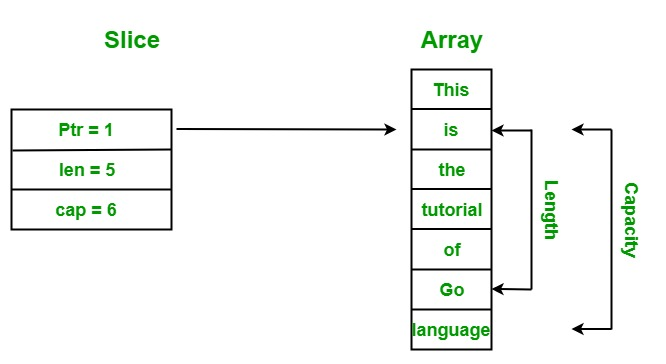

# 배열의 확장이 가능한 slice



## 배열

```go
import "fmt"

func main() {
	var x [5]int = [5]int{1, 2, 3, 4, 5}
	var s []int = x[1:3]
	fmt.Println(s)
}

// [2 3]
```

- 아래 예시를 보면 `cap` 이해가 좀더 쉬움

```go
package main

import "fmt"

func main() {
	var x [5]int = [5]int{1, 2, 3, 4, 5}
	var s []int = x[0:4] // cap(s) = len(s) - s[0]
	fmt.Println(cap(s))
}

// 5
```

## slice

- 여기서의 `cap` 은 기본배열 `length` + 기본배열 `cap` 을 반환함

```go
package main

import "fmt"

func main() {
	var x []int = []int{1, 2, 3, 4, 5}
	b := append(x, 7, 9)
	fmt.Println(cap(b)) // len(x) + cap(x)
}

```
