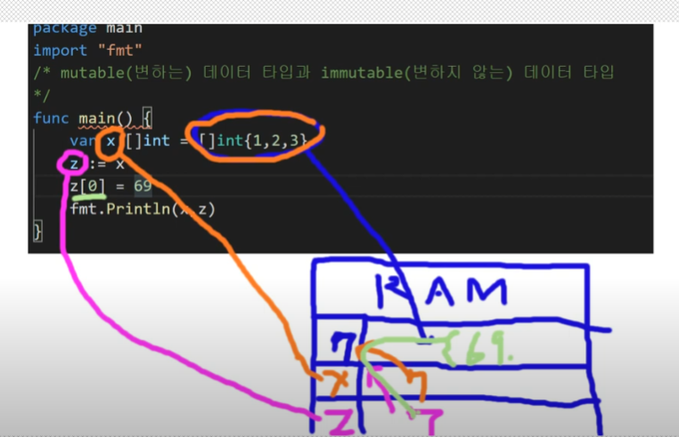

# 불변 자료형 & 가변 자료형

- go 에서도 js 와 마찬가지로 slice 요소를 바꾸게되면 같은 메모리를 참고하고 있는 변수값이 함께 바뀌게 된다.(pointer 개념)

```go
package main

import "fmt"

func main() {
	var x = []int{1, 2, 3, 4}
	z := x
	z[0] = 12
	fmt.Println(x, z)
}

// [12 2 3 4] [12 2 3 4]
```



- 하지만 다음과 같이 `append()` 를 사용하게 되면 서로 다른 참조값을 가지게 됨

```go
package main

import "fmt"

func main() {
	var x = []int{1, 2, 3, 4}
	z := append(x, x...)
	z[0] = 12
	fmt.Println(x, z)
}

// [1 2 3 4] [12 2 3 4 1 2 3 4]
```
