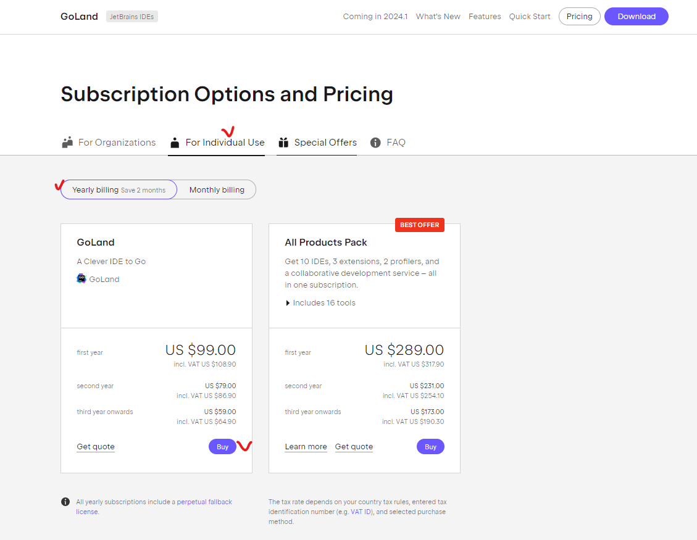
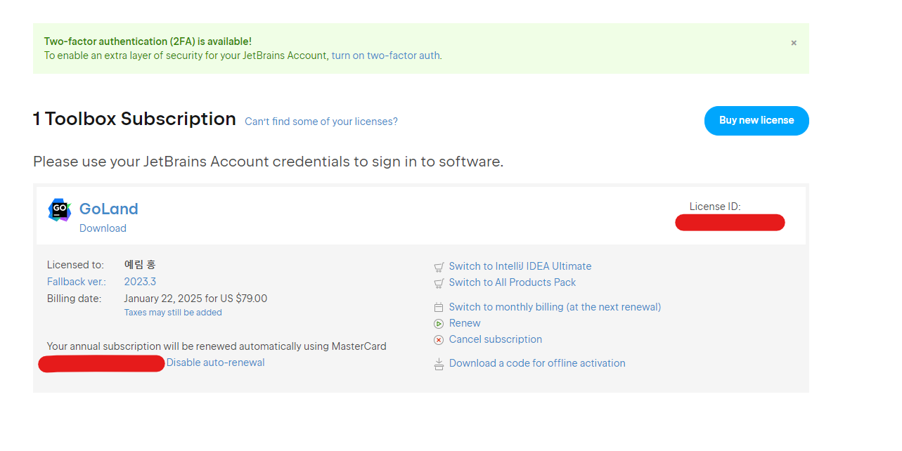
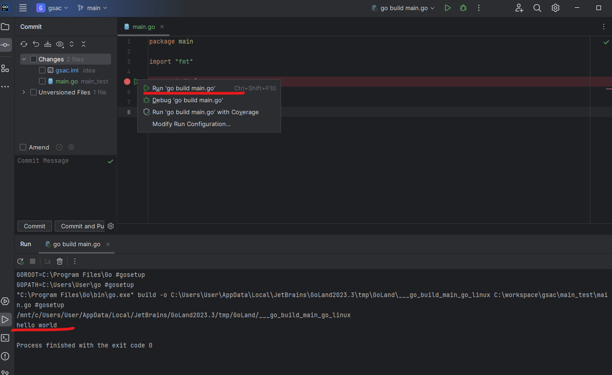
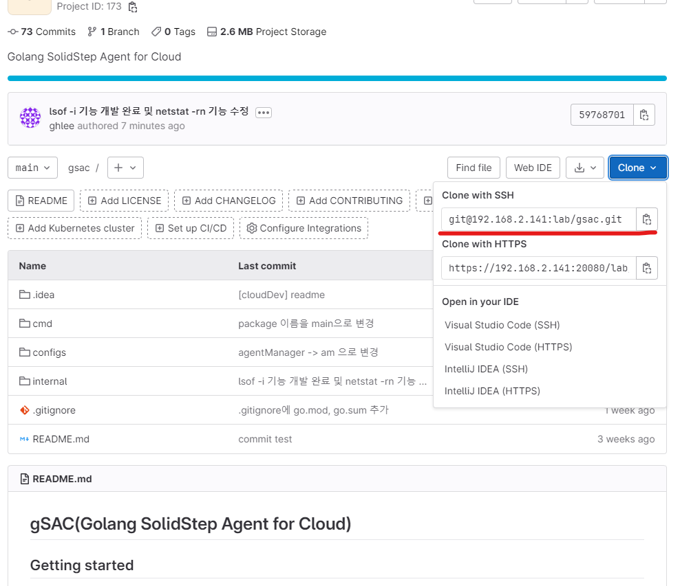

# 초기 세팅

## 01. goland 설치

### goland 결제 및 확인

- goland 접속 후 다음 서비스를 구매한다.

  <https://www.jetbrains.com/go/buy/#personal?billing=yearly>
  

- my page 가서 다음과 같은 내역을 확인할 수 있다.



- down 받은 파일 설치 후 `test.go` 파일을 생성한다.

```go
package main

import "fmt"

func main() {
 fmt.Println("hello world")
}
```

- 다음과 같이 함수 중단점 옆에 마우스 오른쪽 클릭시 => 실행목록이 있는데 클릭하면 다음과 같이 compile 이 실행되어 출력된다.

  

## 02. 그 밖의 tool 설치

### MobaXterm 세팅

- 원격 `lab` 폴더에서 설치를 할수 있는데 다음과 같은 경로의 `MobaXterm` 폴더를 복사해옴

`\\192.168.1.112\lab\HOME\simuiji\MobaXterm`

- `192.168.204.1` => test 서버 에서 계정 로그인을 먼저 해야함.
  - 계정정보
    - ID : root
    - PW : ssrinc!123

## 03. git 환경 세팅

### gitlab 세팅

- 다음 사이트 접속
  <https://192.168.2.141:20080/>

- `git clone`


