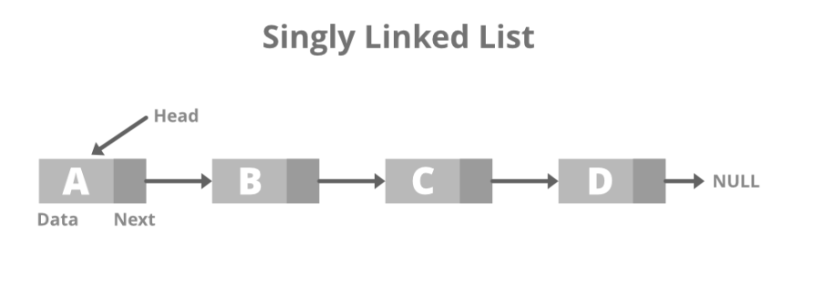

# array 와 linked list

## 가장 기본적인 두 자료구조

- 모든 자료구조의 기본 자료구조
- 모든 자료구조는 `Array` 나 `Linked list` 에서 시작함
- 둘의 차이를 정확하게 알고 있어야함

## Array

- 고정길이 배열
- 연속된 메모리 블럭

## Linked list

- 포인터로 연결한 노드들로 구성
- 불연속 메모리
- Graph(상위범주)의 일종 => node 와 edge로 이루어짐

  - 하위범주
    linked list(node 여러개와 edge 하나)
    

    tree

```go
package main

import "fmt"

type Node[T any] struct {
	next *Node[T] // next 하나만 있으면 Single Linked list
	prev *Node[T] // Double linked list
	val  T
}

func main() {
	root := &Node[int]{nil, 10}
	root.next = &Node[int]{nil, 20}
	root.next.next = &Node[int]{nil, 30}

	fmt.Println("Hello, 예림")

	for n := root; n != nil; n = n.next {
		fmt.Printf("node val: %d\n", n.val)
	}
}

```

- Single Linked list 와 Double Linked list
