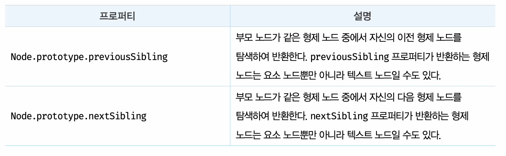

# 39장 DOM

- DOM(DOM 트리)? HTML 문서의 계층적 구조와 정보를 표현하며 이를 제어할 수 있는 API, 즉 프로퍼티와 메서드를 제공하는 트리 자료구조

- 노드 객체들로 구성된 트리자료 구조

## 39.1 노드
### 39.1.1 HTML 요소와 노드 객체
- HTML 요소란 ? HTML 문서를 구성하는 개별적인 요소
```
시작태그     어트리뷰트값   종료태그
<div class = "인사">안뇽</div>
    어트리뷰트이름    컨텐츠
```
- 노드변환요소 : 요소노드 div + 어트리뷰트 노드 class = "인사" + 텍스트노드 안뇽
- HTML 요소를 객체화한 모든 노드 객체 -> 트리자료구조 로 구성
    #### 트리자료구조(부모노드 + 자식노드) : 계층적 구조(비선형 자료구조), 최상위노드(부모노드 x,루트노드라고 불림, 자식노드 없을시 -> 리플노드)포함


### 39.1.2 노드 객체의 타입(그림 39-4)


- 문서노드 : DOM 트리의 최상위에 존재하는 루트노드 -> documents 객체를 가리킴/ window.document or document 참조 ㄱㄴ
- 요소노드 : HTML 요소를 가리키는 객체-> 문서의 구조를 표현
- 어트리뷰트 노드 : HTML 요소의 어트리뷰트를 가리킴, 요소노드애만 연결
- 텍스트 노드 : HTML 요소의 텍스트를 가리킴

- 그밖에 노드 -> Comment 노드, Document Type 노드, DocumentFragment 노드 등 총 12타입의 노드

### 39.1.3 노드 객체의 상속 구조
- DOM ? API(프로퍼티 + 메서드)를 제공하는 트리 자료구조


- input 요소 노드객체는 프로토타입 체인에 있는 모든 프로토타입의 프로퍼티나 메서드를 상속박아 사용 ㄱㄴ


- 노드객체의 상속구조는 개발자 도구의 Elements 패널 우측의 Propertise 패널에서 확인 ㄱㄴ


- DOM은 HTML문서의 계층적 구조와 정보를 표현, 노드객체의 종류(DOM API = 프로퍼티 + 메서드) -> API 통해 내용 또는 스타일 동적조작 ㄱㄴ


## 39.2 요소 노드 취득
- 여러 요소 노드의 취득은 HTML 요소를 조작하는 시작점 -> DOM은 다양한 메서드 제공

### 39.2.1 id를 이용한 요소 노드 취득
- 단 하나의 요소노드만을 반환
- id 존재 안할시 -> null 값 반환
- 어트리뷰트 부여시 동일한 이름의 전역변수가 암묵적으로 선언

### 39.2.2 태그 이름을 이용한 요소 노드 취득
- getElementsByTagName 메서드는 여러개의 요소 노드 객체를 갖는 DOM 컬렉션 객체인 HTMLCollection 객체를 반환 -> 유사배열객체, 이터러블
- 모든 요소 취득시 인수로 '*'

### 39.2.3 class를 이용한 요소 노드 취득
- getElementsByTagName 메서드와 마찬가지로 getElementsByClassName 메서드는 여러개의 요소 노드 객체를 갖는 DOM 컬렉션 객체인 HTMLCollection 객체를 반환 

### 39.2.4 CSS 선택자를 이용한 요소 노드 취득
- 인수로 전달한 css 선택자를 만족시키는 요소노드가 여러개인 경우 첫번째 노드만 반환
- 인수로 전달한 css 선택자를 만족시키는 요소노드가 존재하지 않는 경우 null 반환
- 인수로 전달한 css 선택자가 문법에 맞지 않는 경우 DOMException 에러 발생

### 39.2.4 css 선택자를 이용한 요소 노드 취득
- css 선택자 문법을 사용하는 querySelector,querySelectorAll 메서드는 getElementById, getElementBy*** 메서드보다 다소 느림 but 구체적이고, 일관된 방식으로 노드 취득 ㄱㄴ(아래방법권장)
- id -> getElementById 메서드 사용
- 그외 querySelector,querySelectorAll 메서드 사용

### 39.2.5 특정 요소 노드를 취득할 수 있는지 확인
- Element.prototype.matches 메서드는 css 선택자를 통해 특정요소노드를 취득할수 있는지 확인

### 39.2.6 HTMLCollection 과 NodeList
- HTMLCollection 과 NodeList(유사배열객체, 이터러블) : DOM API가 여러개릐 결과 값을 반환하기 위한 DOM 컬렉션 객체 -> 노드객체의 상태를 실시간으로 반영하는 '살아있는객체'

#### HTMLCollection
-  노드객체의 상태를 실시간으로 반영하는 '살아있는객체'
- for 문으로 순회하면서 노드객체의 상태를 변경해야할때 주의 -> for문을 역방향으로 순회하는 방법으로 회피 ㄱㄴ
- while 문으로도 노드객체가 남아있지 않을때까지 무한반복하는 방법으로도 ㄱㄴ
- 그냥 HTMLCollection 쓰지마..

### NodeList 
- 실시간으로 노드 객체의 상태변경을 반용하지 x
- childNodes 프로퍼티가 반환하는 NodeList 객체는 HTMLCollection 객체와 같이 실시간으로 live 객체로 동작 -> 주의 ! !


- 노드 객체의 상태 변경과 상관없이 안전하게 DOM 컬렉션을 사용하려면 HTMLCollection 과 NodeList 객체를 배열로 변환 -> 사용
- 스프레드 문법이나 Array.from 메서드 사용시 -> 배열변환 ㄱㄴ

## 39.3 노드 탐색

- 노드탐색 프로퍼티 -> 접근자 프로퍼티(setter 없이 getter 만 존재)

### 39.3.1 공백 텍스트 노트
- HTML 요소사이의 스페이스, 탭, 줄바꿈(개행)등의 공백문자는 텍스트 노드를 생성-> 공백텍스트노드


### 39.3.2 자식 노드 탐색


### 39.3.3 자식 노드 존재 확인
- 확인방법 : Node.prototype,hasChildNodes 메서드 사용 true/false 로 자식노드 존재여부 반환
- 자식노드중 텍스트노드가 아닌 요소존재여부 확인 -> children.length or childElementCount 프로퍼티를 사용

### 39.3.4 요소 노드의 텍스트 노드 탐색
- firstChild 프로퍼티로 접근 ㄱㄴ-> 텍스트노드/ 요소노드

### 39.3.5 부모노드 탐색
- 부모노드가 텍스트 노드인 경우 x

### 39.3.6 형제 노드 탐색



## 39.4 노드 정보 취득


## 39.5 요소 노드의 텍스트 조작
### 39.5.1 nodeValue(텍스트 노드에만 적용)
- 노드 탐색, 노드 정보 프로퍼티 -> 읽기 전용 접근자 프로퍼티/ 참조, 할당 모두 가능
- nodeValue 프로퍼티를 참조시 노드 객체의 값(텍스트 노드의 텍스트)을 반환
- 문서, 요소 노드에는 -> null 반환
- 텍스트 값 변경 ㄱㄴ
    1. 텍스트를 변경할 요소노드 취득 -> 탐색(firstChild 프로퍼티 사용)
    2. 탐색한 텍스트 노드틔 nodeValue 프로퍼티 사용 -> 값 변경


### 39.5.2 textContent
- Node.prototype.textContent 프로퍼티는 setter/getter 모두 존재하는 접근자 프로퍼티
- 요소노드의 textContent 프로퍼티 참조시 -> 요소 노드 텍스트 모두 반환(HTML 마크업 무시)
- textContent와 유사한 동작을 하는 innerText 프로퍼티 
-> 사용하지마셈 why?
    1. innerText 프로퍼티는 css 순종적임-> css에 비표시로 지정된 요소노드의 텍스트 반환 x
    2. innerText 프로퍼티는 css를 고려해야함 -> textContent 프로퍼티보다 느림


## 39.6 DOM 조작
- 새로운 노드 생성, DOM에 추가, 기존노드 삭세 및 교체 -> 리플로우, 리페인트 발생
- 복잡한 컨텐츠를 다루는 DOM 조작은 성능 최적화를 위해 주의해서 다뤄야함

### 39.6.1 innerHTML
- 요소 노드의 HTML 마크업을 취득하거나 변경
- innerHTML 프로퍼티는 HTML 마크업이 포함된 문자열을 그대로 반환
- 간단한 DOM 조작이 가능함
- 사용자로부터 입력받은 데이터를 그대로 innerHTML 프로퍼티에 할당하게 되면  "크로스 사이트 스크립팅 공격" 에 취약함으로 위험함
- HTML 새니티제이션 : 사용자로 부터 입력받은 데이터에 의해 발생될 수 있는 크로스 사이트 스크립팅 공격을 예반하기위해 잠재적 위험을 제거 -> DOMPurify 라이브러리 사용 권장
- 새로운 요소를 삽입시 삽입될 위치를 지정할 수 없음

### 39.6.2 insertADjacentHTML 메서드
- Element.prototype.insertADjacentHTML 메서드는 기존 요소를 제거 하지 않으면서 위치를 지정해 새로운 요소 삽입
- innerHTML 프로퍼티보다 효율적이고 빠름
- "크로스 사이트 스크립팅 공격" 에 마찬가지로 취약함

### 39.6.3 노드 생성과 추가
- DOM 은 노드를 직접 생성/삽입/삭제/치환 하는 메서드도 제공


#### 요소노드 생성
- creatElement 메서드의 매개변수 tagName에는 태그 이름을 나타내는 문자열을 인수로 전달
- DOM에 추가되지 않고 홀로 존재하는 상태
- 자식노드도 없는 상태

#### 텍스트 노드 설정
- Document.prototype.createTextNode(text) 메서드는 텍스트 노드를 생성, 반환
- 텍스트 노드는 요소노드의 자식노드
- but 추가 안되고, 홀로 존재하는 상태

#### 텍스트 노드를 요소노드의 자식 노드로 추가
- Node.prototype.appendChild(children) 메서드는 매개변수 childNode에게 인수로 전달한 노드를 appendChild 메서드를 호출한 노드의 마지막 자식 노드로 추가

#### 요소노드를 DOM에 추가
- Node.prototype.appendChild 메서드를 사용하여 텍스트 노드와 부자 관계로 연결한 요소노드를 #fruits 요소 노드의 마지막 자식요소로 추가함


### 39.6.4 복수의 노드생성과 추가
- 기존 DOM 요소노드를 반복하여 추가하는 것은 비효율적
- 컨테이너 요소 사용 -> 미리생성 -> DOM에 추가해야 할 3개 요소노드를 컨테이너 요소에 자식노드로 추가, 컨테이너 요소를 #fruit 요소에 자식으로 추가한다면 DOM은 한번만 변경됨 -> 불필요한 컨테이너 요소 포함됨 -> 바람직하지 않음
- DocumentFragment 노드를 통해 해결가능
    - DocumentFragment 노드는 노드 객체 일종
    - 비어있는  DocumentFragment 노드를 생성 및 반환
    - 리플로우와 리페인트도 한번만 실행
    - 여러개의 요소노드를 DOM에 추가하는 경우 더 효율적

### 39.6.5 노드 삽입
#### 마지막 노드로 추가
- Node.prototype.appendChild 메서드는 인수로 전달받은 노드를 자신이 호출한 노드의 마지막 자식노드로 DOM에 추가함, 위치지정 x

#### 지정한 위치에 노드 삽입
- Node.prototype.insetBefore(newNode, childNode) 메서드는 ->  첫번째 인수로 전달 받은 노드를 두번째 인수로 전달받은 노드 앞에 삽입

### 36.6.6 노드 이동
- appendChild/ insetBefore 메서드 사용

### 39.6.7 노드 복사
- Node.prototype.cloneNode 메서드 사용( 깊복, 얕복 가능-> 매개변수 deep을 true / fales 에 따라서)

### 39.6.8 노드 교체
- Node.prototype.replaceChild 메서드 이용, 기존 노드는 DOM 에서 제거됨


### 39.6.9 노드 삭제
- Node.prototype.removeChild 메서드 사용