# 40장 이벤트

## 40.1 이벤트 드리븐 프로그래밍
- 어플리케이션이 특정 타입의 이벤트에 대해 반응 -> 해당타입 이벤트 발생 -> 호출될 함수를 브라우저에 알려 호출위임
- 호출될 함수 -> 이벤트 핸들러
- 브라우저에게 이벤트 핸들러의 호출을 위임 -> 이벤트 핸들러 등록
- 이벤트 드리븐 프로그래밍 : 프로그램의 흐름을 이벤트 중심으로 제어하는 프로그래밍 방식
- 프로그램이 키의 누름이나 마우스의 이동과 같은 사건이 발생하는지를 끊임없이 감시하고, 그러한 사건의 발생에 대하여 반응하도록 프로그램을 작성하는 방법.

```html
<!DOCTYPE html>
<html>
<body>
    <button>클릭해</button>
    <script>
        const $button = document.querySelector('button');

        //사용자가 버튼을 클릭하면 함수를 호출하도록 요청
        $button.onclick = () => { alert('button click'); };
    </script>
</body>

</html>
```

## 40.2 이벤트 타입
- 이벤트 타입 : 이벤트의 종류를 나타내는 문자열
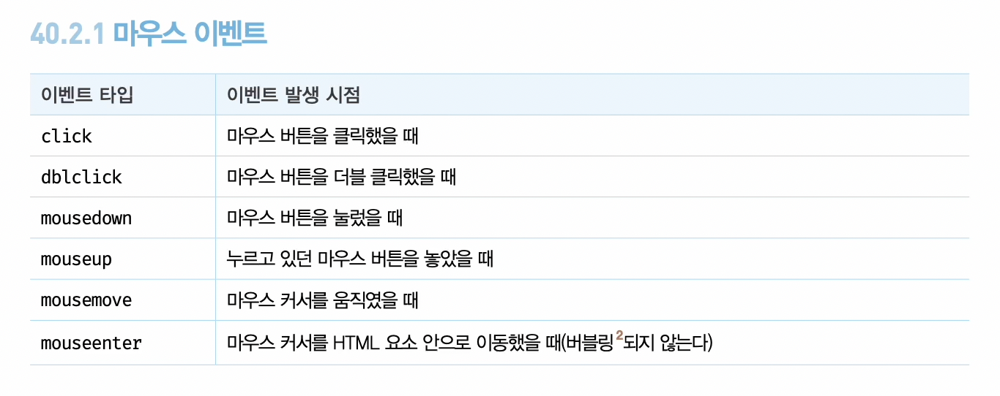
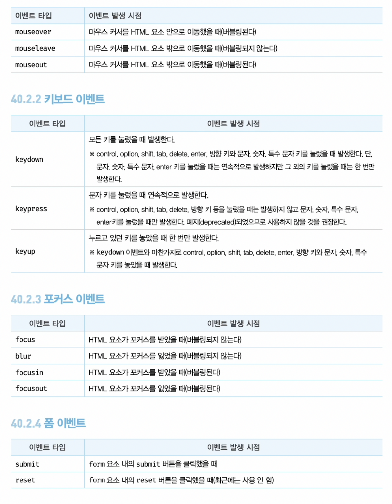
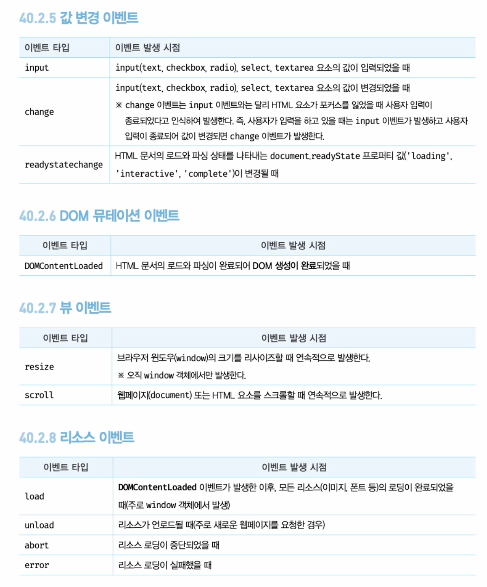

## 40.3 이벤트 핸들러 등록
- 이벤트 핸들러 : 이벤트 발생시 브라우저에 호출을 위임한 함수, 이벤트 발생시 브라우저에 의해 호출될 함수.


### 40.3.1 이벤트 핸들러 어트리뷰트 방식
- 이벤트 핸들러 어트리뷰트 값(onclick, on 접두사와 이벤트 종류를 나타내는 이벤트 타입)으로 <mark>함수 호출문 등의 문을 할당</mark>하면 이벤트 핸들러가 등록됨
- <mark>이벤트 핸들러 어트리뷰트 값으로 함수 참조가 아닌 함수 호출문 등의 문을 할당</mark>
- 이벤트 핸들러 어트리뷰트 값 -> 암묵적으로 생성될 이벤트 핸들러의 함수 몸체를 의미
```html
<!DOCTYPE html>
<html>
<body>
    <button onclick="sayHi('yelim')">클릭해</button>
     <!-- <button onclick="sayHi">클릭해</button> : 인수전달 힘들어짐-->
    <script>
        function sayHi(name){
            console.log(`안녕! ${name}?`);
        }
    </script>
</body>

</html>
```
- 모던 자바 스크립트에서 이벤트를 핸들러 어트리뷰트 방식을 사용하는 경우
    - Angular
    ```html 
        <button (click)="handleClick($event)">저장</button>
    ```
    -{ React } 
    ```html 
        <button onClick={handleClick}>저장</button>
    ```
    - Svelte 
    ```html 
        <button on:click={handleClick}>저장</button>
    ```
    - Vue.js
    ```html 
        <button v-on:click="handleClick($event)">저장</button>
    ```

### 40.3.2 이벤트 핸들로 프로퍼티 방식
- 이벤트 핸들러 프로퍼티에 함수를 바인딩하면 이벤트 핸들러가 등록됨
```html
<!DOCTYPE html>
<html>
<body>
    <button>클릭해</button>
    <script>
        const $button = document.querySelector('button');

        // 이벤트 핸들러 프로퍼티에 이벤트 핸들러를 바인딩
        $button.onclick = function(){
            console.log('버튼클릭^^');
        };
    </script>
</body>

</html>
```
- 이벤트 핸들러를 등록하기 위해서는 <mark>이벤트 타깃</mark>(이벤트를 발생시킬 객체), <mark>이벤트 타입</mark>(이벤트의 종류를 나타내는 문자열), <mark>이벤트 핸들러</mark>를 지정할 필요가 있다.

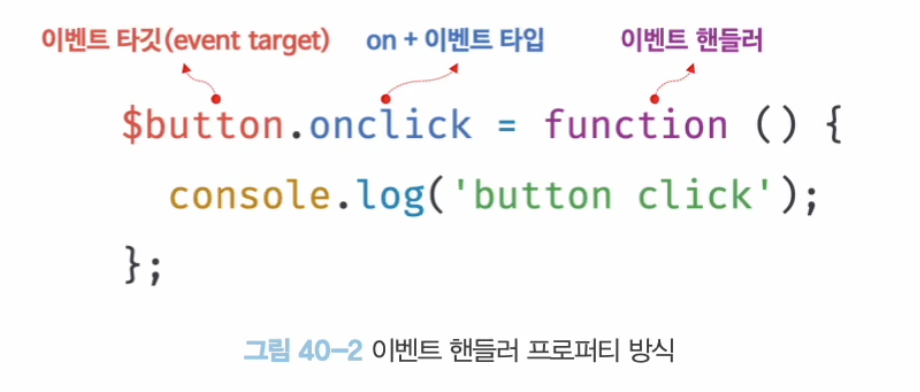

- 이벤트 핸들러는 대부분 이벤트 타깃에 바인딩
- 이벤트 핸들러 어트리뷰트 방식 = 이벤트 핸들러 프로퍼티 방식
- 이벤트 핸들러 프로퍼티에 하나의 이벤트 핸들러만 바인딩 됨

### 40.3.3 addEventListener 메서드 방식

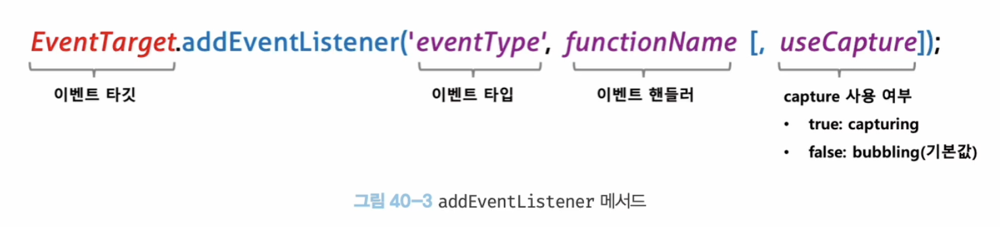

```html
<!DOCTYPE html>
<html>
<body>
    <button>클릭해</button>
    <script>
        const $button = document.querySelector('button');

        // //이벤트 핸들러 프로퍼티 방식
        // $button.onclick = function () {
        //     console.log('버튼 클릭됨')
        // };

        //addEventerListenr 메서드 방식
        $button.addEventListener('click', function () {
            console.log('버튼 클릭됨')
        });
    </script>
</body>

</html>
```
- (동일한 HTML 요소에서 발생된 동일한 이벤트에 대해서) 
- 이벤트 핸들러 프로퍼티 방식 -> 하나 이상의 이벤트 핸들러 등록 x
- addEventListener 메서드는 하나이상의 이벤트 핸들러 등록 ㄱㄴ

```html
<!DOCTYPE html>
<html>
<body>
    <button>클릭해</button>
    <script>
        const $button = document.querySelector('button');

        $button.addEventListener('click', function () {
            console.log('버튼 클릭됨_1')
        });
        $button.addEventListener('click', function () {
            console.log('버튼 클릭됨_2')
        });
    </script>
</body>

</html>
```

## 40.4 이벤트 핸들러 제거
- addEventListener  메서드 제거방법 -> EventTarget.prototype.removeEventListener 메서드를 사용함
- removeEventListener에 전달인수는 addEventListener 메서드와 동일
- 인수 동일하지 않으면 이벤트 핸들러가 제거되지 x

```html
<!DOCTYPE html>
<html>
<body>
    <button>클릭해</button>
    <script>
        const $button = document.querySelector('button');

        const handleClick = () => console.log('버튼 클릭됨');

        // 이벤트 핸들러 등록
        $button.addEventListener('click', handleClick);
        
        // 이벤트 핸들러 제거
        // 전달한 인수가 일치 해야함
        $button.removeEventListener('click', handleClick, true);//실패
        $button.removeEventListener('click', handleClick); //성공
        
    </script>
</body>

</html>
```
- removeEventListener 와 addEventListener 각각의 이벤트 핸들러는 동일한 함수 이어야함
- 무명함수 이벤트 핸들러로 등록한 경우 제거 x
- 기명함수 에벤트 핸들러 내부에서 removeEventListener 호출하여 제거하는 것은 ㄱㄴ
- arguments.callee 사용(최적화 방해 -> stric mode에서 사용 금지)
- 프로퍼티 방식의 이벤트 핸들러는 removeEventListener로 제거 할수 x -> null을 할당한다

## 40.5 이벤트 객체
- 생성된 이벤트 객체는 이벤트 핸들러의 첫번째 인수로 전달됨

```html
<!DOCTYPE html>
<html>
<body>
    <p>클릭 plz</p>
    <em class="message"></em>
    <script>
        const $msg = document.querySelector('.message');
        
        //클릭 이벤트에 의해 생성된 이벤트 객체는 이벤트 핸들러의 첫번째 인수로 전달
        function 좌표보여주삼(e) {
            $msg.textContent = `clientX: ${e.clientX}, clientY: ${e.clientY}`;
        }

        document.onclick = 좌표보여주삼;
    </script>
</body>

</html>
```
- 클릭 이벤트에 의해 생성된 이벤트 객체-> 첫번째 인수로 전달, 매개변수 e에 암묵적으로 할당 -> e 말고, 다른이름 사용하여도 상관 x


### 40.5.1 이벤트 객체의 상속 구조
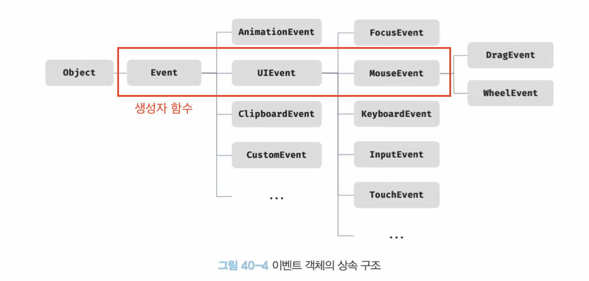

```html
<!DOCTYPE html>
<html>
<body>
    <script>
    //Event 생성자 함수를 호출하여 ho 이벤트 타입의 Event 객체 생성
    let e = new Event('ho');
    console.log(e); //Event {isTrusted: false, type: 'ho', target: null, currentTarget: null, eventPhase: 0, …}

    console.log(e.type);//'ho'
    console.log(e instanceof Event);//true
    console.log(e instanceof Object);//true
    
    //FocusEvent 생성자 함수를 호출하여 focus 이벤트 타입의 FocusEvent 객체를 생성함
    e = new FocusEvent('focus');
    console.log(e); //FocusEvent {isTrusted: false, relatedTarget: null, view: null, detail: 0, sourceCapabilities: null, …}

    //MouseEvent 생성자 함수를 호출하여 click 이벤트 타입의 MouseEvent 객체를 생성함
    e = new MouseEvent('click');
    console.log(e);//MouseEvent {isTrusted: false, screenX: 0, screenY: 0, clientX: 0, clientY: 0, …}

    //KeyboardEvent 생성자 함수를 호출하여 keyup 이벤트 타입의 KeyboardEvent 객체를 생성함
    e = new FocusEvent('keyup');
    console.log(e);//FocusEvent {isTrusted: false, relatedTarget: null, view: null, detail: 0, sourceCapabilities: null, …}

    //InputEvent 생성자 함수를 호출하여 change 이벤트 타입의 InputEvent 객체를 생성함
    e = new InputEvent('change');
    console.log(e);//InputEvent {isTrusted: false, data: null, isComposing: false, inputType: '', dataTransfer: null, …}

    </script>
</body>
</html>
```
- 이벤트 발생시 암묵적으로 생성되는 이벤트 객체도 생성자 함수에 의해 생성
- 생성된 이벤트 객체는 생성자 함수와 더불어 생성되는 프로토타입 체인이 일원이 됨
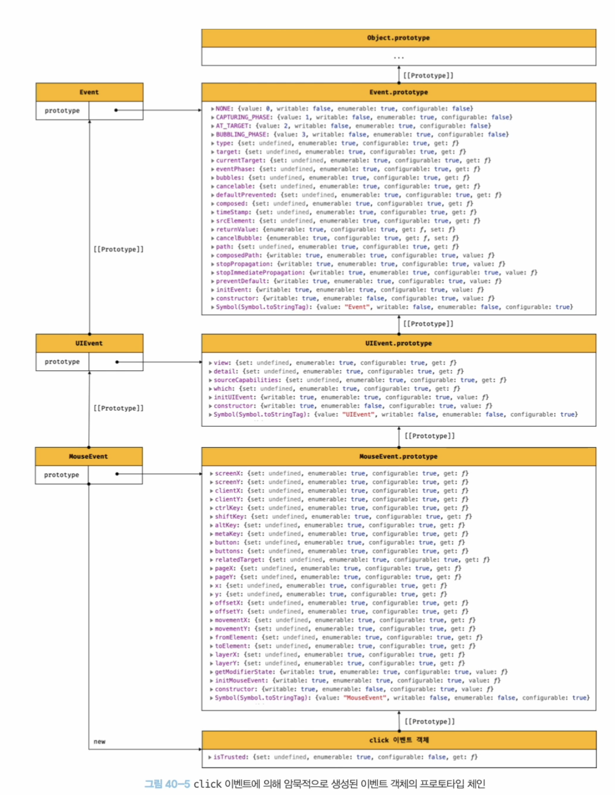

- 이벤트 객체중 일부는 사용자 행위에 의해 생성, 일부는 자스 코드에 의해 인위적으로 생성
- Event 인터페이스는 DOM 내에서 발생한 이벤트에 의해 생성되는 이벤트 객체를 나타냄, 모든 이벤트 객체의 공통 프로퍼티가 정의
- FocusEvent, MouseEvent, KeyboardEvent, WheelEvent 같은 하위 인터페이스에는 고유프로퍼티 정의
```html
<!DOCTYPE html>
<html>
<body>
    <input type="text">
    <input type="checkbox">
    <button>날 클릭해..</button>
    <script>
        const $input = document.querySelector('input[type=text]');
        const $checkbox = document.querySelector('input[type=checkbox]');
        const $button = document.querySelector('button');

        //load 이벤트가 발생하면 Event의 이벤트 객체가 생성됨
        window.onload = console.log;

        //change 이벤트가 발생하면 Event의 이벤트 객체가 생성됨
        $checkbox.onchange = console.log;

        //focus 이벤트가 발생하면 FocusEvent의 이벤트 객체가 생성됨
        $input.onfocus = console.log;

        //input 이벤트가 발생하면 InputEvent의 이벤트 객체가 생성됨
        $input.oninput = console.log;

        //keyup 이벤트가 발생하면 KeyboardEvent의 이벤트 객체가 생성됨
        $input.onkeyup = console.log;

        //click 이벤트가 발생하면 MouseEvent의 이벤트 객체가 생성됨
        $button.onclick = console.log;
    </script>
</body>
</html>
```
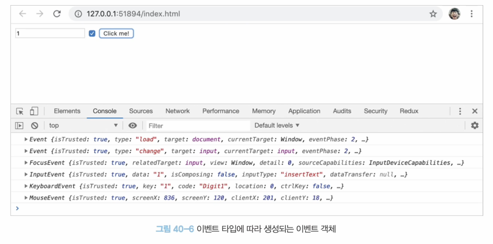

### 40.5.2 이벤트 객체의 공통 프로퍼티
- 이벤트 객체의 공통 프로퍼티
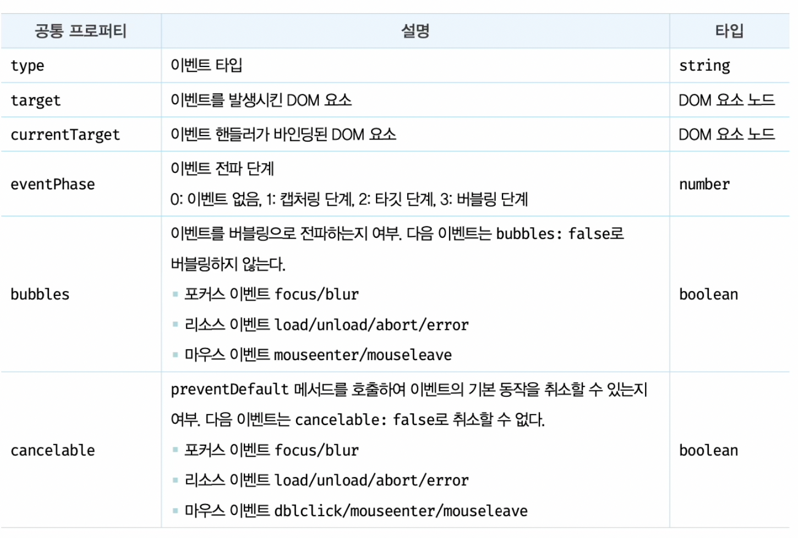
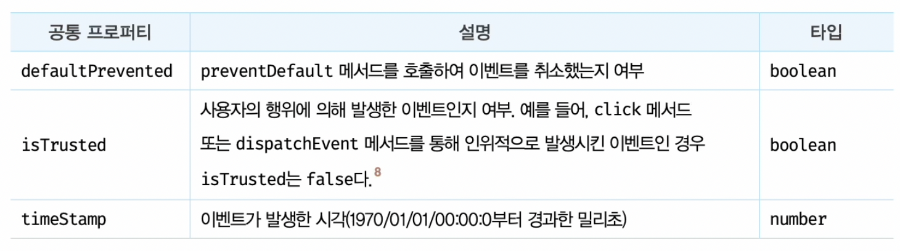

### 40.5.3 마우스 정보 취득
- click, dbclick, mousedown, mouseup, mousemove, mouseenter, mousseleave 이벤트가 발생되면 생성되는 MouseEvent 타입의 이벤트 객체는 다음과 같은 고유의 프로퍼티를 갖는다.
    - 마우스 포인터의 좌표정보를 나타내는 프로퍼티 : screenX/screenY, clientX/clientY, pageX/pageY, offsetX/offsetY
    - 버튼 정보를 나타내는 프로퍼티 : altKey, ctrlKey, shiftKey, button

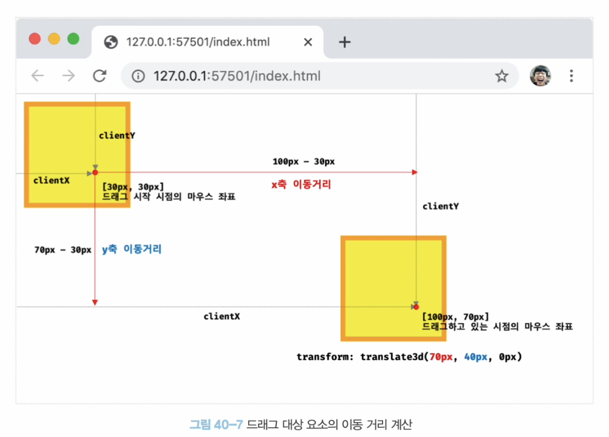

- 드래그는 마우스버튼을 누른상태(mousedown) -> 이동(mousemove) -> 떼면종료(mouseup)
- 드래그의 이동거리를 계산
- 마우스 포인터 좌표는 MouseEvent 타입의 이벤트 객체에서 제공, mousedown, mouseup, mousemove 이벤트 발생시 -> screenX/screenY, clientX/clientY, pageX/pageY, offsetX/offsetY 프로퍼티 제공

### 40.5.4 키보드 정보 취득
- keydown, keyup, keypress 이벤트 발생시 생성되는 keyboard 타입의 이벤트 객체는 -> altKey, ctrlKey, shiftKey, metaKey, Key, KeyCode 같은 고유의 프로퍼티를 갖는다
- input 요소에 keyup 이벤트 핸들러가 두번 호출되는 현상을 피하기위해 keyup 이벤트 대신 keydown 이벤트를 캐치함

## 40.6 이벤트 전파
- 이벤트 전파 : DOM 트리 상에 존재하는 DOM 요소 노드에서 발행한 이벤트는 DOM트 리를 통해 전파되는것

```html
<!DOCTYPE html>
<html>
<body>
    <ul id="fruits">
        <li id="apple">Apple</li>
        <li id="banana">Banana</li>
        <li id="orange">Orange</li>
    </ul>
</body>
</html>

````
- 생성된 이벤트 객체는 이벤트를 발생시킨 DOM 요소인 이벤트 타깃을 중심으로 DOM 트리를 통해 전파된다.
- 다음과 같은 3단계
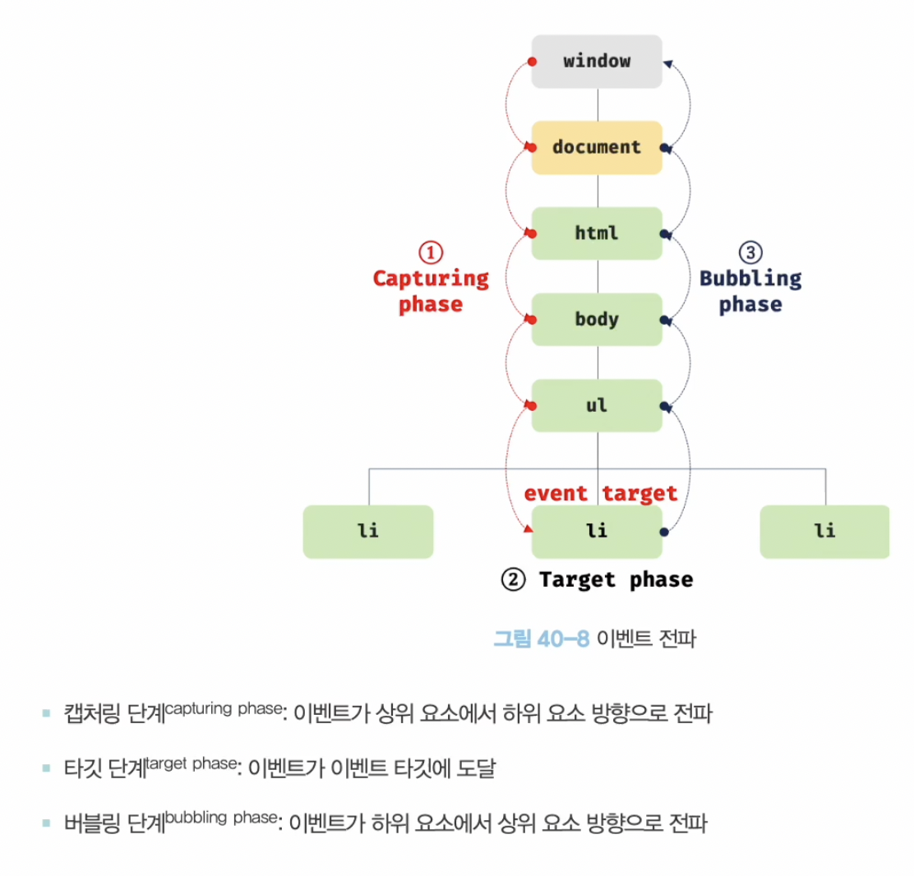

- 이벤트 타깃(event.target)은 li 요소이고 커런트 타깃(event.currentTarget)은 ul 요소이다.

```html
<!DOCTYPE html>
<html>
<body>
    <ul id="fruits">
        <li id="apple">Apple</li>
        <li id="banana">Banana</li>
        <li id="orange">Orange</li>
    </ul>
    <script>
        const $fruits = document.getElementById('fruits');

        // $fruits 요소의 하위요소인 li 요소를 클릭한 경우
        $fruits.addEventListener('click', e => {
            console.log(`이벤트 단계: ${e.eventPhase}`); // 3:버블링 단계
            console.log(`이벤트 타깃: ${e.target}`); // [object HTMLLIElement]
            console.log(`커런트 타깃: ${e.currentTarget}`); // [object HTMLUListElement]
        });
    </script>
</body>
</html>
````
- 캡처링 단계 : li 요소를 클릭-> 이벤트 발생 -> 객체생성(window -> 이벤트 타깃방향)
- 타깃 단계 : 이벤트를 발생시킨 이벤트 타깃에 도달
- 버블링 단계 : 이벤트 타깃 -> window 방향으로 전파
- addEventListener 메서드 방식 이벤트 핸들러 -> 캡처링, 타킷, 버블링 선별적 캐치 ㄱㄴ
- 캡처링 단계의 이벤트 캐치하려면 3번째 인수로 true 전달
- <mark>이벤트는 이벤트를 발생시킨 이벤트 타깃은 물론 상위 DOM 요소에서도 캐치할 수 있다.</mark>

- 다음 이벤트는 버블링을 통해 전파 x, 캡처링 단계에서 이벤트를 캐치해야함
    - 포커스 이벤트 : focus/blur
    - 리소스 이벤트 : load/unload/abort/error
    - 마우스 이벤트 : mouseenter/mouseleave

- 상위요소에서 위에 이벤트를 캐치해야한다면??(버블링 필요하다면)다음으로 대체
    - 포커스 이벤트 : focusin/focusout
    - 마우스 이벤트 : mouseover/mouseout

## 40.7 이벤트 위임
- 이벤트 위임 : 여러개의 하위 DOM 요소에 각각 이벤트 핸들러를 등록하는 대신 하나의 상위 DOM 요소에 이벤트 핸들러를 등록하는 방법을 말함
- 주의사항 ** 상위 요소에 이벤트 핸들러를 등록하기 때문에 이벤트 타깃 DOM 요소가 개발자가 기대한 DOM 요소가 아닐수도 있음
```html
<!DOCTYPE html>
<html>
<head>
    <style>
        #fruits {
            display: flex;
            list-style-type: none;
            padding: 0;
        }

        #fruits li{
            width: 100px;
            cursor: pointer;
        }

        #fruits .active {
            color: red;
            text-decoration: underline;
        }
    </style>
</head>
<body>
    <nav>
        <ul id="fruits">
            <li id="apple" class="active">Apple</li>
            <li id="banana">Banana</li>
            <li id="orange">Orange</li>
        </ul>
    </nav>
    <div>선택된 내비게이션 아이템: <em class="msg">apple</em></div>
    <script>
        const $fruits = document.getElementById('fruits');
        const $msg = document.querySelector('.msg');

        // 사용자 클릭에 의해 선택된 내비게이션 아이템(li 요소)에 active 클래스를 추가하고
        // 그외의 모든 내비게이션 아이템의 active 클래스를 제거한다.
        function activate({ target }){
            //이벤트를 발생시킨 요소(target)가 ul#fruits 의 자식요소가 아니라면 무시한다.
            if (!target.matches('#fruit > li ')) return;

            [...$fruits.children].forEach($fruit => {
                $fruit.classList.toggle('active', $fruit === target);
                $msg.textContent = target.id;
            });
        }


        //이벤트 위임 : 상위요소(ul#fruits)는 하위요소의 이벤트를 캐치할 수 있다.
        $fruits.onclick = activate;
    </script>
</body>
</html>
````

## 40.8 DOM 요소의 기본 동작 조작
### 40.8.1 DOM 요소의 기본 동작 중단
- 이벤트 객체의 preventDefault 메서드는 이러한 DOM 요소의 기본동작을 중단함

### 40.8.2 이벤트 전파 방지
- stopPropagation 메서드는 이벤트 전파를 중지시킨다.(하위 DOM 요소 이벤트를 개별적으로 처리하기위해 사용)

## 40.9 이벤트 핸들러 내부의 this
### 40.9.1 이벤트 핸들러 어트리뷰트 방식
- handleClick 함수내부의 this는 전역객체 window를 가리킴 -> 이벤트 핸들러 프로퍼티 방식과 동일

```html
<!DOCTYPE html>
<html>
<body>
    <button onclick="handleClick()">클릭해</button>
    <script>
       function handleClick() {
           console.log(this);//window
       }
    </script>
</body>
</html>
```

### 40.9.2 이벤트 핸들러 프로퍼티 방식과 addEventListener 메서드 방식
- 이벤트 핸들러 내부 this는 이벤트 객체의 currentTarget 프로퍼티와 같다.
- 화살표 함수는 함수 자체의 this 바인딩을 갖지 않는다.


## 40.10 이벤트 핸들러에 인수 전달
- 이벤트 핸들러 내부에 함수호출하면서 인수 전달 

## 40.11 커스텀 이벤트
### 40.11.1 커스텀 이벤트 생성
- 이벤트 생성자 함수 : Event, UIEvent, MouseEvent -> 임의로 이벤트 타입 지정 ㄱㄴ -> 커스텀이벤트 (개발자의 의도)
    - 인수로 이벤트 타입을 나타내는 문자열을 전달받음
    -
### 40.11.2 커스텀 이벤트 디스패치
- 생성된 커스텀 이벤트는 dispatchEvent 메서드로 디스패치(이벤트를 발생시키는 행위)할 수 있음
- 동기 처리 방식
