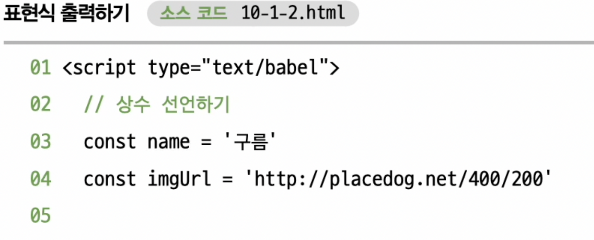
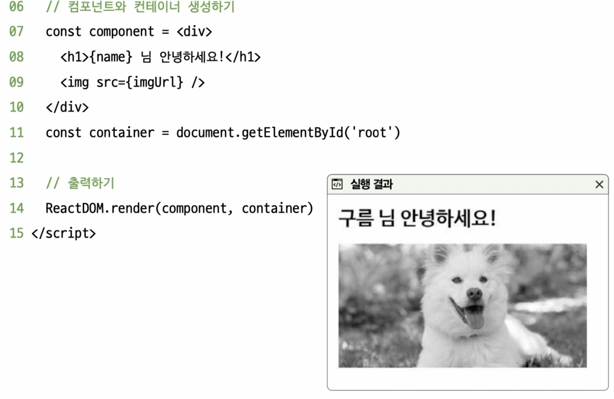
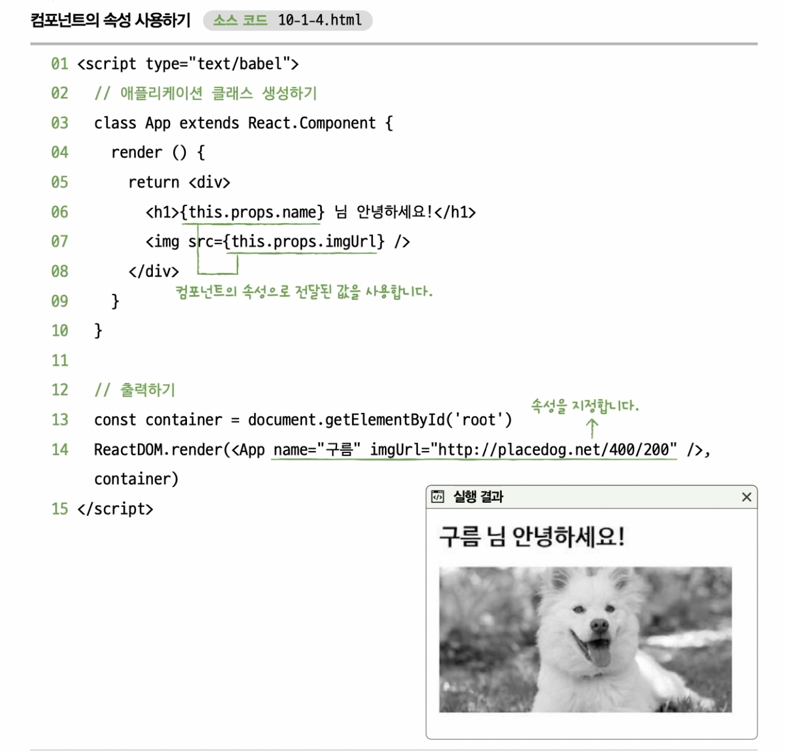

# 10장 리액트
## 10-1 리액트의 기본

- Node.js 없는 리액트 시작하겠습니다.
- 리액트 라이브러리 : 규모가 큰 자스 라이브러리, UI를 쉽게 구성할 수 있도록 도와줌, 대규모 웹 어플리케이션을 체계적으로 개발할 수 있음, 리액트 네이티브를 활용 -> 스마트폰에서도 빠른 속도로 작동하는 어플 제작 가능

### 리액트 라이브러리 사용 준비하기
- 다음과 같은 3개의 자스를 읽어들임
- react.development.js (리액트를 사용하기 위해 필요)
    -  http://unpkg.com/react@17/umd/react.development.js
- react-dom.development.js(리액트를 사용하기 위해 필요)
    - http://unpkg.com/react-dom@17/umd/react-dom.development.js
- babel.min.js (리액트 코드를 쉽게 작성할 수 있기위해 필요)
    - http://unpkg.com/babel-standalone@6/babel.min.js

- 리액트 라이브러리는 단순 자스가 아닌 리액트를 위해 개발된 자스 확장 문법 사용 -> <mark>바벨</mark>을 적용 해야함
```js
<script type="text/babel"></script>
```

### 루트 컴포넌트 출력하기
- 리액트 : 사용자 인터페이스를 쉽게 구성할수 있게 도와주는 라이브러리 
- 컴포넌트 : 화면에 출력되는 요소
- 루트 컴포넌트 : 최상위에 배치하는 컴포넌트

#### 컴포넌트 생성법 (html 요소를 만드는 것과 동일문법)
```
<컴포넌트 이름></컴포넌트 f이름>
```

- 출력시 ReactDOM.render()메소드 사용
- 컨테이너 : 컴포넌트를 출력할 상자

#### 컴포넌트 출력하기

```
ReactDOM.render(컴포넌트, 컨테이너)
```
```js

// 컴포넌트와 컨테이너 생성하기
const conponent = <h1>리액트 기본</h1>
const constainer = document.getElementById('root')


// 출력하기
ReactDOM.render(component, container)

```
1. h1 컴포넌트를 생성하고
2. h1 컴포넌트를 출력할 div#root를 읽어 들인뒤
3. ReactDOM.render() 메소드로 컴포넌트를 div#root 에 출력합니다.

- 자스 코드 내부에 HTML 코드를 사용함 -> JSX(자바스크립트 확장 문법)/ 웹브라우저는 이러한 코드를 읽고 실행하지 x -> 바벨이 JSX 코드를 읽고 일반적인 자스 문법으로 변환후 실행
 

 ### JSX 기본 문법
 - JSX : 태그 만드는 기능 이외에도 태그 내부에 표현식을 삽입 -> 출력
 - 표현식 출력시 {...} 기호를 사용함
 - 속성으로 표현식을 출력시 따옴표를 사용하면 x

 ```
<태그>{표현식}</태그>
<태그 속성 = {표현식} />
```




### 클래스 컴포넌트 
- 클래스 또는 함수를 이용해 컴포넌트를 만들 수있음
- 클래스 컴포넌트 : 클래스로 만든 컴포넌트
- 함수 컴포넌트 : 함수로 만드는 컴포넌트

#### 클래스 컴포넌트 만들기
```js
class 컴포넌트 이름 extends React.Component {
    render () {
        return <h1>출력할 것</h1>
    }
}
```
- React.Component 클래스의 상속을 받아야 컴포넌트로 동작할 수있게 하는 속성과 메소드를 받을 수 있다
- React.Component 클래스는 화면에 무언가를 출력시 render() 메소드를 호출함



#### 클래스의 메소드 오버라이드(구현) 하기
```js
class App extends React.Component {
 constructor (props){
     super(props)
     //생성자 코드
 }

 render () {
     // 출력할 것
 }

 componentDidMount () {
     // 컴포넌트가 화면에 출력될 때 호출 
 }

 componentWillUnmount () {
     // 컴포넌트가 화면에 제거될 때 호출 
 }

}
```
- 변경해서 사용하는 속성으로는 state 속성이 있음 -> 출력할 값을 저장
- state 속성값을 변경할 시 -> setState()메소드를 사용함 

```js
// 상태 선언하기(생성자 위치)
this.state = { 속성 : 값 }
// 상태 변경하기(이외의 위치)
this.setState({ 변경할 속성 : 값})
```

- 리액트를 활용한 현재 시간 출력 프로그램
```js
    class App extends React.Component {
        constructor (props){
            super(props)
            this.state = {
                time: new Date()
            }
        }

        reder () {
            return <h1>{this.state.time.toLocaleTimeString()}</h1>
        }

        conponentDidMount () {
            //컴포넌트가 화면에 출력 되었을때
            this.timerID = setInterval(() => {
                this.setState({
                    time : new Date()
                })
            }, 1000)
        }

        componentWillUnmount () {
            // 컴포넌트가 화면에서 제거 될때
            clearInterval(this.timeId)
        }
    }

    // 출력하기
    const constainer = document.getElementById('root')
    ReactDOM.render(<APP />, container)

```

### 이벤트 연결하기
- 컴포넌트에 이벤트 연결시
```js
class App extends React.Component {
    constructor (props) {
        super(props)
        this.메소드 이름 = this.메소드 이름.bind(this) // (2)메소드에 this를 바인드 합니다.
    }

    render() {
        return <h1 이벤트 이름 ={this.메소드 이름}></h1>
        // (3) 이벤트를 연결합니다
    }

    메소드 이름 (event){
        // 이벤트가 호출될 때 실행할 코드 
        // (1) 메소드를 선언합니다
    }
}
```
```js
// 어플리케이션 클래스 생성하기
class App extends React.Component {
    constructor(props){
        super(props)
        this.state = {
            count : 0
        }

        this.countUp = this.countUp.bind(this)
    }

    render () {
        return <div>
            <h1>클릭한 횟수 : {this.state.count}</h1>
            <button onClick ={this.countUp}>클릭</button>
        </div>
    }

    countUP (event){
        this.setState({
            count: this.state.count + 1
        })
    }
}

// 출력하기
const container = document.getElementById('root')
ReactDOM.render(<APP />, container)
```
### 스타일 지정하기 
- 스타일 지정시 style 속성에 객체를 지정
```js
render () {
    const style = { }
    return <h1 style = {style}>글자</h1>
}
```
- style 객체에는 캐멀 케이스로 속성을 입력
- 숫자를 입력할때 단위를 입력하지 않아도 됨

```js
// 애플리케이션 클래스 생성하기
class App extends React.Component {
    constructor (props) {
        super(props)
        this.state = {
            checked : fales
        }
        this.handleClick = this.handleClick.bind(this)
    }

    render () {
        const textStyle = {
            color : this.state.checked ? 'blue' : 'red'
        }

        return <div>
            <input
              type = "checkbox"
              onClick = {this.handleClick} />
              <h1 style = {textStyle}>글자</h1>
        </div>
    }


    handleClick (event){
        this.setState({
            checked: event.target.checked
        })
    }
}

// 출력하기
const container = document.getElementById('root')
ReactDOM.render(<APP />, container)
```

### 컴포넌트 배열
- 배열을 통해 한번에 여러개의 컴포넌트 출력 가능
```js
//애플리케이션 클래스 생성하기
class App extends React.Component {
    render (){
        const list = [
            <li>사과</li>,
            <li>바나나</li>,
            <li>배</li>,
            <li>귤</li>
        ]

        return <ul>{list}</ul>
    }
}

//출력하기
const container = document.getElementById('root')
ReactDOM.render(<APP />, container)
```

## 10-2 리액트와 데이터
- Flux 패턴을 활용하는 라이브러리들을 사용하면 코드가 훨씬 깔끔해짐

### 여러 개의 컴포넌트 사용하기
- Item 컴포넌트를 만들고 사용하는 예
```js
//애플리케이션 클래스 생성하기
class App extends React.Component {
    render () {
        return <ul>
                <Item />
                <Item />
                <Item />
            </ul>
    }
}

class Item extends React.Component {
    render () {
        return <li>Item 컴포넌트</li>
    }
}

// 출력하기
const container = document.getElementById('root')
ReactDOM.render(<APP />, container)
```

### 부모에서 자식의 state 속성 변경하기
- 부모 컴포넌트에서 시간을 구하고 이를 속성을 통해 자식 컴포넌트에게 전달하는 예
```js
// 애플리케이션 클래스 생성하기
class App extends React.Component {
    constructor (props){
        super(props)
        this.state ={
            time : new Date()
        }
    }

    componentDidMount () {
        //컴포넌트가 화면에 출력되었을때
        this.timerId = setInterval(() => {
            this.setState({
                time: new Date()
            })
        },1000)
    }

    componentWillUnmount () {
        //컴포넌트가 화면에서 제거 될때
        clearInterval(this.timerId)
    }

    render() {
        return <ul>
            <Item value = {this.state.time.toLocaleString()} />
            <Item value = {this.state.time.toLocaleString()} />
            <Item value = {this.state.time.toLocaleString()} />
        </ul>
    }
}

class Item extends React.Component {
    constructor (props){
        super(props)
        this.state = {
            value: props.value
        }
    }

     componentDidUpdate (preProps) {
       if (preProps.value !== this.props.value) {
           this.setState({
               value: this.props.value
           })
       }
    }
    render () {
        return <li>{this.state.value}</li>
    }
}

// 출력하기
const container = document.getElementById('root')
ReactDOM.render(<APP />, container)
```
- componentDidUpdate() 메소드는 컴포넌트에 변경이 발생했을떄 호출되는 메소드 -> 오버라이드해서 사용하는것
- componentDidUpdate() 메소드 부분이 없으면 시간은 변하지 않는다.