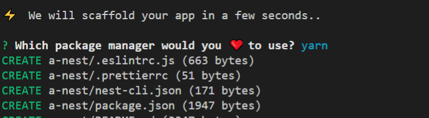

# nestjs 시작

## 기본 세팅 생략(node, mysql 설치)

- cho 형의 sleact repo에서 파일을 다운 받아준다
- alecture 로 들어가서 다음 설치

```sh
npm i -g @nestjs/cli
```

- 새로운 프로젝트 생성

```sh
nest new aNest
```

- 다음과 같은 화면에서 나는 yarn 을 선택해 주었다.



```sh
yarn add -d webpack-node-externals run-script-webpack-plugin webpack
```
