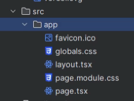

# intro

## app router

- react 18 서버 컴포넌트를 적극적으로 활용하기 시작함
  -> 서버에서 미리 랜더링 한후 => 클라이언트로 데이터를 보여줄때 완성된 html 미리 보여줌 => client 에서의 속도측면에서는 빨라지나 => 서버쪽에 부하가 많이 생김(그래서 next 에서는 cheshing 기능을 적극 활용하려고 함 => app router 에서는 넥스트에서 대신 처리를 해줌)
- next 서버도 제공되긴 하지만 비즈니스 로직상 백앤드 서버를 따로 구축하는걸 추천함

### `(filename)`

## public folder

- public 폴더에 들어있는 것은 넥스트 서버에서 누구나 접근 할 수있게 서빙을 해준다.

## src/app

- src/app 으로 하는 이유는 app 폴더 안에서만 주소와 관련된 routing 이 일어나는것을 명시하기 위해서임 src 안에 다른 폴더에서는 그밖의 처리를 하기 위해

## @

- `src` 까지의 경로를 `@` 로 대체하여 절대경로를 활용하자 ~
- `../../src/app/layout` => `@/app/layout`

## layout 과 template 의 차이

- layout : 페이지를 넘나들때 마운트 x
- template : 페이지를 넘나들때 마운트 o
