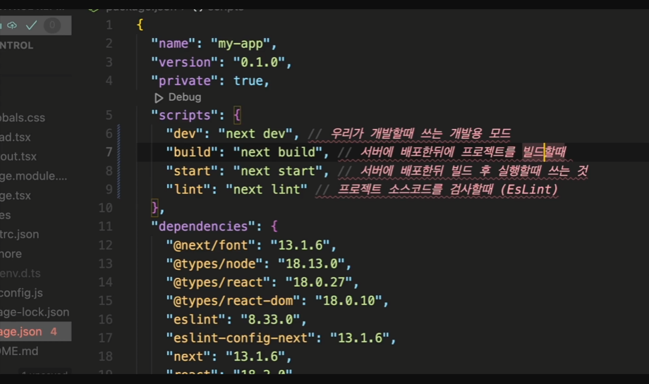
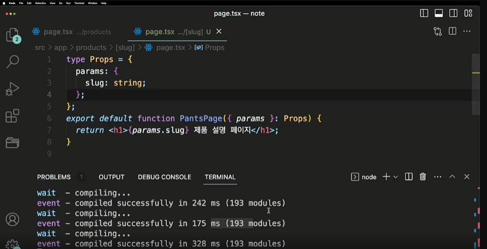
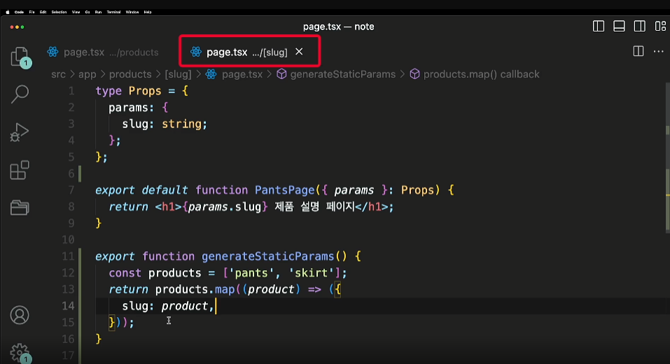

- next.js
  csr,ssr,isr, 중첩라우팅(직관적), servercomponents, suspense, data fetching, 최적화, api router, middleware, node.js, edge runtime, css surport

-> file system을 기반으로한 router

- 파일 구조 살펴보기
  pakage.json 에서
  dev, build, start, lint
  

  dev용으로 프로젝트를 실행하게 되면 static side generation 모드로 설정한 페이지 이더라도 항상 ssr 으로 이루어지게된다 -> 별도의 build 절차를 거치지 않고 dev로 실행하게되면 미리 만들어진 페이지라 html이 없음

- 새프로젝트 생성시
  npx create-next-app@latest --experimental-app ->최신버전
  npx create-next-app@canary--experimental-app -> 개발중인 더최신버전

* app 이라는 폴더는 13버전부터 생긴거임
  원래는 pages 안에서만 작업을 했었음

* 왜 앱이라는 경로를 통해 13버전으로 업그레이드를 시켰을까??

* 레이아웃은 그대로 유지하고
  업그레이드된 버전만 반영한다 ->breaking changes

* dev 모드에서 페이지 이동시 요청시간이 더 걸리는 이유 -> ssr 때문에 요청시 페이지를 새롭게 만들기 때문임

* ssg인지 ssr인지 확인하고 싶으면 build 했을때 파일 내역 살펴보면 됨

- Dynamic Routing
  정적인 기본적인 ui 골격은 가져가면서 해당 데이터를 유연하게 보여주는 것

* 페이지를 포함하는 폴더명을 ex) [slug] 으로 설정 해당 페이지를 보여주기위해 props 로 전달한다
  

  -> 골격은 미리 html 파일로 만들어 놓고(pre-rendering) 동적 routing 되는 변경되는 부분만 ssr 시켜버린다
  -> 정적인 경로로 미리만들어 두고 싶다면? next 에서 정한 규격인 generateStaticParams 함수를 만들어주면됨

  

- static generation : build 타임에 생성되는것을 말함

- not-found : not found 함수 호출시 not found 페이지를 보여줌
