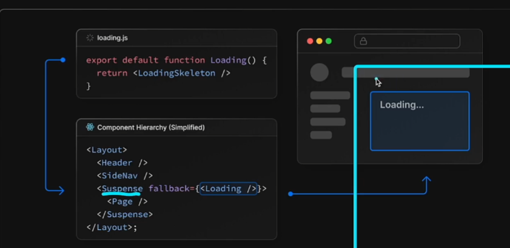

- fetch를 사용한 CSR

* 업데이트가 되어야 하지만 나중에 rendering되도 상관없는 경우 - CSR

* fudamental

- server-component에서 새롭게 fetching 되는 방법
- fetching data를 병렬적으로 사용하는 방법
- Layout 과 Pages에서 fetch data의 중복이 있으면 중복제거도 해줌
- loading ui, streaming, suspense의 병렬적인 ui 작업을 해줌

- post 는 쓰기 전용 api 관해서는 중복제거 를 해주고 있지 않음

- server-component에서는 cookies()와 headers()가 필요함

- web-app을 만들때 next로 fullstack까지 가능하도록 만들수 있음 ?

* 어떻게 ?? api 폴더에다 함수를 만들어 놓고 varcel에 등록만 해놓으면 서버처럼 작동함

* 13버전부터 이제는 router 하나당 폴더 하나의 구성이됨(이전에는 page 하나)

  - loading 처리 또한 products 라는 폴더안에 loading 컴포넌트를 만들어 관리할 수 있다.

* loading ui 작동 원리
  react에서 제공되는 Suspense 바운더리에 loading 컴포넌트를 props로 받아서 사용한다.



- error handling

  - react에서 제공되는 Error 바운더리에 loading 과같이 똑같이 적용된다.
  - 가장 근접한 컴포넌트의 error를 보여준다.

- Image

  - next 에서 제공되는 Image 컴포넌트를 이용시 화면사이즈별로 resizing 되어 좀더 최적화된 이미지 source관리를 할수 있음
  - 서버상의 이미지를 static 하게 import 해오는 것은 문제가 안되지만 인터넷상(외부)의 이미지를 참조하기 위해선 width 값과 height 값을 지정해주고, next.config.js 파일에 등록을 해주어야함

  - priority를 설정해주면 페이지 로딩시 가장먼저 보여줌

- Fonts
  font 또한 image와 마찬가지로 자체 서버 폰트 및 외부에서 제공되는 source 사용시 layout shift 현상이 발생할 수 있음

  > next에서는 이런부분을 미연에 방지하기위해 css의 size-adjust를 사용 self-hosting이 가능하도록 설계

* redirects 기능

  next.config.js 에
  함수

  ```js
  // 예시
  async redirects() {
        return [
    {
      source: "/products/deleted_forever",
      destination: "/products",
      permanent: true, // search 엔진 적용점
    },
        ]
  }
  ```

  설정시 url이 source에 진입하여도 destination로 이동시킬수 있음

  - 동적으로 사용하기!
    만약에 존재하지 않는 상품페이지 접속시 'next/navigation' 에 있는 redirect('/products') 를 notfound() 대신 설정하여 초기페이지로 돌아가게 한다

- rewrites

  기존(destination)에 복잡한 경로를 간단히 대체 할 수 있음

  ```js
  // 예시
  async rewrites() {
  return [
    {
      source: "/ellie",
      destination: "/about/me/ellie",
    },

  ];
  },
  ```
