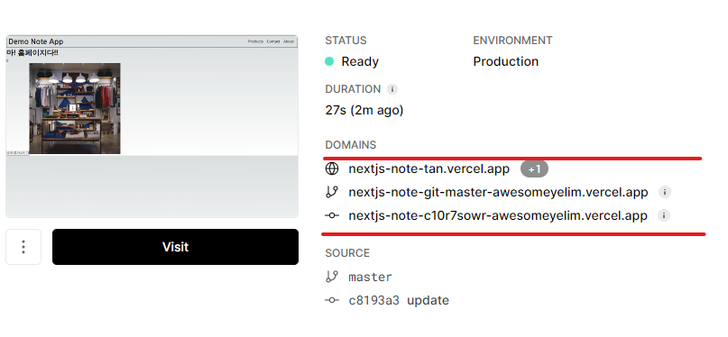

## 배포

- vercel 에서 github를 연동하면 ci/cd를 돌려 자동 업데이트가 된다.

- 아래와 같이 3개의 경로로 즉각반영이 된다.



- 하지만 beta 버전이 즉각반영이 되면 더 난감 하기때문에
  다음과 같은 release 브랜치를 만든다.

```
git checkout -b release
```

참고 : https://nextjs.org/docs/app/building-your-application/deploying
