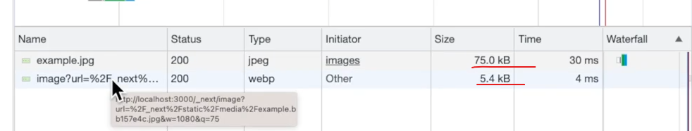
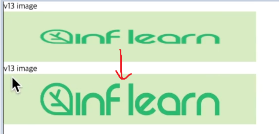

# nextjs 분석

## 01. .next 폴더 분석

- .next 안에는 chache, server, static 이라는 세가지 폴더로 나뉘어져 있다.


### 초기 랜더링시 html 파일은 어디서 ?

- 초기 랜더링시 불러오는 html 파일은 `static/chunks/pages` 에서 확인 할 수 있는데 파일명+hash 값으로 되어있는 파일명을 확인할 수 있다.

- 브라우저에의 inspector 를 보면 같은 hash 값을 가진 그 파일을 다운로드 하는것을 확인 할 수 있다.

### pre-rendering 확인하기

- `revalidate : 5` 가 걸려 있는 상태에서 5가 지날시 x-vercel-cache 는 STALE로 표기된다. 그리고 `static/chunks/pages` 내의 파일을 확인해보면 값이 업데이트가 진행되어 이미 뒤에서 pre-rendering이 진행된것을 확인해 볼수 있다.

=> 이 상태에서 새로 고침시 x-vercel-cache 은 Hit 으로, ETag도 바뀐것을 확인할 수 있다.

## 02. next/image 분석하기

### chrome-browser 에서 작동하는 레이지 기능

- 만약에 스크롤을 내려야만 보여지는 이미지가 있다고 하자. 그렇다면 페이지 랜더링 이후에 img 가 바로 보여지는것은 네트워크의 낭비가 생길수 있는 부분

- 그럴 때 활용할 수 있는것이 `lazy` 부분이다.

```jsx
<figure>
  
  <figcaption>example img</figcaption>
</figure>
```

- 스크롤을 내리다가 특정 stretch hold 를 넘으면 lazy 하게 이미지를 다운로드 한다.

### 그렇다면 next/image 는 무엇이 좋다는 걸까

- next/image 에는 `lazy` 기능이 자동 추가가 되어있다.

#### 이미지 용량 최적화 및 제공 속성

- 기존의 img 태그와는 다르게 WebP 타입의 이미지가 다운로드 받아진다 ( 75kb => 5.4kb ), 외피 형식이기 때문에 원본에 비해 작은용량으로도 사용 가능하다.



- `quality` : 얼마나 최적화 할지 설정할 수 있다.(기본값 75)
- `placeholder` : `blur` 로 설정시 사진이 다운로드 되는 동안 블러이미지가 자동 적용됨

```jsx
<Image
  src={example}
  alt="v13 image"
  width={500}
  height={100}
  quality={100}
  //   placeholder="blur"
/>
```

> 💫 어떻게 이러한 최적화가 가능할까

- 이유는 소스파일을 스태틱하게 import 했기 때문에 빌드 시점에 이미지 정보(너비, 높이)를 미리 알 수 있음 => 미리 최적화 가능

#### 외부 링크로 image를 import 할 경우

- 외부 링크를 사용했지만 width 와 height 값을 모르는 경우에는 `fill` 이라는 속성을 사용하자

```jsx
<figure style={{ position: "relative", width: "500px", height: "100px" }}>
  <Image src="https://inflearn-nextjs.vercel.app/example.jpg" alt="v13 fill" fill style={{ objectFit: "cover" }} />
</figure>
```

- 이러한 경우 이미지의 사이즈는 부모에 의해 결정된다.
- 부모의 `position`을 `relative` 또는 다른 상관관계로 설정한고 부모의 사이즈를 설정함

- 하지만 납작한 이미지(?) 를 원하지 않을때에는 `Image` 태그의 `objectFit` 속성에 `cover`라고 지정해주면 다음과 같이 fit 한 사이즈 설정이 가능하다



- 그리고 외부링크로 소스를 넣을때 외부링크를 사용할 수 없다는 에러 메세지가 보이곤 하는데.. => 보안을 위해 허용돈 도메인만 접근할수 있도록 막아둔것

- `next.config.js` 로 입장후 다음과 같이 작성 => `inflearn-nextjs.vercel.app` 이라는 도메인을 허용해줄 수 있다. => restart 해줘야 반영됨

```js
/** @type {import('next').NextConfig} */
const nextConfig = {
  reactStrictMode: true,
  images: {
    domains: ["inflearn-nextjs.vercel.app"],
  },
};

module.exports = nextConfig;
```

#### layout shift 현상 방지

next 프로젝트는 새로고침을 하여도 제자리에 잘 유지되는것을 확인 할 수 있는데, `next/image` 의 최적화와도 관련이 되어있다.

- 참조 : <https://velog.io/@sunohvoiin/pl2u9xiz>

- Layout Shift란?

  Layout Shift란 페이지 콘텐츠가 예기치 않게 이동하는 현상이다.
  보통 리소스가 비동기식으로 로드되거나 DOM 요소가 동적으로 추가되어 발생한다.
