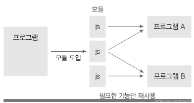
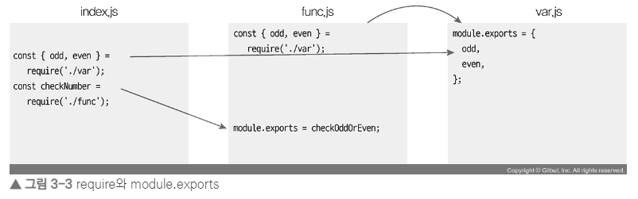
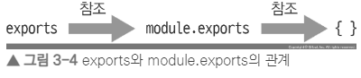
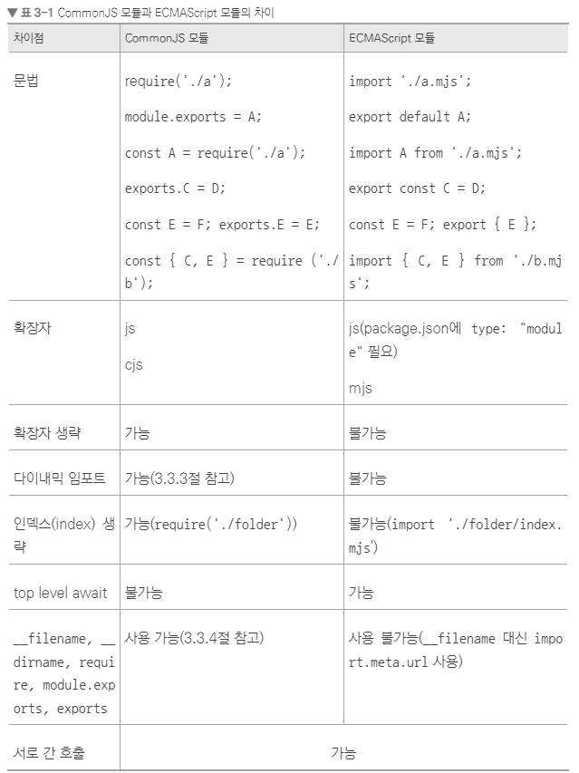

# node 의 기능

## REPL

🚩`REPL(Read Eval Print Loop)` ?

> 입력한 코드를 읽고(Read), 해석하고(Eval), 결과물을 반환하고(Print), 종료할 때까지 반복한다(Loop)

## 모듈로 만들기

🚩`모듈` ?

> 모듈이란 특정한 기능을 하는 함수나 변수들의 집합을 말한다

- 노드는 코드를 모듈로 만들 수 있다는 점에서 브라우저의 자바스크립트와는 다르다.
- 보통 파일 하나가 모듈 하나가 되며, 파일별로 코드를 모듈화할 수 있어 관리하기 편합니다.



- 노드에서는 두 가지 형식의 모듈을 사용하는데, 하나는 `CommonJS 모듈`이고 다른 하나는 `ECMAScript 모듈` 이다.

## CommonJS

- `CommonJS` 모듈은 표준 자바스크립트 모듈은 아니지만 노드 생태계에서 가장 널리 쓰이는 모듈이다.



- `module.exports`와 `exports`가 같은 객체를 참조
- `console.log(module.exports === exports)`를 하면 `true`가 나온다.



### 노드에서 this는 무엇일까?

```js
console.log(this); // {}
console.log(this === module.exports); // true
console.log(this === exports); // true
function whatIsThis() {
  console.log("function", this === exports, this === global); // function false true
}
whatIsThis();
```

- 노드에서의 this는 브라우저의 this와 조금 다르다.
- 다른 부분은 브라우저의 자바스크립트와 동일하지만 최상위 스코프에 존재하는 this는 module.exports(또는 exports 객체)를 가리킨다.

### 모듈을 불러오는 require에 대해

- `require`는 함수이고, 함수는 객체이므로 `require`는 객체로서 속성을 몇 개 갖고 있다.
- 그 중에서 `require.cache`와 `require.main`을 알아보자

- `require.cache` : 객체에 require.js나 var.js 같은 파일 이름이 속성명으로 들어 있는 것을 볼 수 있다. 한번 `require`한 파일은 `require.cache`에 저장되므로 다음 번에 `require`할 때는 새로 불러오지 않고 `require.cache`에 있는 것이 재사용 된다.

- `require.main` : 노드 실행 시 첫 모듈을 가리킨다. 현재 `node require`로 실행했으므로 `require.js`가 `require.main`이 된다. `require.main` 객체의 모양은 `require.cache`의 모듈 객체와 같다.

```js
// require.js
console.log("require가 가장 위에 오지 않아도 됩니다.");

module.exports = "저를 찾아보세요.";

require("./var");

console.log("require.cache입니다.");
console.log(require.cache);
console.log("require.main입니다.");
console.log(require.main === module);
console.log(require.main.filename);
```

```js
// console.log
require가 가장 위에 오지 않아도 됩니다.
require.cache입니다.
[Object: null prototype] {
  'C:\Users\zerocho\require.js': Module {
    id: '.',
    exports: '저를 찾아보세요.',
    filename: 'C:\Users\zerocho\require.js',
    loaded: false,
    children: [ [Module] ],
    paths: [
      'C:\Users\zerocho\node_modules',
      'C:\Users\node_modules',
      'C:\node_modules'
    ]
  },
  'C:\Users\zerocho\var.js': Module {
    id: 'C:\Users\zerocho\var.js',
    exports: { odd: 'CJS홀수입니다', even: 'CJS 짝수입니다' },
    filename: 'C:\Users\zerocho\var.js',
    loaded: true,
    children: [],
    paths: [
      'C:\Users\zerocho\node_modules',
      'C:\Users\node_modules',
      'C:\node_modules'
    ]
  }
}
require.main입니다.
true
C:\Users\zerocho\require.js
```

#### 순환참조(circular dependency)

- 만약 두 모듈 dep1과 dep2가 있고 이 둘이 서로를 require한다면 어떻게 될까?

```sh
require dep1 {}
require dep2 [Function (anonymous)]
dep2 [Function (anonymous)]
dep1 {}
(node:29044) Warning: Accessing non-existent property 'Symbol(nodejs.util.inspect.custom)' of module exports inside circular dependency
(Use `node --trace-warnings ...` to show where the warning was created)
```

- dep1의 module.exports가 함수가 아니라 빈 객체로 표시가 되는데 이러한 현상을 `순환 참조(circular dependency)`라고 부른다.
- 이렇게 순환 참조가 있을 경우에는 순환 참조되는 대상을 빈 객체로 만든다.

## ECMAScript 모듈

- `ECMAScript 모듈(이하 ES 모듈)`은 공식적인 자바스크립트 모듈 형식이다.
- 노드에서 아직까지는 `CommonJS` 모듈을 많이 쓰긴 하지만, ES 모듈이 표준으로 정해지면서 점점 ES 모듈을 사용하는 비율이 늘어나고 있다.

- `require`와 `exports`, `module.exports`가 각각 `import`, `export`, `export default`로 바뀌었다.

- 두 모듈 형식의 차이
  

### 다이내믹 임포트

- `dynamic import` 란 ?
  > 아래와 같이 조건부로 모듈을 불러오는 것을 다이내믹 임포트라고 한다.(commonjs에선 가능)

```js
// O (commonjs)
const a = false;
if (a) {
  require("./func");
}
console.log("성공");
```

```js
// X (ES 모듈)
const a = false;
if (a) {
  import "./func.mjs";
}
console.log("성공");
// error
```

- 하지만 아래와 같이는 가능하다.(import는 Promise를 반환하기에 await이나 then을 붙여야 한다.), `top level await` 가능

```js
const a = true;
if (a) {
  const m1 = await import("./func.mjs");
  console.log(m1);
  const m2 = await import("./var.mjs");
  console.log(m2);
}
```

- 🚩 결괏값 함께 확인
  > `export default`의 경우 import할 때도 `default`라는 속성 이름으로 import됩니다. 참고로 `CommonJS` 모듈에서 `module.exports`한 것도 `default`라는 이름으로 import됩니다.
