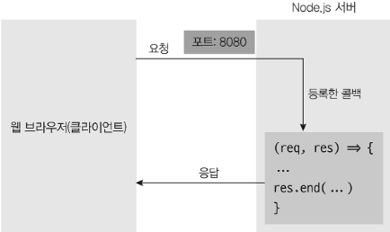
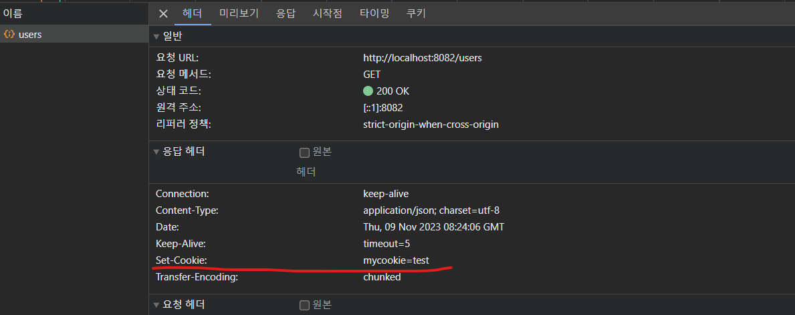
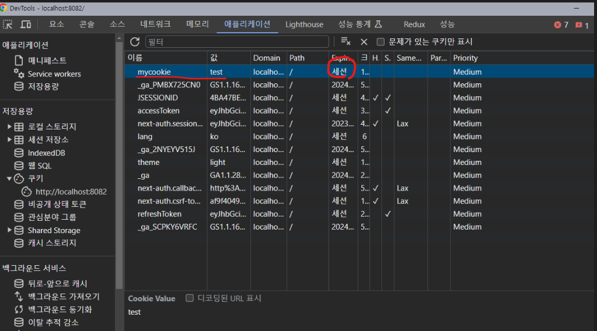
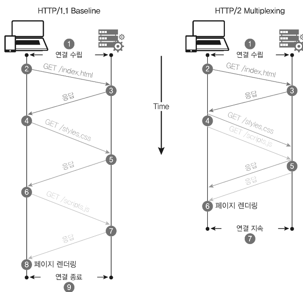

# 05. node 통신

## 서버와 클라이언트의 관계

1. 클라이언트가 서버로 요청(request)을 보냄
2. 서버는 요청을 처리
3. 처리후 클라이언트로 응답(response)을 보냄

## 노드로 http 서버 만들기

- 다음과 같이 서버 생성후 터미널에서 실행하는경우 실행기 하나를 차지하게 된다


```js
const http = require("http");

const server = http
  .createServer((req, res) => {
    res.write("<h1>Hello Node!</h1>"); // stream 방식
    res.write("<h1>룰루리랄랄</h1>");
    res.end("<h1>the end</h1>");
  })

  .listen(8080);

server.on("listening", () => {
  console.log("8080포트입니다");
});
server.on("error", (err) => {
  console.log(err);
});
```



> `localhost` 와 `포트`란?

- `포트`는 서버 내에서 `프로세스`를 구분하는 번호이다. 서버는 `HTTP 요청`을 대기하는 것 외에도 다양한 작업을 한다. 데이터베이스와도 통신해야 하고, `FTP 요청`을 처리하기도 한다. 따라서 서버는 프로세스에 포트를 다르게 할당해 들어오는 요청을 구분한다. 유명한 포트 번호로는 `21(FTP)`, `80(HTTP)`, `443(HTTPS)`, `3306(MYSQL)`이 있습니다. 포트 번호는 IP 주소 뒤에 콜론(:)과 함께 붙여 사용한다.

++ . `리눅스`와 `맥`에서는 `1024번 이하의 포트`에 연결할 때 `관리자 권한`이 필요하다. 따라서 명령어 앞에 `sudo`를 붙여야 한다. 예를 들면 `node server1` 대신 `sudo node server1`을 입력해야 한다. 예제에서는 `8080번 포트`를 사용하므로 `sudo`를 붙이지 않아도 된다.

## fs로 HTML 읽어 제공하기

- 위의 코드와 같이 `res.write()` 와 `res.end()` 에 html코드를 적어주는것은 굉장히 비효율적이다.
- fs 모듈을 불러와서 다음과 같이 사용할수 있다.

```js
const http = require("http");
const fs = require("fs").promises; // fs 는 콜백 형식 모듈이므로 비동기로 처리하기 위해 .promises 를 붙여서 사용한다

http
  .createServer(async (req, res) => {
    try {
      const data = await fs.readFile("./test.html");
      res.writeHead(200, { "Content-Type": "text/html; charset=utf-8" }); // 한글로 사용하기 위해선 "text/html; charset=utf-8" 설정해 줘야함
      res.end(data);
    } catch (err) {
      console.error(err);
      res.writeHead(500, { "Content-Type": "text/plain; charset=utf-8" }); // 에러 메시지는 일반 문자열이므로 text/plain을 사용
      res.end(err.message);
    }
  })

  .listen(8080, () => {
    console.log("8080포트입니다");
  });
```

- HTTP 상태 코드

> 200이나 500과 같은 숫자는 HTTP 상태 코드입니다. res.writeHead에 첫 번째 인수로 상태 코드를 넣었는데, 브라우저는 서버에서 보내주는 상태 코드를 보고 요청이 성공했는지 실패했는지를 판단합니다. 여기서는 대표적인 상태 코드들을 알아보겠습니다.

• 2XX: 성공을 알리는 상태 코드입니다. 대표적으로 200(성공), 201(작성됨)이 많이 사용됩니다.

• 3XX: 리다이렉션(다른 페이지로 이동)을 알리는 상태 코드입니다. 어떤 주소를 입력했는데 다른 주소의 페이지로 넘어갈 때 이 코드가 사용됩니다. 대표적으로 301(영구 이동), 302(임시 이동)가 있습니다. 304(수정되지 않음)는 요청의 응답으로 캐시를 사용했다는 뜻입니다.

• 4XX: 요청 오류를 나타냅니다. 요청 자체에 오류가 있을 때 표시됩니다. 대표적으로 400(잘못된 요청), 401(권한 없음), 403(금지됨), 404(찾을 수 없음)가 있습니다.

• 5XX: 서버 오류를 나타냅니다. 요청은 제대로 왔지만 서버에 오류가 생겼을 때 발생합니다. 이 오류가 뜨지 않게 주의해서 프로그래밍해야 합니다. 이 오류를 res.writeHead로 클라이언트에 직접 보내는 경우는 거의 없고, 예기치 못한 에러가 발생하면 서버가 알아서 5XX대 코드를 보냅니다. 500(내부 서버 오류), 502(불량 게이트웨이), 503(서비스를 사용할 수 없음)이 자주 사용됩니다.

## REST API와 라우팅 사용

> REST(REpresentational State Transfer)

- 서버의 자원을 정의하고 자원에 대한 주소를 지정하는 방법
- 예측이 가능하다 => 보안에 취약할수도..

> HTTP 요청 메서드

• GET: 서버 자원을 가져오고자 할 때 사용
• POST: 서버에 자원을 새로 등록하고자 할 때 사용
• PUT: 서버의 자원을 요청에 들어 있는 자원으로 치환하고자 할 때 사용
• PATCH: 서버 자원의 일부만 수정하고자 할 때 사용
• DELETE: 서버의 자원을 삭제하고자 할 때 사용
• OPTIONS: 요청을 하기 전에 통신 옵션을 설명하기 위해 사용

## cookies 와 session 이해하기

### 쿠키의 필요성

> 클라이언트의 요청에 큰 단점

- 누가 요청을 보냈는지 모름(IP 주소나 브라우저 정보 정도만)
- 그래서 로그인을 구현하면 됨(쿠키와 세션 필요)


- 브라우저는 쿠키가 있다면 자동으로 동봉해서 보내주므로 따로 처리할 필요가 없다. 서버에서 브라우저로 쿠키를 보낼 때만 코드를 작성해 처리하면 된다.

- 이전에 만들었던 서버에서 `Set-Cookie` 를 설정하게 되면

```js
res.writeHead(200, { "Content-Type": "application/json; charset=utf-8", "Set-Cookie": "mycookie=test" });
```

- 브라우저에는 다음과 같이 저장되게 된다.(세션 쿠키라 브라우저 닫히면 같이 사라짐)

  
  

- cookie 폴더에 있는 `cookie.html` 를 살펴보자

```html
<!-- action  : 폼 내부에 데이터를 보내는 목적지 url을 지정한다. -->
<form action="/login">
  <input id="name" name="name" placeholder="이름을 입력하세요" />
  <button id="login">로그인</button>
</form>
```

> 폼(form) 속성 종류

- action  : 폼 내부에 데이터를 보내는 목적지 url을 지정한다.
- autocomplete : HTML5에 추가되었으며 양식의 자동완성을 지정한다.
- enctype : 넘기는 content 타입을 지정하는데 주로 파일을 넘길 때 많이 사용. entype="multipart/form-data"로 지정해서 사용한다.
- method : 폼을 서버로 전송하는 http 방식을 지정. POST와 GET이 있다.
- name : 폼을 식별하기 위한 이름을 지정한다.
- target : action에서 지정한 스크립트 파일이 현재나 다른 위치에서 열리도록 지적한다.
- accept-charset : 폼 전송에 사용될 문자 인코딩을 지정한다.

- cookie 폴더에 있는 `cookie.js` 를 살펴보자

```js
const http = require("http");
const fs = require("fs").promises;
const path = require("path");

// 1.
const parseCookies = (cookie = "") =>
  cookie
    .split(";")
    .map((v) => v.split("="))
    .reduce((acc, [k, v]) => {
      acc[k.trim()] = decodeURIComponent(v);
      return acc;
    }, {});

http
  .createServer(async (req, res) => {
    const cookies = parseCookies(req.headers.cookie);

    // 2. 주소가 /login으로 시작하는 경우
    if (req.url.startsWith("/login")) {
      const url = new URL(req.url, "http://localhost:8084");
      const name = url.searchParams.get("name");
      const expires = new Date();
      // 쿠키 유효 시간을 현재 시간 + 5분으로 설정
      expires.setMinutes(expires.getMinutes() + 5);
      res.writeHead(302, {
        Location: "/",
        "Set-Cookie": `name=${encodeURIComponent(name)}; Expires=${expires.toGMTString()}; HttpOnly; Path=/`,
      }); // Expires :  쿠키 만료시간 설정시 브라우저 닫아도 유지됨, HttpOnly : 자바스크립트로 쿠키에 접근하지 못하게
      res.end();

      // 3. 주소가 /이면서 name이라는 쿠키가 있는 경우
    } else if (cookies.name) {
      res.writeHead(200, { "Content-Type": "text/plain; charset=utf-8" });
      res.end(`${cookies.name}님 안녕하세요`);
    } else {
      // 주소가 /이면서 name이라는 쿠키가 없는 경우
      try {
        const data = await fs.readFile(path.join(__dirname, "cookie.html"));
        res.writeHead(200, { "Content-Type": "text/html; charset=utf-8" });
        res.end(data);
      } catch (err) {
        res.writeHead(500, { "Content-Type": "text/plain; charset=utf-8" });
        res.end(err.message);
      }
    }
  })
  .listen(8084, () => {
    console.log("8084번 포트에서 서버 대기 중입니다!");
  });
```

- 쿠키 옵션들

• 쿠키명=쿠키값: 기본적인 쿠키의 값입니다. mycookie=test 또는 name=zerocho와 같이 설정합니다.

• Expires=날짜: 만료 기한입니다. 이 기한이 지나면 쿠키가 제거됩니다. 기본값은 클라이언트가 종료될 때까지입니다.

• Max-age=초: Expires와 비슷하지만 날짜 대신 초를 입력할 수 있습니다. 해당 초가 지나면 쿠기가 제거됩니다. Expires보다 우선합니다.

• Domain=도메인명: 쿠키가 전송될 도메인을 특정할 수 있습니다. 기본값은 현재 도메인입니다.

• Path=URL: 쿠키가 전송될 URL을 특정할 수 있습니다. 기본값은 ‘/’이고, 이 경우 모든 URL에서 쿠키를 전송할 수 있습니다.

• Secure: HTTPS일 경우에만 쿠키가 전송됩니다.

• HttpOnly: 설정 시 자바스크립트에서 쿠키에 접근할 수 없습니다. 쿠키 조작을 방지하기 위해 설정하는 것이 좋습니다.

- `cookie.js` 방식은 `Application` 탭에서 쿠키가 노출되어있기 때문에 위험함 => 쿠키가 조작될 위험도 있음

- cookie 폴더에 있는 `session.js` 를 살펴보자

```js
const http = require("http");
const fs = require("fs").promises;
const path = require("path");

const parseCookies = (cookie = "") =>
  cookie
    .split(";")
    .map((v) => v.split("="))
    .reduce((acc, [k, v]) => {
      acc[k.trim()] = decodeURIComponent(v);
      return acc;
    }, {});

const session = {};

http
  .createServer(async (req, res) => {
    const cookies = parseCookies(req.headers.cookie);
    if (req.url.startsWith("/login")) {
      const url = new URL(req.url, "http://localhost:8085");
      const name = url.searchParams.get("name");
      const expires = new Date();
      expires.setMinutes(expires.getMinutes() + 5);
      const uniqueInt = Date.now();
      session[uniqueInt] = {
        name,
        expires,
      };
      res.writeHead(302, {
        Location: "/",
        "Set-Cookie": `session=${uniqueInt}; Expires=${expires.toGMTString()}; HttpOnly; Path=/`,
      });
      res.end();
      // 세션 쿠키가 존재하고, 만료 기간이 지나지 않았다면
    } else if (cookies.session && session[cookies.session].expires > new Date()) {
      res.writeHead(200, { "Content-Type": "text/plain; charset=utf-8" });
      res.end(`${session[cookies.session].name}님 안녕하세요`);
    } else {
      try {
        const data = await fs.readFile(path.join(__dirname, "cookie.html"));
        res.writeHead(200, { "Content-Type": "text/html; charset=utf-8" });
        res.end(data);
      } catch (err) {
        res.writeHead(500, { "Content-Type": "text/plain; charset=utf-8" });
        res.end(err.message);
      }
    }
  })
  .listen(8085, () => {
    console.log("8085번 포트에서 서버 대기 중입니다!");
  });
```

> cookie.js와 비교해 달라진 점

- 쿠키에 이름을 담아서 보내는 대신, uniqueInt라는 숫자 값을 보냄
- 사용자의 이름과 만료 시간은 uniqueInt 속성명 아래에 있는 session이라는 객체에 대신 저장

## https와 http2

### https

- https 모듈은 웹 서버에 SSL 암호화를 추가(response header 를 암호화한다)

- `http` 모듈과 `https` 모듈 비교

```js
// http
const http = require("http");

http
  .createServer((req, res) => {
    res.writeHead(200, { "Content-Type": "text/html; charset=utf-8" });
    res.write("<h1>Hello Node!</h1>");
    res.end("<p>Hello Server!</p>");
  })
  .listen(8080, () => {
    // 서버 연결
    console.log("8080번 포트에서 서버 대기 중입니다!");
  });
```

```js
// https -  인증서는 인증 기관에서 구입해야함 ex) Let’s Encrypt
const https = require("https");
const fs = require("fs");

https
  .createServer(
    {
      cert: fs.readFileSync("도메인 인증서 경로"),
      key: fs.readFileSync("도메인 비밀 키 경로"),
      ca: [fs.readFileSync("상위 인증서 경로"), fs.readFileSync("상위 인증서 경로")],
    },
    (req, res) => {
      res.writeHead(200, { "Content-Type": "text/html; charset=utf-8" });
      res.write("<h1>Hello Node!</h1>");
      res.end("<p>Hello Server!</p>");
    }
  )
  .listen(443, () => {
    console.log("443번 포트에서 서버 대기 중입니다!");
  });
```

> 🚩차이점 분석

- createServer 메서드가 인수를 두 개 받음(두 번째 인수는 http 모듈과 같이 서버 로직이고, 첫 번째 인수는 인증서에 관련된 옵션 객체이다.)
- 실제 서버에서는 80번 포트 대신 443번 포트를 사용하면 된다.

### http2

- SSL 암호화와 더불어 최신 HTTP 프로토콜인 http/2를 사용하는 모듈
- 요청 및 응답 방식이 기존 `HTTP/1.1` 보다 개선됨
- 웹의 속도도 개선됨


