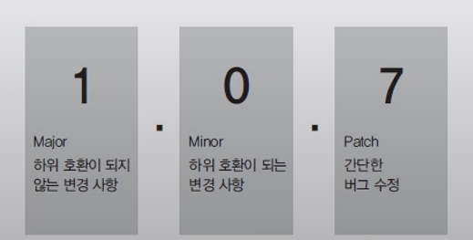
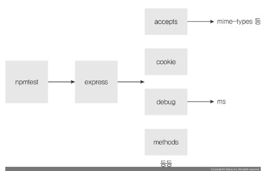
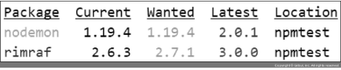

# 06. node 패키지 매니저

## npm(Node Package Manager)

### package.json 만들기

```sh
npm init
```

> vulnerability

```sh
npm install express
added 50 packages, and audited 51 packages in 1s

2 packages are looking for funding
  run `npm fund` for details

found 0 vulnerabilities
```

- 패키지 설치할때 보면 `found 0 vulnerabilities` 또는 `[숫자] [심각도] severity vulnerability` 라는 문장이 출력 된다. npm은 패키지를 설치할 때 패키지에 있을 수 있는 취약점을 자동으로 검사한다. `found 0 vulnerabilities`는 취약점이 없음을 뜻하지만, 취약점이 있는 경우에는 다음과 같이 표시된다.

```sh
[숫자] [심각도] severity vulnerability

To address all issues, run:
  npm audit fix --force

Run `npm audit` for details.
```

- `npm audit`은 패키지의 알려진 취약점을 검사할 수 있는 명령어이다. `npm`에 패키지들이 워낙 많다 보니 일부 패키지는 악성 코드를 담고 있다. 이런 것들이 `npm`에 보고되는데, `npm audit`을 통해 내가 혹시 악성 코드가 담긴 패키지를 설치하지 않았는지 검사할 수 있다. `npm audit fix`를 입력하면 `npm`이 스스로 수정할 수 있는 취약점을 알아서 수정한다.

### express를 추가해준 이후의 package.json

```json
// package.json

{
  "name": "npmtest",
  ...
  "license": "ISC",
  "dependencies": {
    "express": "^4.17.3", // 버전 앞에 ^ 표시
  }
}
```

> SemVer 버저닝

- 노드 패키지의 버전은 SemVer(유의적 버저닝) 방식을 따름
  Major(주 버전), Minor(부 버전), Patch(수 버전)

  노드에서 배포를 할 때 항상 버전을 올려야 하는데..

  

> 버전 기호 사용하기

- `^1.1.1` : 패키지 업데이트시 `minor` 버전까지만 업데이트 됨(2.0.0 버전은 안됨)
- `~1.1.1` : 패키지 업데이트시 `patch` 버전까지만 업데이트 됨(1.2.0 버전은 안됨)
- `@latest` : 가장 최신의 버전을 설치할 수 있다.`(ex) npm i express@latest`
- `@next` : (`npm` 에 출시 되지 않은) 앞으로 나올 버전을 테스트 해볼 수 있다.`(ex) npm i express@next`
- `@숫자` : 원하는 버전을 설치할 수 있다.`(ex) npm i express@3`

### package-lock.json

`package.json` 의 `dependencies` 관계의 패키지가 담겨있음 => 직접 설치한 `express` 외에도 `node_modules`에 들어 있는 패키지들의 정확한 버전과 의존 관계가 담겨 있다.

`npm`으로 패키지를 설치, 수정, 삭제할 때마다 패키지들 간의 정확한 내부 의존 관계를 이 파일에 저장한다.

즉, `package.json`은 직접 설치한 패키지를 기록하는 파일이고, `package-lock.json`은 패키지 간의 의존 관계를 명시한 파일입니다.



### npx

- 명령어로 시행되는 애들은 `-g` 로 설치 해야함

  ex)

  📍 만약 다음과 같이 사용이 되야한다면(rimraf 는 삭제 명령어)

  ```sh
  rimraf node-modules
  ```

  📍 다음과 같이 설치 되어야함

  ```sh
  npm -g rimraf
  ```

  📍 근데 이렇게 `-g` 로 설치가 되었을때 발생되는 문제로 => `package.json` 에 기록이 안됨 그래서 다음과 같이 지역적으로 설치 이후 글로벌 명령어로 사용하려면

  ```sh
  npm i rimraf -D
  ```

  📍 앞에 npx 를 붙여서 사용한다.(이렇게 하면 관리도 되면서 지역적/ 전역적 선택적으로 사용 가능하게됨)

  ```sh
  npx rimraf node-modules
  ```

## 그 밖에

> npm에 등록되지 않은 패키지

- 모든 패키지가 `npm`에 등록되어 있는 것은 아니다. 일부 패키지는 오픈 소스가 아니거나 개발 중인 패키지이므로 `깃허브`나 `넥서스(Nexus)` 등의 저장소에 보관되어 있을 수도 있다. 그러한 패키지들도 `npm install [저장소 주소]` 명령어를 통해 설치할 수 있다.

> node_modules 내부 수정하기

- 종종 설치한 패키지 내부 소스 코드를 수정하고 싶을 때가 있다. (설치한 패키지에서 버그가 발생했는데, 당장 수정이 필요할 때) => 문제는 수정한 그 당시에는 node_modules 내부 패키지가 잘 돌아가지만 한 번이라도 npm i를 입력하게 되면 수정한 내용이 초기화된다는 것

그래서 node_modules 내부의 수정 사항을 영구적으로 반영해주는 patch-package 패키지가 있습니다. package.json을 다음과 같이 수정하고 patch-package 패키지를 설치한다.

```json
// package.json

"scripts": {
    "postinstall": "patch-package"
  },

```

```sh
npm i patch-package
(node_modules 내부의 원하는 패키지 수정하기)

npx patch-package [수정한 패키지 이름]

```

- 이러면 patches 폴더가 생성되고 그 안에 patch 확장자를 가진 파일이 생성된다. 이후 npm i를 해도 patch-package가 patch 파일을 읽어서 수정 사항을 적용한다.

> 기타 npm 명령어

📍 `npm outdated`

- 업데이트할 수 있는 패키지가 있는지 확인할 수 있다.



- `Current`와 `Wanted`가 다르다면 업데이트가 필요한 경우 이다. `npm update [패키지 이름]`으로 업데이트할 수 있다.

📍 `npm uninstall [패키지 이름]`

- 해당 패키지를 제거하는 명령어이다. 패키지가 node_modules 폴더와 package.json에서 사라진다.

📍 `npm search [검색어]`

- npm의 패키지를 검색할 수 있다.

📍 `npm info [패키지 이름]`

- 패키지의 세부 정보를 파악하고자 할 때 사용하는 명령어

📍 `npm login`

- npm 로그인을 위한 명령어

```sh
npm login
Username: [사용자 이름 입력]
Password: [비밀번호 입력]
Email: (this IS public) [이메일 입력]
npm notice Please check your email for a one-time password (OTP)
Enter one-time password: [OTP 번호 입력]
Logged in as [사용자 이름] on https://registry.npmjs.org/

```

📍 `npm npm whoami`

- 로그인한 사용자가 누구인지 알린다.

📍 `npm logout`

- npm login으로 로그인한 계정을 로그아웃할 때 사용

📍 `npm version [버전]`

- package.json의 버전을 올린다.

📍 `npm deprecate [패키지 이름] [버전] [메시지]`

- 해당 패키지를 설치할 때 경고 메시지를 띄우게 하는 명령어

📍 `npm publish`

- 자신이 만든 패키지를 배포할 때 사용

📍 `npm unpublish`

- 배포한 패키지를 제거할 때 사용
- 72시간 이내에 배포한 패키지만 제거할 수 있다.

📍 `npm ls`

- 내 프로젝트가 어떤 패키지를 사용하고 있는지 찾고 싶을때
