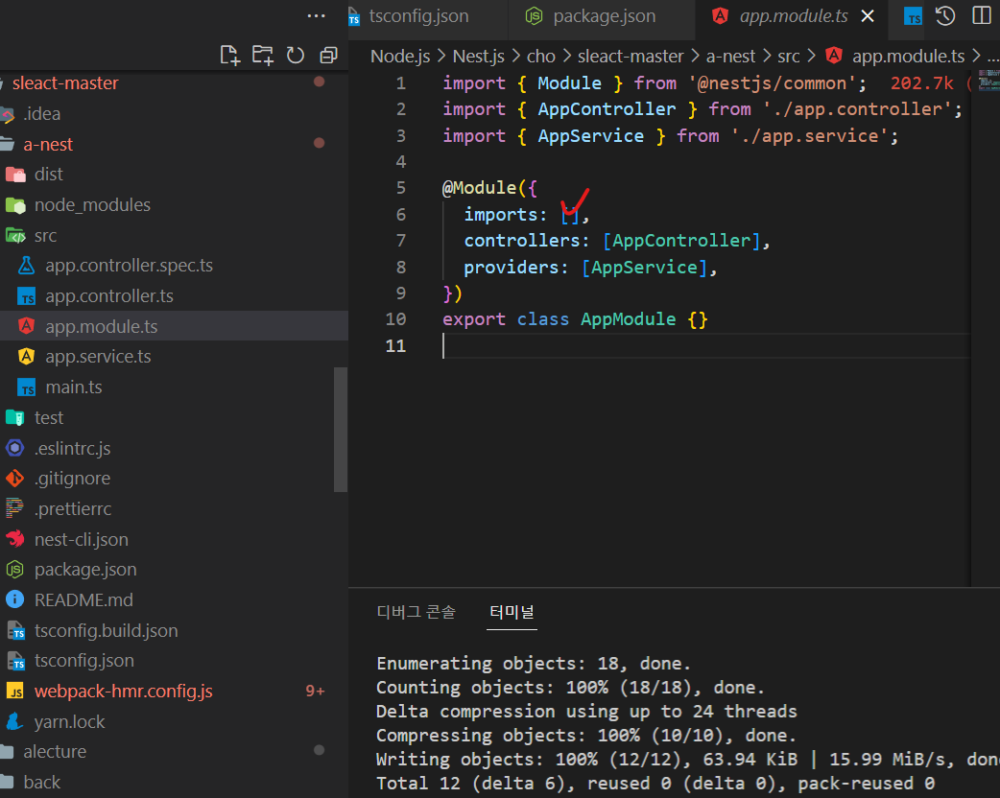
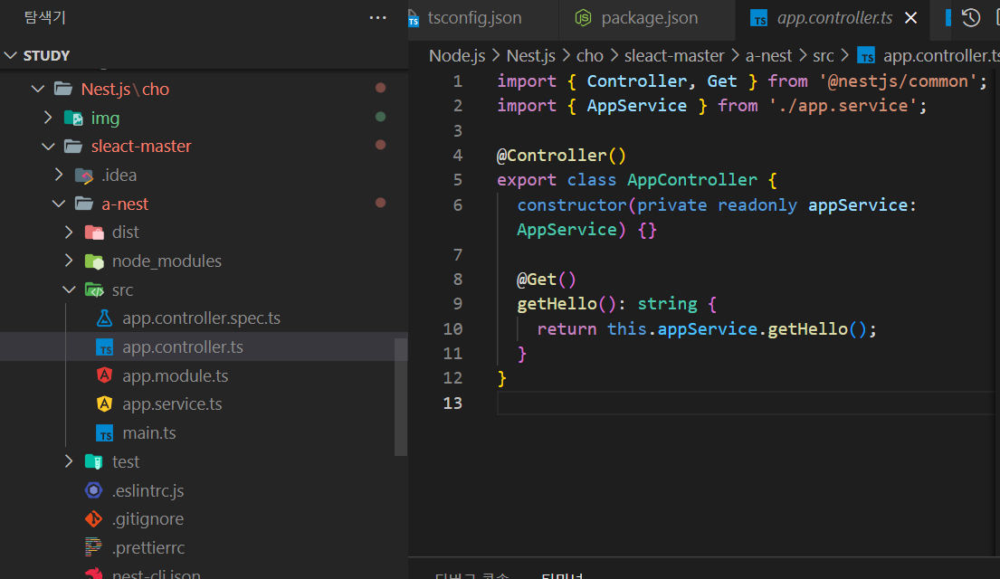
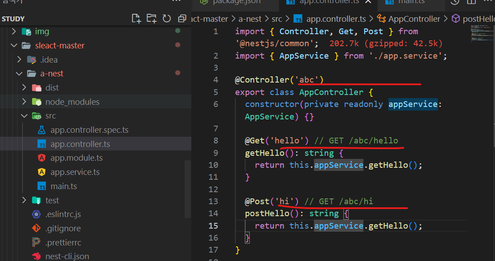

# nestjs 시작

## 기본 세팅 생략(node, mysql 설치)

- cho 형의 sleact repo에서 파일을 다운 받아준다
- sleact-master 로 들어가서 다음과 같이 전역으로 설치

```sh
npm i -g @nestjs/cli
```

- 새로운 프로젝트 생성

```sh
nest new aNest
```

- 다음과 같은 화면에서 나는 yarn 을 선택해 주었다.


- a-nest 에 들어가서 `package.json` 을 살펴보자

```json
{
  "name": "a-nest",
  "version": "0.0.1",
  "description": "",
  "author": "",
  "private": true,
  "license": "UNLICENSED",
  "scripts": {
    "build": "nest build",
    "format": "prettier --write \"src/**/*.ts\" \"test/**/*.ts\"",
    "start": "nest start",
    "start:dev": "nest start --watch",
    "start:debug": "nest start --debug --watch",
    "start:prod": "node dist/main",
    "lint": "eslint \"{src,apps,libs,test}/**/*.ts\" --fix",
    "test": "jest",
    "test:watch": "jest --watch",
    "test:cov": "jest --coverage",
    "test:debug": "node --inspect-brk -r tsconfig-paths/register -r ts-node/register node_modules/.bin/jest --runInBand",
    "test:e2e": "jest --config ./test/jest-e2e.json"
  },
  "dependencies": {
    "@nestjs/common": "^10.0.0",
    "@nestjs/core": "^10.0.0",
    "@nestjs/platform-express": "^10.0.0",
    "reflect-metadata": "^0.1.13",
    "rxjs": "^7.8.1"
  },
  "devDependencies": {
    "@nestjs/cli": "^10.0.0",
    "@nestjs/schematics": "^10.0.0",
    "@nestjs/testing": "^10.0.0",
    "@types/express": "^4.17.17",
    "@types/jest": "^29.5.2",
    "@types/node": "^20.3.1",
    "@types/supertest": "^2.0.12",
    "@typescript-eslint/eslint-plugin": "^6.0.0",
    "@typescript-eslint/parser": "^6.0.0",
    "eslint": "^8.42.0",
    "eslint-config-prettier": "^9.0.0",
    "eslint-plugin-prettier": "^5.0.0",
    "jest": "^29.5.0",
    "prettier": "^3.0.0",
    "source-map-support": "^0.5.21",
    "supertest": "^6.3.3",
    "ts-jest": "^29.1.0",
    "ts-loader": "^9.4.3",
    "ts-node": "^10.9.1",
    "tsconfig-paths": "^4.2.0",
    "typescript": "^5.1.3"
  },
  "jest": {
    "moduleFileExtensions": ["js", "json", "ts"],
    "rootDir": "src",
    "testRegex": ".*\\.spec\\.ts$",
    "transform": {
      "^.+\\.(t|j)s$": "ts-jest"
    },
    "collectCoverageFrom": ["**/*.(t|j)s"],
    "coverageDirectory": "../coverage",
    "testEnvironment": "node"
  }
}
```

- `express` 기반으로 함

- `hot reloading` 설치

> `hot reloading` 이란 ?

개발자가 전체 애플리케이션을 수동으로 새로 고치거나 개발 서버를 다시 시작하지 않고도 코드 변경의 즉각적인 결과를 확인할 수 있는 개발 기능 ex) nodemon

> `HMR(Hot Module Replacement)` 이란 ?

코드 변경 시 모듈 교체를 통해 애플리케이션의 일부를 다시로드하지 않고도 새로운 코드를 즉시 반영할 수 있도록 하는 개발 도구

- 관련 문서를 보며 찬찬히 따라한다.
  <https://docs.nestjs.com/recipes/hot-reload>

```sh
yarn add -d webpack-node-externals run-script-webpack-plugin webpack
```

## controller 기본

### nest 는 `모듈위주`의 설계

기존 express는 `router` 위주의 설계가 되었다면 nest 는 `module` 위주의 설계로 진행이 된다.

- 생성되는 모듈들을 `app.module.ts` `import` 에 넣어주면 연결이 됨



- 여기부분이 `router` 라고 생각하면 됨 `@GET()`이 GET



다음과 같이 인자값을 입력하게되면 주소가 설정이됨



### `anotation` + `decoration` 패턴 사용

데코레이터 패턴이란 ?
객체의 결합 을 통해 기능을 동적으로 유연하게 확장 할 수 있게 해주는 패턴

- `nest` 는 블랙박스 개념이라 기능적인 flow가 어떻게 연결되는지 보여지지가 않음

### 왜 컨트롤러와 서비스를 분리하였을까?

- 서비스는 트랜잭션 단위로 짜주어야하는데

`트랜잭션(transaction)`이란 ? 쪼갤 수 없는 업무 처리의 최소 단위

```ts
// app.controller.ts

import { Get, Post } from "@nestjs/common";
import { AppService } from "./app.service";

// req, res에 대해서는 알고 있음
export class AppController {
  constructor(private readonly appService: AppService) {}

  @Get("user") // GET /user
  getHello(): string {
    return this.appService.getUser();
  }

  @Post("user") // GET /user
  postHello(): string {
    return this.appService.postUser();
  }
}
```

```ts
// app.service.ts

import { Injectable } from "@nestjs/common";

// req, res에 대해서는 모름
@Injectable()
export class AppService {
  async getUser(): string {
    const user = await User.findOne();
    return user;
  }
  postUser(): string {
    const user = await User.create();
    return user;
  }
}
```

### ConfigModule 사용하기(dotenv 의 진화판)

- nest 는 모듈위주라 dotenv도 모듈화 시켜주어야 사용이 가능하다.

- 다음 설치

```sh
yarn add @nestjs/config

```

```ts
// app.module.ts

import { ConfigModule } from '@nestjs/config';

@Module({
  imports: [ConfigModule.forRoot()], // 다음 추가
  ...
})
```

- 그런다음 `.env` 파일을 생성후 똑같이 사용해주면 된다.

- 다음과 같은 방식으로도 사용할 수 있다. (`ConfigService` 를 사용하면 nest에서 통째로 관리하기 좋은 모듈이 된다.)

```js
// app.module.ts
import { ConfigModule, ConfigService } from '@nestjs/config';


 @Module({
  imports: [ConfigModule.forRoot({ isGlobal: true })], // 다음 추가
  ...
  providers: [AppService, ConfigService], // ConfigService 추가
})
```

```js
// app.service.ts

import { Injectable } from '@nestjs/common';
import { ConfigService } from '@nestjs/config';

@Injectable()
export class AppService {
  constructor(private readonly configService: ConfigService) {}
  async getHello() {
    return this.configService.get('SECRET');
    // process.env.SECRET
  }
}


```

- 다음과 같은 방식으로도 사용할수 있는데(외부 서버에서 비밀키를 요청해서 받고, 관리 할 수 있음)

```js
// app.module.ts

...
const getEnv = () => {
  return {
    NAME: 'yelim',
  };
};


@Module({
  imports: [ConfigModule.forRoot({ isGlobal: true, load: [getEnv] })],

  ...
})


// 이런식으로도 응용가능

const getEnv = async () => {
  const res = await axios.get('/비밀키 요청~');
  return res.data;
};

@Module({
  imports: [ConfigModule.forRoot({ isGlobal: true, load: [getEnv] })],
  ...
})

```

### loggerMiddleware로 morgan 처럼 로깅하기

- `nest` 에서는 네이밍을 할때 카멜케이스 보다 `.` 을 더 많이 사용함

- 다음 내용들을 각각 추가한다.

```ts
// middleware/logger.middleware.ts

import { Injectable, Logger, NestMiddleware } from "@nestjs/common";
import { Request, Response, NextFunction } from "express";

@Injectable()
export class LoggerMiddleware implements NestMiddleware {
  private logger = new Logger();
  use(req: Request, res: Response, next: NextFunction) {
    const { ip, method, originalUrl } = req;
    const userAgent = req.get("user-agent"); // 1

    res.on("finish", () => {
      const { statusCode } = res;
      const contentLength = res.get("content-length");
      this.logger.log(`${method} ${originalUrl} ${statusCode} ${contentLength} - ${userAgent} ${ip}`);
    }); // 2

    next(); // 3
  }
}
```

- 실행순서 `1 -> 3 -> 2`

```js
// app.module.ts

import { LoggerMiddleware } from './../../nest-typeorm/src/middlewares/logger.middleware';
import { Module, MiddlewareConsumer, NestModule } from '@nestjs/common';

...

export class AppModule implements NestModule {
  configure(consumer: MiddlewareConsumer) {
    consumer.aply(LoggerMiddleware).forRoutes("*"); // 미들웨어 consumer를 통해 연결됨
  }
}
```

- 이런식으로 `middleware` 를 작성하게 되면 모건처럼 작동하는 `logger` 를 구현해 보았다.


- 하지만 `nest morgan` 을 쓰도록 하자...! `( ͡°( ͡° ͜ʖ( ͡° ͜ʖ ͡°)...(웅성웅성)`

> `implements` 사용하는 이유

- `NestModule` 내의 요소들`(configure)`을 반드시 만들어 줘야하기때문에 (오탈자 같은..)오류 범위를 줄일수 있다.

```js
// app.module.ts
...
export class AppModule implements NestModule {
  configure(consumer: MiddlewareConsumer) {
    consumer.apply(LoggerMiddleware).forRoutes("*");
  }
}

```

```js
// nest-module.interface.d.ts
export interface NestModule {
  configure(consumer: MiddlewareConsumer): any;
}
```

> `Dependency Injection(의존성 주입)`

- 다음과 같이 `app.module.ts` providers의 의존성 배열에 넣어주게 되면

```js
// app.module.ts
...
@Module({
  imports: [ConfigModule.forRoot({ isGlobal: true, load: [getEnv] })],
  controllers: [AppController],
  providers: [AppService, ConfigService],
})
...
```

- 다음과 같이 `app.controller.ts` 의 `AppController` 에 의존성 주입이 된다.

```js
// app.controller.ts
...
@Controller()
export class AppController {
  constructor(private readonly appService: AppService) {}

  @Get()
  getHello() {
    return this.appService.getHello();
  }
}

```

- 위 `AppService` 의 원래모양

```js
 {
  provider : AppService, // 고유키값 자리
  useClass : AppService // useValue : '커스텀값 입력', useFactory : () => { // 다양한 작업 } 이런식으로 처리 할 수 도 있음
}
```

- `Injectable` 한 class 를 넣어주게되면 `AppService` 자체가 고유키값으로 처리된다.

```js
// app.service.ts
...
@Injectable()
export class AppService {
  constructor(private readonly configService: ConfigService) {}
  async getHello() {
    return this.configService.get('SECRET');
    // process.env.SECRET
  }
}

```
