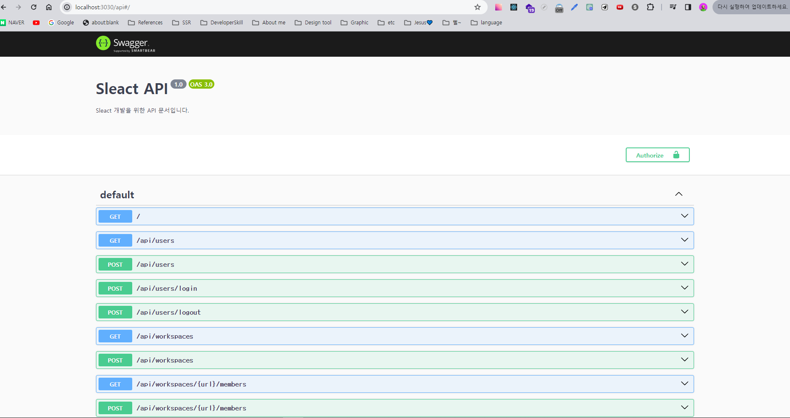
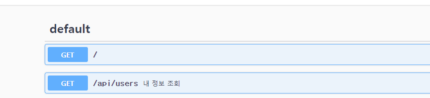
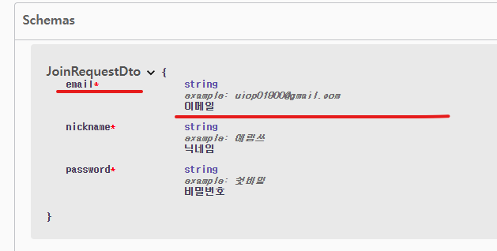
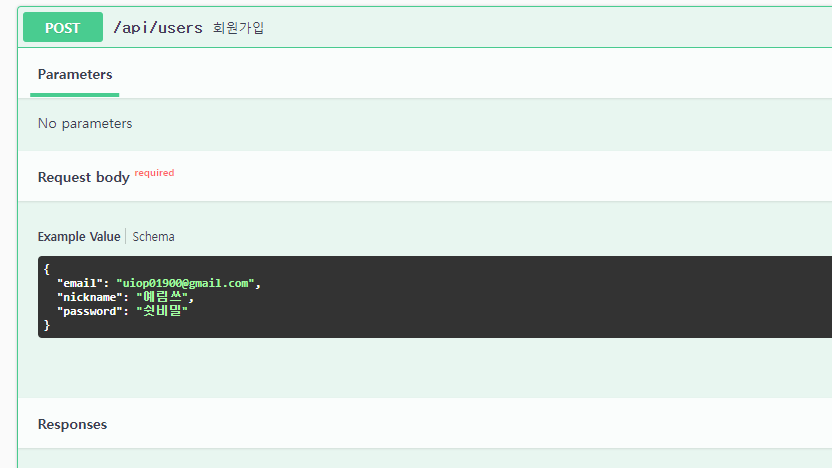
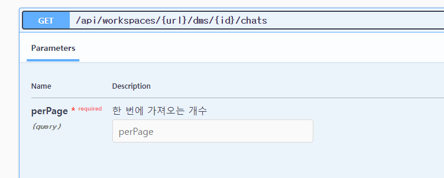
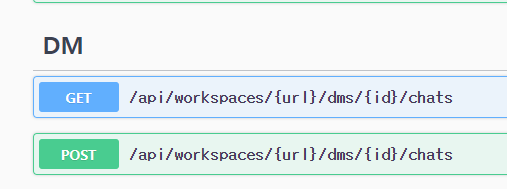
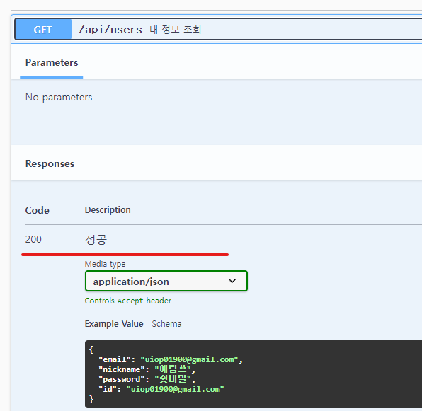

# nest Api 설계하기

## express 에서 사용했던 api를 옮겨보자

> 📍 참고

<https://github.com/ZeroCho/sleact/blob/master/API.md>

### nest cli

- nest는 컨트롤러 모듈 서비스를 생성하는 명령어를 제공함

> 📍 참고

<https://docs.nestjs.com/cli/usages#nest-generate>

```sh
# 모듈
nest g mo users
nest g mo workspaces
nest g mo channels
nest g mo dms
```

- 이렇게 하게 되면 각각 폴더내 모듈 생성후 `app.module.ts` 에 의존성 주입이 된다.

```js
// app.module.ts
...
@Module({
  imports: [
    ConfigModule.forRoot(),
    UsersModule,
    WorkspacesModule,
    ChannelsModule,
    DmsModule,
  ],
  ...
})
...
```

- 이제 서비스와 컨트롤러도 같은 맥락으로 만들어 준다.

```sh
# 서비스
nest g s users
nest g s dms
nest g s channels
nest g s workspaces

# 컨트롤러
nest g co users
nest g co dms
nest g co channels
nest g co workspaces
```

- `users.controller.ts` 가 생성이 되면 다음과 같이 작성해준다.

```ts
import { Body, Controller, Get, Post, Req, Res } from "@nestjs/common";
import { JoinRequestDto } from "./dto/join.request.dto";
import { UsersService } from "./users.service";

@Controller("api/users")
export class UsersController {
  constructor(private usersService: UsersService) {}
  @Get()
  getUsers(@Req() req) {
    return req.user;
  }

  @Post()
  postUsers(@Body() data: JoinRequestDto) {
    this.usersService.postUsers(data.email, data.nickname, data.password);
  }

  @Post("login")
  logIn() {}

  @Post("logout")
  logout(@Req() req, @Res() res) {
    req.logOut();
    res.clearCookie("connect.sid", { httpOnly: true });
    res.send("ok");
  }
}
```

- 위에 있는 `JoinRequestDto` 타입을 만들어 보도록 하자

> `DTO (Data Transfer Object)` 란 ?

- 데이터를 전송하거나 서로 다른 계층 간에 데이터를 전달하기 위한 객체이다. 주로 비즈니스 계층과 퍼시스턴스 계층 간의 데이터 전송에 사용되며, 데이터베이스나 외부 시스템과의 통신 등에서 주로 활용

### `nest`의 `convention`

1. `hypen`이나 `camelcase` 잘안쓰고 점으로 naming
2. `export default` 를 잘 안씀
3. `interface` 잘안쓰고 `class`를 많이 씀(컴파일 이후에도 남아있어서 js단에서도 타입검증 , 벨리데이션 같은 것을 수행할 수 있다.)

- `nest` 는 di 까지는 해줘도 타입까지는 정확하게 못잡아주기 때문에 타입을 붙여줘야한다.

```ts
// user/dto/join.request.dto.ts

export class JoinRequestDto {
  public email: string;
  public nickname: string;
  public password: string;
}
```

### query string 사용법

- 아래 부분을 `nest` 에서 구현해 보자면..

<https://github.com/ZeroCho/sleact/blob/master/API.md#get-workspacesworkspacedmsidchats>

- 다음과 같이 작성

```ts
// user/dms/dms.controller.ts

import { Body, Controller, Get, Param, Post, Query } from "@nestjs/common";

@Controller("api/workspaces/:url/dms")
export class DmsController {
  @Get(":id/chats")
  getChet(@Query() query, @Param() param) {
    console.log(query.perPage, query.page);
    console.log(param.id, param.url);
  }

  @Post(":id/chats")
  postChat(@Body() body) {}
}
```

```ts
// user/channels/channels.controller.ts

import { Body, Controller, Get, Param, Post, Query } from '@nestjs/common';

@Controller('channels')
export class ChannelsController {
  @Get()
  getAllChannels() {}

  @Post()
  createChannels() {}

  @Get(':name')
  getSpecificChannel() {}

  @Get(':name/chats')
  getChet(@Query() query, @Param() param) {
    console.log(query.perPage, query.page);
    console.log(param.id, param.url);
  }

  @Post(':name/chats')
  postChat(@Body() body) {}

  @Get(':name')
  getAllMembers() {}

  @Post(':name/chats')
  inviteMemvbers() {}
}
Chat(@Body() body) {}
```

## API 문서 작성

- `express` 는 자유도가 너무 높아서 api 문서를 만들어 주는데 한계가... 다음패키지 설치

> 참고: <https://docs.nestjs.com/openapi/introduction>

```sh
yarn add @nestjs/swagger

```

- 다음과 같이 api 문서가 세팅된다 ~



### 각 api description 작성

- 다음과 같이 각 `api`위에 `@ApiOperation`를 달아주면

```ts
// users.controller.ts

...
export class UsersController {
  constructor(private usersService: UsersService) {}
  @ApiOperation({ summary: '내 정보 조회' })
  @Get()
  getUsers(@Req() req) {
    return req.user;
  }

  ...
}

...

```

- 다음과 같이 볼수 있다.

  

### `Property` 작성

- `dto` 에서도 `@ApiProperty`를 달면

```ts
// user/dto/join.request.dto.ts

export class JoinRequestDto {
  @ApiProperty({
    example: "uiop01900@gmail.com",
    description: "이메일",
    required: true,
  })
  public email: string;
  ...
}
```

- 다음과 같이 확인할 수 있다.





### `query` 작성

- 또한 `dms`에서 다음과 같이 `@ApiQuery`를 작성해주면

```ts
// dms.controller.ts

 ...
 export class DmsController {
  @ApiQuery({
    name: 'perPage',
    required: true,
    description: '한 번에 가져오는 개수',
  })
  @Get(':id/chats')
  getChet(@Query() query, @Param() param) {
    console.log(query.perPage, query.page);
    console.log(param.id, param.url);
  }

}

```

- 이렇게 확인 가능하다



### `tag` 작성

- `@ApiTags` 공통으로 묶어서

```ts
// dms.controller.ts

...
@ApiTags("DM")
@Controller("api/workspaces/:url/dms")
export class DmsController {}
```

- 다음과 같이 구분 `tag` 를 가질수 있음



### `dto` 관리

- 자주 사용하는 `dto` 는 따로 빼서 관리를 해주는게 편함(나중에 `validation` 하는 라이브러리 붙여서 `bodyparser` 동작하게 하면서 동시에 `validation`까지 같이 할 수 있음)

```ts
// common/dto/user.dto.ts

import { ApiProperty } from "@nestjs/swagger";
import { JoinRequestDto } from "src/users/dto/join.request.dto";

export class UserDto extends JoinRequestDto {
  @ApiProperty({
    required: true,
    example: 1,
    description: "아이디",
  })
  id: number;

  @ApiProperty({
    required: true,
    example: "uiop01900@gmail.com",
    description: "이메일",
  })
  id: number;
}
```

### `dto extend` (에러 코드마다 별개로 작성해 줘야함)

- 위에 작성한 `dto` 를 `@ApiResponse`로 가져다 사용하면 된다.

```ts
// users.controller.ts

...
export class UsersController {
  constructor(private usersService: UsersService) {}
    @ApiResponse({
    status: 200,
    description: '성공',
    type: UserDto,
  })
  @ApiOperation({ summary: '내 정보 조회' })
  @Get()
  getUsers(@Req() req) {
    return req.user;
  }

  ...
}

...

```

- 그럼 다음과 같이 보여짐
  
