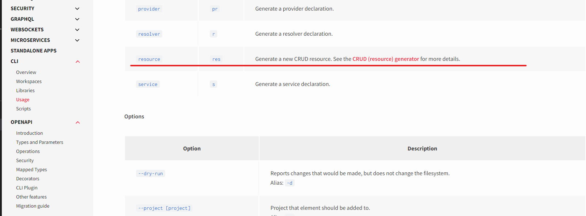

# typeorm 사용하기

- `typeorm-model-generator` 를 사용하여 `type-orm` 을 붙여보자

  <https://www.npmjs.com/package/typeorm-model-generator>

```sh
yarn add typeorm-model-generator -D
```

```sh
npx typeorm-model-generator -h localhost -d sleact -u root -x nodejsbook -e mysql
```

> ✋ 나는 `typeorm-model-generator` 설치 안하고 `nest-typeorm` 폴더의 `src/entities`를 그냥 복사해서 src 폴더에 붙여넣고 진행함

```sh
yarn add @nestjs/typeorm typeorm mysql

```

> CRUD 한번에 만들기



## typeorm 커넥션 맺기

```js
// app.models.ts

...
@Module({
  imports: [
    ConfigModule.forRoot(), // forRoot 는 설정이 있는 애들
    UsersModule,
    ...
    TypeOrmModule.forRoot({
      type: 'mysql',
      host: 'localhost',
      port: 3306,
      username: process.env.DB_USERNAME,
      password: process.env.DB_PASSWORD,
      database: process.env.DB_DATABASE,
      entities: [],
      synchronize: true, // 개발환경일때만 true 로 해준다.
       logging: true,
      keepConnectionAlive: true,  // hot reloading 같은 역활
      charset: 'utf8mb4', // 이모티콘 추가 가능
    }), // 이거 추가
    TypeOrmModule.forFeature([Users]),// 이거 추가
  ],
})
....

```

## typeorm seeding

- 초기데이터 넣어보는 작업을 seed 로 해보자

> 📍 `migration` 이란 ?

- 데이터베이스 구조를 변경하는 프로세스, 테이블, 열, 인덱스 또는 관계를 생성하거나 수정하는 등 데이터베이스의 스키마(구조)를 업데이트하는 데 사용된다.

```sh
yarn add typeorm-extension
```

```json
// paakage.json
{
  "name": "a-nest",
  "version": "0.0.1",
  "description": "",
  "author": "",
  "private": true,
  "license": "UNLICENSED",
  "scripts": {
    "build": "nest build",
    ...
    // 다음 아래 명령어 추가
    "db:create": "ts-node ./node_modules/typeorm-extension/bin/cli.cjs db:create -d ./dataSource.ts",
    "db:drop": "ts-node ./node_modules/typeorm-extension/bin/cli.cjs db:drop -d ./dataSource.ts",
    "seed": "ts-node ./node_modules/typeorm-extension/bin/cli.cjs seed:run -d ./dataSource.ts",
    "schema:drop": "ts-node ./node_modules/typeorm/cli.js schema:drop",
    "schema:sync": "ts-node ./node_modules/typeorm/cli.js schema:sync",
    "db:migrate": "npm run typeorm migration:run -- -d ./dataSource.ts",
    "db:migrate:revert": "npm run typeorm migration:revert -- -d ./dataSource.ts",
    "db:create-migration": "npm run typeorm migration:create -- ./src/migrations/",
    "db:generate-migration": "npm run typeorm migration:generate -- ./src/migrations -d ./dataSource.ts"
  },
  ...
  }

```
