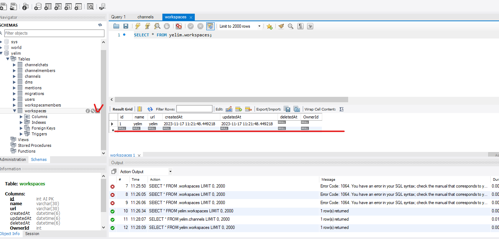
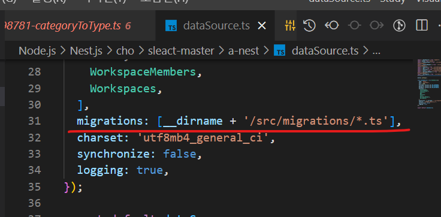

# typeorm 사용하기

- `typeorm-model-generator` 를 사용하여 `type-orm` 을 붙여보자

  <https://www.npmjs.com/package/typeorm-model-generator>

```sh
yarn add typeorm-model-generator -D
```

```sh
npx typeorm-model-generator -h localhost -d sleact -u root -x nodejsbook -e mysql
```

> ✋ 나는 `typeorm-model-generator` 설치 안하고 `nest-typeorm` 폴더의 `src/entities`를 그냥 복사해서 src 폴더에 붙여넣고 진행함

```sh
yarn add @nestjs/typeorm typeorm mysql

```

> CRUD 한번에 만들기


## typeorm 커넥션 맺기

```js
// app.models.ts

...
@Module({
  imports: [
    ConfigModule.forRoot(), // forRoot 는 설정이 있는 애들
    UsersModule,
    ...
    TypeOrmModule.forRoot({
      type: 'mysql',
      host: 'localhost',
      port: 3306,
      username: process.env.DB_USERNAME,
      password: process.env.DB_PASSWORD,
      database: process.env.DB_DATABASE,
      entities: [
        ChannelChats,
        ChannelMembers,
        Channels,
        DMs,
        Mentions,
        Users,
        WorkspaceMembers,
        Workspaces,
      ],
    //   autoLoadEntities: true, // entities 전체 포함하는 설정 (버그가 많다고 해서 나는 그냥 entities 에 다 넣어주었다.)
      synchronize: true, // 개발환경일때만 true 로 해준다. => true 로 변경하고 서버를 재시작하면 테이블은 자동으로 생긴다.
       logging: true,
      keepConnectionAlive: true,  // hot reloading 같은 역활
      charset: 'utf8mb4', // 이모티콘 추가 가능
    }), // 이거 추가
    TypeOrmModule.forFeature([Users]),// 이거 추가
  ],
  ...
})
....

```

## typeorm seeding

- 초기데이터 넣어보는 작업을 seed 로 해보자

- 다음을 설치 해준다.

```sh
yarn add typeorm-extension
```

- `package.json` 에 다음과 같이 추가

```json
// package.json
{
  "name": "a-nest",
  "version": "0.0.1",
  "description": "",
  "author": "",
  "private": true,
  "license": "UNLICENSED",
  "scripts": {
    "build": "nest build",
    ...
    // 다음 아래 명령어 추가
    "typeorm": "ts-node --require tsconfig-paths/register ./node_modules/typeorm/cli.js",
    "db:create": "ts-node ./node_modules/typeorm-extension/bin/cli.cjs db:create -d ./dataSource.ts",
    "db:drop": "ts-node ./node_modules/typeorm-extension/bin/cli.cjs db:drop -d ./dataSource.ts",
    "seed": "ts-node ./node_modules/typeorm-extension/bin/cli.cjs seed:run -d ./dataSource.ts",
    "schema:drop": "ts-node ./node_modules/typeorm/cli.js schema:drop",
    "schema:sync": "ts-node ./node_modules/typeorm/cli.js schema:sync",
    "db:migrate": "npm run typeorm migration:run -- -d ./dataSource.ts",
    "db:migrate:revert": "npm run typeorm migration:revert -- -d ./dataSource.ts",
    "db:create-migration": "npm run typeorm migration:create -- ./src/migrations/",
    "db:generate-migration": "npm run typeorm migration:generate -- ./src/migrations -d ./dataSource.ts"
  },
  ...
  }

```

- `typeorm`은 설정을 못읽기 때문에 `typeorm` 을 위한 설정 파일을 따로 만들어 주어야 함 => `dataSource.ts` 생성

```ts
// dataSource.ts

import { DataSource } from "typeorm";
import dotenv from "dotenv";
import { ChannelChats } from "./src/entities/ChannelChats";
import { ChannelMembers } from "./src/entities/ChannelMembers";
import { Channels } from "./src/entities/Channels";
import { DMs } from "./src/entities/DMs";
import { Mentions } from "./src/entities/Mentions";
import { Users } from "./src/entities/Users";
import { WorkspaceMembers } from "./src/entities/WorkspaceMembers";
import { Workspaces } from "./src/entities/Workspaces";

dotenv.config();

const dataSource = new DataSource({
  type: "mysql",
  host: "localhost",
  port: 3306,
  username: process.env.DB_USERNAME,
  password: process.env.DB_PASSWORD,
  database: process.env.DB_DATABASE,
  entities: [ChannelChats, ChannelMembers, Channels, DMs, Mentions, Users, WorkspaceMembers, Workspaces],
  migrations: [__dirname + "/src/migrations/*.ts"],
  charset: "utf8mb4_general_ci",
  synchronize: false,
  logging: true,
});

export default dataSource;
```

- 테이블 생기기 전에 `database` 를 만들어 주어야 되기 때문에 다음 명령어를 실행한다

```sh
yarn add db:create

```

- 다움과 같이 `yelim db` 가 생성되었다 (짝짝짝)👏👏👏


- 다음 명령어를 입력뒤 서버연결이 성공하면

```sh
yarn start:dev

```

- `synchronize` 를 `false` 로 바꿔준다.

```js
// app.models.ts

...
@Module({
  imports: [
    ConfigModule.forRoot(), // forRoot 는 설정이 있는 애들
    UsersModule,
    ...
    TypeOrmModule.forRoot({
      type: 'mysql',
      host: 'localhost',
      port: 3306,
     ...
      synchronize: false, // false 로 바꿔준다.
    ...
    }),
   ...
  ],
  ...
})
....

```

- 자,, 이제 `seeding` 을 해보자 ~ (초기 데이터를 넣어주자 ~ 다음경로에 생성을 해야 `seeds` 로 인식을 함)

> 왜 만들어야 하냐면..

- 초기 워크스페이스 하나 와 워크스페이스에 속한 일반 채널을 초창기 데이터로 설정해 놓아야 워크스페이스로 넘어갔을때 에러를 방지 할 수 있다.

```ts
// src/database/seeds/create-initial-data.ts

import { Seeder, SeederFactoryManager } from "typeorm-extension";
import { DataSource } from "typeorm";
import { Workspaces } from "../../entities/Workspaces";
import { Channels } from "../../entities/Channels";

export default class UserSeeder implements Seeder {
  public async run(
    // 이 run 이 실행되게 되면 아까 만든 dataSource.ts 가 여기로 연결이 됨
    dataSource: DataSource
    // factoryManager: SeederFactoryManager,
  ): Promise<any> {
    const workspacesRepository = dataSource.getRepository(Workspaces);
    await workspacesRepository.insert([
      {
        id: 1,
        name: "Sleact",
        url: "sleact",
      },
    ]);
    const channelsRepository = dataSource.getRepository(Channels);
    await channelsRepository.insert([
      {
        id: 1,
        name: "일반",
        WorkspaceId: 1,
        private: false,
      },
    ]);
  }
}
```

- `factoryManager` 는 랜덤 `channel` 이나 `user` 생성할 때 주로 사용 => 테스트용 데이터 자동으로 생성할때 굉장히 유용하다.

> 참조

<https://www.npmjs.com/package/typeorm-extension#factory>
<https://fakerjs.dev/guide/>

- 여튼 .. seed를 생성해 보자 ~

```sh
yarn seed

```

- 워크 벤치에서 표시부분 클릭하거나 `SElECT * FROM yelim.workspaces` 입력후 `Ctrl+Enter` 시 초기데이터 다음과 같이 조회가능(`seeding` 성공 ~)



## migration 하기

> 📍 `migration` 이란 ?

- 데이터베이스 구조를 변경하는 프로세스, 테이블, 열, 인덱스 또는 관계를 생성하거나 수정하는 등 데이터베이스의 스키마(구조)를 업데이트하는 데 사용된다.(실수 했을때 경우를 대비해서 롤백하는 그런기능을 위해 `migration` 작업을 하는거임, 한번만 `migration` 하면되서 불일치 문제도 방지할 수 있음)

- 다음 입력 하게 되면 `workspaces/` 경로에 `migrations` 파일 하나가 생성이 되는데

```sh
yarn db:create-migration
```

- `src/migrations` 폴더 생성후 거기 정리해줌 => `dataSource.ts` 파일에 `src/migrations` 하위 파일들이 `migrations` 파일이라고 설정해 두었기 때문에



- `migration` 에 작성된 하위 파일을 다음과 같이 수정한다.

```ts
// migration/*

import { MigrationInterface, QueryRunner } from "typeorm";

export class Migrations1700189498781 implements MigrationInterface {
  name = "Migrations1700189498781";
  public async up(queryRunner: QueryRunner): Promise<void> {
    await queryRunner.query("ALTER TABLE `mentions` RENAME COLUMN `category` TO `type`");
  }

  public async down(queryRunner: QueryRunner): Promise<void> {
    await queryRunner.query("ALTER TABLE `mentions` RENAME COLUMN `type` TO `category`");
  } //
}
```

- 실수할 경우 `rollback` 할 수 있게 `up`과 `down` 두가지를 작성해주면 된다.

- 💬다음 명령어로 자동 작성이 되긴하지만 `generate` 가 아직 불안정해서 그대로 갖다 쓰면 안됨 => (실제 db와 `entities`의 `typeorm`을 분석해서 파일 생성함)

```sh
yarn db:generate-migration
```

- 다음을 실행하게 되면

```sh
yarn db:migrate

```
