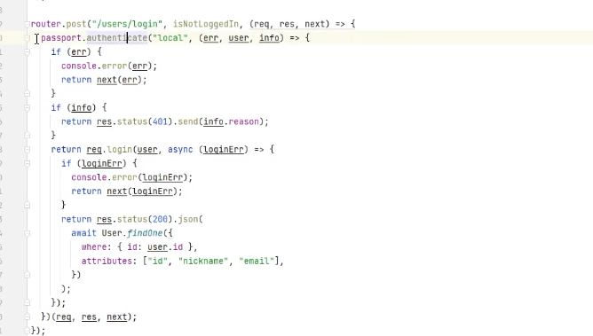

# 본격 backend 작업

## express 의 `authenticate` 작업을 해보자



- 설치 및 다음 경로에 파일 생성

```sh
yarn add @nestjs/passport && passport-local && passport && cookie-parser && express-session
```

- `src/auth/` 하위 파일 생성

```ts
// src/auth/local-auth.guard.ts

import { ExecutionContext, Injectable } from "@nestjs/common";
import { AuthGuard } from "@nestjs/passport";

@Injectable()
export class LocalAuthGuard extends AuthGuard("local") {
  async canActivate(context: ExecutionContext): Promise<boolean> {
    const can = await super.canActivate(context);
    if (can) {
      const request = context.switchToHttp().getRequest();
      console.log("login for cookie");
      await super.logIn(request);
    }

    return true;
  }
}
```

```ts

// users.controller.ts

...
  @ApiOperation({ summary: '로그인' })
  @UseGuards(LocalAuthGuard) // 다음 추가
  @Post('login')
  logIn(@User() user) {
    return user;
  }

  ...

```
