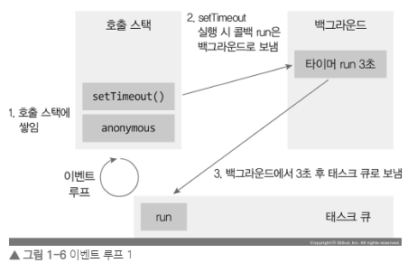
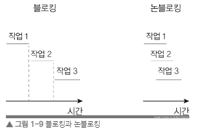
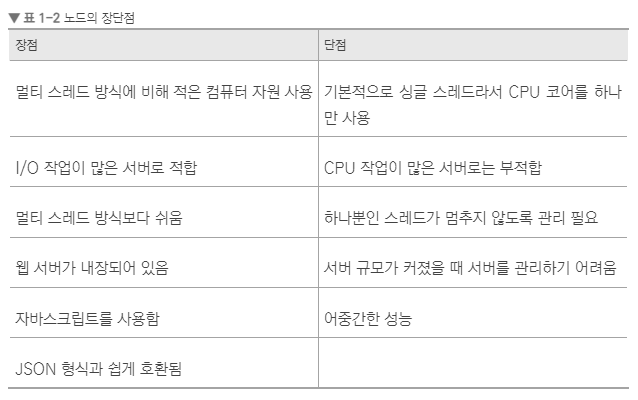
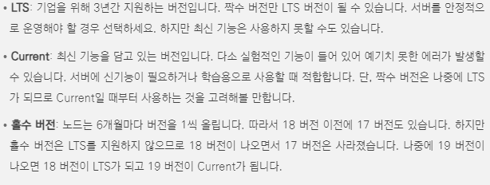

# 01. node.js 기초 개념 쌓기

## 노드 외의 런타임

- 자바스크립트 런타임은 노드 외에도 많다. 아직 노드의 유명세를 따라잡지는 못했지만 눈여겨봐야 할 것으로 번<https://bun.sh>과 디노<https://deno.land>가 있다.

## 이벤트 기반 방식으로 동작하는 노드

• `이벤트 루프`: 이벤트 발생 시 호출할 콜백 함수들을 관리, 호출된 콜백 함수의 실행 순서를 결정하는 역할을 담당한다. 노드가 종료될 때까지 이벤트 처리를 위한 작업을 반복하므로 루프(loop)라고 부른다.

• `백그라운드`: setTimeout 같은 타이머나 이벤트 리스너들이 대기하는 곳. 자바스크립트가 아닌 다른 언어로 작성된 프로그램이라고 봐도 무방하다, 여러 작업이 동시에 실행될 수 있다.

• `태스크 큐`: 이벤트 발생 후, 백그라운드에서는 태스크 큐로 타이머나 이벤트 리스너의 콜백 함수를 보낸다. 정해진 순서대로 콜백들이 줄을 서 있으므로 콜백 큐라고도 한다. 콜백들은 보통 완료된 순서대로 줄을 서 있지만, 특정한 경우 순서가 바뀌기도 한다.



## 논블로킹(non-blocking) / 블로킹(blocking)



## node의 장단점



### 이와 같은 특성을 활용하려면 노드를 어디에 사용해야 할까?

- 개수는 많지만 크기는 작은 데이터를 실시간으로 주고받는 데 적합하다.
- 네트워크나 데이터베이스, 디스크 작업 같은 I/O에 특화되어 있다.
- 실시간 채팅 애플리케이션이나 주식 차트, JSON 데이터를 제공하는 API 서버가 노드를 많이 사용

### node 홈페이지의 LTS와 Current 버전의 차이



> `초콜리티`
> 윈도우 에서도 명령 프롬프트를 통해 노드를 설치하고 싶다면 초콜리티(chocolatey)를 고려해도 된다. 초콜리티는 노드 외의 다른 프로그램도 명령 프롬프트를 통해 설치할 수 있어 편리하다
> <https://chocolatey.org/install>

```sh
choco install nodejs
```
