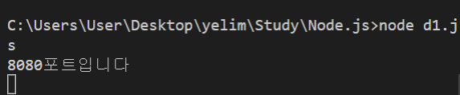
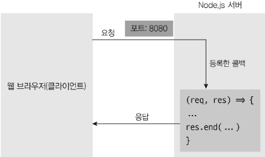

# 04. node 통신

## 서버와 클라이언트의 관계

1. 클라이언트가 서버로 요청(request)을 보냄
2. 서버는 요청을 처리
3. 처리후 클라이언트로 응답(response)을 보냄

## 노드로 http 서버 만들기

- 다음과 같이 서버 생성후 터미널에서 실행하는경우 실행기 하나를 차지하게 된다



```js
const http = require("http");

const server = http
  .createServer((req, res) => {
    res.write("<h1>Hello Node!</h1>"); // stream 방식
    res.write("<h1>룰루리랄랄</h1>");
    res.end("<h1>the end</h1>");
  })

  .listen(8080);

server.on("listening", () => {
  console.log("8080포트입니다");
});
server.on("error", (err) => {
  console.log(err);
});
```



> `localhost` 와 `포트`란?

- `포트`는 서버 내에서 `프로세스`를 구분하는 번호이다. 서버는 `HTTP 요청`을 대기하는 것 외에도 다양한 작업을 한다. 데이터베이스와도 통신해야 하고, `FTP 요청`을 처리하기도 한다. 따라서 서버는 프로세스에 포트를 다르게 할당해 들어오는 요청을 구분한다. 유명한 포트 번호로는 `21(FTP)`, `80(HTTP)`, `443(HTTPS)`, `3306(MYSQL)`이 있습니다. 포트 번호는 IP 주소 뒤에 콜론(:)과 함께 붙여 사용한다.

++ . `리눅스`와 `맥`에서는 `1024번 이하의 포트`에 연결할 때 `관리자 권한`이 필요하다. 따라서 명령어 앞에 `sudo`를 붙여야 한다. 예를 들면 `node server1` 대신 `sudo node server1`을 입력해야 한다. 예제에서는 `8080번 포트`를 사용하므로 `sudo`를 붙이지 않아도 된다.

## fs로 HTML 읽어 제공하기

- 위의 코드와 같이 `res.write()` 와 `res.end()` 에 html코드를 적어주는것은 굉장히 비효율적이다.
- fs 모듈을 불러와서 다음과 같이 사용할수 있다.

```js
const http = require("http");
const fs = require("fs").promises; // fs 는 콜백 형식 모듈이므로 비동기로 처리하기 위해 .promises 를 붙여서 사용한다

http
  .createServer(async (req, res) => {
    try {
      const data = await fs.readFile("./test.html");
      res.writeHead(200, { "Content-Type": "text/html; charset=utf-8" }); // 한글로 사용하기 위해선 "text/html; charset=utf-8" 설정해 줘야함
      res.end(data);
    } catch (err) {
      console.error(err);
      res.writeHead(500, { "Content-Type": "text/plain; charset=utf-8" }); // 에러 메시지는 일반 문자열이므로 text/plain을 사용
      res.end(err.message);
    }
  })

  .listen(8080, () => {
    console.log("8080포트입니다");
  });
```

- HTTP 상태 코드

> 200이나 500과 같은 숫자는 HTTP 상태 코드입니다. res.writeHead에 첫 번째 인수로 상태 코드를 넣었는데, 브라우저는 서버에서 보내주는 상태 코드를 보고 요청이 성공했는지 실패했는지를 판단합니다. 여기서는 대표적인 상태 코드들을 알아보겠습니다.

• 2XX: 성공을 알리는 상태 코드입니다. 대표적으로 200(성공), 201(작성됨)이 많이 사용됩니다.

• 3XX: 리다이렉션(다른 페이지로 이동)을 알리는 상태 코드입니다. 어떤 주소를 입력했는데 다른 주소의 페이지로 넘어갈 때 이 코드가 사용됩니다. 대표적으로 301(영구 이동), 302(임시 이동)가 있습니다. 304(수정되지 않음)는 요청의 응답으로 캐시를 사용했다는 뜻입니다.

• 4XX: 요청 오류를 나타냅니다. 요청 자체에 오류가 있을 때 표시됩니다. 대표적으로 400(잘못된 요청), 401(권한 없음), 403(금지됨), 404(찾을 수 없음)가 있습니다.

• 5XX: 서버 오류를 나타냅니다. 요청은 제대로 왔지만 서버에 오류가 생겼을 때 발생합니다. 이 오류가 뜨지 않게 주의해서 프로그래밍해야 합니다. 이 오류를 res.writeHead로 클라이언트에 직접 보내는 경우는 거의 없고, 예기치 못한 에러가 발생하면 서버가 알아서 5XX대 코드를 보냅니다. 500(내부 서버 오류), 502(불량 게이트웨이), 503(서비스를 사용할 수 없음)이 자주 사용됩니다.

## REST API와 라우팅 사용

> REST(REpresentational State Transfer)

- 서버의 자원을 정의하고 자원에 대한 주소를 지정하는 방법
- 예측이 가능하다 => 보안에 취약할수도..

> HTTP 요청 메서드

• GET: 서버 자원을 가져오고자 할 때 사용
• POST: 서버에 자원을 새로 등록하고자 할 때 사용
• PUT: 서버의 자원을 요청에 들어 있는 자원으로 치환하고자 할 때 사용
• PATCH: 서버 자원의 일부만 수정하고자 할 때 사용
• DELETE: 서버의 자원을 삭제하고자 할 때 사용
• OPTIONS: 요청을 하기 전에 통신 옵션을 설명하기 위해 사용

### HTTP 프로토콜
