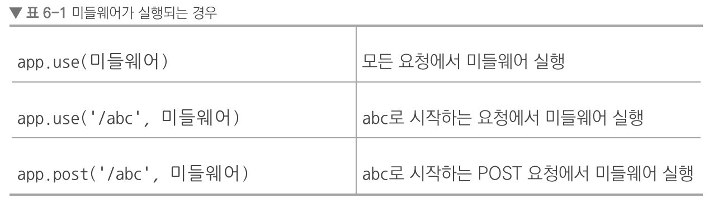
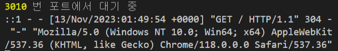
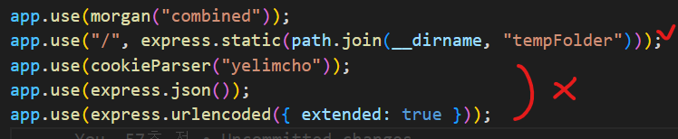
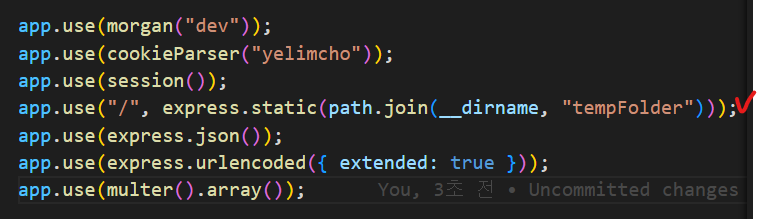
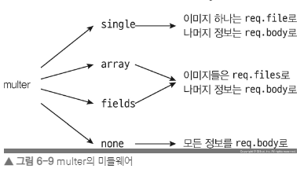
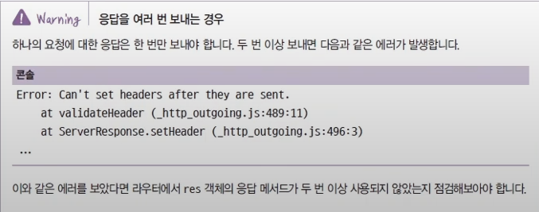

# express

## 필요 모듈 설치

- nodemon : 서버 코드에 수정 사항이 생길 때마다 매번 서버를 재시작하기는 귀찮으므로 nodemon 모듈로 서버를 자동으로 재시작한다.(배포이후에는 서버코드가 빈번하게 변경될일이 없으므로 개발용으로만 사용)

```sh
 npm i express
 npm i -D nodemon
```

- `app.js` 에 다음과 같은 코드를 작성

```js
const express = require("express");

const app = express();

app.use((req, res, next) => {
  console.log("모든 요청에 다 실행됩니다.");
  next(); // 이걸 써줘야 다음 실행기로 넘어간다
});

app.set("port", process.env.PORT || 3010); // app.set 은 서버 내내 유지

// 하나의 요청에 하나의 res 를 걸수 있다.
app.get("/", (req, res) => {
  res.send("Hello, Express");
});

app.get("/:name", (req, res) => {
  // wildcard 사용
  res.send(`Hello, ${req.params.name}`);
});

app.use((err, req, res, next) => {
  // 에러 처리 미들웨어는 매개변수가 err, req, res, next로 네 개여야함
  console.error(err);
  res.status(500).send(err.message);
});

app.listen(app.get("port"), () => {
  console.log(app.get("port"), "번 포트에서 대기 중");
});
```

## 자주 사용하는 미들웨어

- 미들웨어는 익스프레스의 핵심, `요청`과 `응답`의 `중간(middle)`에 위치하기 때문에 `미들웨어(middleware)`라고 부르는 것

- (위와 같은 코드에서 모든 함수에 공통으로 실행하고 싶을때 사용)미들웨어는 `app.use`와 함께 사용 된다. `app.use(미들웨어)` 꼴



> wildcard

- 와일드카드 문자(wildcard character)는 컴퓨터에서 특정 명령어로 명령을 내릴 때, 여러 파일을 한꺼번에 지정할 목적으로 사용하는 기호를 가리킨다.

- (주의점) 위에서 아래로 실행되기 때문에 `/yelim` 주소로 이동하게되면 위의 함수에서 멈추게 되므로 `wildcard` 사용 라우터들(범위가 넓은 라우터들)은 맨 아래쪽에 위치시켜준다.

```js
app.get("/:name", (req, res) => {
  res.send(`Hello, wild`);
});

app.get("*", (req, res) => {
  // 모든 요청에 대해서
  res.send(`Hello, everyone`);
});

app.get("/yelim", (req, res) => {
  res.send(`Hello, yelim`);
});
```

- 다음과 같은 형태로도 사용 가능하다.

```js
app.use(
  (req, res, next) => {
    console.log("1. 모든 요청에 다 실행됩니다.");
    next();
  },
  (req, res, next) => {
    console.log("2. 모든 요청에 다 실행됩니다.");
    next();
  },
  (req, res, next) => {
    console.log("3. 모든 요청에 다 실행됩니다.");
    next();
  },
  (req, res, next) => {
    console.log("4. 모든 요청에 다 실행됩니다.");
    next();
  }
);
```

- 다음구조에서 `next` 인자 값으로 err 넣을시 에러처리 구문의 미들웨어로 이동함

```js
app.use((req, res, next) => {
  console.log(" 모든 요청에 다 실행됩니다.");
  try {
    console.log(asda);
  } catch (err) {
    next(err);
  }
});
...
app.use((err, req, res, next) => {
  // 에러 처리 미들웨어는 매개변수가 err, req, res, next로 네 개
  console.error(err);
  res.status(500).send(err.message);
});
```

- 만약 다음 구조에서 `next` 안에 `route` 를 적는다면 다음 라우터로 이동하게됨

```js
app.get(
  "/",
  (res, req, next) => {
    console.log("실행되나요");
    next("route");
  },
  (res, req, next) => {
    console.log("여기는 실행 x");
  }
);
app.get("/", (res, req, next) => {
  console.log("다음은 여기가 실행됩니다 ~");
});

// 실행되나요
// 다음은 여기가 실행됩니다 ~
```


## 실무에서 자주 사용하는 미들웨어 패키지

- 이미 많은 사람들이 유용한 기능들을 미들웨어 패키지로 만들어 놨음

```sh
yarn add morgan cookie-parser express-session
yarn add dotenv # 미들웨어 아님
```

▸ morgan : 다음과 같이 요청과 응답을 기록함

```js
app.use(morgan("dev"));
```


- `[HTTP 메서드] [주소] [HTTP 상태 코드] [응답 속도] - [응답 바이트]`를 의미

```js
app.use(morgan("combined")); // combined 사용시 좀더 자세히 나옴
```



▸ cookie-parser : `cookie-parser` 사용시 쿠키관련 조작이 편리해짐

```js
app.use(cookieParser());

app.get("/", (req, res) => {
  req.cookies; // 문자열 => 객체로 알아서 파싱해줌
  res.cookie("name", encodeURIComponent(name), {
    expires: new Date(),
    httpOnly: true,
    path: "/",
  });
  res.clearCookie("name", encodeURIComponent(name), {
    httpOnly: true,
    path: "/",
  });
});
```

- 다음과 같이 사용시 서명된 `yelimcho` 쿠키를 보낼수 있다.

```js
app.use(cookieParser("yelimcho"));
req.signedCookies;
```

▸ express 내부

```js
app.use(express.json()); // json 데이터를 파싱해서 req 데이터로 넣어준다.
app.use(express.urlencoded({ extended: true })); // express 파싱시 querystring 을 어떻게 처리할 것인지 여부를 지정 =>  true 면 qs, false 면 querystring
```

▸ static

- static 미들웨어는 정적인 파일들을 제공하는 라우터 역할을 한다.

```js
// app.use("요청 경로", express.static(path.join(__dirname, "실제 경로")));
app.use("/", express.static(path.join(__dirname, "tempFolder")));

// 요청경로 => localhost:3000/hello.css    실제경로 => express/tempFolder/hello.css => 보안에도 좋음
```

> 유의할 점

- 미들웨어 끼리의 순서도 중요한데 다음 미들웨어에서는 `next()`가 없기 때문에 파일을 찾게되면 아래가 실행되지 않는다.

- 요청 주소에 따라 미들웨어가 어디 까지 실행되는지 여부가 달라진다.

  ex)
  localhost:3000/hello.css => 아래 미들웨어에서 걸려 멈춤
  localhost:3000/hello => 아래 라우터 까지 찾아나감

```js
app.use("/", express.static(path.join(__dirname, "tempFolder")));
```



- 보통 이런 순서로 놓는 경우는 로그인된 사용자에게만 정적소스를 제공하고 싶을 때 사용한다.



▸ express-session : 세션 관리용 미들웨어

- 세션은 사용자별로 req.session 객체 안에 유지된다.

```js
app.use(
  session({
    resave: false,
    saveUninitialized: false,
    secret: "yelimcho",
    cookie: {
      httpOnly: true,
      secure: false,
    },
    name: "session-cookie",
  })
);

app.get("/", (req, res) => {
  req.session.id = "uiop0190"; // 데이터가 계속 남아있음 > 요청 한번에 일회성 데이터를 담고 싶다면 req.data 에서 관리

  res.send(`Hello, everyone`);
});
```

- 미들웨어 확장하기

  ```js
  app.use("/", (req, res, next) => {
    express.static(__dirname, "tempFolder")(req, res, next);
  });
  ```

  💨 다음과 같이 미들웨어 내부에 미들웨어를 사용하게되면 내부에서 (로그인 같은 경우를) 분기하여 처리할 수 있음

  ```js
  app.use("/", (req, res, next) => {
    if (req.session.id) {
      express.static(__dirname, "tempFolder")(req, res, next);
    } else {
      next();
    }
  });
  ```

▸ multer : 파일 업로드를 위해 사용되는 미들웨어

```js
const fs = require("fs");
const path = require("path");
const multer = require("multer");

try {
  fs.readFileSync("upload"); // 서버 시작전이라 sync 모듈을 사용해도 된다.
} catch (error) {
  console.log("upload 폴더가 없");
  fs.mkdirSync("upload");
}

const upload = multer({
  // storage 는 어디에(destination) 어떤 이름으로(filename) 저장할지
  storage: multer.diskStorage({
    // destination과 filename 함수내 매개변수(req나 file의 데이터를 가공해서 done으로 넘기는 형식)
    // req => 요청에 대한 정보
    // file 객체 => 업로드한 파일에 대한 정보
    // done(함수) => 첫 번째 인수에는 에러가 있다면 에러를 넣고, 두 번째 인수에는 실제 경로나 파일 이름을 넣어주면 된다.
    destination(req, file, done) {
      done(null, "uploads/");
    },
    filename(req, file, done) {
      const ext = path.extname(file.originalname); // 확장자 추출
      done(null, path.basename(file.originalname, ext) + Date.now() + ext); // 현재 시간을 넣어주는 이유는 업로드하는 파일명이 겹치는 것을 막기 위함임
    },
  }),
  // limits 속성에는 업로드에 대한 제한 사항을 설정할 수 있다. ( 파일 사이즈(fileSize, 바이트 단위)는 5MB로 제한)
  limits: { fileSize: 5 * 1024 * 1024 },
});

app.get("/upload", (req, res) => {
  res.sendFile(path.join(__dirname, "multipart.html"));
});

app.post("/upload", app.use(upload.array("image")), (req, res) => {
  console.log(req.file);
  res.send("ok");
});
```



## Router 객체로 라우팅 분리하기

- 이전 라우터를 만들 때는 요청 메서드와 주소별로 분기 처리를 하느라 코드가 매우 복잡하며, if문으로 분기하면서 코딩했기 때문에 보기에도 좋지 않고 확장하기도 어려웠다.

- routes 폴더를 생성후 각각 파일을 생성해보자.

```js
// index.js
const express = require("express");

const router = express.Router();

// GET / 라우터
router.get("/", (req, res) => {
  res.send("Hello, Express");
});

module.exports = router;
```

```js
// user.js
const express = require("express");

const router = express.Router();

// GET /user 라우터
router.get("/", (req, res) => {
  res.send("Hello, User");
});

module.exports = router;
```

- 그런다음 `app.use`를 통해 `app.js`에 연결 할수 있다.

```js
// app.js
const indexRouter = require("./routes");
const userRouter = require("./routes/user");

app.use("/", indexRouter);
app.use("/user", userRouter); // app.use로 연결할 때 주소가 합쳐진다

app.use((req, res, next) => {
  res.status(404).send("Not Found");
}); // 에러처리 미들웨어
```

> 주소는 같지만 메서드가 다른 코드가 있을때 `router.route` 로 묶는다

```js
// before
router.get("/abc", (req, res) => {
  res.send("GET /abc");
});
router.post("/abc", (req, res) => {
  res.send("POST /abc");
});

// after
router
  .route("/abc")
  .get((req, res) => {
    res.send("GET /abc");
  })
  .post((req, res) => {
    res.send("POST /abc");
  });
```

## req, res 객체 살펴보기

### req 객체

• req.app: req 객체를 통해 app 객체에 접근할 수 있습니다. req.app.get('port')와 같은 식으로 사용할 수 있습니다.

• req.body: body-parser 미들웨어가 만드는 요청의 본문을 해석한 객체입니다.

• req.cookies: cookie-parser 미들웨어가 만드는 요청의 쿠키를 해석한 객체입니다.

• req.ip: 요청의 ip 주소가 담겨 있습니다.

• req.params: 라우트 매개변수에 대한 정보가 담긴 객체입니다.

• req.query: 쿼리스트링에 대한 정보가 담긴 객체입니다.

• req.signedCookies: 서명된 쿠키들은 req.cookies 대신 여기에 담겨 있습니다.

• req.get(헤더 이름): 헤더의 값을 가져오고 싶을 때 사용하는 메서드입니다.

### res 객체

• res.app: req.app처럼 res 객체를 통해 app 객체에 접근할 수 있습니다.

• res.cookie(키, 값, 옵션): 쿠키를 설정하는 메서드입니다.

• res.clearCookie(키, 값, 옵션): 쿠키를 제거하는 메서드입니다.

• res.end(): 데이터 없이 응답을 보냅니다.

• res.json(JSON): JSON 형식의 응답을 보냅니다.

• res.locals: 하나의 요청 안에서 미들웨어 간에 데이터를 전달하고 싶을 때 사용하는 객체입니다.

• res.redirect(주소): 리다이렉트할 주소와 함께 응답을 보냅니다.

• res.render(뷰, 데이터): 다음 절에서 다룰 템플릿 엔진을 렌더링해서 응답할 때 사용하는 메서드입니다.

• res.send(데이터): 데이터와 함께 응답을 보냅니다. 데이터는 문자열일 수도, HTML일 수도, 버퍼일 수도, 객체나 배열일 수도 있습니다.

• res.sendFile(경로): 경로에 위치한 파일을 응답합니다.

• res.set(헤더, 값): 응답의 헤더를 설정합니다.

• res.status(코드): 응답 시의 HTTP 상태 코드를 지정합니다.

### 추가사항

- 메서드 체이닝을 지원함

```js
// prettier-ignore
res
  .status(201)
  .cookie('test', 'test')
  .redirect('/admin');
```

- 응답은 한번만 ~



## 템플릿 엔진

- 📍 HTML의 정적인 단점을 개선(템플릿 엔진은 자바스크립트를 사용해서 HTML을 렌더링할 수 있게한다.)

- 반복문, 조건문, 변수 등을 사용할 수 있음
- 동적인 페이지 작성 가능
- php, jsp와 유사
- (간단한 ssr을 구현할 수 있음)

### 퍼그(제이드)

- 퍼그 설치

```sh
yarn add pug
```

- `app.js` 에 다음을 추가한다.

```js
app.set("views", path.join(__dirname, "views"));
app.set("view engine", "pug");
```

- `views`는 템플릿 파일들이 위치한 폴더를 지정하는 것이다. `res.render` 메서드가 이 폴더 기준으로 템플릿 엔진을 찾아서 렌더링한다.

ex) `res.render('index')` => `views/index.pug`를 렌더링한다.

- 아이콘 <del>개졸귀</del>
  

- 관련문법은 다음을 참조하자

<https://pugjs.org/api/getting-started.html>
