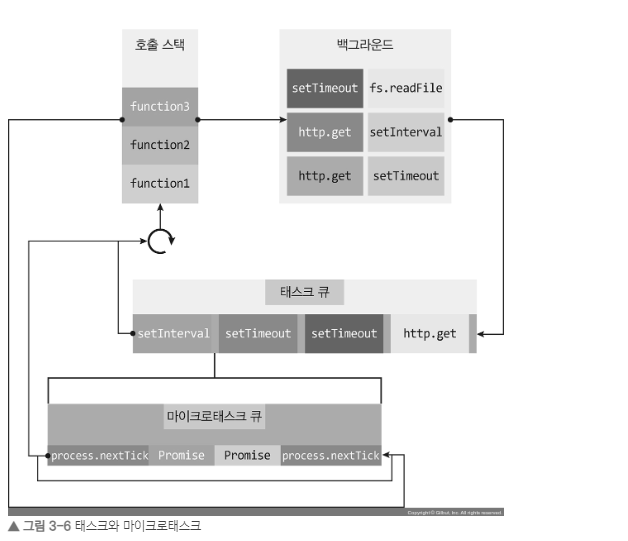
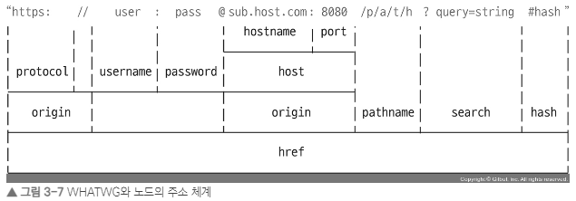

# 03. node 의 기능

## 노드 내장 객체

### global 객체

- 브라우저의 window와 같은 전역 객체이며, 전역 객체이므로 모든 파일에서 접근할 수 있다.

- `require` 함수도 `global.require`에서 `global`이 생략된 것

- `window`, `document` 객체와 `globalThis`

  > 노드에는 `DOM`이나 `BOM`이 없어 `window`와 `document` 객체를 노드에서 사용할 수 없다. 노드에서 `window` 또는 `document`를 사용하면 에러가 발생한다. 따라서 이 둘을 아우르는 `globalThis` 객체가 만들어졌다. 브라우저 환경에서는 `globalThis` => `window`가 되고, 노드에서는 `globalThis` => `global`이 된다.

<details>
<summary>DOM / BOM 참고 사이트 </summary>
<div markdown="1">

<https://velog.io/@imok-_/JavaScript-DOM-BOM-%EC%9D%B4%EB%9E%80>

</div>

</details>

### console

- `console.log()` 이외에도 더 다양하게 사용할수 있는 `console` 을 확인해보자.

• `console.time(레이블)`: console.timeEnd(레이블)과 대응되어 같은 레이블을 가진 time과 timeEnd 사이의 시간을 측정한다.

• `console.error(에러 내용)`: 에러를 콘솔에 표시

•`console.table(배열)`: 배열의 요소로 객체 리터럴을 넣으면, 객체의 속성들이 테이블 형식으로 표현된다.

• `console.dir(객체, 옵션)`: 객체를 콘솔에 표시할 때 사용한다. 첫 번째 인수로 표시할 객체를 넣고, 두 번째 인수로 옵션을 넣는다. 옵션의 colors를 true로 하면 콘솔에 색이 추가되어 보기가 한결 편해진다. depth는 객체 안의 객체를 몇 단계까지 보여줄지를 결정한다. 기본값은 2

• `console.trace(레이블)`: 에러가 어디서 발생했는지 추적할 수 있게 한다. 보통은 에러 발생 시 에러 위치를 알려주므로 자주 사용하지 않지만, 위치가 나오지 않는다면 사용할 만하다.

### 타이머

- 타이머 기능을 제공하는 함수인 `setTimeout`, `setInterval`, `setImmediate`는 노드에서 `window` 대신 `global` 객체 안에 들어 있다.

- 프로미스 기반의 타이머를 사용해보자.

```js
import { setTimeout, setInterval } from "timers/promises";

await setTimeout(3000);
console.log("3초 뒤 실행");

for await (const startTime of setInterval(1000, Date.now())) {
  console.log("1초마다 실행", new Date(startTime));
}
```

### process

- process 객체는 현재 실행되고 있는 노드 프로세스에 대한 정보를 담고 있다.
- 일반적으로 운영체제나 실행 환경별로 다른 동작을 하고 싶을 때 사용

```js
const { version, arch, platform, pid, execPath, uptime, cwd, cpuUsage } = process;
console.log({
  version,
  arch,
  platform,
  pid,
  execPath,
  uptime: uptime(),
  cwd: cwd(),
  cpuUsage: cpuUsage(),
});
// console.log
// {
//     version: 'v16.14.0', // 설치된 노드 버전
//     arch: 'x64', //  프로세서 아키텍처 정보. arm, ia32 등의 값일 수도 있다.
//     platform: 'win32', // 운영체제 플랫폼 정보. linux나 darwin, freebsd 등의 값일 수도 있다.
//     pid: 22120, // 현재 프로세스의 아이디. 프로세스를 여러 개 가질 때 구분할 수 있다.
//     execPath: 'C:\\Program Files\\nodejs\\node.exe',  // 노드의 경로
//     uptime: 0.0330234,  // 프로세스가 시작된 후 흐른 시간. 단위는 초
//     cwd: 'C:\\Users\\User\\Desktop\\yelim\\Study\\Node.js',// 현재 프로세스가 실행되는 위치
//     cpuUsage: { user: 31000, system: 15000 } // 현재 cpu 사용량
//   }
```

#### process.nextTick(콜백)

- 이벤트 루프가 다른 콜백 함수들보다 nextTick의 콜백 함수를 우선으로 처리하도록 만든다.



- 마이크로태스크의 재귀 호출

> process.nextTick으로 받은 콜백 함수나 resolve된 Promise는 다른 이벤트 루프에서 대기하는 콜백 함수보다도 먼저 실행된다. 그래서 비동기 처리를 할 때 setImmediate보다 process.nextTick을 더 선호하는 개발자도 있다. 하지만 이런 마이크로태스크를 재귀 호출하게 되면 이벤트 루프는 다른 콜백 함수보다 마이크로태스크를 우선해 처리하므로 콜백 함수들이 실행되지 않을 수도 있다.

### process.exit(코드)

- 실행 중인 노드 프로세스를 종료
- process.exit 메서드는 인수로 코드 번호를 줄 수 있다.

  0. `인수를 주지 않거나 0` : 정상 종료를 뜻한다.
  1. `1` : 비정상 종료를 뜻합니다. 만약 에러가 발생해서 종료하는 경우에는 1을 넣으면 된다.

### 기타 내장 객체

• `URL`, `URLSearchParams`: 3.5.3절에서 다룹니다.

• `AbortController`, FormData, fetch, Headers, Request, Response, Event, EventTarget: 브라우저에서 사용하던 API가 노드에도 동일하게 생성되었다.

• `TextDecoder`: `Buffer` => `문자열`

• `TextEncoder`: `문자열` => `Buffer`

• `WebAssembly`: 웹어셈블리 처리를 담당

## 노드 내장 모듈 사용하기

### os

- 웹 브라우저에 사용되는 자바스크립트는 운영체제의 정보를 가져올 수 없지만, 노드는 os 모듈에 정보가 담겨 있어 정보를 가져올 수 있다.
- os 모듈은 주로 컴퓨터 내부 자원에 빈번하게 접근하는 경우 사용한다.(운영체제별로 다른 서비스를 제공하고 싶을 때 os 모듈이 유용)

### path

- 폴더와 파일의 경로를 쉽게 조작하도록 도와주는 모듈이다. path 모듈이 필요한 이유 중 하나는 운영체제별로 경로 구분자가 다르기 때문이다.

• `윈도`: C:\Users\ZeroCho처럼 `\`로 구분합니다.

• `POSIX(맥 + linux)`: /home/zerocho처럼 `/` 로 구분합니다.

### url

- 인터넷 주소를 쉽게 조작하도록 도와주는 모듈



```js
const url = require('url'); ---- ➊

const { URL } = url;
const myURL = new URL('http://www.gilbut.co.kr/book/bookList.aspx?sercate1=001001000#anchor');
console.log('new URL():', myURL);
console.log('url.format():', url.format(myURL));
```

```js
// console.log

// new URL(): URL {
//   href: 'http://www.gilbut.co.kr/book/bookList.aspx?sercate 1 = 001001000 #anchor',
//   origin: 'http://www.gilbut.co.kr' ,
//   protocol: 'http:',
//   username: '',
//   password: '',
//   host: 'www.gilbut.co.kr',
//   hostname: 'www.gilbut.co.kr',
//   port: '',
//   pathname: '/book/bookList.aspx',
//   search: '?sercate 1 = 001001000 ',
//   searchParams: URLSearchParams { 'sercate 1 ' => '001001000 ' },
//   hash: '#anchor'
// }
// url.format(): http://www.gilbut.co.kr/book/bookList.aspx?sercate1=001001000#anchor // 분해되었던 url 객체를 다시 원래 상태로 조립한다.
```

• getAll(키): 키에 해당하는 모든 값을 가져옵니다. category 키에는 nodejs와 javascript라는 두 가지 값이 들어 있습니다.

• get(키): 키에 해당하는 첫 번째 값만 가져옵니다.

• has(키): 해당 키가 있는지 없는지를 검사합니다.

• keys(): searchParams의 모든 키를 반복기(iterator)(ES2015 문법) 객체로 가져옵니다.

• values(): searchParams의 모든 값을 반복기 객체로 가져옵니다.

• append(키, 값): 해당 키를 추가합니다. 같은 키의 값이 있다면 유지하고 하나 더 추가합니다.

• set(키, 값): append와 비슷하지만 같은 키의 값들을 모두 지우고 새로 추가합니다.

• delete(키): 해당 키를 제거합니다.

• toString(): 조작한 searchParams 객체를 다시 문자열로 만듭니다. 이 문자열을 search에 대입하면 주소 객체에 반영됩니다.

### dns

- DNS를 다룰 때 사용하는 모듈입니다. 주로 도메인을 통해 IP나 기타 DNS 정보를 얻고자 할 때 사용합니다.

### crypto

- 단방향 암호화는 가능하지만 복호화(암호 => 평문)는 불가능

- 단방향 암호화의 대표주자는 해시 기법(문자열을 고정된 길이의 다른 문자열로 바꾸는 방식)

### util

• `util.deprecate`: 함수가 deprecated 처리되었음을 알립니다. 첫 번째 인수로 넣은 함수를 사용했을 때 경고 메시지가 출력됩니다. 두 번째 인수로 경고 메시지 내용을 넣으면 됩니다. 함수가 조만간 사라지거나 변경될 때 알려줄 수 있어 유용합니다.

• `util.promisify`: 콜백 패턴을 프로미스 패턴으로 바꿉니다. 바꿀 함수를 인수로 제공하면 됩니다. 이렇게 바꿔두면 async/await 패턴까지 사용할 수 있어 좋습니다. 3.5.5.1절의 randomBytes와 비교해보세요. 프로미스를 콜백으로 바꾸는 util.callbackify도 있지만 자주 사용되지는 않습니다.

### 노드에서 멀티 스레드 방식으로 작업하는 방법(worker_threads)

- 사용경우는 극히 드물다. cpu 를 많이 쓰는 작업에서만 진행
