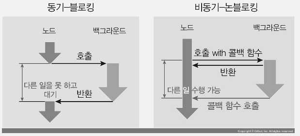

# 03. node 의 기능

## 파일 시스템 접근하기

### fs 모듈

- `fs` 는 기본적으로 콜백 형식의 모듈이므로 실무에서 사용하기가 불편하다. 따라서 프로미스 형식으로 바꿔주자.

```js
// readme.txt
// 어쩌라구

const fs = require("fs").promises;

fs.readFile("./readme.txt")
  .then((data) => {
    console.log(data);
    console.log(data.toString());
  })
  .catch((err) => {
    console.error(err);
  });

// console.log
// <Buffer ec 96 b4 ec a9 8c eb 9d bc ea b5 ac>
// 어쩌라구
```

- 다음과 같이 작성시 writeFile된 값을 바로 확인해볼수 있다.

```js
const fs = require("fs").promises;

fs.writeFile("./hh.txt", "글이 입력")
  .then(() => {
    return fs.readFile("./hh.txt");
  })
  .then((data) => {
    console.log(data.toString());
  })
  .catch((err) => {
    console.error(err);
  });
// 글이 입력
```

### 동기 메서드와 비동기 메서드

#### 동기와 비동기, 블로킹과 논블로킹

> 동기와 비동기, 블로킹과 논블로킹이라는 네 개의 용어가 노드에서 혼용되고 있는데, 용어가 서로 다른 만큼 의미상의 차이가 있습니다.

• `동기와 비동기`: 백그라운드 작업 완료 확인 여부

• `블로킹과 논블로킹`: 함수가 바로 return되는지 여부

- 노드에서는 동기-블로킹 방식과 비동기-논블로킹 방식이 대부분입니다. 동기-논블로킹이나 비동기-블로킹은 없다고 봐도 됩니다.

- 동기-블로킹 방식에서는 백그라운드 작업 완료 여부를 계속 확인하며, 호출한 함수가 바로 return되지 않고 백그라운드 작업이 끝나야 return합니다. 비동기-논블로킹 방식에서는 호출한 함수가 바로 return되어 다음 작업으로 넘어가고, 백그라운드 작업 완료 여부는 신경 쓰지 않고 나중에 백그라운드가 알림을 줄 때 비로소 처리합니다.



#### `readFile` 와 `readFileSync`의 차이

- 이름 그대로 비동기식 처리와 동기식 처리를 나눈 메서드이다.
- `readFileSync` 메서드를 사용하면 요청이 수백 개 이상 들어올 때 성능에 문제가 생김(서버 시작전 동기는 괜춘) => 즉, `백그라운드`가 작업하는 동안 `메인 스레드`는 아무것도 못하고 대기하고 있어야 하며, `메인 스레드`가 일을 하지 않고 노는 시간이 생기므로 비효율적이다.

- `백그라운드`는 `fs` 작업을 동시에 처리할 수도 있는데, `Sync 메서드`를 사용하면 `백그라운드`조차 동시에 처리할 수 없게 됩니다

#### 그렇다면 `readFile` 를 동기식으로 사용하는 방법은 ?

- 콜백 지옥을 사용하지 않고 Promise나 async/await 를 이용하면 됨

```js
const fs = require("fs").promises;

console.log("시작");
fs.readFile("./hh.txt")
  .then((data) => {
    console.log("1번", data.toString());
    return fs.readFile("./hh.txt");
  })
  .then((data) => {
    console.log("2번", data.toString());
    return fs.readFile("./hh.txt");
  })
  .then((data) => {
    console.log("3번", data.toString());
    console.log("끝");
  })
  .catch((err) => {
    console.error(err);
  });
```

#### 버퍼와 스트림 이해하기

- `버퍼` : 일정한 크기로 모아두는 데이터
  일정한 크기가 되면 한번에 처리
  `버퍼링` : 버퍼에 데이터가 찰 때까지 모으는 작업
- `스트림` : 데이터의 흐름
  일정한 크기로 나눠서 여러번에 걸쳐서 처리(메모리 관리에서 효율적임)
  `스트리밍` : 일정한 크기의 데이터를 지속적으로 전달하는 작업


#### pipe 스트림

- `createReadStream` 으로 파일을 읽고 그 스트림을 전달받아 `createWriteStream` 으로 파일을 쓸 수도 있다.

- 스트림끼리 연결하는 것을 `파이핑한다`고 표현하는데, `액체가 흐르는 관(파이프(pipe))`처럼 데이터가 흐른다고 해서 지어진 이름

```js
// 다음과 같이 작성시 readme4.txt의 내용이 writeme3.txt로 복사된다.

const fs = require("fs");

const readStream = fs.createReadStream("readme4.txt");
// const zlibStream = zlib.createGzip(); // 다음과 같이 zlib 모듈을 통해 압축하여 작성할 수 있음
const writeStream = fs.createWriteStream("writeme3.txt");
readStream.pipe(writeStream);
// readStream.pipe(zlibStream).pipe(writeStream);
```

- es 모듈에서는 다음과 같이 작성할 수 있다.

```mjs
import { pipeline } from "stream/promises";
import zlib from "zlib";
import fs from "fs";

await pipeline(fs.createReadStream("./hh.txt"), zlib.createGzip(), fs.createWriteStream("./readme4.txt.gz"));
```

#### 버퍼와 스트림 의 성능 차이

- 다음과 같이 용량이 큰 파일을 만들어보자

```js
const fs = require("fs");
const file = fs.createWriteStream("./big.txt");

for (let i = 0; i <= 10_000_000; i++) {
  file.write("안녕하세요. 엄청나게 큰 파일을 만들어 볼 것입니다. 각오 단단히 하세요!");
}
file.end();
```

- 🚩버퍼사용 ) `readFile` 메서드를 사용해 `big.txt`를 `big2.txt`로 복사해보자.

```js
const fs = require("fs");

console.log("before: ", process.memoryUsage().rss);

const data1 = fs.readFileSync("./big.txt");
fs.writeFileSync("./big2.txt", data1);
console.log("buffer: ", process.memoryUsage().rss);

// before:  18137088
// buffer: 1019133952
```

- 1GB 용량의 파일을 복사하기 위해 메모리에 파일을 모두 올려둔 후 `writeFileSync`를 수행했기 때문에 처음에 18MB였던 메모리 용량이 순식간에 1GB를 넘었다.

- 🚩스트림사용 )

```js
const fs = require("fs");

console.log("before: ", process.memoryUsage().rss);

const readStream = fs.createReadStream("./big.txt");
const writeStream = fs.createWriteStream("./big3.txt");
readStream.pipe(writeStream);
readStream.on("end", () => {
  console.log("stream: ", process.memoryUsage().rss);
});

// before:  18087936
// stream: 62472192
```

- 큰 파일을 조각내어 작은 버퍼 단위로 옮겼기 때문에 스트림을 사용해서 파일을 복사했더니 메모리를 62MB밖에 차지하지 않는다. 이렇게 스트림을 사용하면 효과적으로 데이터를 전송할 수 있다. => 동영상 같은 큰 파일들을 전송할 때 이러한 이유로 스트림을 사용한다.

### 그 밖의 fs 모듈

- 파일 및 폴더 생성

• fs.access(경로, 옵션, 콜백): 폴더나 파일에 접근할 수 있는지를 체크합니다. 두 번째 인수로 상수들(constants를 통해 가져옵니다)을 넣었습니다. F_OK는 파일 존재 여부, R_OK는 읽기 권한 여부, W_OK는 쓰기 권한 여부를 체크합니다. 파일/폴더나 권한이 없다면 에러가 발생하는데, 파일/폴더가 없을 때의 에러 코드는 ENOENT입니다.

• fs.mkdir(경로, 콜백): 폴더를 만드는 메서드입니다. 이미 폴더가 있다면 에러가 발생하므로 먼저 access 메서드를 호출해서 확인하는 것이 중요합니다.

• fs.open(경로, 옵션, 콜백): 파일의 아이디(fd 변수)를 가져오는 메서드입니다. 파일이 없다면 파일을 생성한 뒤 그 아이디를 가져옵니다. 가져온 아이디를 사용해 fs.read 또는 fs.write로 읽거나 쓸 수 있습니다. 두 번째 인수로 어떤 동작을 할 것인지를 설정할 수 있습니다. 쓰려면 w, 읽으려면 r, 기존 파일에 추가하려면 a입니다. 앞의 예제에서는 w를 했으므로 파일이 없을 때 새로 만들 수 있었습니다. r이었다면 에러가 발생했을 것입니다.

• fs.rename(기존 경로, 새 경로, 콜백): 파일의 이름을 바꾸는 메서드입니다. 기존 파일 위치와 새로운 파일 위치를 적으면 됩니다. 꼭 같은 폴더를 지정할 필요는 없으므로 잘라내기 같은 기능을 할 수도 있습니다.

- 폴더, 파일 내용 확인 및 삭제

• fs.readdir(경로, 콜백): 폴더 안의 내용물을 확인할 수 있습니다. 배열 안에 내부 파일과 폴더명이 나옵니다.

• fs.unlink(경로, 콜백): 파일을 지울 수 있습니다. 파일이 없다면 에러가 발생하므로 먼저 파일이 있는지를 꼭 확인해야 합니다.

• fs.rmdir(경로, 콜백): 폴더를 지울 수 있습니다. 폴더 안에 파일들이 있다면 에러가 발생하므로 먼저 내부 파일을 모두 지우고 호출해야 합니다

- 노드 8.5 버전 이후에는 createReadStream과 createWriteStream을 pipe하지 않아도 파일을 복사할 수 있다.

```js
const fs = require("fs").promises;

fs.copyFile("readme4.txt", "writeme4.txt")
  .then(() => {
    console.log("복사 완료");
  })
  .catch((error) => {
    console.error(error);
  });
```

- 파일/폴더의 변경 사항을 감시할 수 있는 watch 메서드

```js
const fs = require("fs");

fs.watch("./target.txt", (eventType, filename) => {
  console.log(eventType, filename);
});
```

- 내용물을 수정할 때는 change 이벤트가 발생하고, 파일명을 변경하거나 파일을 삭제하면 rename 이벤트가 발생한다. rename 이벤트가 발생한 후에는 더 이상 watch가 수행되지 않는다. change 이벤트가 두 번씩 발생하기도 하므로 실무에서 사용할 때는 주의가 필요하다.

## 이벤트

• on(이벤트명, 콜백): 이벤트 이름과 이벤트 발생 시의 콜백을 연결합니다. 이렇게 연결하는 동작을 이벤트 리스닝이라고 합니다. event2처럼 이벤트 하나에 이벤트 여러 개를 달아줄 수도 있습니다.

• addListener(이벤트명, 콜백): on과 기능이 같습니다.

• emit(이벤트명): 이벤트를 호출하는 메서드입니다. 이벤트 이름을 인수로 넣으면 미리 등록해뒀던 이벤트 콜백이 실행됩니다.

• once(이벤트명, 콜백): 한 번만 실행되는 이벤트입니다. myEvent.emit('event3')을 두 번 연속 호출했지만 콜백이 한 번만 실행됩니다.

• removeAllListeners(이벤트명): 이벤트에 연결된 모든 이벤트 리스너를 제거합니다. event4가 호출되기 전에 리스너를 제거했으므로 event4의 콜백은 호출되지 않습니다.

• removeListener(이벤트명, 리스너): 이벤트에 연결된 리스너를 하나씩 제거합니다. 리스너를 넣어야 한다는 것을 잊지 마세요. 역시 event5의 콜백도 호출되지 않습니다.

• off(이벤트명, 콜백): 노드 10 버전에서 추가된 메서드로, removeListener와 기능이 같습니다.

• listenerCount(이벤트명): 현재 리스너가 몇 개 연결되어 있는지 확인합니다.

## 예외 처리 : 처리하지 못한 에러

- 노드 스레드를 멈춤
- 노드는 기본적으로 싱글스레드라 스레드가 멈춘다 => 프로세스가 멈춘다

### 예외 처리 방법

1. trc 로 감싼다
2. 메서드 콜백의 err 를 받는다
3. 예기치 못한 에러는 다음과 같은 방법으로 확인할 수 있다.

```js
process.on("uncaughtException", (err) => {
  console.error("예기치 못한 에러", err);
});

setInterval(() => {
  throw new Error("서버를 고장내주마!");
}, 1000);
setTimeout(() => {
  console.log("실행됩니다");
}, 2000);
```

### 자주 발생하는 에러들

• `node: command not found`: 노드를 설치했지만 이 에러가 발생하는 경우는 환경 변수가 제대로 설정되어 있지 않은 것입니다. 환경 변수에는 노드가 설치된 경로가 포함되어야 합니다. node 외의 다른 명령어도 마찬가지입니다. 그 명령어를 수행할 수 있는 파일이 환경 변수에 들어 있어야 명령어를 콘솔에서 사용할 수 있습니다.

• `ReferenceError`: 모듈 is not defined: 모듈을 require했는지 확인합니다.

• `Error: Cannot find module 모듈명`: 해당 모듈을 require했지만 설치하지 않았습니다. npm i 명령어로 설치하세요.

• `Error [ERR_MODULE_NOT_FOUND]`: 존재하지 않는 모듈을 불러오려 할 때 발생합니다.

• `Error: Can't set headers after they are sent`: 요청에 대한 응답을 보낼 때 응답을 두 번 이상 보냈습니다. 요청에 대한 응답은 한 번만 보내야 합니다. 응답을 보내는 메서드를 두 번 이상 사용하지 않았는지 체크해보세요.

• `FATAL ERROR: CALL_AND_RETRY_LAST Allocation failed- JavaScript heap out of memory`: 코드를 실행할 때 메모리가 부족해서 스크립트가 정상적으로 작동하지 않는 경우입니다. 코드가 잘못 구현되었을 확률이 높으므로 코드를 점검해보세요. 만약 코드는 정상이지만 노드가 활용할 수 있는 메모리가 부족한 경우라면 노드의 메모리를 늘릴 수 있습니다. 노드를 실행할 때 node --max-old-space-size=4096 파일명과 같은 명령어를 사용하면 됩니다. 4096은 4GB를 의미합니다. 여기에 원하는 용량을 적으면 됩니다.

• `UnhandledPromiseRejectionWarning: Unhandled promise rejection`: 프로미스 사용 시 catch 메서드를 붙이지 않으면 발생합니다. 항상 catch를 붙여 에러가 발생하는 상황에 대비하세요.

• `EADDRINUSE 포트 번호`: 해당 포트 번호에 이미 다른 프로세스가 연결되어 있습니다. 그 프로세스는 노드 프로세스일 수도 있고 다른 프로그램일 수도 있습니다. 그 프로세스를 종료하거나 다른 포트 번호를 사용해야 합니다.

- 윈도에서 프로세스 종료하기

```sh
 netstat -ano | findstr 포트
 taskkill /pid 프로세스아이디 /f

```

- 맥/리눅스에서 프로세스 종료하기

```sh
 lsof -i tcp:포트
 kill -9 프로세스아이디
```

• `EACCES 또는 EPERM`: 노드가 작업을 수행하는 데 권한이 충분하지 않습니다. 파일/폴더 수정, 삭제, 생성 권한을 확인해보는 것이 좋습니다. 맥이나 리눅스 운영체제라면 명령어 앞에 sudo를 붙이는 것도 방법입니다.

• `EJSONPARSE`: package.json 등의 JSON 파일에 문법 오류가 있을 때 발생합니다. 자바스크립트 객체와는 형식이 조금 다르니 쉼표 같은 게 빠지거나 추가되지는 않았는지 확인해보세요.

• `ECONNREFUSED`: 요청을 보냈으나 연결이 성립하지 않을 때 발생합니다. 요청을 받는 서버의 주소가 올바른지, 서버가 꺼져 있지는 않은지 등을 확인해봐야 합니다.

• `ETARGET`: package.json에 기록한 패키지 버전이 존재하지 않을 때 발생합니다. 해당 버전이 존재하는지 확인하세요.

• `ETIMEOUT`: 요청을 보냈으나 응답이 시간 내에 오지 않을 때 발생합니다. 역시 요청을 받는 서버의 상태를 점검해봐야 합니다.

• `ENOENT`: no such file or directory: 지정한 폴더나 파일이 존재하지 않는 경우입니다. 맥이나 리눅스 운영체제에서는 대소문자도 구별하므로 확인해봐야 합니다.
