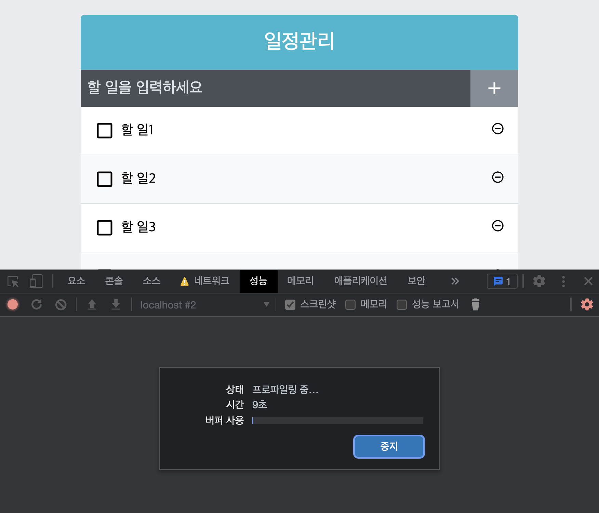
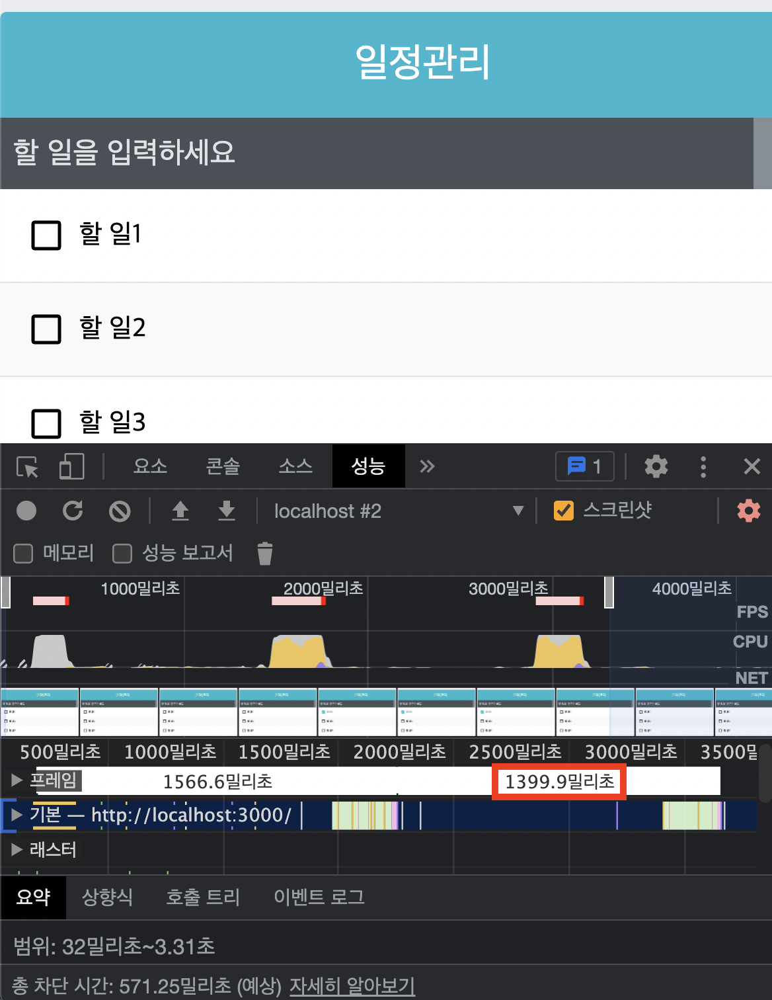
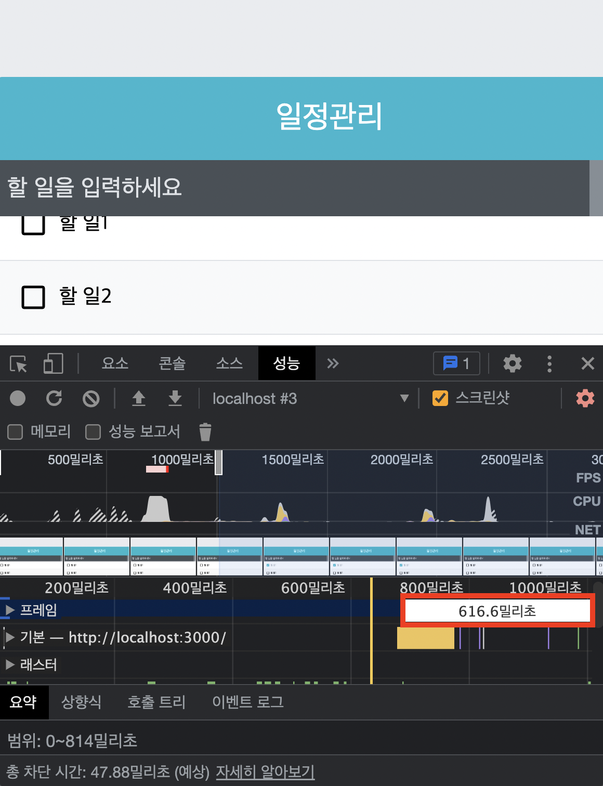
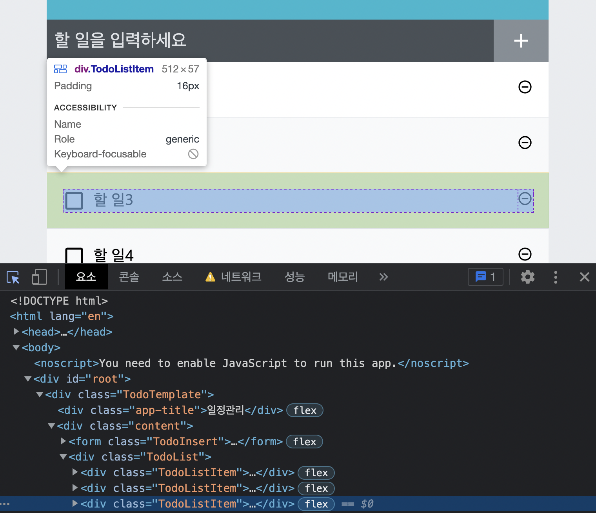
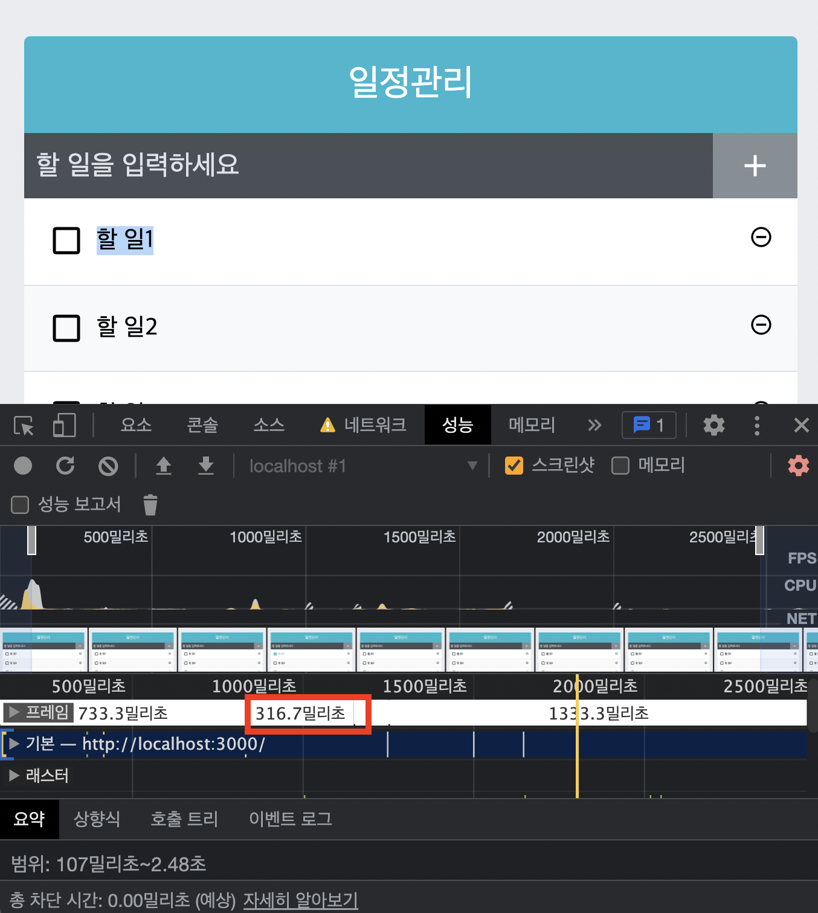

# 11장 컴포넌트 성능 최적화

- 데이터가 많아지면 -> 애플리케이션이 느려짐 -> 지연이 발생
- 실습진행(컴포넌트 성능 최적화)
  > 많은 데이터 렌더링하기 - 크롬 개발자 도구를 통한 성능 모니터링 - React.memo를 통한 컴포넌트 리렌더링 성능 최적화 - onToggle 과 onRemove가 새로워지는 현상 방지 - react-virtualized를 사용한 렌더링 최적화

## 11.1 많은 데이터 렌더링하기

- 실제 랙(lag) 경험하기

```js
// App.js
import React, { useState, useRef, useCallback } from "react";
import TodoTemplate from "./components/TodoTemplate";
import TodoInsert from "./components/TodoInsert";
import TodoList from "./components/TodoList";

function createBulkTodos() {
  const array = [];
  for (let i = 1; i <= 2500; i++) {
    array.push({
      id: i,
      text: `할 일${i}`,
      checked: false,
    });
  }
  return array;
}
const App = () => {
  const [todos, setTodos] = useState(createBulkTodos);
  //기본값에 파라미터로 함수 형태를 넣어주면 컴포넌트가 처음 렌더링될 때만 createBulkTodos함수 실행된다.

  //ref를 사용하여 변수 담기
  const nextId = useRef(2501);

  const onInsert = useCallback(
    (text) => {
      const todo = {
        id: nextId.current,
        text,
        checked: false,
      };
      setTodos(todos.concat(todo));
      nextId.current += 1; // nextId 1씩 더하기
    },
    [todos]
  );

  const onRemove = useCallback(
    (id) => {
      setTodos(todos.filter((todo) => todo.id !== id));
    },
    [todos]
  );

  const onToggle = useCallback(
    (id) => {
      setTodos(
        todos.map((todo) =>
          todo.id === id ? { ...todo, checked: !todo.checked } : todo
        )
      );
    },
    [todos]
  );

  return (
    <TodoTemplate>
      <TodoInsert onInsert={onInsert} />
      <TodoList todos={todos} onRemove={onRemove} onToggle={onToggle} />
    </TodoTemplate>
  );
};

export default App;
```

<mark style="background-color:pink"><i><b>할일 2500개... 당연히 이전보다 느려질수 밖에 ^^</b></i></mark>

- 할일체크시 느리게 반응하는걸 알수 있다

## 11.2 크롬 개발자 도구를 통한 성능 모니터링

- 정확한 반응속도가 몇 초가 걸리는지 확인해야함
  <mark style="background-color:pink"><i><b>크롬 개발자 도구의 Perfomance 탭을 사용하여 측정</b></i></mark>

- 진행과정
  > '할일 1' 항목체크 - 화면의 Stop 버튼클릭 - 스크린샷을 겸하여 보며 몇 초가 걸렸는지확인

1. 

2. 

   > 1.399 초..극혐의 반응속도;;
- 아래있는 차단시간으로도 최적화 확인 가능 

## 11.3 느려지는 원인 분석

<mark style="background-color:pink"><i><b>컴포넌트는 다음과 같은 상황에서 리렌더링이 발생</b></i></mark>

1. 자신이 전달받은 props가 변경될 때
2. 자신의 state가 바뀔 때
3. 부모 컴포넌트가 리렌더링될 때
4. forceUpdate 함수가 실행될 때

- 현재 '할일 2'부터 '할일 2500'까지 모두 리렌더링이 되고 있음(리렌더링 안해도 되는 상황)
- 리렌더링 개수 약 2,000개가 넘어가면 성능이 저하됨
- 최적화 필수 ! ! <- 리렌더링 방지 작업

## 11.4 React.memo를 사용하여 컴포넌트 성능 최적화

- 7장에서 배운 shouldComponentUpdate 라는 라이프사이클을 사용
- 함수형 컴포넌트에서는 라이프사이클 메서드 사용불가
- 대신 React.memo 라는 함수 사용(컴포넌트를 만들고 감싸주기만 하면 됨)

```js
// TodoListItem.js
import React from "react";
import {
  MdCheckBoxOutlineBlank,
  MdCheckBox,
  MdRemoveCircleOutline,
} from "react-icons/md";
import cn from "classnames";
import "./TodoListItem.scss";

const TodoListItem = ({ todo, onRemove, onToggle }) => {
  const { id, text, checked } = todo;

  return (
    <div className="TodoListItem">
      <div className={cn("checkbox", { checked })} onClick={() => onToggle(id)}>
        {checked ? <MdCheckBox /> : <MdCheckBoxOutlineBlank />}
        <div className="text">{text}</div>
      </div>
      <div className="remove" onClick={() => onRemove(id)}>
        <MdRemoveCircleOutline />
      </div>
    </div>
  );
};

export default React.memo(TodoListItem); //이 부분을 감싸줌
```

- TodoListItem 컴포넌트는 todo, onRemove, onToggle 이 바뀌지 않으면 리렌더링을 하지 x

## 11.5 onToggle, onRemove 함수가 바뀌지 않게 하기

<mark style="background-color:pink"><i><b>하지만 최적화는 여기서 ~~ 끝이 아니야</b></i></mark>

- 현재 todos 배열이 업데이트되면 -> onRemove, onToggle 함수도 새롭게 바뀜(함수가 새로 만들어짐)

<mark style="background-color:pink"><i><b>어떻게 함수가 새로 만들어지는 상황을 방지할꽈 ?</b></i></mark>

1. useState 의 함수형 업데이트 기능을 사용
2. useReducer 를 사용

### 11.5.1 useState의 함수형 업데이트

- 기존 setTodos 함수 사용시 -> 새로운 상태를 파라미터로 넣어줌
  <mark style="background-color:pink"><i><b>이.번.엔 ^^</b></i></mark>

- 상태업데이트를 어떻게 할지 정의해주는 업데이트 함수를 파라미터에 넣어줌 -> 함수형 업데이트

- App.js 에서 onInsert, onRemove, onToggle 함수에서 setTodos함수를 사용할 때, 앞에는 todos=> 를 넣어준다.

- useCallback을 사용할 때 두번째 파라미터에는 빈 배열을 넣어준다.

```js
//App.js
import React, { useState, useRef, useCallback } from "react";
import TodoTemplate from "./components/TodoTemplate";
import TodoInsert from "./components/TodoInsert";
import TodoList from "./components/TodoList";

function createBulkTodos() {
  const array = [];
  for (let i = 1; i <= 2500; i++) {
    array.push({
      id: i,
      text: `할 일${i}`,
      checked: false,
    });
  }
  return array;
}
const App = () => {
  const [todos, setTodos] = useState(createBulkTodos);
  //기본값에 파라미터로 함수 형태를 넣어주면 컴포넌트가 처음 렌더링될 때만 createBulkTodos함수 실행된다.

  //ref를 사용하여 변수 담기
  const nextId = useRef(2501);

  const onInsert = useCallback((text) => {
    const todo = {
      id: nextId.current,
      text,
      checked: false,
    };
    setTodos((todos) => todos.concat(todo)); //setTodos 함수사용시 todos =>
    nextId.current += 1; // nextId 1씩 더하기
  }, []); // 빈배열을 넣어준다

  const onRemove = useCallback((id) => {
    setTodos((todos) => todos.filter((todo) => todo.id !== id)); //setTodos 함수사용시 todos =>
  }, []); // 빈배열을 넣어준다

  const onToggle = useCallback((id) => {
    setTodos((todos) =>
      todos.map(
        (todo) => (todo.id === id ? { ...todo, checked: !todo.checked } : todo) //setTodos 함수사용시 todos =>
      )
    );
  }, []); // 빈배열을 넣어준다

  return (
    <TodoTemplate>
      <TodoInsert onInsert={onInsert} />
      <TodoList todos={todos} onRemove={onRemove} onToggle={onToggle} />
    </TodoTemplate>
  );
};

export default App;
```



> 0.616초로 양호해짐(성능 나름 향상)

### 11.5.2 useReducer 사용하기

<mark style="background-color:pink"><i><b>useReducer를 사용해 최적화 해보자 !</b></i></mark>

- useReducer를 사용시 원래 두번째 파라미터의 초기상태(빈배열) 대신 undefined를 널고 세번째 파라미터에 초기상태를 만들어 주는 creatBulkTodos 함수를 넣어줌 -> 컴포넌트가 맨처음 랜더링 될때만 creatBulkTodos 함수가 호출됨

```js
import React, { useReducer, useRef, useCallback } from "react";
import TodoTemplate from "./components/TodoTemplate";
import TodoInsert from "./components/TodoInsert";
import TodoList from "./components/TodoList";

function createBulkTodos() {
  const array = [];
  for (let i = 1; i <= 2500; i++) {
    array.push({
      id: i,
      text: `할 일${i}`,
      checked: false,
    });
  }
  return array;
}

function todoReducer(todos, action) {
  switch (action.type) {
    case "INSERT": //새로추가
      return todos.concat(action.todo);
    case "REMOVE": //제거
      return todos.filter((todo) => todo.id !== action.id);
    case "TOGGLE": //토글
      return todos.map((todo) =>
        todo.id === action.id ? { ...todo, checked: !todo.checked } : todo
      );
    default:
      return todos;
  }
}
const App = () => {
  const [todos, dispatch] = useReducer(todoReducer, undefined, createBulkTodos);
  //기본값에 파라미터로 함수 형태를 넣어주면 컴포넌트가 처음 렌더링될 때만 createBulkTodos함수 실행된다.

  //ref를 사용하여 변수 담기
  const nextId = useRef(2501);

  const onInsert = useCallback(
    (text) => {
      //???
      const todo = {
        id: nextId.current,
        text,
        checked: false,
      };
      dispatch({ type: "INSERT", todo });
      nextId.current += 1; //id+1
    },
    [] //todos가 바뀔때만 렌더링
  );

  const onRemove = useCallback((id) => {
    dispatch({ type: "REMOVE", id });
  }, []);

  const onToggle = useCallback((id) => {
    dispatch({ type: "TOGGLE", id });
  }, []);

  return (
    <TodoTemplate>
      <TodoInsert onInsert={onInsert} />
      <TodoList todos={todos} onRemove={onRemove} onToggle={onToggle} /> {/* props 넣어주기 */}
    </TodoTemplate>
  );
};
export default App;
```

<mark style="background-color:pink"><i><b>성능상 비슷함 -> 개취..^^ </b></i></mark>

## 11.6 불변성의 중요성

<mark style="background-color:pink"><i><b>불변성을 지킨다 : 기존값을 직접 수정하지 않으면서 새로운 값을 만들어 내는것</b></i></mark>

- 리액트 컴포넌트에서 불변성을 지키는것이 매우중요
- 앞의 장에서도 직접수정하지 x , 새로운 배열을 만든다음 -> 새로운 객체를 만들어서 필요한 부분을 교체해주는 방식으로 구현
- 불변성이 지켜져야 React. memo를 사용했을 때 객체 내부의 값이 바뀌었는지 알아내서 성능을 최적화할 수 있음

> ++ 추가로 전개 연산자 ( . . . ) 를 사용하여 객체나 배열 내부의 값을 복사할 때는 얕은 복사를 하게 된다. 따라서 내부의 값이 객체 혹은 배열이라면 내부의 값도 따로 복사해주어야 함

```js
const nextTodos = [ . . . todos ];

nextTodos[ 0 ] = { . . .nextTodos[ 0 ], checked: false };
```
- 이렇게 복잡한 경우에는 immer라이브러리의 도움을 받을 수도 있음 immer는 다음 장에서 ~~

## 11.7 TodoList 컴포넌트 최적화하기
<mark style="background-color:pink"><i><b>리스트관련 컴포넌트 최적화를 위해선 ?</b></i></mark>

- 리스트 내부에서 사용하는 컴포넌트도 최적화 ㄱㄱ
- 리스트로 사용되는 컴포넌트 자체도 최적화 ㄱㄱ

- TodoList.js에서 export default React.memo( TodoList ); 를 작성하셈

- 성능에 영향 x -> App 컴포넌트에 state가 추가되어 해당값이 업데이트될수도 있으므로..(불필요한 리렌더링 방지) -> 미리미리 최적화 작업


## 11.8 react-virtualized를 사용한 렌더링 최적화

- react-virtualized를 사용하면 리스트 컴포넌트에서 스크롤되기 전에 보이지 않는 컴포넌트는 렌더링하지 않고 크기만 차지하게끔 할 수 있음 
- 이 라이브러리를 사용시 -> 스크롤시에 스무스하게 렌더링 ~

### 11.8.1 최적화 준비

- 아래와 같이 라이브러리를 설치 해보자
```js
npm add react-virtualized
```
- npm ERR! code ERESOLVE 
npm ERR! ERESOLVE unable to resolve dependency tree 오류 발생시 ! --legacy-peer-deps 를 뒤에 붙이셈 -> 충돌방지

```js
npm add react-virtualized --legacy-peer-deps
```
- 그 다음 크기를 알아봅니당 


- 512 x 57 px

### 11.8.2 TodoList 수정
- 다음과 같이 수정 ~
```js
import React, { useCallback } from 'react';
import { List } from 'react-virtualized';
import TodoListItem from './TodoListItem';
import './TodoList.scss';


const TodoList = ({ todos, onRemove, onToggle }) => {
  const rowRenderer = useCallback( //List 컴포넌트 사용위해 rowRenderer라는 함수를 새로 작성
    ({ index, key, style }) => {
      const todo = todos[index];
      return (
        <TodoListItem
          todo={todo}
          key={key}
          onRemove={onRemove}
          onToggle={onToggle}
          style={style}
        />
      );
    },
    [onRemove, onToggle, todos],
  );
  return (
    <List
      className='TodoList'
      width={512} // 전체 크기
      height={513} // 전체 높이 -> 화면에 9개만 보임을 기준 57*9
      rowCount={todos.length} // 항목 개수
      rowHeight={57} // 항목 높이
      rowRenderer={rowRenderer} // 항목을 렌더링할 때 쓰는 함수
      list={todos} // 배열
      style={{ outline: 'none' }} // List에 기본 적용되는 outline 스타일 제거
    />
  ); 
};


export default React.memo(TodoList);
```
- 각 요소들을 List 컴포넌트에 props로 넣어주어야함 -> 자동으로 최적화 해줌

### 11.8.3 TodoListItem 수정

- 현재 상태 -> 아래 UI가 깨져 달달 거림
- TodoListItem 컴포넌트 수정
```js
// TodoListItem.js
import React from 'react';
import {
  MdCheckBoxOutlineBlank,
  MdCheckBox,
  MdRemoveCircleOutline,
} from 'react-icons/md';
import cn from 'classnames';
import './TodoListItem.scss';


const TodoListItem = ({ todo, onRemove, onToggle, style }) => {
  const { id, text, checked } = todo;


return (
    <div className="TodoListItem-virtualized" style={style}>
      <div className="TodoListItem">
        <div
          className={cn('checkbox', { checked })}
          onClick={() => onToggle(id)}
        >
          {checked ? <MdCheckBox /> : <MdCheckBoxOutlineBlank />}
          <div className="text">{text}</div>
        </div>
        <div className="remove" onClick={() => onRemove(id)}>
          <MdRemoveCircleOutline />
        </div>
      </div>
    </div>
  );
};


export default React.memo(
  TodoListItem,
  (prevProps, nextProps) => prevProps.todo === nextProps.todo,
);
```
- TodoListItem.scss 수정
```css
/* TodoListItem.scss */

.TodoListItem-virtualized {
  & + & {
    border-top: 1px solid #dee2e6;
  }
  &:nth-child(even) {
    background: #f8f9fa;
  }
} 

.TodoListItem {
    padding : 1rem;
    display : flex;
    align-items : center; /* 세로 중앙 정렬*/
    &:nth-child(even){
      background: #f8f9fa;
    }
    .checkbox {
      cursor : pointer;
      flex : 1; /* 차지할 수 있는 영역 모두 차지 */
      display :  flex;
      align-items: center; /* 세로 중앙 정렬 */
      svg {
        /* 아이콘 */
        font-size : 1.5em;
      }
      .text {
        margin-left : 0.5rem;
        flex: 1; /* 차지할 수 있는 영역 모두 차지 */
      }
      /* 체크되었을 때 보여 줄 스타일 */
      &.checked {
        svg {
          color : #22b8cf;
        }
        .text {
          color : #adb5bd;
          text-decoration: line-through;
        }
      }
    }
    remove {
      display: flex;
      align-items: center;
      font-size: 1.5rem;
      color: #ff6b6b;
      &:hover {
        color: #ff8787;
      }
    }
  
   /* 엘리먼트 사이사이에 테두리를 넣어줌 */
    /* & + &{
    border-top: 1px solid #dee2e6;
    } */
  }
```
- 성능 체크 타임 ~~

- 0.3초..
- 아래있는 차단시간으로도 최적화 확인 가능 

## 11.9 정리
- 리스트와 관련된 컴포넌트를 만들 때 보여 줄 항목이 100개 이상이고 업데이트가 자주 발생한다면, 이 장에서 학습한 방식을 사용하여 꼭 최적화 합시다 ~~


## 총정리

<mark style="background-color:pink"><i><b>크롬 개발자 도구의 Perfomance 탭을 사용하여 측정</b></i></mark>

<mark style="background-color:pink"><i><b>컴포넌트는 다음과 같은 상황에서 리렌더링이 발생</b></i></mark>

1. 자신이 전달받은 props가 변경될 때
2. 자신의 state가 바뀔 때
3. 부모 컴포넌트가 리렌더링될 때
4. forceUpdate 함수가 실행될 때

React.memo를 사용하여 컴포넌트 성능 최적화

### useState의 함수형 업데이트


- App.js 에서 onInsert, onRemove, onToggle 함수에서 setTodos함수를 사용할 때, 앞에는 todos=> 를 넣어준다.

- useCallback을 사용할 때 두번째 파라미터에는 빈 배열을 넣어준다.


### useReducer 사용하기

<mark style="background-color:pink"><i><b>useReducer를 사용해 최적화 해보자 !</b></i></mark>

- useReducer를 사용시 원래 두번째 파라미터의 초기상태(빈배열) 대신 undefined를 널고 세번째 파라미터에 초기상태를 만들어 주는 creatBulkTodos 함수를 넣어줌 -> 컴포넌트가 맨처음 랜더링 될때만 creatBulkTodos 함수가 호출됨