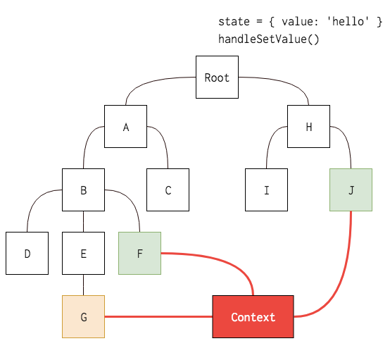

# 15장 Context API
- Context API : 리액트 프로젝트에서 전역적으로 사용할 데이터가 있을때 유용한 기능 ex) 사용자로그인정보, 애플리케이션 환경설정, 테마등
- 리액트 라이브러리에서도 많이 사용됨

- 실습진행
> Context API를 사용한 전역 상태 관리 흐름 이해하기 - 기본적인 사용법 익히기 - 동적 Context 사용하기 - Consummer 대신 Hook 또는 static contextType 사용하기

## 15.1 Context API를 사용한 전역 상태 관리 흐름 이해하기
- 컴포넌트 내 필요데이터는 App의 state(최상위 컴포넌트)에 넣어서 관리
- 실제 프로젝트에서는 많은 컴포넌트를 거치며(다뤄야하는 데이터가 많아짐) -> 유지보수성이 낮아짐
- 이를 방지하기위해 리덕스나 Mobx 같은 상태 관리 라이브러리를 사용 -> 전역 상태 관리작업
- Context API 사용시 -> Context를 만들어 한번에 원하는 값을 받아와서 사용 가능


## 15.2 Context API 사용법 익히기
- 연습할 리액트 프로젝트 생성
```js
npm create react-app context-tutorial
```
### 15.2.1 새 Context 만들기 
- src/contexts/color.js 생성
```js
import { createContext } from 'react';

const ColorContext = createContext({ color: 'black' });// createContext 함수 사용 -> 해당 Context의 기본상태 지정

export default ColorContext;
```


### 15.2.2 Consumer 사용하기

- src/components/ColorBox.js 생성
```js
import React from 'react';
import ColorContext from '../contexts/color';


const ColorBox = () => { //Function as a child / Render Props
  return (
    <ColorContext.Consumer>
      {value => (
        <div
          style={{
            width: '64px',
            height: '64px',
            background: value.color
          }}
        />
      )}
    </ColorContext.Consumer>
  );
};


export default ColorBox;
```
- Render Props 예제
```js
import React from 'react';

const RenderPropsSample = ({ children }) => {
  return <div>결과: {children(5)}</div>;
};

export default RenderPropsSample;
```
- 만약 위와 같은 컴포넌트가 있다면 추후 사용할 때 다음과 같이 사용할 수 있음

```js
<RenderPropsSample>{value => 2 * value}</RenderPropsSample>;
```

- App.js 에서 렌더링

```js
import React from 'react';
import ColorBox from './components/ColorBox';
const App = () => {
  return (
    <div>
      <ColorBox />
    </div>
  );
};
 
export default App;
```
### 15.2.3 Provider
- Provider 사용시 Context의 value 변경 가능
```js
import React from 'react';
import ColorBox from './components/ColorBox';
import ColorContext from './contexts/color'

const App = () => {
  return (
    <ColorContext.Provider value = {{ color: 'red' }}>
      <div>
        <ColorBox />
      </div>
    </ColorContext.Provider>
  );
};
 
export default App;
```
- createContext 함수에 기본값은 Provider를 사용하지 않았을때만 사용
- Provider 사용시 value 값 필수 ! 명시 !

## 15.3 동적 Context 사용하기
- Context의 값을 업데이트 해야하는 경우

### 15.3.1 Context 파일 수정하기
- value에는 상태값 뿐만아닌 함수도 전달 가능하다 ?!
- contexts/color.js 수정
```js
import { createContext, useState } from 'react';
 
const ColorContext = createContext({ 
   state: { color: 'black', subcolor: 'red' },
   actions: {
       setColor: () => {},
       setSubcolor: () => {}
   }
});

const ColorProvider = ({ children }) =>{
    const [color, setColor] = useState('black');
    const [subcolor, setSubcolor] = useState('red');

    const value = {
        state: {color, subcolor},
        actions: {setColor, setSubcolor}
    };
    return(
        <ColorContext.Provider value={value}>{children}</ColorContext.Provider>
    );
};

// const ColorConsumer = ColorContext.Consumer 와 같은 의미
const { Consumer: ColorConsumer } = ColorContext;

// ColorProvider 와 ColorConsumer 내보내기
export { ColorProvider, ColorConsumer };
 
export default ColorContext;
```
- state와 action 객체를 따로 분리해주면 나중에 Context의 값을 사용할때 편함
-  createContext의 기본값은 실제 Provider의 value에 넣는 객체의 형태와 일치시켜 주는 것이 좋음 -> Context 내부값구성 파악하기 쉬움, 에러발생 x

### 15.3.2 새로워진 Context를 프로젝트에 반영하기
- App.js 수정
> ColorContext.provider -> ColorProvider 로 대체
```js
import React from 'react';
import ColorBox from './components/ColorBox';
import { ColorProvider } from './contexts/color';
const App = () => {
  return (
    <ColorProvider>
      <div>
        <ColorBox />
      </div>
    </ColorProvider>
  );
};


export default App;
```
- components/ColorBox.js 수정
> ColorContext.Consumer -> ColorConsumer로 변경, value 값 수정
```js
import React from 'react';
import ColorConsumer from '../contexts/color';


const ColorBox = () => {
  return (
    <ColorConsumer>
      {value => ( //Function as a child / Render Props
       <>
            <div
              style={{
                width: '64px',
                height: '64px',
                background: value.state.color
              }}
            />
            <div 
            style={{
                width: '32px',
                height: '32px',
                background: value.state.subcolor
            }}
            />
       </>
      )}
    </ColorConsumer>
  );
};


export default ColorBox;
```
- 객체 비구조화 할당 문법 사용(value 조회하는것 생략 가능)
```js
import React from 'react';
import { ColorConsumer } from '../contexts/color';


const ColorBox = () => {
  return (
    <ColorConsumer>
      {({ state }) => (
        <>
          <div
            style={{
              width: '64px',
              height: '64px',
              background: state.color
            }}
          />
          <div
            style={{
              width: '32px',
              height: '32px',
              background: state.subcolor
            }}
          />
        </>
      )}
    </ColorConsumer>
  );
};


export default ColorBox;
```
### 15.3.3 색상 선택 컴포넌트 만들기
- Context의 actions에 넣어준 함수 호출하기
- components/SelectColor.js 생성
```js
import React from 'react';


const colors = ['red', 'orange', 'yellow', 'green', 'blue', 'indigo', 'violet'];


const SelectColors = () => {
  return (
    <div>
      <h2>색상을 선택하세요.</h2>
      <div style={{ display: 'flex' }}>
        {colors.map(color => (
          <div
            key={color}
            style={{
              background: color,
              width: '24px',
              height: '24px',
              cursor: 'pointer'
            }}
          />
        ))}
      </div>
      <hr />
    </div>
  );
};


export default SelectColors;
```
- App.js 수정
```js
import React from "react";
import ColorBox from "./components/ColorBox";
import { ColorProvider } from "./contexts/color";
import SelectColors from './components/SelectColors';

const App = () => {
  return (
    <ColorProvider value={{ color: "red" }}>
      <div>
        <SelectColors />
        <ColorBox />
      </div>
    </ColorProvider>
  );
};

export default App;
```
- 해당 SelectColors에 클릭이벤트를 주겠음
- components/SelectColors.js 수정
```js
import React from 'react';
import { ColorConsumer } from '../contexts/color';


const colors = ['red', 'orange', 'yellow', 'green', 'blue', 'indigo', 'violet'];


const SelectColors = () => {
  return (
    <div>
      <h2>색상을 선택하세요.</h2>
      <ColorConsumer>
        {({ actions }) => (
          <div style={{ display: 'flex' }}>
            {colors.map(color => (
              <div
                key={color}
                style={{ background: color, width: '24px', height: '24px', cursor: 'pointer' }}
                onClick={() => actions.setColor(color)}
                onContextMenu={e => {
                  e.preventDefault(); // 마우스 오른쪽 버튼 클릭 시 메뉴가 뜨는 것을 무시함
                  actions.setSubcolor(color);
                }}
              />
            ))}
          </div>
        )}
      </ColorConsumer>
      <hr />
    </div>
  );
};


export default SelectColors;
```
## 15.4 Consumer 대신 Hook 또는 static contextType 사용하기
### 15.4.1 useContext Hook 사용하기
- useContext 라는 Hook을 사용시 -> Context를 아주 편하게 사용 가능
- components/ColorBox.js 수정
```js
import React, { useContext } from 'react';
import ColorContext from '../contexts/color';
 
const ColorBox = () => {
  const { state } = useContext(ColorContext);
  return (
    <>
      <div
        style={{
          width: '64px',
          height: '64px',
          background: state.color
        }}
      />
      <div
        style={{
          width: '32px',
          height: '32px',
          background: state.subcolor
        }}
      />
    </>
  );
};
 
export default ColorBox;
```
- useContext Hook을 사용하여 훨씬 편하게 Context 값을 조회할 수 있음
- ! Hook은 함수형 컴포넌트에서만 사용할 수 있다 !
- ! 클래스형 컴포넌트에서는 Hook을 사용할 수 없음 !

- components/SelectColors.js 수정
```js
import React, { Component } from 'react';
import ColorContext from '../contexts/color';
 
const colors = ['red', 'orange', 'yellow', 'green', 'blue', 'indigo', 'violet'];
 
class SelectColors extends Component {
  static contextType = ColorContext; // static contextType 값 지정 -> this.context 조회시 현재 Context의 value를 가리킴
 
  handleSetColor = color => {
    this.context.actions.setColor(color);
  };
 
  handleSetSubcolor = subcolor => {
    this.context.actions.setSubcolor(subcolor);
  };
 
  render() {
    return (
      <div>
        <h2>색상을 선택하세요.</h2>
        <div style={{ display: 'flex' }}>
          {colors.map(color => (
            <div
              key={color}
              style={{
                background: color,
                width: '24px',
                height: '24px',
                cursor: 'pointer'
              }}
              onClick={() => this.handleSetColor(color)}
              onContextMenu={e => {
                e.preventDefault();
                this.handleSetSubcolor(color);
              }}
            />
          ))}
        </div>
        <hr />
      </div>
    );
  }
}
 
export default SelectColors;
```

### 15.4.2 static contextType 사용하기
- Context를 좀 더 쉽게 사용하고 싶다면? -> static contextType을 정의하는 방법을 사용

## 15.5 정리
- 기존 : 컴포넌트 간에 상태를 교류해야 할 시/ 부모 → 자식 흐름으로 props를 통해 전달
- 현재 : Context API를 통해 더욱 쉽게 상태를 교류할 수 있음

- 전역적으로 여기저기서 사용되는 상태가 있고 컴포넌트의 개수가 많은 상황이라면, Context API를 사용하는 것을 추천