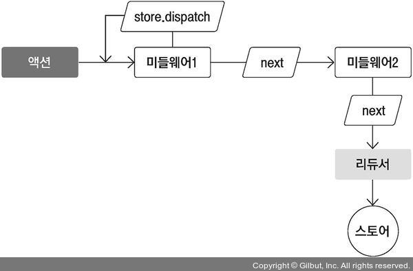
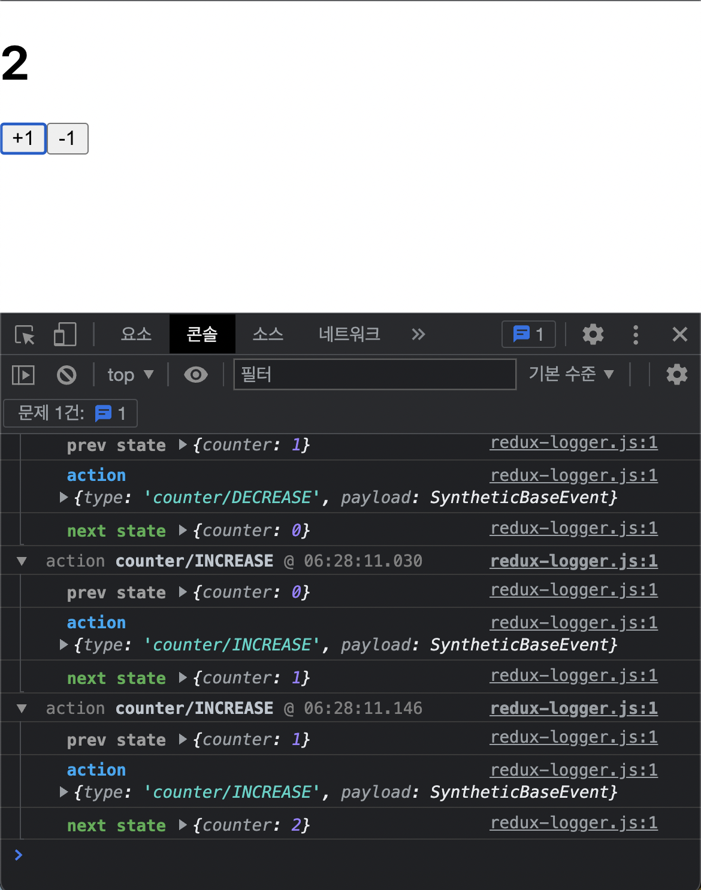

# 18장 리덕스 미들웨어를 통한 비동기 작업 관리
- API 서버 연동시 요청에 대한 상태도 잘 관리해야함(로딩이 끝났음을 명시)
    - 요청성공시 -> 서버에서 받아온 응답에 대한 상태관리
    - 요청실패시 -> 서버에서 반환한 에러에 대한 상태관리

<mark style="background-color:pink"><i><b>(리덕스 내) '미들웨어' 사용시 매우 효율적으로 상태관리 가능함</b></i></mark> 

- 실습진행
> 작업환경준비 - 미들웨어 직접 만들기 - redux-logger사용 - 미들웨어를 사용한 비동기 작업관리

## 18.1 작업 환경 준비
- CRA(creat-react-app) 사용하여 새 프로젝트 생성
```
npm creat react-app learn-redux-middleware
```
- 리덕스를 사용하여 카운터 구현(필요 라이브러리 설치)
```
npm add redux react-redux redux-actions
```
- modules/counter.js 생성
```js
import { createAction, handleActions } from 'redux-actions';


const INCREASE = 'counter/INCREASE';
const DECREASE = 'counter/DECREASE';


export const increase = createAction(INCREASE);
export const decrease = createAction(DECREASE);


const initialState = 0; // 상태는 꼭 객체일 필요가 없습니다. 숫자도 작동해요.


const counter = handleActions(
  {
    [INCREASE]: state => state + 1,
    [DECREASE]: state => state - 1
  },
  initialState
);


export default counter;
```
- modules/index.js(루트 리듀서) 생성
```js
import { combineReducers } from 'redux';
import counter from './counter';


const rootReducer = combineReducers({
  counter
});


export default rootReducer;
```
- 리듀서 다 만든후 
- src/index.js 생성 및 수정(Provider 적용)
```js
import React from 'react';
import ReactDOM from 'react-dom';
import { createStore } from 'redux';
import { Provider } from 'react-redux';
import './index.css';
import App from './App';
import reportWebVitals from './reportWebVitals';
import rootReducer from './modules'

const store = createStore(rootReducer);

ReactDOM.render(
  <Provider store={store}>
    <App />
  </Provider>,
  document.getElementById('root')
);


reportWebVitals();
```

- 프레젠테이셔널 컴포넌트 -> components 디렉터리
- 컨테이너 컴포넌트 -> containers 디렉터리

- components/Counter.js 생성
```js
import React from 'react';


const Counter = ({ onIncrease, onDecrease, number }) => {
  return (
    <div>
      <h1>{number}</h1>
      <button onClick={onIncrease}>+1</button>
      <button onClick={onDecrease}>-1</button>
    </div>
  );
};


export default Counter;
```
- containers/CounterContainer.js 생성
```js
import React from 'react';
import { connect } from 'react-redux';
import { increase, decrease } from '../modules/counter';
import Counter from '../components/Counter';


const CounterContainer = ({ number, increase, decrease }) => {
  return (
    <Counter number={number} onIncrease={increase} onDecrease={decrease} />
  );
};


export default connect(
  state => ({
    number: state.counter
  }),
  {
    increase,
    decrease
  }
)(CounterContainer);
```
- App.js 렌더링
```js
import React from 'react';
import CounterContainer from './containers/CounterContainer';

const App = () => {
  return (
    <div>
      <CounterContainer />
    </div>
  );
};

export default App;
```
<mark style="background-color:pink"><i><b>모든 준비는 끝이 났다 .....</b></i></mark>

## 18.2 미들웨어란?
- 미들웨어란 ?
> 액션을 디스패치했을 때 리듀서에서 이를 처리하기에 앞서 사전에 지정된 작업들을 실행 <mark style="background-color:pink"><i><b>미들웨어는 액션과 리듀서 사이의 중간자</b></i></mark>

- 중간자의 역활로서.. 할수 있는것들
    - 전달받은 액션을 콘솔에 기록
    - 전달받은 액션 정보를 기반으로 액션을 취소
    - 다른 종류의 액션을 추가로 디스패치


## 18.2.1 미들웨어 만들기
- 사실 거의 직접 만들지 x(이해하기위해 만드는거^)
- 간단한 미들웨어를 직접 만들어 보면 미들웨어의 작동 방식을 제대로 이해할 수 있음 -> 커스터마이징도 해야해서

- 로깅 미들웨어를 만들어보자(액션이 디스패치될때마다 액션의 정보와 전후상태를 콘솔에 보여줌)
- lib/loggerMiddleware.js 생성
```js
const loggerMiddleware = store => next => action => {
    // 미들웨어 기본 구조
  };
  
// 일반함수 풀어서 작성시
//   const loggerMiddleware = function loggerMiddleware(store) {
//     return function(next) {
//       return function(action) {
//         // 미들웨어 기본 구조
//       };
//     };
//     };


export default loggerMiddleware;
```
- 미들웨어 ? 결국 함수를 반환하는 함수를 반환하는 함수
-  next 파라미터는 store.dispatch와 비슷한 역할 
- but ! next(action)을 호출하면 그다음 처리해야 할 미들웨어에게 액션을 넘겨주고, 만약 그다음 미들웨어가 없다면 리듀서에게 액션을 넘겨준다는 것


- store.dispatch를 사용하면 첫 번째 미들웨어부터 다시 처리
- 이번에 만들 미들웨어 (다음 정보를 콘솔에 보여줌)
    1. 이전 상태
    2. 액션 정보
    3. 새로워진 상태
- lib/loggerMiddleware.js 수정
```js
const loggerMiddleware = (store) => (next) => (action) => {
  console.group(action && action.type); // 액션 타입으로 log를 그룹화함
  console.log("이전 상태", store.getState());
  console.log("액션", action);
  next(action); // 다음 미들웨어 혹은 리듀서에게 전달
  console.log("다음 상태", store.getState()); // 업데이트된 상태
  console.groupEnd(); // 그룹 끝
};

export default loggerMiddleware;
```
- index.js (스토어에) 적용
```js
import React from 'react';
import ReactDOM from 'react-dom';
import { createStore, applyMiddleware } from 'redux';
import { Provider } from 'react-redux';
import './index.css';
import App from './App';
import reportWebVitals from './reportWebVitals';
import rootReducer from './modules';
import loggerMiddleware from './lib/loggerMiddleware';

const store = createStore(rootReducer, applyMiddleware(loggerMiddleware));

ReactDOM.render(
  <Provider store={store}>
    <App />
  </Provider>,
  document.getElementById('root')
);


reportWebVitals();
```
- 콘솔창 확인

## 18.2.2 redux-logger 사용하기
- loggerMiddleware보다 훨씬 더 잘 만들어진 라이브러리(오픈소스)
- redux-logger를 설치
```
npm add redux-logger
```
- src/index.js 수정
```js
import React from 'react';
import ReactDOM from 'react-dom';
import { createStore, applyMiddleware } from 'redux';
import { Provider } from 'react-redux';
import './index.css';
import App from './App';
import reportWebVitals from './reportWebVitals';
import rootReducer from './modules';
// import loggerMiddleware from './lib/loggerMiddleware';
import { createLogger } from 'redux-logger';


const logger = createLogger();
const store = createStore(rootReducer, applyMiddleware(logger));

ReactDOM.render(
  <Provider store={store}>
    <App />
  </Provider>,
  document.getElementById('root')
);


reportWebVitals();
```
- 콘솔이 컬러풀 해짐, 시간 확인(이미 만들어져 있는 미들웨어)


## 18.3 비동기 작업을 처리하는 미들웨어 사용
- 비동기 작업을 처리할 때 도움을 주는 미들웨어
    • redux-thunk: 비동기 작업을 처리할 때 가장 많이 사용하는 미들웨어. 객체가 아닌 함수 형태의 액션을 디스패치할 수 있게 함
    • redux-saga: redux-thunk 다음으로 가장 많이 사용되는 비동기 작업 관련 미들웨어 라이브러리. 특정 액션이 디스패치되었을 때 정해진 로직에 따라 다른 액션을 디스패치시키는 규칙을 작성 및 비동기 작업 처리

### 18.3.1 redux-thunk
- 리덕스를 사용하는 프로젝트에서 비동기 작업을 처리할 때 가장 기본적으로 사용하는 미들웨어

#### 18.3.1.1 Thunk란?
- Thunk ? 특정 작업을 나중에 할 수 있도록 미루기 위해 함수 형태로 감싼 것
- redux-thunk 라이브러리를 사용하면 thunk 함수를 만들어서 디스패치할 수 있음

#### 18.3.1.2 미들웨어 적용하기
- redux-thunk 미들웨어를 설치 및 프로젝트에 적용
```
npm add redux-thunk
```
- src/index.js 수정
```js
import React from 'react';
import ReactDOM from 'react-dom';
import { createStore, applyMiddleware } from 'redux';
import { Provider } from 'react-redux';
import './index.css';
import App from './App';
import reportWebVitals from './reportWebVitals';
import rootReducer from './modules';
// import loggerMiddleware from './lib/loggerMiddleware';
import { createLogger } from 'redux-logger';
import ReduxThunk from 'redux-thunk';


const logger = createLogger();
const store = createStore(rootReducer, applyMiddleware(logger,ReduxThunk));

ReactDOM.render(
  <Provider store={store}>
    <App />
  </Provider>,
  document.getElementById('root')
);


reportWebVitals();
```
#### 18.3.1.3 Thunk 생성 함수 만들기
- redux-thunk는 액션 생성 함수에서 일반 액션 객체를 반환하는 대신에 함수를 반환
- increaseAsync와 decreaseAsync 함수 -> 카운터 값을 비동기적으로 변경
- modules/counter.js 수정
```js
import { createAction, handleActions } from "redux-actions";

const INCREASE = "counter/INCREASE";
const DECREASE = "counter/DECREASE";

export const increase = createAction(INCREASE);
export const decrease = createAction(DECREASE);

// 1초 뒤에 increase 혹은 decrease 함수를 디스패치함
export const increaseAsync = () => (dispatch) => {
  setTimeout(() => {
    dispatch(increase());
  }, 1000);
};
export const decreaseAsync = () => (dispatch) => {
  setTimeout(() => {
    dispatch(decrease());
  }, 1000);
};

const initialState = 0; // 상태는 꼭 객체일 필요가 없습니다. 숫자도 작동해요.

const counter = handleActions(
  {
    [INCREASE]: (state) => state + 1,
    [DECREASE]: (state) => state - 1,
  },
  initialState
);

export default counter;
```
- container/CounterContainer.js 수정
```js
import React from 'react';
import { connect } from 'react-redux';
import { increaseAsync, decreaseAsync } from '../modules/counter';
import Counter from '../components/Counter';


const CounterContainer = ({ number, increaseAsync, decreaseAsync }) => {
  return (
    <Counter number={number} onIncrease={increaseAsync} onDecrease={decreaseAsync} />
  );
};


export default connect(
  state => ({
    number: state.counter
  }),
  {
    increaseAsync, 
    decreaseAsync
  }
)(CounterContainer);
```
- 처음 디스패치되는 액션 -> 함수 형태
- 두번째 디스패치되는 액션 -> 객체 형태

#### 18.3.1.4 웹 요청 비동기 작업 처리하기
- 가짜 API를 사용
1. 포스트 읽기(:id는 1~100 사이 숫자)
> GET https://jsonplaceholder.typicode.com/posts/:id
2. 모든 사용자 정보 불러오기
> GET https://jsonplaceholder.typicode.com/users

- API를 호출시 주로 axios(Promise 기반 웹 클라이언트)를 사용
- API를 모두 함수화(가독성, 유지보수)
- lib/api.js 생성
```js
import axios from 'axios';


export const getPost = id =>
  axios.get(`https://jsonplaceholder.typicode.com/posts/${id}`);


export const getUsers = id =>
  axios.get(`https://jsonplaceholder.typicode.com/users`);
``` 
- modules/sample.js 생성 - 위 API를 사용하여 데이터를 받아와 상태를 관리
```js
import { handleActions } from 'redux-actions';
import * as api from '../lib/api';


// 액션 타입을 선언합니다.
// 한 요청당 세 개를 만들어야 합니다.


const GET_POST = 'sample/GET_POST';
const GET_POST_SUCCESS = 'sample/GET_POST_SUCCESS';
const GET_POST_FAILURE = 'sample/GET_POST_FAILURE';


const GET_USERS = 'sample/GET_USERS';
const GET_USERS_SUCCESS = 'sample/GET_USERS_SUCCESS';
const GET_USERS_FAILURE = 'sample/GET_USERS_FAILURE';


// thunk 함수를 생성합니다.
// thunk 함수 내부에서는 시작할 때, 성공했을 때, 실패했을 때 다른 액션을 디스패치합니다.


export const getPost = id => async dispatch => {
  dispatch({ type: GET_POST }); // 요청을 시작한 것을 알림
  try {
    const response = await api.getPost(id);
    dispatch({
      type: GET_POST_SUCCESS,
      payload: response.data
    }); // 요청 성공
  } catch (e) {
    dispatch({
      type: GET_POST_FAILURE,
      payload: e,
      error: true
    }); // 에러 발생
    throw e; // 나중에 컴포넌트단에서 에러를 조회할 수 있게 해 줌
  }
};


export const getUsers = () => async dispatch => {
  dispatch({ type: GET_USERS }); // 요청을 시작한 것을 알림
  try {
    const response = await api.getUsers();
    dispatch({
      type: GET_USERS_SUCCESS,
      payload: response.data
    }); // 요청 성공
  } catch (e) {
    dispatch({
      type: GET_USERS_FAILURE,
      payload: e,
      error: true
    }); // 에러 발생
    throw e; // 나중에 컴포넌트단에서 에러를 조회할 수 있게 해 줌
  }
};


// 초기 상태를 선언합니다.
// 요청의 로딩 중 상태는 loading이라는 객체에서 관리합니다.


const initialState = {
  loading: {
    GET_POST: false,
    GET_USERS: false
  },
  post: null,
  users: null
};


const sample = handleActions(
  {
    [GET_POST]: state => ({
      ...state,
      loading: {
        ...state.loading,
        GET_POST: true // 요청 시작
      }
    }),
    [GET_POST_SUCCESS]: (state, action) => ({
      ...state,
      loading: {
        ...state.loading,
        GET_POST: false // 요청 완료
      },
      post: action.payload
    }),
    [GET_POST_FAILURE]: (state, action) => ({
      ...state,
      loading: {
        ...state.loading,
        GET_POST: false // 요청 완료
      }
    }),
    [GET_USERS]: state => ({
      ...state,
      loading: {
        ...state.loading,
        GET_USERS: true // 요청 시작
      }
    }),
    [GET_USERS_SUCCESS]: (state, action) => ({
      ...state,
      loading: {
        ...state.loading,
        GET_USERS: false // 요청 완료
      },
      users: action.payload
    }),
    [GET_USERS_FAILURE]: (state, action) => ({
      ...state,
      loading: {
        ...state.loading,
        GET_USERS: false // 요청 완료
      }
    })
  },
  initialState
);


export default sample;
```
- modules/index.js(루트 리듀서에 포함)
```js
import { combineReducers } from 'redux';
import counter from './counter';
import sample from './sample';


const rootReducer = combineReducers({
  counter,
  sample
});


export default rootReducer;
```
- 렌더링할 프레젠테이셔널 컴포넌트부터 작성 -> API를 통해 전달받은 데이터의 형식이 어떤 구조인지 확인

- 보여줄 부분
    - post -> title, body
    - user -> username, email

- components/Sample.js 생성
```js
import React from 'react';

const Sample = ({ loadingPost, loadingUsers, post, users }) => {
  return (
    <div>
      <section>
        <h1>포스트</h1>
        {loadingPost && '로딩 중...'}
        {!loadingPost && post && (
          <div>
            <h3>{post.title}</h3>
            <h3>{post.body}</h3>
          </div>
        )}
      </section>
      <hr />
      <section>
        <h1>사용자 목록</h1>
        {loadingUsers && '로딩 중...'}
        {!loadingUsers && users && (
          <ul>
            {users.map(user => (
              <li key={user.id}>
                {user.username} ({user.email})
              </li>
            ))}
          </ul>
        )}
      </section>
    </div>
  );
};

export default Sample;
```
- 데이터를 불러와서 렌더링해 줄 때는 유효성 검사를 해 주는 것이 중요 !
- containers/SampleContainer.js 생성
```js
import React from 'react';
import { connect } from 'react-redux';
import Sample from '../components/Sample';
import { getPost, getUsers } from '../modules/sample';


const { useEffect } = React;
const SampleContainer = ({
  getPost,
  getUsers,
  post,
  users,
  loadingPost,
  loadingUsers
}) => {
  // 클래스 형태 컴포넌트였다면 componentDidMount
  useEffect(() => {
    getPost(1);
    getUsers(1);
  }, [getPost, getUsers]);
  return (
    <Sample
      post={post}
      users={users}
      loadingPost={loadingPost}
      loadingUsers={loadingUsers}
    />
  );
};


export default connect(
  ({ sample }) => ({
    post: sample.post,
    users: sample.users,
    loadingPost: sample.loading.GET_POST,
    loadingUsers: sample.loading.GET_USERS
  }),
  {
    getPost,
    getUsers
  }
)(SampleContainer);
```
- App.js 렌더링(CounterContainer -> SampleContainer)
```js
import React from 'react';
import SampleContainer from './containers/SampleContainer';

const App = () => {
  return (
    <div>
      <SampleContainer />
    </div>
  );
};

export default App;
```
- 브라우저 오픈후 작동 확인
#### 18.3.1.5 리팩토링
- 반복되는 로직분리 -> 코드의 양줄이자
- lib/createRequestThunk.js 생성
```js
export default function createRequestThunk(type, request) {
    // 성공 및 실패 액션 타입을 정의합니다.
    const SUCCESS = `${type}_SUCCESS`;
    const FAILURE = `${type}_FAILURE`;
    return params => async dispatch => {
      dispatch({ type }); // 시작됨
      try {
        const response = await request(params);
        dispatch({
          type: SUCCESS,
          payload: response.data
        }); // 성공
      } catch (e) {
        dispatch({
          type: FAILURE,
          payload: e,
          error: true
        }); // 에러 발생
        throw e;
      }
    };
  }
  
  
  //사용법: createRequestThunk(‘GET_USERS‘,api.getUsers);
```
- 액션 타입과 API를 요청하는 함수를 파라미터로 넣어 주면 나머지 작업을 대신 처리 -> 기존 thunk 함수의 코드를 대체
- modules/sample.js 수정
```js
import { handleActions } from 'redux-actions';
import * as api from '../lib/api';
import createRequestThunk from '../lib/createRequestThunk';

// 액션 타입을 선언합니다.
// 한 요청당 세 개를 만들어야 합니다.

const GET_POST = 'sample/GET_POST';
const GET_POST_SUCCESS = 'sample/GET_POST_SUCCESS';
const GET_POST_FAILURE = 'sample/GET_POST_FAILURE';

const GET_USERS = 'sample/GET_USERS';
const GET_USERS_SUCCESS = 'sample/GET_USERS_SUCCESS';
const GET_USERS_FAILURE = 'sample/GET_USERS_FAILURE';

// thunk 함수를 생성합니다.
// thunk 함수 내부에서는 시작할 때, 성공했을 때, 실패했을 때 다른 액션을 디스패치합니다.

export const getPost = createRequestThunk(GET_POST, api.getPost);
export const getUsers = createRequestThunk(GET_USERS, api.getUsers);

// 초기 상태를 선언합니다.
// 요청의 로딩 중 상태는 loading이라는 객체에서 관리합니다.

const initialState = {
  loading: {
    GET_POST: false,
    GET_USERS: false
  },
  post: null,
  users: null
};


const sample = handleActions(
  {
    [GET_POST]: state => ({
      ...state,
      loading: {
        ...state.loading,
        GET_POST: true // 요청 시작
      }
    }),
    [GET_POST_SUCCESS]: (state, action) => ({
      ...state,
      loading: {
        ...state.loading,
        GET_POST: false // 요청 완료
      },
      post: action.payload
    }),
    [GET_POST_FAILURE]: (state, action) => ({
      ...state,
      loading: {
        ...state.loading,
        GET_POST: false // 요청 완료
      }
    }),
    [GET_USERS]: state => ({
      ...state,
      loading: {
        ...state.loading,
        GET_USERS: true // 요청 시작
      }
    }),
    [GET_USERS_SUCCESS]: (state, action) => ({
      ...state,
      loading: {
        ...state.loading,
        GET_USERS: false // 요청 완료
      },
      users: action.payload
    }),
    [GET_USERS_FAILURE]: (state, action) => ({
      ...state,
      loading: {
        ...state.loading,
        GET_USERS: false // 요청 완료
      }
    })
  },
  initialState
);


export default sample;
```
- 요청의 로딩 상태를 관리하는 작업을 개선 -> 로딩 상태만 관리하는 리덕스 모듈을 따로 생성하여 처리
- modules/loading.js 생성
```js
import { createAction, handleActions } from 'redux-actions';


const START_LOADING = 'loading/START_LOADING';
const FINISH_LOADING = 'loading/FINISH_LOADING';


//  요청을 위한 액션 타입을 payload로 설정합니다(예: 'sample/GET_POST').


export const startLoading = createAction(
  START_LOADING,
  requestType => requestType
);


export const finishLoading = createAction(
  FINISH_LOADING,
  requestType => requestType
);


const initialState = {};


const loading = handleActions(
  {
    [START_LOADING]: (state, action) => ({
      ...state,
      [action.payload]: true
    }),
    [FINISH_LOADING]: (state, action) => ({
      ...state,
      [action.payload]: false
    })
  },
  initialState
);


export default loading;
```
- modules/index.js(루트 리듀서에 포함)
```js
import { combineReducers } from 'redux';
import counter from './counter';
import sample from './sample';
import loading from './loading';


const rootReducer = combineReducers({
  counter,
  sample,
  loading
});


export default rootReducer;
```
- lib/createRequestThunk.js(액션 생성 함수 사용)
```js
import { startLoading, finishLoading } from '../modules/loading';

export default function createRequestThunk(type, request) {
  // 성공 및 실패 액션 타입을 정의합니다.
  const SUCCESS = `${type}_SUCCESS`;
  const FAILURE = `${type}_FAILURE`;
  return (params) => async (dispatch) => {
    dispatch({ type }); // 시작됨
    dispatch(startLoading(type));
    try {
      const response = await request(params);
      dispatch({
        type: SUCCESS,
        payload: response.data,
      }); // 성공
      dispatch(finishLoading(type));
    } catch (e) {
      dispatch({
        type: FAILURE,
        payload: e,
        error: true,
      }); // 에러 발생
      dispatch(startLoading(type));
      throw e;
    }
  };
}

//사용법: createRequestThunk('.ET_USERS'.api.getUsers);

```
- containers/SampleContainer.js (로딩상태 조회가능)
```js
import React from 'react';
import { connect } from 'react-redux';
import Sample from '../components/Sample';
import { getPost, getUsers } from '../modules/sample';

const { useEffect } = React;
const SampleContainer = ({
  getPost,
  getUsers,
  post,
  users,
  loadingPost,
  loadingUsers
}) => {
  // 클래스 형태 컴포넌트였다면 componentDidMount
  useEffect(() => {
    getPost(1);
    getUsers(1);
  }, [getPost, getUsers]);
  return (
    <Sample
      post={post}
      users={users}
      loadingPost={loadingPost}
      loadingUsers={loadingUsers}
    />
  );
};

export default connect(
  ({ sample, loading }) => ({
    post: sample.post,
    users: sample.users,
    loadingPost: loading.GET_POST,
    loadingUsers: loading.GET_USERS
  }),
  {
    getPost,
    getUsers
  }
)(SampleContainer);
```
- modules/sample.js (불필요한 코드 지우기)
```js
import { handleActions } from 'redux-actions';
import * as api from '../lib/api';
import createRequestThunk from '../lib/createRequestThunk';


// 액션 타입을 선언합니다.
const GET_POST = 'sample/GET_POST';
const GET_POST_SUCCESS = 'sample/GET_POST_SUCCESS';


const GET_USERS = 'sample/GET_USERS';
const GET_USERS_SUCCESS = 'sample/GET_USERS_SUCCESS';


// thunk 함수를 생성합니다.
// thunk 함수 내부에서는 시작할 때, 성공했을 때, 실패했을 때 다른 액션을 디스패치합니다.


export const getPost = createRequestThunk(GET_POST, api.getPost);
export const getUsers = createRequestThunk(GET_USERS, api.getUsers);


// 초기 상태를 선언합니다.
// 요청의 로딩 중 상태는 loading이라는 객체에서 관리합니다.


const initialState = {
  post: null,
  users: null
};


const sample = handleActions(
  {
    [GET_POST_SUCCESS]: (state, action) => ({
      ...state,
      post: action.payload
    }),
    [GET_USERS_SUCCESS]: (state, action) => ({
      ...state,
      users: action.payload
    })
  },
  initialState
);


export default sample;
```
- sample 리듀서에서는 로딩 중에 대한 상태를 관리할 필요가 없음
- 에러값은 useEffect 사용해서 조회하셈

### 18.3.2 redux-saga
-  redux-saga는 까다로운 상황에서 유용(아래와 같은 상황)
    • 기존 요청을 취소 처리해야 할 때(불필요한 중복 요청 방지)
    • 특정 액션이 발생했을 때 다른 액션을 발생시키거나, API 요청 등 리덕스와 관계없는 코드를 실행할 때
    • 웹소켓을 사용할 때
    • API 요청 실패 시 재요청해야 할 때

## 18.4 정리
- 비동기 작업을 처리할 때 리덕스 미들웨어를 사용하는 이유는 결국 좀 더 편하게 처리하기 위해서임
- 불편하다고 느낀다면 사용하지 않는 편이 좋을 수도 있음