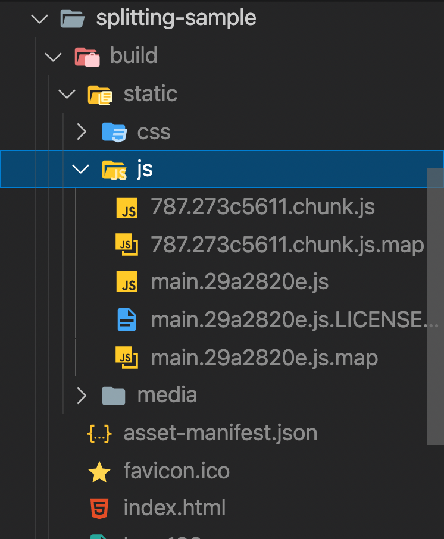
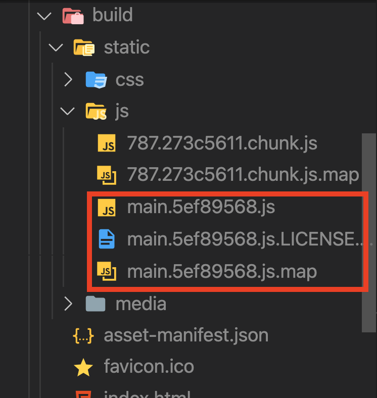

# 19장 코드 스플리팅

- 리액트 프로젝트 -> 사용자에게 제공할 시 -> 빌드 작업을 거쳐서 배포해야 함
- 웹팩(webpack)을 사용함 -> 별도설정 없을시 모든 js, css 파일이 하나로 합쳐짐
- CRA의 기본 웹팩 설정에는 SplitChunks라는 기능이 적용 -> node_modules 여러 파일을 자동으로 따로 분리 (캐싱의 효과 ↑)
- 리액트 프로젝트 생성

```
npm create react-app splitting-sample
cd splitting-sample
npm run build
```

- splitting-sample/bulid/static 오픈시
  

- '273c5611' 같은 해시(hash)값이 포함 -> 빌드과정시 파일내용에 따라 생성
- 787로 시작하는 파일 -> React, ReactDOM 등 node_modules에서 불러온 라이브러리 관련 코드(코드가 김)
- main으로 시작하는 파일 -> 직접 프로젝트에 작성하는 App 같은 컴포넌트에 대한 코드가 들어 있음(코드 짧음)

- App.js 수정

```js
import logo from "./logo.svg";
import "./App.css";

function App() {
  return (
    <div className="App">
      <header className="App-header">
        
        <p>나는 홍예림</p>
      </header>
    </div>
  );
}

export default App;
```

- npm run build 재 빌드
  

- main으로 시작하는 파일의 이름이 바뀜 !
  > <mark style="background-color:pink"><i><b> 코드스플리팅 ? </b></i></mark>
  > 이렇게 파일을 분리하는 작업
  > (프로젝트에 기본 탑재된 SplitChunks 기능을 통한 코드 스플리팅은 단순한 캐싱 효과만 있을 뿐)

> <i><b>코드 비동기 로딩 </b></i>
> 코드 스플리팅 방법 중 하나
> 자바스크립트 함수, 객체, 혹은 컴포넌트를 처음에는 불러오지 않고 필요한 시점에 불러와서 사용할 수 있음

- 실습진행
  > 자바스크립트 함수 비동기 로딩 - React.lazy와 Suspense를 통한 컴포넌트 비동기 렌더링 - Loadable Components를 통한 컴포넌트 비동기 렌더링

## 19.1 자바스크립트 함수 비동기 로딩

- 우선 일반 자바스크립트 함수를 스플리팅 해보자
- src/notify.js 생성

```js
export default function notify() {
  alert("안녕예림");
}
```

- 나는예림 클릭시 notify 함수가 실행되도록 src/App.js 수정

```js
import logo from "./logo.svg";
import "./App.css";
import notify from "./notify";

function App() {
  const onClick = () => {
    notify();
  };
  return (
    <div className="App">
      <header className="App-header">
        
        <p onClick={onClick}>나는예림</p>
      </header>
    </div>
  );
}

export default App;
```

- 다음과 같이 import를 상단에서 하지 않고 import() 함수 형태로 메서드 안에서 사용시 -> 파일을 따로 분리시켜서 저장
- src.App.js 수정

```js
import logo from "./logo.svg";
import "./App.css";
// import notify from './notify';

function App() {
  const onClick = () => {
    import("./notify").then((result) => result.default());
  };
  return (
    <div className="App">
      <header className="App-header">
        
        <p onClick={onClick}>나는예림</p>
      </header>
    </div>
  );
}

export default App;
```

- import 함수 사용시

  - Promise 반환
  - 표준 자바스크립트 x stage-3 단계 dynamic import라는 문법
  - 현재 웹팩에서 지원 o
  - default로 내보낸 것은 result.default를 참조해야 사용할 수 있음

- npm run build 로 재빌드
  

- 154로 시작하는 파일이 생김 -> notify 관련 코드가 들어감

## 19.2 React.lazy와 Suspense를 통한 컴포넌트 코드 스플리팅

### 19.2.1 state를 사용한 코드 스플리팅

- React.lazy 없이 컴포넌트의 코드를 스플리팅, 어떻게 ?
- src/SplitMe.js 생성

```js
import React from "react";

const SplitMe = () => {
  return <div>SplitMe</div>;
};

export default SplitMe;
```

- App.js 수정 및 렌더링

```js
import React, { Component } from "react";
import logo from "./logo.svg";
import "./App.css";

class App extends Component {
  state = {
    SplitMe: null,
  };
  handleClick = async () => {
    const loadedModule = await import("./SplitMe");
    this.setState({
      SplitMe: loadedModule.default,
    });
  };
  render() {
    const { SplitMe } = this.state;
    return (
      <div className="App">
        <header className="App-header">
          
          <p onClick={this.handleClick}>나는예림</p>
          {SplitMe && <SplitMe />}
        </header>
      </div>
    );
  }
}

export default App;
```

- 나는예림 클릭시 SplitMe 실행 확인 및 코드 스플리팅 확인
- state를 사용? 어렵지 x
- but 매번 선언하기 불편쓰 ~

### 19.2.2 React.lazy와 Suspense 사용하기

- React.lazy : 컴포넌트를 렌더링하는 시점에서 비동기적으로 로딩할 수 있게 해 주는 유틸 함수
  ```js
  const SplitMe = React.lazy(() => import('./SplitMe'));
  ```
- Suspense : 리액트 내장 컴포넌트로서 코드 스플리팅된 컴포넌트를 로딩하도록 발동시킴, 로딩이 끝나지 않았을 때 보여 줄 UI를 설정할 수 있음
    ```js
    import React, { Suspense } from 'react';

    (...)
    <Suspense fallback={<div>loading...</div>}> // fallback props를 통해 로딩 중에 보여 줄 JSX를 지정
    <SplitMe />
    </Suspense>
    ```
- App.js 적용
```js
import React, { useState, Suspense } from 'react';
import logo from './logo.svg';
import './App.css';
const SplitMe = React.lazy(() => import('./SplitMe'));


function App() {
  const [visible, setVisible] = useState(false);
  const onClick = () => {
    setVisible(true);
  };
  return (
    <div className="App">
      <header className="App-header">
        
        <p onClick={onClick}>나는예림</p>
        <Suspense fallback={<div>loading...</div>}>
          {visible && <SplitMe />}
        </Suspense>
      </header>
    </div>
  );
}


export default App;
```
- Network - Slow 3G 설정후 
- 나는예림 클릭하여 loading... 먼저 뜨는지 확인
### 19.2.3 Loadable Components를 통한 코드 스플리팅
- Loadable Components ? 코드 스플리팅을 편하게 하도록 도와주는 서드파티 라이브러리
    - 서버 사이드 렌더링(웹 서비스의 초기 로딩 속도 개선, 캐싱 및 검색 엔진 최적화를 가능하게 해 주는 기술)을 지원
    - 렌더링하기 전에 스플리팅된 파일을 미리 불러올 수 있음
- 다음설치
```
npm add @loadable/component 
```
- App.js 수정
```js
import React, { useState } from 'react';
import logo from './logo.svg';
import './App.css';
import loadable from '@loadable/component';
const SplitMe = loadable(() => import('./SplitMe'), {
    fallback: <div>loading...</div>
});
// loadable을 사용하는 부분을 수정하여 로딩 중에 다른 UI를 보여줌

function App() {
  const [visible, setVisible] = useState(false);
  const onClick = () => {
    setVisible(true);
  };
  return (
    <div className="App">
      <header className="App-header">
        
        <p onClick={onClick}>나는예림</p>
        {visible && <SplitMe />}
      </header>
    </div>
  );
}


export default App;
```
- 컴포넌트 미리 불러오는(preload) 방법
- App.js 수정
```js
import React, { useState } from 'react';
import logo from './logo.svg';
import './App.css';
import loadable from '@loadable/component';
const SplitMe = loadable(() => import('./SplitMe'), {
    fallback: <div>loading...</div>
});
// loadable을 사용하는 부분을 수정하여 로딩 중에 다른 UI를 보여줌

function App() {
  const [visible, setVisible] = useState(false);
  const onClick = () => {
    setVisible(true);
  };
  const onMouseOver = () => {
    SplitMe.preload();
  };
  return (
    <div className="App">
      <header className="App-header">
        
        <p onClick={onClick} onMouseOver={onMouseOver}>나는예림</p>
        {visible && <SplitMe />}
      </header>
    </div>
  );
}


export default App;
```
- 마우스 오버시 loading... 생기는지 확인, 클릭시 렌더링 되는지 확인
- Loadable Components는 미리 불러오는 기능 외 타임아웃, 로딩 UI 딜레이, 서버 사이드 렌더링 호환 등 다양한 기능을 제공 공식문서 확인(https://www.smooth-code.com/open-source/loadable-components/docs/delay/)

## 19.3 정리
- 서버 사이드 렌더링을 할 계획이 없다면 React.lazy와 Suspense로 구현하고, 계획이 있다면 Loadable Components를 사용
