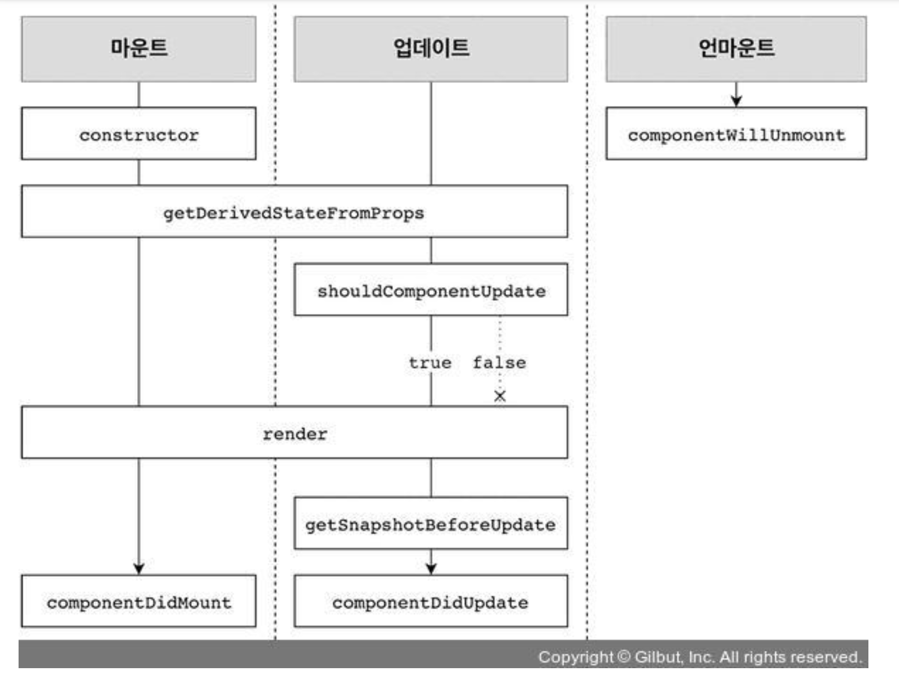

# 7장 컴포넌트의 라이프사이클 메서드

- 모든 리액트 컴포넌트에는 라이프사이클(수명주기)이 존재 !
- 컴포넌트 수명 : 페이지에 렌더링 되기전인 준비 과정에서 시작 -> 페이지 사라질때 끝남

<mark style="background-color:pink"><i>언제 컴포넌트의 라이프사이클 메서드를 사용할꽈 ? </i></mark>

> - 컴포넌트를 처음 렌더링시, 업데이트하기 전후, 어떤 작업을 처리해야 하거나 불필요한 업데이트를 방지해야할 때
> - 클래스형 컴포넌트에서만 사용 ㄱㄴ
> - 함수형 컴포넌트에서는 Hooks 기능을 사용하여 비슷한 작업을 처리

## 7.1 라이프사이클 메서드의 이해

- 라이프사이클 메서드의 종류 9가지
  - Will 접두사가 붙은 메서드(어떤 작업을 작동하기 전)
  - Did 접두사가 붙은 메서드(어떤 작업을 작동한 후)
- 라이프사이클의 3가지 카테고리 - 마운트 : 페이지에 컴포넌트가 나타남 - 업데이트 : 컴포넌트 정보를 업데이트 - 언마운트 : 페이지에서 컴포넌트가 사라짐
  > <mark style="background-color:pink"><i>어떻게 컴포넌트의 라이프사이클 메서드를 사용할꽈 ? </i></mark>
  > 컴포넌트 클래스에서 덮어써 선언

#### 마운트

- DOM이 생성되고 웹 브라우저상에 나타나는것
- 이때 호출되는 메서드

  > 컴포넌트 만들기
  > -> constructor
  > -> getDerivedStateFromProps
  > -> render
  > -> componentDidMount

- constructor: 컴포넌트를 새로 만들때마다 호출되는 클래스 생성자 메서드
- getDerivedStateFromProps: props에 있는 값을 state에 넣을 때 사용하는 메서드
- render: 우리가 준비한 UI를 렌더링하는 메서드
- componentDidMount: 컴포넌트가 웹 브라우저상에 나타난 후 호출하는 메서드

#### 업데이트

- 컴포넌트는 다음과 같은 4가지 경우에 업데이트 함

  1. props가 바뀔때
  2. state가 바뀔때
  3. 부모 컴포넌트가 리렌더링 될때
  4. this.forceUpdate로 강제로 렌더링을 트리거할 때

- 이때 호출되는 메서드

  > 업데이트를 발생시키는 4가지요인 등장
  > -> getDerivedStateFromProps
  > -> shouldComponentUpdate(true 반환시 render 호출, false 반환시 여기서 작업 취소)
  > -> render(forceUpdate)
  > -> getSnapchotBeforeUpdate(웹 브라우저상의 실제 DOM 변화)
  > -> componentDidUpdate

- getDerivedStateFromProps : 마운트 과정에서도 호출됨, 업데이트가 시작하기전에도 호출, props의 변화에 따라 prop의 변화에 따라 state 값에도 변화를 주고 싶을 때 사용
- shouldComponentUpdate : 컴포넌트가 리렌더링을 해야 할지 결정하는 메서드 -> true, false 값을 반환
- render : 컴포넌트를 리렌더링
- getSnapchotBeforeUpdate : 컴포넌트 변화를 DOM에 반영하기 바로 직전에 호출하는 메서드
- componentDidUpdate : 컴포넌트의 업데이트 작업이 끝난후 호출하는 메서드

#### 언마운트

- 마운트의 반대과정, 컴포넌트를 DOM에서 제거하는것
- 이때 호출되는 메서드
  > componentWillUnmount : 컴포넌트가 웹 브라우저상에서 사라지기 전에 호출하는 메서드

## 7.2 라이프사이클 메서드 살펴보기

### 7.2.1 render() 함수

```js
render() {...}
```

- 이 메서드는 컴포넌트 모양새를 정의
- 컴포넌트에서 가장 중요한 메서드
- 라이프사이클 메서드 중 유일한 필수 메서드
- this.props와 this.state에 접근 -> 리액트요소를 반환
- 다음 사항에 주의
  - 이벤트 설정이 아닌 곳에서 setState를 사용하면 x, 브라우저의 DOM에 접근해서도 안됨
  - DOM 정보를 가져오거나 state에 변화 -> componentDidMount 에서 처리

### 7.2.2 constructor 메서드

```js
constructor(props) {...}
```

- 컴포넌트 생성자 메서드로 컴포넌트를 만들때 처음으로 실행됨 -> 초기 state를 정할 수 있음

### 7.2.3 getDerivedStateFromProps 메서드

- props로 받아온 값을 state에 동기화시키는 용도로 사용
- 컴포넌트가 마운트될때와 업데이트될 때 호출됨

```js
static getDerivedStateFromProps(nextProps, preState) {
    if(nextProps.value !== preState.value) {
        //조건에 따라 특정값 동기화
        return { value: nextProps.value };
    }
     return null; //state를 변경할 필요가 없다면 null을 반환
}
```

### 7.2.4 componentDidMount 메서드

```js
componentDidMount() {...}
```

- 컴포넌트를 만들고 첫 렌더링을 다 마친후 실행
- 이 안에서 다른 자스 라이브러리 or 프레임워크의 함수를 호출 or 이벤트 등록, setTimeout, setInterval, 네트워크 요청 같은 비동기 작업을 처리

### 7.2.5 shouldComponentUpdate 메서드

```js
shouldComponentUpdate(nextProps, nextState){...}
```

- props 또는 state를 변경했을때, 리랜더링을 시작할지 여부를 지정하는 메서드
- 반드시 true or false 값을 반환해야함
- 컴포넌트 만들때 이 메서드를 따로 생성하지 않으면 기본적으로 true 값을 반환
- false 값을 반환한다면 업데이트 과정 중지
- 접근방법
  - this.props 와 this.state로 접근
- 설정방법
  - nextProps 와 nextState로 접근
- 프로젝트 성능 최적화시 -> 리렌더링을 방지하기위해 false 값을 반환

### 7.2.6 getSnapshotBeforeUpdate 메서드

- 이 메서드는 render에서 만들어진 결과물이 브라우저에 실제로 반영되기 직전에 호출
- 이 메서드의 반환값은 componentDidUpdate에서 세번째 파라미터인 snapshot 값으로 전달 o -> 업데이트하기 직전의 값을 참고 할 일이 있을때 활용됨(ex: 스크롤바 위치 유지)

```js
getSnapchotBeforeUpdate(preProps, prevState){
    if(prevState.array !== this.state.array){
        const { scrollTop, scrollHeight } = this.list
        return { scrollTop, scrollHeight };
    }
}
```

### 7.2.7 componentDidUpdate 메서드

```js
componentDidUpdate(preProps, preState, snapshot){...}
```

- 리렌더링을 완료한 후 실행됨
- 업데이트 끝난 직후로 DOM 관련 처리를 해도 무방함
- preProps or preState를 사용하여 컴포넌트가 이전에 가졌던 데이터에 접근 ㄱㄴ
- getSnapshotBeforeUpdate에서 반환값이 있다면 snapshot 값을 전달 받을 수 있음

### 7.2.8 componentWillUnmount 메서드

```js
componentWillUnmount(){...}
```

- 컴포넌트를 DOM에서 제거할 때 실행됨
- componentDidMount 에서 등록한 이벤트, 타이머, 직접 생성한 DOM이 있다면 여기서 제거 작업을 해야함

### 7.2.9 componentDidCatch 메서드

- 컴포넌트 렌더링 도중에 에러가 발생시 애플리케이션이 먹통이 되지 않고 오류 UI를 보여줄 수 있게 해줌

```js
componentDidCatch(error, info){
    this.setState({
        error: true
    });
    console.log({error, info});
}
```

- error 파라미터는 어떤 error가 발생했는지 알려줌
- info 파라미터는 어디에 있는 코드에서 오류가 발생하는지 정보를 줌
- 서버 API를 호출하여 따로 수집할 수 있음
- but ! 자신에게 발생하는 에러를 잡아낼순 x
- this.props.children 으로 전달되는 컴포넌트에서 발생되는 에러만 잡아낼수 있음

## 7.3 라이프사이클 메서드 사용하기

- 실습의 흐름
  > LifeCycleSample 컴포넌트 만들기
  > -> App에 렌더링 하기
  > -> 버튼 누르고 콘솔창 확인

### 7.3.1 예제 컴포넌트 생성

```js
import React, { Component } from "react";

class LifeCycleSample extends Component {
  state = {
    number: 0,
    color: null,
  };

  myRef = null; // ref를 설정할 부분

  constructor(props) {
    super(props);
    console.log("constructor");
  }

  static getDerivedStateFromProps(nextProps, prevState) {
    console.log("getDerivedStateFromProps");
    if (nextProps.color !== prevState.color) {
      return { color: nextProps.color };
    }
    return null;
  }

  componentDidMount() {
    console.log("componentDidMount");
  }

  shouldComponentUpdate(nextProps, nextState) {
    console.log("shouldComponentUpdate", nextProps, nextState);
    // 숫자의 마지막 자리가 4면 리렌더링하지 않습니다.
    return nextState.number % 10 !== 4;
  }

  componentWillUnmount() {
    console.log("componentWillUnmount");
  }

  handleClick = () => {
    this.setState({
      number: this.state.number + 1,
    });
  };

  getSnapshotBeforeUpdate(prevProps, prevState) {
    console.log("getSnapshotBeforeUpdate");
    if (prevProps.color !== this.props.color) {
      return this.myRef.style.color;
    }
    return null;
  }

  componentDidUpdate(prevProps, prevState, snapshot) {
    console.log("componentDidUpdate", prevProps, prevState);
    if (snapshot) {
      console.log("업데이트되기 직전 색상: ", snapshot);
    }
  }

  render() {
    console.log("render");

    const style = {
      color: this.props.color,
    };

    return (
      <div>
        <h1 style={style} ref={(ref) => (this.myRef = ref)}>
          {this.state.number}
        </h1>
        <p>color: {this.state.color}</p>
        <button onClick={this.handleClick}>더하기</button>
      </div>
    );
  }
}

export default LifeCycleSample;
```

> 1.  이 컴포넌트는 각 라이프사이클 메서드를 실행할 때 콘솔 디버거에 기록

2.  부모 컴포넌트에서 props로 색상을 받아 버튼을 누르면 state.number 값을 1씩 더함

- getDerivedStateProps는 부모에서 받은 color 값을 state에 동기화 하고 있음
- getSnapshotBeforeUpdate는 DOM에 변화가 일어나기 직전의 색상 속성을 snapshot 값으로 반환하여 이것을 componentDidUpdate에서 조회할 수 있게 함

### 7.3.2 App 컴포넌트에서 예제 컴포넌트 사용

- App.js

```js
import React, { Component } from "react";
import LifeCycleSample from "./LifeCycleSample";

// 랜덤 색상을 생성합니다.
function getRandomColor() {
  return "#" + Math.floor(Math.random() * 16777215).toString(16);
}

class App extends Component {
  state = {
    color: "#000000",
  };

  handleClick = () => {
    this.setState({
      color: getRandomColor(),
    });
  };

  render() {
    return (
      <div>
        <button onClick={this.handleClick}>랜덤 색상</button>
        <LifeCycleSample color={this.state.color} />
      </div>
    );
  }
}

export default App;
```

- 버튼을 렌더링하고, 누를때 마다 handleClick 메서드가 호출되게 이벤트를 설정


## 7.4 정리
- 한눈에 정리해보기

- 라이프사이클 메서드는 컴포넌트 상태에 변화가 있을 때마다 실행하는 메서드
- 이 메서드들은 서드파티 라이브러리를 사용하거나 DOM을 직접 건드려야 하는 상황에서 유용