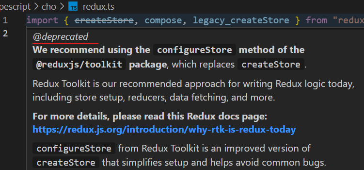

# redux 타입 분석

- 상태관리 라이브러리, typescript로 되어있어 따로 @types/redux 설치 하지 않아도 됨

```sh
yarn add redux
```

    번외 ) 예를들어 @types/react 설치시 major 버전과 맞추어 설치 해줘야함 --> @types/react@17

- tsconfig.json 의 "module" : "commonjs" 로 설정해주고 다음과 같이 불러올수 있는데 (얘네들은 named space임)

```ts
import { createStore, compose, legacy_createStore } from "redux";
```

- 만약 이런 @deprecated 를 발견한다면 잘읽어보자..

  deprecated
  : 중요도가 떨어져 더 이상 사용되지 않고 앞으로는 사라지게 될 (컴퓨터 시스템 기능 등)



- 다음 combineReducers 은 아래와 같은 타입을 같는다.

```ts
const reducer = combineReducers({
  user: (state, action) => {},
  posts: (state, action) => {},
});
```

```ts
export type ReducersMapObject<S = any, A extends Action = Action> = {
  [K in keyof S]: Reducer<S[K], A>;
};
```

- 그렇기 때문에 아래와 같은 구조를 갖게 된다.

```ts
import { compose, legacy_createStore as createStore, combineReducers } from "redux";

const action = { type: "example" };
const anyAction = { type: "example", data: "123" };

const init = {
  // keyof S
  user: {
    // S[K]
    isLoggIn: false,
    data: null,
  },
  post: [],
};

const reducer = combineReducers({
  user: (state, action) => state,
  posts: (state, action) => state,
});
const store = createStore(reducer, init);
```

- redux 는 상태를 바꿔주는 기계...

- 여기서는 매개변수와 return 값만 보면됨

```ts
export declare function legacy_createStore<S, A extends Action, Ext, StateExt>(
  reducer: Reducer<S, A>,
  preloadedState?: PreloadedState<S>,
  enhancer?: StoreEnhancer<Ext>
): Store<S & StateExt, A> & Ext;
```

- Dispatch 의 모양도 잘 기억해두자(interface 는 함수로도 사용)

```ts
export interface Dispatch<A extends Action = AnyAction> {
  <T extends A>(action: T): T;
}
```

- Middleware 의 모습을 잘 살펴 보면 3단 고차 함수임

```ts
export interface Middleware<DispatchExt = {}, S = any, D extends Dispatch = Dispatch> {
  (api: MiddlewareAPI<D, S>): (next: Dispatch<AnyAction>) => (action: any) => any;
}
```

- 이런식으로 활용할 수 있음 => 객체인 action을 함수꼴로 만들수 있음(비동기 action이 가능함 !)

```ts
const thunkMiddleware: Middleware = (store) => (next) => (action) => {
  if (typeof action === "function") {
    return action(store.dispatch, store.getState); // 비동기
  }
  return next(action); // 동기
};
```
