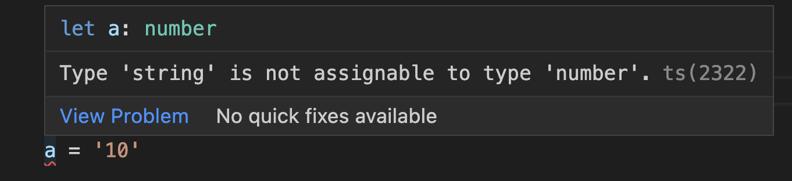
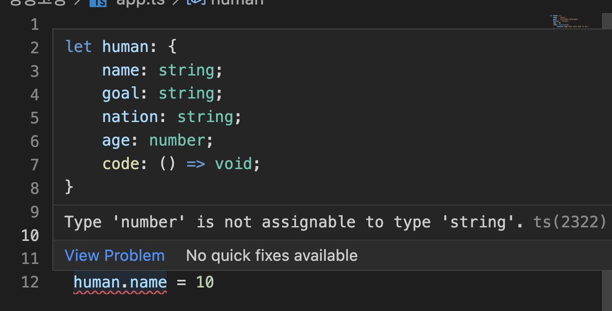
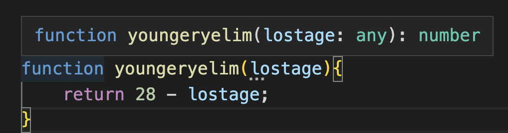

# **타입 추론 (Type Inference)**

#### **Typescript의 가장 독특한 특징**

*  Static Typing(정적 타이핑) 기능을 javascript 언어에 제공함

    **📌 Static Typing(정적 타이핑)이란?**

        타입을 선언하고 선언된 타입에 맞는 값만 할당 또는 반환되어야 된다는 뜻 !


그렇다면..?

 #### **📌 Type Inference(타입 추론)이란 ?**

    타입스크립트 내에서 타입표기가 없는 경우 코드를 읽고 분석하여 타입을 유추하는것


**예시 설명**

```ts
let a = 10 // 타입을 number 타입인 10으로 지정했기 때문에
a = '10' // string 타입으로는 지정할 수 없음
```
- app.ts 파일에서 다른타입의 값을 재 할당시 다음과 같은 오류 메세지가 발생된다. (터미널에서 compile 시에도 동일한 에러메세지가 발생)



**더 구체적인 예시**

```ts

let human = {
    name : 'Yelim',
    goal : 'Fullstack developer',
    nation : 'Korean',
    age : 28,
    code: function(){
        console.log('dont know what to do')
    }
}

human.name = 10
```
- human의 property 값인 name을 숫자 값으로 재 할당하려고 할시 다음과 같은 에러메세지가 발생된다.



**다음과 같은 상황에도 적용이 된다**

```ts
function youngeryelim(lostage){
    return 28 - lostage;
}
```
- youngeryelim 함수에 포인터를 갖다 대면 다음과 같은 타입추론이 명시된다.




**_참고영상) 땅콩코딩 : https://www.youtube.com/watch?v=rwqqhvR353A&t=111s_**