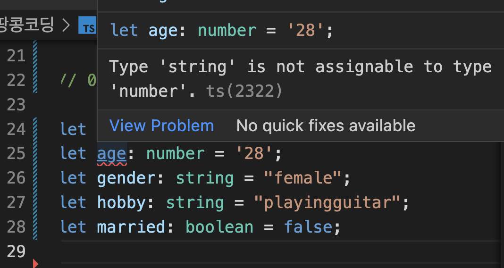

# **타입 명시 (Type Anoations)**

#### **📌 타입 명시(Type Anoations)란?**

    변수를 선언할 때, 변수 값의 타입을 명시함으로써 
    변수 값의 데이터 타입을 지정 !

**🔑 다음과 같은 Syntax(문법)을 가진다**

```js
let myname : string = "yelim"
```


#### **일반적으로 다음과 같이 타입 명시가 가능하다**

```js

let myname: string = "yelim";
let age: number = 28;
let gender: string = "female";
let hobby: string = "playingguitar";
let married: boolean = false;

```

- 만약 숫자 타입으로 명시된 age를 string 값으로 바꾸면 다음과 같은 에러 메세지가 발생된다.




#### **그럼 함수의 타입명시는 어떻게 해야할까 ?**

🐜 다음과 같이 함수의 파라미터에도 타입지정이 가능하다.

```js
function aboutyelim(age: number) {}
```

🐜 또한 함수의 return 값에도 타입을 명시할 수 있다.

❗️ 만약 아무 값도 반환하지 않는다면 ? void로 명시
❗️ `any` 타입으로는 왠만하면 명시하지 x (typescript을 사용하는 의미가 없다..)

```js
function aboutyelim(age: number): void {}
```

🐜 return 값을 object로 설정한다면 ?

```js
function aboutyelim(age: number): object {
  return { myname, age, gender, hobby, married };
} // 객체지정후 null로 return 했다. 틀린문법은 아니지만 구체적인 타입명시가 아니므로 이것도 사실 좋은 테스트 케이스가 아니다.
```

🐜 return 되는 객체의 구조를 타입으로 지정한다면 ?

```js

function aboutyelim(age: number): {
    myname: string;
    age: number;
    gender: string;
    hobby: string;
    married: boolean;
} {
    return { myname, age, gender, hobby, married }
}

```
- 이런식으로도 함수에 타입을 명시할 수 있지만 좋은 선례가 아니다.(interface를 사용하여 좀더 가독성 있는 코드를 완성해보자! )
