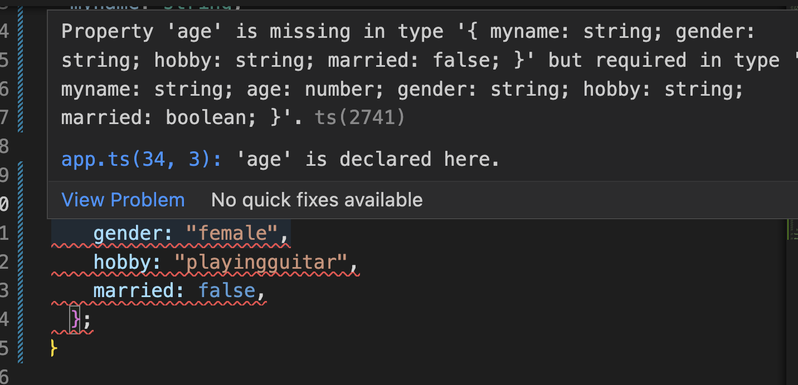

# **타입으로 사용되는 인터페이스 (Interface)**

#### **🧠 저번장애서 보았던 타입이 명시된 함수 구조** 

```js
function aboutyelim(age: number): {
  myname: string;
  age: number;
  gender: string;
  hobby: string;
  married: boolean;
} {
  return {
    myname: "yelim",
    age: 28,
    gender: "female",
    hobby: "playingguitar",
    married: false,
  };
}
```

📌 interface 구조로 바꾸어 주자 !

    - interface 의 이름은 대문자로 시작해야한다.
    🔑 다른 언어들은 interface의 'i' 를 따서 'I'로 시작하는 네이밍컨벤션을 따르지만 typescript에서는 'I'를 붙이지 않는것을 원칙으로 하고있다.
    

```js

interface Aboutme {
  myname: string;
  age: number;
  gender: string;
  hobby: string;
  married: boolean;
}

function aboutyelim(age: number): Aboutme {
  return {
    myname: "yelim",
    age: 28,
    gender: "female",
    hobby: "playingguitar",
    married: false,
  };
}

```

#### **Optional 기호 물음표(?)를 사용하여 missing error 해결하기**

**만약 return 값중 age 프로퍼티 값을 제거한다면 ?**

📌 다음과 같은 missing error가 발생된다.



📌 다음과 같은 선택적 프로퍼티(optional property) 사용으로 해결 할수 있다.

```js

interface Aboutme {
  myname: string;
  age?: number; // 이와같은 방법으로 있어도, 없어도 되는 값으로 만들어 버리자
  gender: string;
  hobby: string;
  married: boolean;
}

function aboutyelim(age: number): Aboutme {
  return {
    myname: "yelim",
    gender: "female",
    hobby: "playingguitar",
    married: false,
  };
}


```

#### **interface의 최대의 강점 -> 코드의 재사용성**

```ts

interface Aboutme {
  myname: string;
  age: number;
  gender: string;
  hobby: string;
  married: boolean;
}

function aboutyelim(age: number): Aboutme {
  return {
    myname: "yelim",
    age: 28,
    gender: "female",
    hobby: "playingguitar",
    married: false,
  };
}

// 📌 정보도 객체로 만들어 인자값으로 보내준다
const who = {
    myname: "yelim",
    age: 28,
    gender: "female",
    hobby: "playingguitar",
    married: false,
  };
  
  // 📌 파라미터 human의 타입을 Aboutme 로 지정함으로써 지정된 interface의 재사용이 가능하다.
function aboutyelim2(human: Aboutme): void {} 

aboutyelim2(who);

```


#### **메소드도 interface 안에서 정의할 수 있다.**

**📌 메소드란 ?**

    객체 내에서 정의된 함수를 말한다.

* 다음과 같이 객체 내에 메소드를 추가할 수 있다.

```ts
interface Aboutme {
  myname: string;
  age: number;
  gender: string;
  hobby: string;
  married: boolean;
  thisismethod?(comment: string): string;
  //   thisismethod? : (comment : string) => string;
}
```

      thisismethod(comment: string): string;
      thisismethod : (comment : string) => string;
      

👉🏻 이 두개는 표현방법이 다르지만 같은 메서드 이다.(혹시 모르는 오류범위로 optional 기호를 사용하였다.)


#### **interface에서 쓰일 수 있는 Read Only 속성**

    📌 Read Only 프로퍼티는 읽기 전용 프로퍼티로 객체 생성시 할당된 프로퍼티의 값은 바꿀수 없다 !

```ts
interface Aboutme {
  readonly myname: string; //📌 다음과 같이 myname 불변적인 값을 원하는 프로퍼티 앞에 readonly를 붙여주자 !
  age: number;
  gender: string;
  hobby: string;
  married: boolean;
}
```

**📚 마지막으로..**

    - interface 는 코드가 렌더링 될때 아무런 영향력이 없다.(즉, 컴파일된 js 파일에서는 보이지 x )

    - interface 는 작성중인 코드에 대한 더 많은 정보를 자바스크립트에게 전달하기 위해서 존재하는것 !


**_🧠 타입스크립트에게 더 많은 정보를 제공할 수록 타입스크립트는 더 많은 도움을 줄수 있다(더 많은 오류를 찾을 수 있기 때문)_** 


**_(참고영상) 땅콩코딩 : https://www.youtube.com/watch?v=jlzvXcDGZUU_**