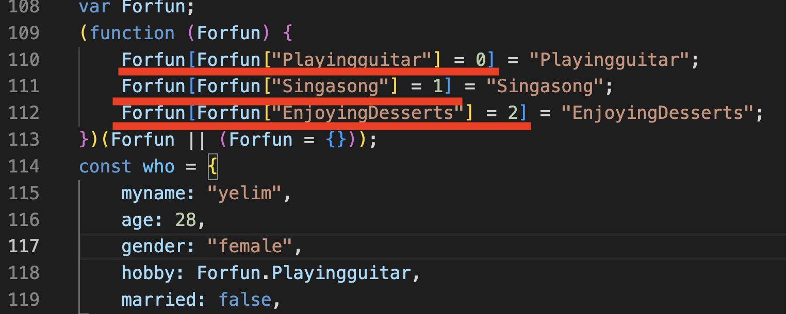
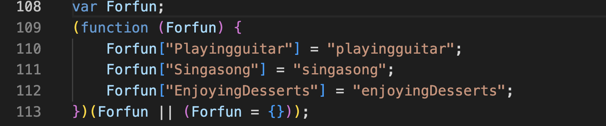

# **열거형(Enum) 과 리터럴 타입**

#### **Enum(열거형) 이란 ?**

    연관된 아이템들을 함께 묶어서 표현 할 수 있는 수단

**예시비교**

- enum을 사용해보자 !

```js
//📌 1. 다음과 같이 상단에 enum을 작성해보자
enum Forfun {
  Playingguitar,
  Singasong,
  EnjoyingDesserts,
}

const who = {
  myname: "yelim",
  age: 28,
  gender: "female",
  hobby: Forfun.Playingguitar,//📌 3. string value 의 값을 enum 내 properties 로 바꿔주자
  married: false,
};
interface Aboutme {
  readonly myname: string;
  age: number;
  gender: string;
  hobby: Forfun; //📌 2. gender 타입을 enum으로 설정해 놓자
  married: boolean;
}

function aboutyelim(age: number): Aboutme {
  return who;
}

function aboutyelim2(aboutme: Aboutme): void {}

aboutyelim2(who);
```

**이전의 interface와 비교**

👉🏻 컴파일된 js 파일을 확인해보자 !

    compile 식 코드가 사라지는 interface와는 달리, enum은 코드가 구현되어 js파일에 다음과 같이 나타난다.



👉🏻 무엇을 의미하나 ?

    이것은 enum이 런타임에 존재하는 실제 객체라는 사실을 보여준다 !

👉🏻 가장 큰 차이로는 숫자 열거형(Numeric Enum)

     다음과 같이 enum 속에 선언된 값의 순서에 따라 0부터 시작해서 순차적으로 숫자값이 할당됨을 의미한다.

```js
enum Forfun {
  Playingguitar = 0,
  Singasong = 1,
  EnjoyingDesserts = 2,
}
```

❗️ 숫자 열거형(Numeric Enum)이 아닌 문자형 열거형(Stirng Enum)을 사용하고 싶다면 ?

- 그냥 간단하게 string 값을 선언해 주면 된다.

```js
enum Forfun {
  Playingguitar = 'playingguitar',
  Singasong = 'singasong',
  EnjoyingDesserts = 'enjoyingDesserts',
}
```

- 다음과 같은 컴파일된 js 파일을 확인 할 수 있다 !



    string enum은 numeric enum 처럼 자동 증가하는 기능은 없지만, 조금 더 읽기 쉬운 값을 할당 할수 있는 장점이 있다.

- 또 다른 property 값을 제한하는 방법

#### **리터럴 타입 이란 ?**

- enum 보다 훨씬 심플한 타입이다.
- 일반적으로 파이프(|)를 사용하여 유니온 타입을 함께 사용한다.

```js
interface Aboutme {
  readonly myname: string;
  age: number;
  gender: string;
  hobby: 'playingguitar' | 'singasong' | 'enjoyingDesserts'; //📌 1. enum type인 Forfun을 지워주고 문자열 + 파이프(string | )로 넣어준다.
  married: boolean;
}

function aboutyelim(age: number): Aboutme {
  return {
    myname: "yelim",
    age: 28,
    gender: "female",
    hobby: 'singasong',//📌 2. Forfun.Playingguitar 를 삭제하고, hobby의 string값을 넣어준다
    married: false,
  };
}

```

**_(참고영상) 땅콩코딩 : https://www.youtube.com/watch?v=-TlpYcmHvb8_**
