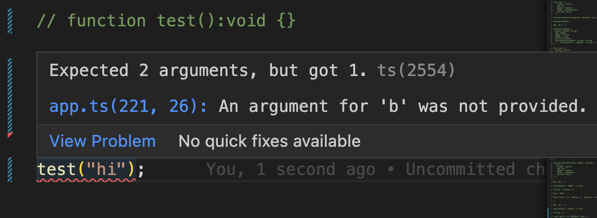

# **함수의 타입명시**

📌 typescript에서 함수를 작성하는 방법에 대해 알아보자

    1. 함수의 반환(return) 타입을 지정하는 방법
    2. 선택적 매개변수(parameter)를 전달하는 방법
    3. 매개변수의 디폴트 값을 주는 방법

### **1. 함수의 반환(return) 타입을 지정하는 방법**

**syntax**

```
function 함수이름(매개변수1, 매개변수2) : 함수의 반환타입 {

}
```

**❗️ void 타입**

```js
function test(): void {}
```

👉🏻 아무것도 반환 하지 않는 함수의 반환 값으로만 사용될 수 있는 타입

**string 타입**

```js
function test(): string {
  return "a";
}
```

👉🏻 string 값으로 return

**string[] 타입**

```js
function test(): string[] {
  return ["a", "b"];
}
```

👉🏻 string 배열 값으로 return

**🔑 number와 boolean등 나머지 타입에도 동일하게 적용된다**

### **2. 선택적 매개변수(parameter)를 전달하는 방법**

- 다음과 같은 함수가 있다고 가정해보자

```js
function test(a: string, b: string): void {
  console.log(a, b);
}

test("hi", "yelim");
```

📌 만약 여기서 인자(argment)값을 하나만 전달한다고 하면 error가 발생할 것이다.



**❓ 왜 그런것일까 ?**

    타입스크립트는 함수에 정의된 모든 매개변수가 함수에 필요하다고 가정하기 때문이다.
    -> 함수 호출시 타입스크립트 컴파일러는 parameter 와 argument를 비교 검사하게 된다.

**🧠 어떻게 해결할수 있을까?**

    이전에 타입명시와 같이 있어도 되고 없어도 되는 값 !
    선택적 매개변수(optional parameter)를 사용하여 해결해보자

```js
function test(a: string, b?: string): void {
  console.log(a, b);
}

test("hi");
```

❗️ 여기서 주의사항

    만약 전달되는 매개변수가 여러개이고,
    몇가지만 선택적 매개변수인 경우 ??

👉🏻 선택적 매개변수들은 반드시 ! 필수 매개변수 뒤에 위치해야한다 !

```js
function test(a: string, b?: string, c?: string, d?: string, e?: string): void {
  console.log(a, b, c, d, e);
}

test("hi");
```

- 컴파일 시켜서 console로 살펴보게 되면 다음과 같이 할당되지 않은 argument값은 parameter로 전달되지 않아 undefined로 표시된다.

```
hi undefined
```

👉🏻 이럴때 할당된 기본값을 사용할수 있다 ? 바로

### **3.기본 매개 변수(Default Parameter)**

```js
function test(a: string, b = "yelim"): void {
  console.log(a, b);
}

test("hi");
```

📌 그냥 parmeter 뒤에 값을 설정해주면 된다.
📌 매개변수뒤에 값을 설정해 주면된다.(선택적표기(?), 타입 생략가능 -> 타입추론으로 커버가능)

👉🏻 다음과 같은 코드에서 무엇이 출력될지 생각해보자 !

```js
function test(a = "hello", b = "yelim"): void {
  console.log(a, b);
}

test();
test("hi");
test("hi", "there");

// 1. 📌 hello yelim
// 2. 📌 hi yelim
// 3. 📌 hi there
```

**_(참고영상) 땅콩코딩 : https://www.youtube.com/watch?v=SVtqhpboxGw&t=2s_**
