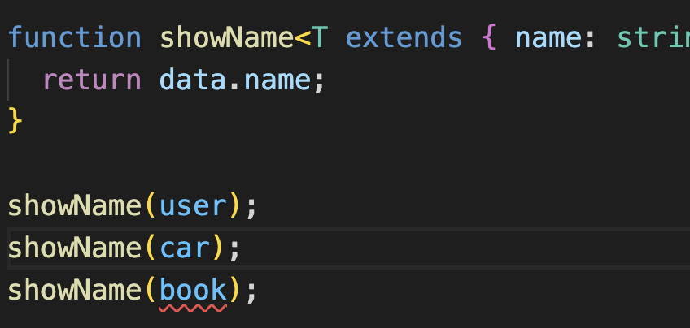

### **Generics**

**Generics가 무엇일까 ?**

    general 이라는 단어를 아는가? 
    이것은 일반적인, 보편적인 이라는 뜻이다 '-ic'라는 접미사를 통해 일반적인 것들과 관련된(작용을 하는) 뜻으로 해석할 수 있다.


**_👉🏻 한마디로 말해서 프로그래밍용 언어로 생각해 볼때_**

    데이터 형식에 의존하지 않고, 하나의 값이 여러 다른 데이터 타입을 가질수 있도록 하는 방법이다.


👉🏻 우선 다음과 같은 예제가 있다

```js
function order(arr: number[] | string[] | boolean[] | object[]): number { //📌 이러한 방식으로 변수가 하나씩 선언될때마다 데이터 타입을 지정해 줘야한다.
  return SafeArray.length;
}

const arr1 = [1, 2, 3];
order(arr1);

const arr2 = ["a", "b", "c"];
order(arr2);

const arr3 = [true, false, true];
order(arr3);

const arr4 = [{}, {}, { name: "yelim" }];
order(arr4);

```

**❓ 일일이 데이터 타입을 쓰지 않고 간단하게 지정 할 수 있는 방법**

- Generics을 사용 -> <> 안에 type parameter를 지정하자


```js
function order<T>(arr : T[]): number { //📌 보통 일반적으로 type의 약어인 'T'를 사용한다. 상관 x
  return SafeArray.length;
}

const arr1 = [1, 2, 3];
order<number>(arr1); // 📌 이런식으로 <> 안에 타입을 지정해 주어도 되지만(특정타입으로 강조하고 싶을때만 사용),

const arr2 = ["a", "b", "c"];
order<string>(arr2);

const arr3 = [true, false, true];
order(arr3); // 📌 지정하지 않아도 충분히 타입추론이 가능하다

const arr4 = [{}, {}, { name: "yelim" }];
order(arr4);

```

- 일반적으로 많이 쓰이는 타입으로는 아래와 같다 !

|||
|-|-|
|`<T>`|type|
|`<E>`|Element|
|`<K>`|Key|
|`<V>`|Value|
|`<N>`|Number|


👉🏻 또 다른 예제를 살펴보자, 이런 경우 generics를 활용할수 있다.

```js

interface Mobile {
  name: string;
  price: number;
  option: any;
}

```

👇🏻

```js

interface Mobile<T> { // 📌 <> 안에 타입파라미터를 지정해 주었다
  name: string;
  price: number;
  option: T; 
}

const m1: Mobile<{ color: string; GB: number; coupon: boolean }> = { // 📌 generic으로 지정되어있는 option 객체내의 값을 타입파라미터로 보내준다.
  name: "iphone11pro",
  price: 1000,
  option: {
    color: "green",
    GB: 256,
    coupon: true,
  },
};

const m2: Mobile<string> = { // 📌 generic으로 지정되어있는 option 값을 타입파라미터로 보내준다.
  name: "iphone11pro",
  price: 1000,
  option: "good",
};

```

👉🏻 좀더 구체적인 예시

- 이러한 구조가 있다고 생각해보자

```js
interface User {
  name: string;
  age: number;
}

interface Car {
  name: string;
  color: string;
}

interface Book {
  price: number;
}

const user: User = { name: "a", age: 10 };
const car: Car = { name: "bmw", color: "blue" };
const book: Book = { price: 3000 };

function showName(data): string { // 📌 지금 data 파라미터는 받아오는 인자값에 name이 없으므로 error를 나타내게 되며, any 타입으로 임의 지정되어있다.
  return data.name;
}

showName(user)
showName(car)
showName(book)
```
- 다음과 같은 showName() 함수에 `<T>`를 적용해보자

```js
function showName<T extends { name: string }>(data: T): string { // 📌 이런식으로 타입 파라미터를 확장시켜 명시되는 타입을 구체적으로 표기할 수 있다.
  return data.name;
}
```
- 이런식으로 작성하면 error 가 name 프로퍼티가 없는 인자값 book 으로 옮겨가게 된다.



🔑 오류를 없애고 싶으면 name 프로퍼티를 Book 타입에 설정해주고, 값을 할당해주면 된다.

```js
interface Book {
  price: number;
  name: string; 
}

const user: User = { name: "a", age: 10 };
const car: Car = { name: "bmw", color: "blue" };
const book: Book = { price: 3000, name: 'diary' };
```

> ❗️ 컴파일시 generic 타입은 존재하지 않는다


**_Generic은 위에서 말했듯이 일반적인 타입이라고 지정된 약속이며, 어떠한 런타임내에 존재하는 객체가 아니다._**


📚 참고) 

https://www.typescriptlang.org/docs/handbook/2/generics.html
https://st-lab.tistory.com/153
https://www.youtube.com/watch?v=pReXmUBjU3E&list=PLZKTXPmaJk8KhKQ_BILr1JKCJbR0EGlx0&index=7

