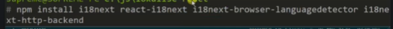

# i18next setting

  

```
yarn add i18next && react-i18next &&  i18next-browser-languagedetector && i18next-http-backend
```

## package 별 기능

- i18next : 주된 패키지
- react-i18next : react에서 지원되는 라이브러리 세팅
- i18next-browser-languagedetector : 브라우저내 언어 자동 탐색
- i18next-http-backend : 파일을 동기식으로 로드하기위한 http

## 기본 세팅 과정

1. 최상단에 locales 폴더 생성후 국가별 폴더를 생성

2. 초기세팅 과정

   - i18n.ts 파일 생성

   ```ts
   import i18n from "i18next";
   import { initReactI18next } from "react-i18next";
   import detector from "i18next-browser-languagedetector";
   import backend from "i18next-http-backend";
   import ko from "./ko/translation.json";
   import jp from "./jp/translation.json";

   /** react-i18 next versions 11.11.0 보다 높은 경우 세팅 해줌  */
   declare module "react-i18next" {
     interface Options {
       defaultNS: "ko";
       resources: {
         ko: typeof ko;
         jp: typeof jp;
       };
     }
   }

   i18n
     .use(backend)
     .use(detector)
     .use(initReactI18next)
     .init({
       fallbackLng: "ko",
       lng: "ko",
       ns: ["translation"],
       resources: {
         ko: { translation: ko },
         jp: { translation: jp },
       } as const,
     });

   export default i18n;
   ```

   - 최상단 index.tsx 파일에서 다음과 같이 감싸준다.

   ```ts
   <I18nextProvider i18n={i18n}>
     <App />
   </I18nextProvider>
   ```

3. ui 구성
   MyInfoPopOver 컴포넌트 에서
   사용자 아이콘 클릭시 나오는 언어 선택 select box 그리기
