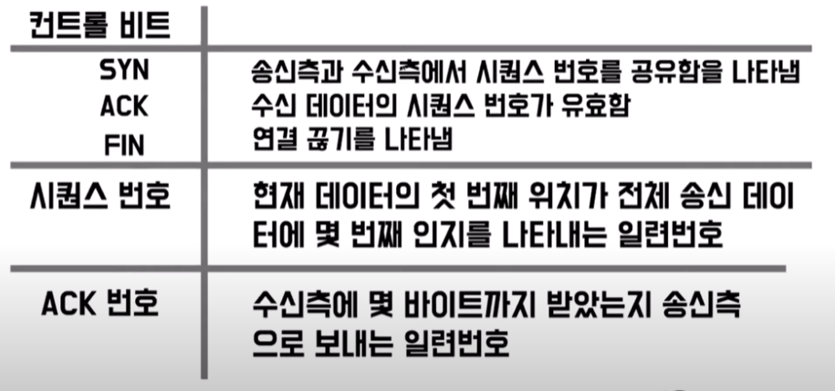
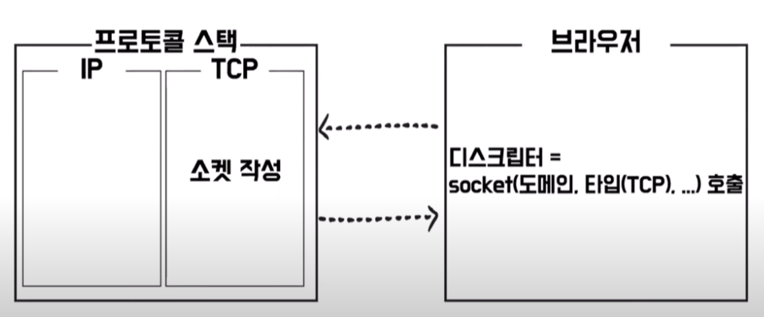
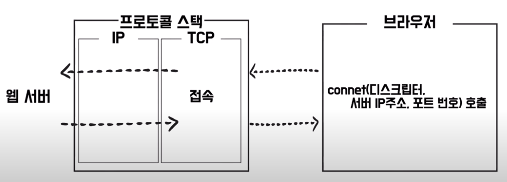

# TCP/IP

## 01. TCP/IP 모델

- application layer (http, 브라우저)
- Transport layer (TCP/UDP)
- Internet layer (IP)
- Network Access layer (인터넷)

### 02. TCP 동작과정

- 소켓 생성 => 3way Handshake(연결) => 데이터 송신, 수신 => 4way Handshake(연결끊기)

#### TCP 헤더

#### 01) 소켓 생성

- 브라우저에서 소켓을 호출(도메인과 사용할 타입인 TCP를 설정해서 호출하게됨) => 프로토콜 스택(OS의 네트워크 제어용 소프트웨어)이 받아서 소켓 작성 => 디스크립터(소켓의 번호표) 반환

#### 02) 3way Handshake

- 브라우저에서 디스크립터, IP 주소, 포트 번호를 넣어서 호출 => 요청을 받은 프로토콜 스택이 웹서버로 요청을 보냄

- 좀 더 디테일하게 보자면

#### 03) 데이터 송신, 수신

#### 04) 4way Handshake
