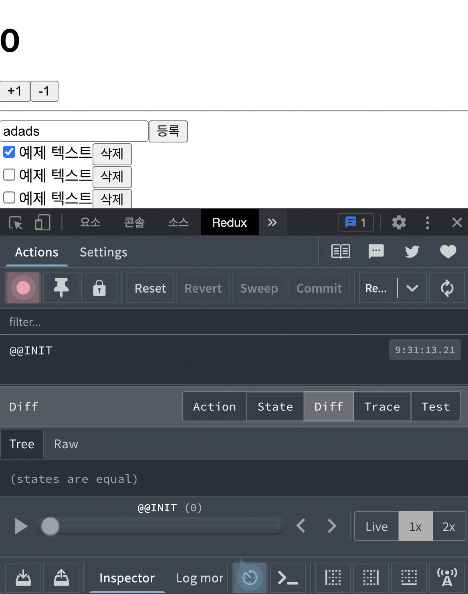

# 17장 리덕스를 사용하여 리액트 애플리케이션 상태 관리하기
- 프로젝트 규모가 커짐에 따라 상태관리 필수 ! 
- 리덕스 사용시 유지보수, 컴포넌트 업데이트시 매우 유용
- 리액트에서 리덕스 사용시 react-redux 라이브러리에서 제공하는 유틸함수(connect)와 컴포넌트(Provider)을 사용하여 처리

- 실습진행
> 프로젝트 준비 - 프레젠테이셔널 컴포넌트 작성 - 리덕스 관련 코드 작성 - 컨테이너 컴포넌트 작성 - 더 편하게 사용하는 방법 알아보기 - connect 대신 Hooks 사용하기

## 17.1 작업 환경 설정
- 새로운 리액트 프로젝트 생성
```
npm create react-app react-redux-tutorial
```
- 리덕스와 react-redux 라이브러리 설치
```
cd react-redux-tutorial
npm add redux react-redux
```

## 17.2 UI 준비하기
- 프레젠테이셔널 컴포넌트 / 컨테이너 컴포넌트 분리 (가장많이 사용하는 패턴)
    - 프레젠테이셔널 컴포넌트 : 상태관리가 이루어지지 않고, props를 받아와서 화면에 UI를 보여주기만하는 컴포넌트
    - 컨테이너 컴포넌트 : 리덕스와 연동되어있는 컴포넌트, 리덕스로부터 상태를 받아오고, 리덕스 스토어에 액션을 디스패치함

- 이러한 패턴이 필수 사항은 아님 ! but! 사용시 코드의 재사용성도 높아짐
- src/components -> UI 관련된 프레젠테이셔널 컴포넌트 저장
- src/containers -> 리덕스와 연동된 컨테이너 컴포넌트 저장

### 17.2.1 카운터 컴포넌트 만들기

- components/Counter.js 생성
```js
import React from 'react';


const Counter = ({ number, onIncrease, onDecrease }) => {
  return (
    <div>
      <h1>{number}</h1>
      <div>
        <button onClick={onIncrease}>+1</button>
        <button onClick={onDecrease}>-1</button>
      </div>
    </div>
  );
};


export default Counter;
```
- App.js 랜더링
```js
import React from 'react';
import Counter from './components/Counter';

const App = () => {
  return (
    <div>
      <Counter number={0} />
    </div>
  );
};

export default App;
```
### 17.2.2 할 일 목록 컴포넌트 만들기
- components/Todos.js 생성
```js
import React from 'react';


const TodoItem = ({ todo, onToggle, onRemove }) => {
  return (
    <div>
      <input type="checkbox" />
      <span>예제 텍스트</span>
      <button>삭제</button>
    </div>
  );
};


const Todos = ({
  input, // 인풋에 입력되는 텍스트
  todos, // 할 일 목록이 들어 있는 객체
  onChangeInput,
  onInsert,
  onToggle,
  onRemove,
}) => {
  const onSubmit = e => {
    e.preventDefault();
  };
  return (
    <div>
      <form onSubmit={onSubmit}>
        <input />
        <button type="submit">등록</button>
      </form>
      <div>
        <TodoItem />
        <TodoItem />
        <TodoItem />
        <TodoItem />
        <TodoItem />
      </div>
    </div>
  );
};


export default Todos;
```
- App.js 랜더링
```js
import React from 'react';
import Counter from './components/Counter';
import Todos from './components/Todos';

const App = () => {
  return (
    <div>
      <Counter number={0} />
      <hr />
      <Todos />
    </div>
  );
};

export default App;
```

## 17.3 리덕스 관련 코드 작성하기
- 리덕스 사용시..작성해야할 것
    - 액션 타입 
    - 액션 생성 함수
    - 리듀서 코드

- Ducks 패턴 : 액션 타입, 액션 생성 함수, 리듀서 함수를 기능별로 파일 하나에 몰아서 다 작성하는 방식

### 17.3.1 counter 모듈 작성하기
- 모듈 : Ducks 패턴을 사용하여 액션 타입, 액션 생성 함수, 리듀서를 작성한 코드

#### 17.3.1.1 액션 타입 정의하기
- modules/counter.js 생성
```js
const INCREASE = 'counter/INCREASE';
const DECREASE = 'counter/DECREASE';
```
- 첫번째 할일 : 액션 타입 정의(액션 타입은 대문자로 정의, 문자열 내용은 '모듈 이름/액션 이름'과 같은 형태로 작성 -> 충돌방지)

#### 17.3.1.2 액션 생성 함수 만들기
- modules/counter.js 수정
```js
const INCREASE = 'counter/INCREASE';
const DECREASE = 'counter/DECREASE';

export const increase = () => ({ type: INCREASE });
export const decrease = () => ({ type: DECREASE });
```

#### 17.3.1.3 초기 상태 및 리듀서 함수 만들기
- modules/counter.js 수정
```js
const INCREASE = 'counter/INCREASE';
const DECREASE = 'counter/DECREASE';

export const increase = () => ({ type: INCREASE });
export const decrease = () => ({ type: DECREASE });

const initialState = {
  number: 0
};


function counter(state = initialState, action) {
  switch (action.type) {
    case INCREASE:
      return {
        number: state.number + 1
      };
    case DECREASE:
      return {
        number: state.number - 1
      };
    default:
      return state;
  }
}


export default counter;
```
- 알아두자 !
> export는 여러 개를 내보낼 수 있지만 export default는 단 한 개만 내보낼 수 있다는 것

- 한꺼번에 불러오고 싶을 때
```js
import counter, { increase, decrease } from './counter';
```
### 17.3.2 todos 모듈 만들기
#### 17.3.2.1 액션 타입 정의하기
- modules/todos.js 생성(액션타입정의)
```js
const CHANGE_INPUT = 'todos/CHANGE_INPUT'; // 인풋 값을 변경함
const INSERT = 'todos/INSERT'; // 새로운 todo를 등록함
const TOGGLE = 'todos/TOGGLE'; // todo를 체크/체크 해제함
const REMOVE = 'todos/REMOVE'; // todo를 제거함
```
#### 17.3.2.2 액션 생성 함수 만들기
- modules/todos.js 수정
```js
const CHANGE_INPUT = 'todos/CHANGE_INPUT'; // 인풋 값을 변경함
const INSERT = 'todos/INSERT'; // 새로운 todo를 등록함
const TOGGLE = 'todos/TOGGLE'; // todo를 체크/체크 해제함
const REMOVE = 'todos/REMOVE'; // todo를 제거함


export const changeInput = input => ({
    type: CHANGE_INPUT,
    input
  });
  
  let id = 3; // insert가 호출될 때마다 1씩 더해집니다.
  export const insert = text => ({
    type: INSERT,
    todo: {
      id: id++,
      text,
      done: false
    }
  });
  
  export const toggle = id => ({
    type: TOGGLE,
    id
  });
  
  export const remove = id => ({
    type: REMOVE,
    id
  });
```
#### 17.3.2.3 초기 상태 및 리듀서 함수 만들기
- 객체에 한개이상의 값이 들어감 -> 불변성을 유지해줘야함 -> 까다로움
- spread 연산자(...), 배열내장함수사용
- modules/todos.js 수정
```js
const CHANGE_INPUT = 'todos/CHANGE_INPUT'; // 인풋 값을 변경함
const INSERT = 'todos/INSERT'; // 새로운 todo를 등록함
const TOGGLE = 'todos/TOGGLE'; // todo를 체크/체크 해제함
const REMOVE = 'todos/REMOVE'; // todo를 제거함


export const changeInput = input => ({
    type: CHANGE_INPUT,
    input
  });
  
  let id = 3; // insert가 호출될 때마다 1씩 더해집니다.
  export const insert = text => ({
    type: INSERT,
    todo: {
      id: id++,
      text,
      done: false
    }
  });
  
  export const toggle = id => ({
    type: TOGGLE,
    id
  });
  
  export const remove = id => ({
    type: REMOVE,
    id
  });

// ↓ 추가할 부분
  const initialState = {
    input: '',
    todos: [
      {
        id: 1,
        text: '리덕스 기초 배우기',
        done: true
      },
      {
        id: 2,
        text: '리액트와 리덕스 사용하기',
        done: false
      }
    ]
  };
  
  
  function todos(state = initialState, action) {
    switch (action.type) {
      case CHANGE_INPUT:
        return {
          ...state,
          input: action.input
        };
      case INSERT:
        return {
          ...state,
          todos: state.todos.concat(action.todo)
        };
      case TOGGLE:
        return {
          ...state,
          todos: state.todos.map(todo =>
            todo.id === action.id ? { ...todo, done: !todo.done } : todo
          )
        };
      case REMOVE:
        return {
          ...state,
          todos: state.todos.filter(todo => todo.id !== action.id)
        };
      default:
        return state;
    }
  }
  
  
  
  export default todos;
```
### 17.3.3 루트 리듀서 만들기
- createStore 함수를 사용하여 스토어를 만들 때는 리듀서를 하나만 사용해야 함 -> 하나로 합쳐주자 -> combineReducers라는 유틸 함수 사용
- modules/index.js 생성
```js
import { combineReducers } from 'redux';
import counter from './counter';
import todos from './todos';


const rootReducer = combineReducers({
  counter,
  todos,
});


export default rootReducer;
```
- index.js로 설정시 나중에 import 시킬때 디렉터리 이름까지만 입력해도 됨
```js
import rootReducer from './modules';
```

## 17.4 리액트 애플리케이션에 리덕스 적용하기
- src/index.js -> 리덕스 적용

### 17.4.1 스토어 만들기
### 17.4.2 Provider 컴포넌트를 사용하여 프로젝트에 리덕스 적용하기
- src/index.js 수정
```js
import React from 'react';
import ReactDOM from 'react-dom';
import { createStore } from 'redux';//
import { Provider } from 'react-redux';//
import './index.css';
import App from './App';
import reportWebVitals from './reportWebVitals';
import rootReducer from './modules'//

const store = createStore(rootReducer);//

ReactDOM.render(
  <Provider store={store}>//
    <App />
  </Provider>,//
  document.getElementById('root')
);


reportWebVitals();
```
### 17.4.3 Redux DevTools의 설치 및 적용
- Redux DevTools : 리덕스 개발자 도구
- 크롬 웹 스토어(https://chrome.google.com/webstore/) 에서 Redux DevTools 검색후 설치
- 패키지를 설치 및 적용시 -> 코드 훨씬 깔끔

- redux-devtools-extension 설치
```
npm add redux-devtools-extension
```
- src/index.js 적용
```js
import React from 'react';
import ReactDOM from 'react-dom';
import { createStore } from 'redux';
import { Provider } from 'react-redux';
import { composeWithDevTools } from 'redux-devtools-extension';//
import './index.css';
import App from './App';
import reportWebVitals from './reportWebVitals';
import rootReducer from './modules'

const store = createStore(rootReducer, composeWithDevTools());//

ReactDOM.render(
  <Provider store={store}>
    <App />
  </Provider>,
  document.getElementById('root')
);


reportWebVitals();
```
- 개발자도구에 Redux 카테고리가 나와야함, state 눌러서 내부상태도 봐야함



## 17.5 컨테이너 컴포넌트 만들기
- 리덕스 스토어에 접근하여 원하는 상태를 받아오고, 액션도 디스패치 해주자
- 컨테이너 컴포넌트 : 리덕스 스토어와 연동된 컴포넌트

### 17.5.1 CounterContainer 만들기
- containers/CounterContainer.js 생성
```js
import React from 'react';
import Counter from '../components/Counter';

const CounterContainer = () => {
  return <Counter />;
};

export default CounterContainer;
```
- 컴포넌트 리덕스와 연동시 -> react-redux에서 제공하는 connect 함수를 사용해야 함
    - mapStateToProps : 리덕스 스토어 안의 상태를 컴포넌트의 props로 넘겨주기 위해 설정하는 함수
    - mapDispatchToProps : 액션 생성 함수를 컴포넌트의 props로 넘겨주기 위해 사용하는 함수
```js
connect(mapStateToProps, mapDispatchToProps)(연동할 컴포넌트)
```

- connect 함수를 호출후 또 다른 함수 반환 -> 반환된 함수에 컴포넌트를 파라미터로 넣어 주면 리덕스와 연동된 컴포넌트가 만들어짐

```js
const makeContainer = connect(mapStateToProps, mapDispatchToProps)
makeContainer(타깃 컴포넌트)
```
- containers/CounterContainer.js 수정
```js
import React from 'react';
import { connect } from 'react-redux';
import Counter from '../components/Counter';


const CounterContainer = ({ number, increase, decrease }) => {
  return (
    <Counter number={number} onIncrease={increase} onDecrease={decrease} />
  );
};


const mapStateToProps = state => ({
  number: state.counter.number,
});
const mapDispatchToProps = dispatch => ({
  // 임시 함수
  increase: () => {
    console.log('increase');
  },
  decrease: () => {
    console.log('decrease');
  },
});
export default connect(
  mapStateToProps,
  mapDispatchToProps,
)(CounterContainer);
```
- App에서 Counter를 CounterContainer로 교체
- App.js 수정
```js
import React from 'react';
import Todos from './components/Todos';
import CounterContainer from './containers/CounterContainer';

const App = () => {
  return (
    <div>
      <CounterContainer />
      <hr />
      <Todos />
    </div>
  );
};

export default App;
```
- +1, -1 할때) 콘솔창에  increase, decrease 찍히는지 확인
- 화면 출력을 위해 CounterContainer.js 수정
```js
import React from 'react';
import { connect } from 'react-redux';
import Counter from '../components/Counter';
import { increase, decrease } from '../modules/counter'


const CounterContainer = ({ number, increase, decrease }) => {
  return (
    <Counter number={number} onIncrease={increase} onDecrease={decrease} />
  );
};


const mapStateToProps = state => ({
  number: state.counter.number,
});
const mapDispatchToProps = dispatch => ({
  // 임시 함수
  increase: () => {
    dispatch(increase());
  },
  decrease: () => {
    dispatch(decrease());
  },
});
export default connect(
  mapStateToProps,
  mapDispatchToProps,
)(CounterContainer);
```
- bindActionCreators 유틸 함수를 사용하는 것보다 두 번째 파라미터를 객체 형태로 넣어 주는것이 더 편한방법임
```js
import React from 'react';
import { connect } from 'react-redux';
import Counter from '../components/Counter';
import { increase, decrease } from '../modules/counter';

const CounterContainer = ({ number, increase, decrease }) => {
  return (
    <Counter number={number} onIncrease={increase} onDecrease={decrease} />
  );
};

export default connect(
  state => ({
    number: state.counter.number,
  }),
  {
    increase,
    decrease,
  },
)(CounterContainer);
```
### 17.5.2 TodosContainer 만들기
- containers/TodosContainer.js 생성
```js
import React from 'react';
import { connect } from 'react-redux';
import { changeInput, insert, toggle, remove } from '../modules/todos';
import Todos from '../components/Todos';


const TodosContainer = ({
  input,
  todos,
  changeInput,
  insert,
  toggle,
  remove,
}) => {
  return (
    <Todos
      input={input}
      todos={todos}
      onChangeInput={changeInput}
      onInsert={insert}
      onToggle={toggle}
      onRemove={remove}
    />
  );
};


export default connect(
  // 비구조화 할당을 통해 todos를 분리하여
  // state.todos.input 대신 todos.input을 사용
  ({ todos }) => ({
    input: todos.input,
    todos: todos.todos,
  }),
  {
    changeInput,
    insert,
    toggle,
    remove,
  },
)(TodosContainer);
```
- App.js 수정
```js
import React from 'react';
import CounterContainer from './containers/CounterContainer';
import TodosContainer from './containers/TodosContainer';

const App = () => {
  return (
    <div>
      <CounterContainer />
      <hr />
      <TodosContainer />
    </div>
  );
};

export default App;
```
- components/Todos.js 수정 (props 사용하도록)
```js
import React from 'react';


const TodoItem = ({ todo, onToggle, onRemove }) => {
  return (
    <div>
      <input
        type="checkbox"
        onClick={() => onToggle(todo.id)}
        checked={todo.done}
        readOnly={true}
      />
      <span style={{ textDecoration: todo.done ? 'line-through' : 'none' }}>
        {todo.text}
      </span>
      <button onClick={() => onRemove(todo.id)}>삭제</button>
    </div>
  );
};


const Todos = ({
  input, // 인풋에 입력되는 텍스트
  todos, // 할 일 목록이 들어 있는 객체
  onChangeInput,
  onInsert,
  onToggle,
  onRemove,
}) => {
  const onSubmit = e => {
    e.preventDefault();
    onInsert(input);
    onChangeInput(""); // 등록 후 인풋 초기화
  };
  const onChange = e => onChangeInput(e.target.value);
  return (
    <div>
      <form onSubmit={onSubmit}>
        <input value={input} onChange={onChange} />
        <button type="submit">등록</button>
      </form>
      <div>
        {todos.map(todo => (
          <TodoItem
            todo={todo}
            key={todo.id}
            onToggle={onToggle}
            onRemove={onRemove}
          />
        ))}
      </div>
    </div>
  );
};


export default Todos;
```
- 기능 작동 잘되는 지 확인하기 ^^(일정 추가, 체크 박스, 삭제)

## 17.6 리덕스 더 편하게 사용하기
- redux-actions 라이브러리, immer 라이브러리를 활용
### 17.6.1 redux-actions
- 액션 생성 함수를 더 짧은 코드로 작성할 수 있음
- 리듀서를 작성시 handleActions라는 함수 사용
- redux-actions 설치
```
npm add redux-actions
```
#### 17.6.1.1 counter 모듈에 적용하기
- modules/counter.js 수정(createAction 함수, handleActions 함수 이용)
```js
import { createAction, handleActions } from 'redux-actions';

const INCREASE = 'counter/INCREASE';
const DECREASE = 'counter/DECREASE';

export const increase = createAction(INCREASE);
export const decrease = createAction(DECREASE);

const initialState = {
  number: 0,
};

const counter = handleActions(
  {
    [INCREASE]: (state, action) => ({ number: state.number + 1 }),
    [DECREASE]: (state, action) => ({ number: state.number - 1 }),
  },
  initialState,
);

export default counter;
```
#### 17.6.1.2 todos 모듈에 적용하기
- 같은 방식으로 modules/todos.js 수정 + 비구조화 할당 문법
```js
import { createAction, handleActions } from "redux-actions";

const CHANGE_INPUT = "todos/CHANGE_INPUT"; // 인풋 값을 변경함
const INSERT = "todos/INSERT"; // 새로운 todo를 등록함
const TOGGLE = "todos/TOGGLE"; // todo를 체크/체크 해제함
const REMOVE = "todos/REMOVE"; // todo를 제거함

export const changeInput = createAction(CHANGE_INPUT, (input) => input);

let id = 3; // insert가 호출될 때마다 1씩 더해집니다.
export const insert = createAction(INSERT, (text) => ({
  id: id++,
  text,
  done: false,
}));

export const toggle = createAction(TOGGLE, (id) => id);
export const remove = createAction(REMOVE, (id) => id);

const initialState = {
  input: "",
  todos: [
    {
      id: 1,
      text: "리덕스 기초 배우기",
      done: true,
    },
    {
      id: 2,
      text: "리액트와 리덕스 사용하기",
      done: false,
    },
  ],
};

const todos = handleActions(
    {
      [CHANGE_INPUT]: (state, { payload: input }) => ({ ...state, input }),
      [INSERT]: (state, { payload: todo }) => ({
        ...state,
        todos: state.todos.concat(todo),
      }),
      [TOGGLE]: (state, { payload: id }) => ({
        ...state,
        todos: state.todos.map(todo =>
          todo.id === id ? { ...todo, done: !todo.done } : todo,
        ),
      }),
      [REMOVE]: (state, { payload: id }) => ({
        ...state,
        todos: state.todos.filter(todo => todo.id !== id),
      }),
    },
    initialState,
  );
  
  export default todos;

```

### 17.6.2 immer
- 모듈의 상태가 복잡해질수록 불변성을 지키기가 까다로워짐(특히 깊은 객체 !)
- immer를 사용시 ? 객체의 구조가 복잡해지거나 객체로 이루어진 배열을  훨씬 편리하게 상태를 관리할 수 있음
- immer 설치
```
npm add immer
```
- modules/todos.js에 적용
```js
import { createAction, handleActions } from "redux-actions";
import produce from 'immer';

const CHANGE_INPUT = "todos/CHANGE_INPUT"; // 인풋 값을 변경함
const INSERT = "todos/INSERT"; // 새로운 todo를 등록함
const TOGGLE = "todos/TOGGLE"; // todo를 체크/체크 해제함
const REMOVE = "todos/REMOVE"; // todo를 제거함

export const changeInput = createAction(CHANGE_INPUT, (input) => input);

let id = 3; // insert가 호출될 때마다 1씩 더해집니다.
export const insert = createAction(INSERT, (text) => ({
  id: id++,
  text,
  done: false,
}));

export const toggle = createAction(TOGGLE, (id) => id);
export const remove = createAction(REMOVE, (id) => id);

const initialState = {
  input: "",
  todos: [
    {
      id: 1,
      text: "리덕스 기초 배우기",
      done: true,
    },
    {
      id: 2,
      text: "리액트와 리덕스 사용하기",
      done: false,
    },
  ],
};

const todos = handleActions(
    {
      [CHANGE_INPUT]: (state, { payload: input }) =>
        produce(state, draft => {
          draft.input = input;
        }),
      [INSERT]: (state, { payload: todo }) =>
        produce(state, draft => {
          draft.todos.push(todo);
        }),
      [TOGGLE]: (state, { payload: id }) =>
        produce(state, draft => {
          const todo = draft.todos.find(todo => todo.id === id);
          todo.done = !todo.done;
        }),
      [REMOVE]: (state, { payload: id }) =>
        produce(state, draft => {
          const index = draft.todos.findIndex(todo => todo.id === id);
          draft.todos.splice(index, 1);
        }),
    },
    initialState,
  );
  
  export default todos;
```

## 17.7 Hooks를 사용하여 컨테이너 컴포넌트 만들기
- connect 함수 사용 대신 Hooks를 사용 가능
### 17.7.1 useSelector로 상태 조회하기
- useSelector Hook : connect 함수를 사용하지 않고도 리덕스의 상태를 조회할 수 있음
```
const 결과 = useSelector(상태 선택 함수);
```
### 17.7.2 useDispatch를 사용하여 액션 디스패치하기
- useDispatch Hook : Hook은 컴포넌트 내부에서 스토어의 내장 함수 dispatch를 사용할 수 있게 해 줌
```
const dispatch = useDispatch();
dispatch({ type: 'SAMPLE_ACTION' });
```
- useCallback과 함께 사용
- CounterContainers.js 적용
```js
import React, { useCallback } from 'react';
import { useSelector, useDispatch } from 'react-redux';
import Counter from '../components/Counter';
import { increase, decrease } from '../modules/counter';

const CounterContainer = () => {
  const number = useSelector(state => state.counter.number);
  const dispatch = useDispatch();
  const onIncrease = useCallback(() => dispatch(increase()), [dispatch]);
  const onDecrease = useCallback(() => dispatch(decrease()), [dispatch]);
  return (
    <Counter number={number} onIncrease={onIncrease} onDecrease={onDecrease} />
  );
};

export default CounterContainer;
```

### 17.7.3 useStore를 사용하여 리덕스 스토어 사용하기
- useStore Hooks : 컴포넌트 내부에서 리덕스 스토어 객체를 직접 사용할 수 있음(흔치 x)

### 17.7.4 TodosContainer를 Hooks로 전환하기
- connect 함수 대신에 useSelector와 useDispatch Hooks를 사용하는 형태로 전환
- TodosContainer.js 수정
```js
import React, { useCallback } from 'react';
import { useSelector, useDispatch } from 'react-redux';
import { changeInput, insert, toggle, remove } from '../modules/todos';
import Todos from '../components/Todos';

const TodosContainer = () => {
  const { input, todos } = useSelector(({ todos }) => ({
    input: todos.input,
    todos: todos.todos
  }));
  const dispatch = useDispatch();
  const onChangeInput = useCallback(input => dispatch(changeInput(input)), [
    dispatch
  ]);
  const onInsert = useCallback(text => dispatch(insert(text)), [dispatch]);
  const onToggle = useCallback(id => dispatch(toggle(id)), [dispatch]);
  const onRemove = useCallback(id => dispatch(remove(id)), [dispatch]);

  return (
    <Todos
      input={input}
      todos={todos}
      onChangeInput={onChangeInput}
      onInsert={onInsert}
      onToggle={onToggle}
      onRemove={onRemove}
    />
  );
};

export default TodosContainer;
```
### 17.7.5 useActions 유틸 Hook을 만들어서 사용하기
- 리덕스 개발 팀에서 제외된 Hook
- but ! 공식문서에는 있음 -> https://react-redux.js.org/next/api/hooks#recipe-useactions
### 17.7.6 connect 함수와의 주요 차이점
- Hooks를 사용하여 컨테이너 컴포넌트를 만들 때 장점
> 해당 컨테이너 컴포넌트의 props가 바뀌지 않았다면 리렌더링이 자동으로 방지되어 성능이 최적화
- useSelector를 사용하여 리덕스 상태를 조회했을 때 ? React.memo를 컨테이너 컴포넌트에 사용해 주어야 함

## 17.8 정리
- 리액트 프로젝트에서 리덕스를 사용하면 업데이트에 관련된 로직을 리액트 컴포넌트에서 완벽하게 분리시킬 수 있음 -> 유지보수성 ↑