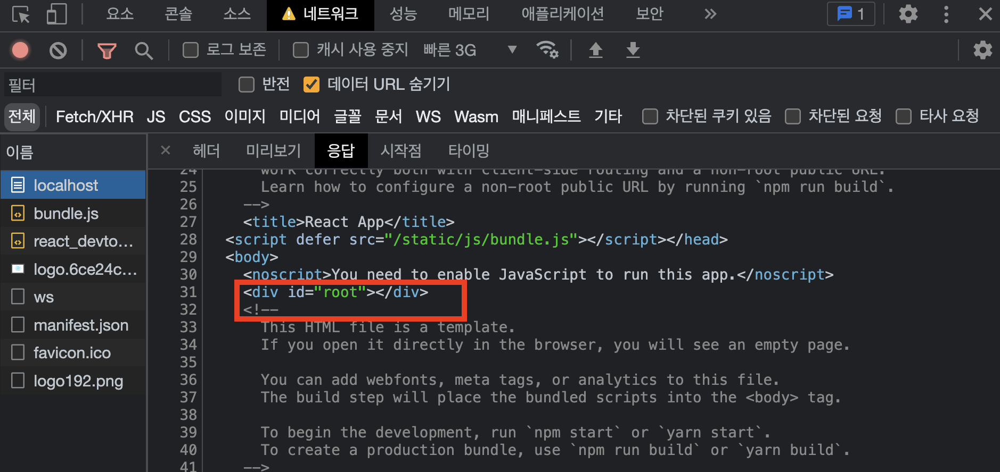

# 20장 서버 사이드 렌더링
- 참고하면 좋을 영상(드림코딩엘리)
> https://www.youtube.com/watch?v=iZ9csAfU5Os

## 20.1 서버 사이드 렌더링의 이해
- 서버 사이드 렌더링 : UI를 서버에서 렌더링하는 것을 의미
- 기존의 리액트 프로젝트는 기본적으로 클라이언트 사이드 렌더링
- 클라이언트 사이드 렌더링 : UI 렌더링을 브라우저에서 모두 처리하는 것. 즉, 자스를 실행해야 만든화면이 사용자에게 보임
- CRA 로 프젝생성
```
npm create react-app ssr-recipe
cd ssr-recipe
npm start
```
- 개발자 도구 - 네트워크 - localhost 를 보게되면 root가 비어있는걸 볼수 있다.(처음에 빈페이지였다가 이후 리액트 컴포넌트가 렌더링이 되는것)


- 서버사이드렌더링 구현시 서버쪽에서 초기 렌더링을 대신 해줌

### 20.1.1 서버 사이드 렌더링의 장점
1. 구글, 네이버, 다음 등의 검색엔진이 웹페이지를 원할하게 수집할수 있음(크롤링이 원할)
2. 초기 렌더링 성능 개선(비어있는 페이지 보여지는 시간 단축 -> 대기시간 최소화 -> 사용자 경험 향상)


### 20.1.2 서버 사이드 렌더링의 단점
1. 서버 리소스가 사용된다(기존브라우저가 해야할일을 서버가 대신처리, 수많은 사용자 접속시 -> 과부화 발생)
2. 프로젝트 구조가 복잡해짐(데이테 미리불러오기, 코드 스플리팅과의 호환등 많은 고려가 필요 -> 개발 어려워짐)
### 20.1.3 서버 사이드 렌더링과 코드 스플리팅 충돌
➊ 서버 사이드 렌더링된 결과물이 브라우저에 나타남
➋ 자바스크립트 파일 로딩 시작
➌ 자바스크립트가 실행되면서 아직 불러오지 않은 컴포넌트를 null로 렌더링함
➍ 페이지에서 코드 스플리팅된 컴포넌트들이 사라짐
➎ 코드 스플리팅된 컴포넌트들이 로딩된 이후 제대로 나타남

- 어떻게 해결? 라우트 경로마다 코드 스플리팅된 파일중에 필요한 모든 파일을 브라우저에서 렌더링하지 전에 미리 불러와야함 -> Loadable Components 라이브러리 사용할 것

- 실습진행
> 프로젝트 준비 - 서버사이드 렌더링 구현 - 데이터 로딩 - 코드 스플리팅

# 20.2 프로젝트 준비하기
- ssr-recipe 프로젝트 디렉터리에 react-router-dom을 설치
```
npm add react-router-dom
```
### 20.2.1 컴포넌트 만들기
### 20.2.2 페이지 컴포넌트 만들기


# 20.3 서버 사이드 렌더링 구현하기
### 20.3.1 서버 사이드 렌더링용 엔트리 만들기
### 20.3.2 서버 사이드 렌더링 전용 웹팩 환경 설정 작성하기
### 20.3.3 빌드 스크립트 작성하기
### 20.3.4 서버 코드 작성하기
### 20.3.5 정적 파일 제공하기


# 20.4 데이터 로딩
### 20.4.1 redux-thunk 코드 준비하기
### 20.4.2 Users, UsersContainer 컴포넌트 준비하기
### 20.4.3 PreloadContext 만들기
### 20.4.4 서버에서 리덕스 설정 및 PreloadContext 사용하기
### 20.4.5 스크립트로 스토어 초기 상태 주입하기
### 20.4.6 redux-saga 코드 준비하기
### 20.4.7 User, UserContainer 컴포넌트 준비하기
### 20.4.8 redux-saga를 위한 서버 사이드 렌더링 작업
### 20.4.9 usePreloader Hook 만들어서 사용하기


## 20.5 서버 사이드 렌더링과 코드 스플리팅
### 20.5.1 라우트 컴포넌트 스플리팅하기
### 20.5.2 웹팩과 babel 플러그인 적용
### 20.5.3 필요한 청크 파일 경로 추출하기
### 20.5.4 loadableReady와 hydrate


## 20.6 서버 사이드 렌더링의 환경 구축을 위한 대안
### 20.6.1 Next.js
### 20.6.2 Razzle


## 20.7 정리