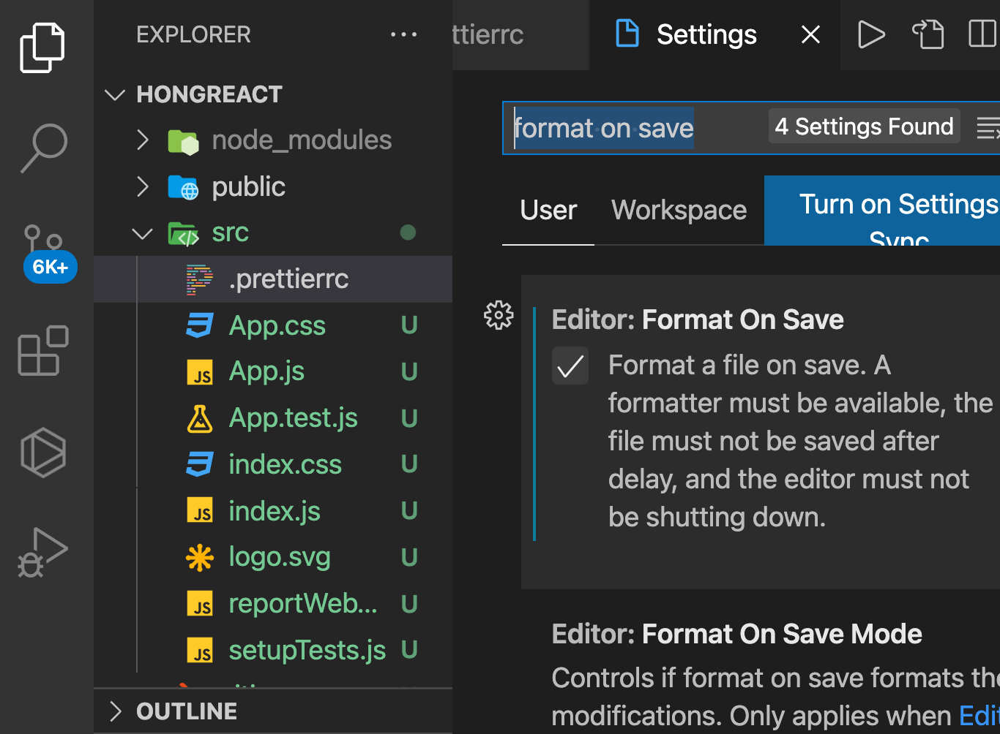

# 2장 JSX

## 2.1 코드 이해하기
- creat-react-app 를 세팅했다고 가정
```js
// src/App.js 오픈합니다

import React from ‘react‘;
import logo from ‘./logo.svg‘;
import ‘./App.css‘;


function App() {
  return (
    <div className=“App“>
      <header className=“App-header“>
        
        <p>
          Edit <code>src/App.js</code> and save to reload.
        </p>
        <a
          className=“App-link“
          href=“https://reactjs.org“
          target=“_blank“
          rel=“noopener noreferrer“
        >
          Learn React
        </a>
      </header>
    </div>
  );
}


export default App;
````

```js
import React from ‘react‘; 
```
- 리액트를 불러와서 사용할 수 있게 해줌 
- 프로젝트 생성과정에서 node_modules 디렉터리에 react 모듈이 설치됨
- 기존 브라우저에는 없던 기능, 브라우저가 아닌 환경에서 자스를 실행해주는 환경인 Node.js 에서 지원하는 기능
- Node.js 에서는 import가 아닌 require 구문으로 패키지를 불러올수 있음
- > 번들러를 사용합니다.(묶여있는 파일뭉치)

### 번들러?
- 대표적인 번들러 -> 웹팩, Parcel, browserify
- 리액트 프젝은 주로 웹팩 사용 -> 편의성과 확장성이 뛰어남
- src/index.js 를 시작으로 필요한 파일을 다 불러와서 번들링함
- 2017 부터 브라우저에 import 구문이 사용할수 있지만 단지 자스를 불러오는 용도로만 사용됨으로 프로젝트 번들링과는 다름 !

```js
import logo from ‘./logo.svg‘;
import ‘./App.css‘;
````

- 웹팩을 사용시 SVG 파일과 CSS 파일도 불러와서 사용할 수 있음
- 웹팩의 로더(loader)라는 기능이 담당
    * 로더의 종류
        - css-loader -> CSS 파일 불러옴
        - file-loader -> 웹폰트, 미디어파일 등을 불러옴
        - babel-loader -> 자스 파일들을 불러옴(최신 자스문법코드 -> 바벨이란 도구 사용 -> ES5문법으로 변환) -> 호환을 위해

<mark>리액트 컴포넌트에서 사용하는 JSX라는 문법도 정식 자바스크립트 문법이 아니므로 ES5 형태의 코드로 변환해야 합니다.<mark>

- JSX 코드
```js
function App(){
    return (
        <div className = "App">
            <header className = "App-header">
                
                <p>
                    Edit<code>src/App/js</code> and save to reload.
                </p>
                <a 
                    className="App-link" href="https://reactjs.org"
                    target="_blank"
                    rel="noopener noreferrer"
                >
                    Learn React
                </a>
            </header>
        </div>
    )
};
```
- 이 코드는 App 이라는 컴포넌트를 만들어줌
- function 키워드를 사용하여 컴포넌트 생성 -> 함수형 컴포넌트
- 프로젝트에서 컴포넌트를 렌더링(보여준다)하면 함수에서 반환하고 있는 내용을 나타냄


## 2.2 JSX란?
- 자스의 확장 문법
- XML 과 매우 비슷하게 생김
```js
function App() {
    return (
        <div>
        Hello <b>react</b>
        </div>
    );
}
// ↓ 다음과 같이 변환

function App() {
    return React.createElement("div", null, "Hello", React.createElement("b", null, "react"));
}

```
- JSX를 사용하여 매우 편하게 UI 랜더링이 가능

<mark>JSX는 공식적인 자스 문법이 아님</mark>

## 2.3 JSX의 장점
### 2.3.1 보기 쉽고 익숙하다
- 가독성이 높고, 작성하기도 쉽다.
- HTML 코드를 작성하는 것과 비슷하다.

### 2.3.2 더욱 높은 활용도
- 앞으로 만들 컴포넌트도 JSX 안에서 작성 ㄱㄴ
```js
// src/index.js

import React from ‘react‘;
import ReactDOM from ‘react-dom‘;
import ‘./index.css‘;
import App from ‘./App‘;
import * as serviceWorker from ‘./serviceWorker‘;

ReactDOM.render(<App />, document.getElementById('root'));

serviceWorker.unregister();
```

> <mark>ReactDOM.render?</mark>
컴포넌트를 페이지에 렌더링하는 역활을 하며, react-dom 모듈을 불러와 사용할 수 있음.
이 함수의 첫번째 파라미터에는 페이지에 렌더링할 내용을 JSX 형태로 작성, 두번째 파라미터에는 해당 JSX를 렌더링할 document 내부 요소를 설정합니다. 

## 2.4 JSX 문법
- 정말 편리한 문법 ^^ but ! 몇가지 규칙을 준수

### 2.4.1 감싸인 요소
- 컴포넌트에 여러 요소가 있다면 반드시 부모 요소 하나로 감싸야 함

```js
// src/App.js
import React from 'react';

function App() {
    return (
        <h1>리액트 안녕!</h1>
        <h2>잘... 작동하니..?</h2>
    )
}

export default App;
```
- 작동안합니다 ^^ (Failed to compile.)
- 요소 여러개가 부모 요소 하나에 의해 감싸져 있지 x 때문에
- 다음과 같이 수정합시다.^^!

```js
// src/App.js

import React from 'react';

function App() {
    return (
        <div>
            <h1>리액트 안녕!</h1>
            <h2>잘... 작동하니..?</h2>
        </div>
    );
}

export default App;
```

> <mark>왜 감싸줘야 하는 것인가??</mark>
컴포넌트 내부는 하나의 DOM 트리 구조로 이루어져야 한다는 규칙땜시 -> Virtual DOM 에서 컴포넌트 변화를 감지해 낼 때 효율적으로 비교할 수 있게하기위함

- 꼭 div 요소를 사용하지 않아도 됩니다. 

```js
// src/App.js

import React, { Fragment } from 'react';

function App() {
    return (
        <Fragment>
            <h1>리액트 안녕!</h1>
            <h2>잘... 작동하니..?</h2>
        </Fragment>
    );
}

export default App;
```

 >  import 구문에 Fragment 라는 컴포넌트를 추가로 불러오는거 잊지 말긔 !^^

- 다음과 같은 형태로도 ㄱㄴ
```js
// src/App.js

import React from 'react';

function App() {
    return (
        <>
            <h1>리액트 안녕!</h1>
            <h2>잘... 작동하니..?</h2>
        </>
    );
}

export default App;
```


### 2.4.2 자바스크립트 표현
- JSX 안에서는 자스표현식을 쓸수 있당
- 자스 표현식을 작성하려면 JSX 내부에서 코드를 { }로 감싸면 됨

```js
// src/App.js

import React from 'react';

function App() {
    const name = '리액트';
    return (
        <>
            <h1>{name} 안녕!</h1>
            <h2>잘... 작동하니..?</h2>
        </>
    );
}

export default App;
```

### 2.4.3 if 문 대신 조건부 연산자
- JSX 내부의 자스 표현식에서 if 문을 사용할 수는 없음
- but! 조건에 따라 따른 내용을 렌더링 해야할 시 JSX 밖에서 if 문을 사용하여 사전에 값을 설정하거나, { } 안에 조건부 연산자(삼항 연산자)를 사용하면 됨
```js
// src/App.js

import React from 'react';

function App() {
    const 이름 = '리액트';
    return(
        <div>
        {이름 === '리액트' ? (
            <h1>리액트입니다.</h1>
        ) : (
            <h2>리액트 아님</h2>
        )}
        </div>
    );
}

export default App;

// const 이름 = '리액트' 일시 출력값--> <h1>리액트입니다.</h1>
// const 이름 != '리액트' 일시 출력값--> <h2>리액트 아님</h2>
```

### 2.4.4 AND 연산자(&&)를 사용한 조건부 렌더링
- 특정 조건을 만족할 때 내용을 보여줘야 되는 상황 !
```js
// src/App.js

import React from 'react';

function App() {
    const 이름 = '뤼액트';
    return<div>
        {이름 === '리액트' ?  <h1>리액트입니다.</h1> : null}</div>;}

export default App;

// null 을 렌더링 하여 아무것도 보여주질 않네요^^
```
- 더 짧은 코드 여기~
```js
// src/App.js

import React from 'react';

function App(){
    const 이름 = '뤼액트';
    return<div>{이름 === '리액트' && <h1>리액트입니다.</h1>}</div>;
}

export default App;
// 조건이 충족되지 않아 아무것도 보여주질 않네요^^
// 이름 값을 리액트로 설정해주면 '리액트입니다.'라는 문구가 나옴
```
- false를 렌더링 할때는 null과 마찬가지로 아무것도 나타나지 않음
    * 주의사항 : falsy 한 값인 0은 예외적으로 화면에 나타남
```js
const number = 0;
return number && <div>내용</div>

//숫자 0을 출력함
```
> <mark>JSX는 언제 괄호로 감싸쥬?</mark>
JSX를 여러줄로 작성시 괄호로 감싸고 한줄로 표현하는 JSX는 감싸지 x, 고로 이거슨... 필수 사항이 아니다 ~ ^^


### 2.4.5 undefined를 렌더링하지 않기
- undefined 만 반환하여 렌더링하는 상황을 만들면 x

```js
// src/App.js

import React from 'react';
import './App.css';

function App(){
    const 이름 = undefined;
    return 이름
}

export default App;

// 오류가 뜹니다요
// App(...): Nothing was returned from render. 
```
- 어떤 값이 undefined 일수 있다면, OR(||)연산자를 사용하여 오류 방지 ㄱㄴ
```js
import React from 'react';
import './App.css';

function App(){
    const 예림 = undefined;
    return 예림 || '예림이는 undefined.' ;
}

export default App;
```
- 반면 JSX 내부에서 undefined를 렌더링하는것은 ㄱㅊ
```js
import React from 'react';
import './App.css';

function App() {
    const 예림 = undefined;
    return <div>{예림}</div>
}

export default App;
```
- 예림 값이 undefined일 때 보여주고 싶은 문구가 있다면?
```js
import React from 'react';
import './App.css';

function App() {
    const 예림 = undefined;
    return <div>{예림 || '리액트'}</div>
}

export default App;
```

### 2.4.6 인라인 스타일링
- 리액트에서 DOM 요소에 스타일을 적용할시 문자열 형태가 아닌 객체형태로 넣어주어야함
> 카멜표기법(camelCase)으로 작성해야함
 background-color -> backgroundColor
```js
// src/App.js

import React from 'react';

function App(){
    const 예림 = '멋진예림';
    const style = {
        backgroundColor: 'black',
        color: 'pink',
        fontSize: '50px',
        fontWeight: 'bold',
        padding: 16 //단위 생략시 px로 지정됨
    };
    return<div style={style}>{예림}</div>;
}

export default App;
```
- 만약 style 객체를 미리 선언하지 않고 style 값을 지정하고 싶다면 다음과 같이 작성
```js
// src/App.js

import React from "react";

function App() {
  const 예림 = "멋진예림";
  return (
    <div
      style={{
        backgroundColor: "black",
        color: "pink",
        fontSize: "50px",
        fontWeight: "bold",
        padding: 16 //단위 생략시 px로 지정됨
      }}
    >
      {예림}
    </div>
  );
}

export default App;
```

### 2.4.7 class 대신 className
- 일반 HTML에서 CSS 클래스를 사용할 때는 ```<div class="myclass"></div> ``` 와 같이 class 속성을 사용하지만 JSX에서는 class가 아닌 ```className``` 으로 설정해 주어야 함
- src/App.css
```css
.mut {
    background: black;
    color: pink;
    font-size: 50px;
    font-weight: bold;
    padding: 16px;
}
```
- src/App.js
```js
import React from 'react';
import './App.css';

function App() {
    const 예림 = '멋진예림'
    return <div className='mut'>{예림}</div>;
}

export default App;
```
- className 아닌 class 값으로 설정해도 스타일이 적용되긴함 ..!
- but 다음과 같은 경고가 Console 탭에 등-장!

> Warning: Invalid DOM property `class`. Did you mean `className`?
  in div (at App.js:6)
  in App (at src/index.js:7)


### 2.4.8 꼭 닫아야하는 태그
- HTML 코드 작성시 가끔 태그를 닫지 않은 상태로 코드를 작성
```input HTML 요소는 <input> 이라고만 입력해도 작동함 ```

- br 과 input 태그는 열기만 하고 닫지 x
```html
<form>
  성: <br>
  <input><br>
  이름: <br>
  <input>
</form>
```
- JSX에서는 태그를 닫지 않으면 오류가 발생
- src/App.js
```js
import React from 'react';
import ' ./App.css';

function App(){
    const 예림 = '멋진예림';
    return(
        <>
        <div className='mut'>{예림}</div>
        <input></input> {/* 닫지 않을시 터미널에 Failed to compile. 오류뜸 */}
        </>
    );
}

export default App;
```
- slef-closing(태그선언과 동시에 닫을수 있음)으로도 처리 ㄱㄴ
```js
import React from "react";
import " ./App.css";

function App() {
  const 예림 = "멋진예림";
  return (
    <>
      <div className="mut">{예림}</div>
      <input />
    </>
  );
}

export default App;
```

### 2.4.9 주석
- JSX 내부에서 주석을 작성할 때는 {/* … */}와 같은 형식으로 작성.
- 시작 태그를 여러줄로 작성할 때는 그 내부에서 // ...과 같은 형태의 주석도 작성할 수 있음.!


## 2.5 ESLint와 Prettier 적용하기(Extention 도구)

### 2.5.1 ESLint
- ESLint 는 문법 검사 도구
- 코드 작성시 실수하면 에러 혹은 경고 메세지는 VS Code 에디터에서 바로 확인 ㄱㄴ
- 에디터 하단에 뜨는 문제 탭은 보기> 문제 를 클릭하여 열수 있음 (shift+command+m)
- 초록색줄 오류는 무시 ㄱㄴ but! 빨간색 줄 오류는 무시하면 안됨(치명적인 오류)

### 2.5.2 Prettier
- Prettier 는 코드 스타일 자동 정리 도구
- JSX 를 작성시 코드의 가독성을 위해 들여쓰기를 사용함
- 코드가 제대로 정렬, 세미콜론(;)이 빠진곳은 자동추가, 기존의 작은따옴표 -> 큰따옴표(이것은 왕도가 아니다)
- Prettier의 장점은 커스터마이징 !
```js
.prettierrc
{
  "singleQuote": true,
  "semi": true,
  "useTabs": false,
  "tabWidth": 2
}
//Prettier Options 페이지 (https://prettier.io/docs/en/options.html)를 참고
```

#### 2.5.2.1 저장할 때 자동으로 코드 정리
- mac 기준 (command + ,) Code - 설정
- format on save 입력후 체크해줍니다 ^^ 
- 저장시 코드 정렬됨 
