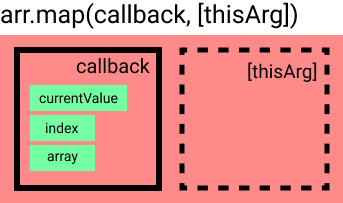

# 6장 컴포넌트 반복

> 오늘의 학습 목표
> <mark>반복적인 내용을 효율적으로 보여주고, 관리하는 방법을 알아보자</mark>

- src 에 IterationSample.js 파일 생성

```js
import React from "react";

const IterationSample = () => {
  return (
    <ul>
      <li>눈사람</li>
      <li>얼음</li>
      <li>눈</li>
      <li>바람</li>
    </ul>
  );
};

export default IterationSample;
```

- li 태그가 계속 반복되는것을 볼 수 있다.
- 이것은 낭비^^ (코드양 증가 -> 파일용량 증가)

<i><h4><mark style="background-color:pink"> 그렇다면 해결책으로는 ?<mark></h4></i>

## 6.1 자바스크립트 배열의 map() 함수

> map 메서드란?
> map() 메서드는 배열 내의 모든 요소 각각에 대하여 주어진 함수를 호출한 결과를 모아 새로운 배열을 반환하는 메서드이다.<br>
> for of 문이나 forEach처럼 배열 내 요소들을 반복하는 반복문의 한 종류인데, 조금 독특한 부분은 매 반복마다 return 되는 결과에 따라 새로운 배열을 만들어낸다는 것이다.


- 자스 배열 객체의 내장 함수인 map 함수를 사용하여 반복되는 컴포넌트를 렌더링 할 수 있다 !
- map 함수는 파라미터로 전달된 함수를 사용 -> 배열내 각 요소를 원하는 규칙에 따라 변환한 후 -> 새로운 배열을 생성

### 6.1.1 문법

```js
arr.map(callback, [thisArg]);
```

- 이 함수의 파라미터 - callback : 새로운 배열의 요소를 생성하는 함수로 아래 파라미터를 가짐 - currentValue: 현재 처리하고 있는 요소 - index: 현재 처리하고 있는 요소의 index 값 - array: 현재 처리하고 있는 원본 배열 - thisArg(선택항목): callback 함수 내부에서 사용할 this 레퍼런스
  

### 6.1.2 예제를 살펴보자

- map 함수를 사용하여 배열 [1,2,3,4,5]의 각 요소 제곱 -> 새로운 배열 생성

```js
//예제 1.
let 숫자 = [1, 2, 3, 4, 5];

let 결과임 = 숫자.map(function (num) {
  return num * num;
});

console.log(결과임); //[ 1, 4, 9, 16, 25 ]

//예제 2.
let 숫자 = [1, 2, 3, 4, 5];

let 결과임 = 숫자.map((num) => num * num);

console.log(결과임); //[ 1, 4, 9, 16, 25 ]
```

> 앞에서는 기존배열에 있는 값들을 제곱하여 -> 새로운 배열생성

<i><h4><mark style="background-color:pink"> (똑같은 원리로) 기존배열로 컴포넌트로 구성된 배열을 생성할 수 있다면 ? <mark></h4></i>

## 6.2 데이터 배열을 컴포넌트 배열로 변환하기

### 6.2.1 컴포넌트 수정하기

- 기존 IterationSample 컴포넌트 수정

```js
import React from "react";

const IterationSample = () => {
  const 내기분 = ["오늘", "하루도", "겁나", "감사"]; //1. 문자열로 구성된 배열을 선언
  const 기분들 = 내기분.map((기분) => <li>{기분}</li>); // 2. JSX 코드로 된 배열을 새로 생성한 후
  return <ul>{기분들}</ul>; // 3. 기분들에 담는다
};

export default IterationSample;
```

- map 함수에서 JSX를 작성할 때는 -> DOM 요소 작성 ok ~, 컴포넌트 사용 ok ~

### 6.2.2 App 컴포넌트에서 예제 컴포넌트 렌더링

- App.js 렌더링 해보좌 (IterationSample.js)

```js
import React, { Component } from "react";
import IterationSample from "./IterationSample";

class App extends Component {
  render() {
    return <IterationSample />;
  }
}

export default App;
```

<i><h4><mark style="background-color:pink"> But ! <mark></h4></i>

> 콘솔창에 "key" prop 이 없다는 경고메세지가 표시됨 왜 그런것일... 꽈..?

## 6.3 key

<i><h4><mark style="background-color:pink"> 리액트에서 key 란 ? ? <mark></h4></i>

> 컴포넌트 배열을 렌더링 했을때 어떤 원소에 변동이 있었는지 알아내려고 사용
> key 값을 사용한다면 어떤변화가 일어나는지 더욱 빠르게 알아낼수 있다

### 6.3.1 key 설정

<i><h4><mark style="background-color:pink"> key 값 설정은 어떻게 ? <mark></h4></i>

> map 함수의 인자로 전달되는 함수 내부에서 컴포넌트 props를 설정하듯이 설정할 수 있다.

- key 값은 언제나 유일해야함
- 데이터가 가진 고유의 값을 key 값으로 설정해야함

<i><h4><mark style="background-color:pink"> 하지만 앞전의 컴포넌트처럼 고유번호가 없다면 ? <mark></h4></i>

- 이럴땐 ! map 함수에 전달되는 콜백함수의 인수인 index 값을 사용한다 ^^
- IterationSample.js 를 수정해보자

```js
import React from "react";

const IterationSample = () => {
  const 내기분 = ["오늘", "하루도", "겁나", "감사"]; //1. 문자열로 구성된 배열을 선언
  const 기분들 = 내기분.map((기분, index) => <li key={index}>{기분}</li>); // 2. JSX 코드로 된 배열을 새로 생성한 후
  return <ul>{기분들}</ul>; // 3. 기분들 에 담는다
};

export default IterationSample;
```

- npm start 다시해야함
- 개발자 도구에서 더 이상 경고 메세지 표시 x

<i><h4><mark style="background-color:pink"> 사실..<mark></h4></i>

- 고유값이 없을때만 index를 key 값으로 사용부탁
- why? index 를 key 값으로 사용시 -> 배열이 변경될때 효율적으로 리렌더링을 못함요..

## 6.4 응용

<i><b>그렇담 말이야.. 응용을 해야되지 말이야..고정배열 렌더링 말구,, 동적배열 렌더링을 구현해볼꽈^^..?</b></i>

- 이렇게 실습할껑미
  > 초기상태 설정 -> 데이터 추가기능 구현 -> 데이터 제거기능 구현

### 6.4.1 초기 상태 설정하기

<i><h4><mark style="background-color:pink"> 초기상태 어떻게 설정 ?<mark></h4></i>

- IterationSample 컴포넌트에서 useState를 사용하여 상태 설정(다음과 같은 세가지 상태를 사용^_^)

  1. 데이터 배열
  2. 텍스트를 입력할수 있는 input의 상태
  3. 데이터 배열에서 새로운 항목을 추가할 때 사용할 고유 id를 위한 상태

- IterationSample.js 를 수정해보자

```js
import React, { useState } from "react";

const IterationSample = () => {
  const [내기분, 기분설정] = useState([
    { id: 1, text: "오늘" },
    { id: 2, text: "하루도" },
    { id: 3, text: "겁나" },
    { id: 4, text: "감사" },
  ]);

  const [inputText, setInputText] = useState("");
  const [nextId, setNextId] = useState(5); // 새로운 항목을 추가할 때 사용할 id

  const 기분들 = 내기분.map((기분) => <li key={기분.id}>{기분.text}</li>);
  return <ul>{기분들}</ul>;
};

export default IterationSample;
```

### 6.4.2 데이터 추가 기능 구현하기
> +새로운 이름 등록 +onClick 이벤트 설정 +
```js
import React, { useState } from "react";

const IterationSample = () => {
  const [내기분, 기분설정] = useState([
    { id: 1, text: "오늘" },
    { id: 2, text: "하루도" },
    { id: 3, text: "겁나" },
    { id: 4, text: "감사" },
  ]);

  const [inputText, setInputText] = useState("");
  const [nextId, setNextId] = useState(5); // 새로운 항목을 추가할 때 사용할 id

  const onChange = e => setInputText(e.target.value);

 const onClick = () => {
    const next기분 = 내기분.concat({// 배열의 내장함수 concat을 사용-> 새로운 배열을 추가한 배열을만듬
      id: nextId, // nextId 값을 id로 설정하고
      text: inputText
    });
    setNextId(nextId + 1); // nextId 값에 1을 더해 준다.
    기분설정(next기분); // 기분 값을 업데이트한다.
    setInputText(''); // inputText를 비운다.
  };

  const 기분들 = 내기분.map((기분) => <li key={기분.id}>{기분.text}</li>);
  return (
    <>
      <input value={inputText} onChange={onChange} />
      <button onClick={onClick}>추가</button>
      <ul>{기분들}</ul>
    </>
  );
};

export default IterationSample;
```
<i><b>배열에 새 항목을 추가할 때 배열의 push 함수를 사용하지 않고 concat을 사용했는데, push 함수는 기존 배열 자체를 변경해 주는 반면, concat은 새로운 배열을 만들어 준다는 차이점이 있다.</b></i>

> 불변성 유지가 필요
> 불변성 유지란 ? 
> 리액트에서 상태를 업데이트할 때는 기존 상태를 그대로 두면서 새로운 값을 상태로 설정하는 것 -> 리액트 컴포넌트의 성능을 최적화 할 수 있음


### 6.4.3 데이터 제거 기능 구현하기
- 배열의 내장 함수 filter 사용(불변성을 유지하면서 배열의 특정 항목을 지울수 있다)
- filter 함수사용시 (분류 및 삭제 ㄱㄴ)
```js
// 분류
const numbers = [1, 2, 3, 4, 5, 6];
const biggerThanThree = numbers.filter(number => number > 3);
// 결과: [4, 5, 6]


// 삭제
const numbers = [1, 2, 3, 4, 5, 6];
const withoutThree = numbers.filter(number => number != = 3);
// 결과: [1, 2, 4, 5, 6]
```

-  HTML 요소를 더블클릭할 때 사용하는 이벤트 이름은 onDoubleClick
- onRemove라는 함수를 만들어서 각 li 요소에 이벤트 등록
```js
import React, { useState } from 'react';


const IterationSample = () => {
  const [내기분, 기분설정] = useState([
    { id: 1, text: "오늘" },
    { id: 2, text: "하루도" },
    { id: 3, text: "겁나" },
    { id: 4, text: "감사" },
  ]);
  const [inputText, setInputText] = useState('');
  const [nextId, setNextId] = useState(5); // 새로운 항목을 추가할 때 사용할 id
 
  const onChange = e => setInputText(e.target.value);
  const onClick = () => {
    const next내기분 = 내기분.concat({
      id: nextId, // nextId 값을 id로 설정하고
      text: inputText
    });
    setNextId(nextId + 1); // nextId 값에 1을 더해 준다.
    기분설정(next내기분); // 내기분 값을 업데이트한다.
    setInputText(''); // inputText를 비운다.
  };
  const onRemove = id => {
    const next내기분 = 내기분.filter(기분 => 기분.id !== id);
    기분설정(next내기분);
  };
  const 기분들 = 내기분.map(기분 => (
    <li key={기분.id} onDoubleClick={() => onRemove(기분.id)}>
      {기분.text}
    </li>
  ));
  return (
    <>
      <input value={inputText} onChange={onChange} />
      <button onClick={onClick}>추가</button>
      <ul>{기분들}</ul>
    </>
  );
};


export default IterationSample;
```

## 6.5 정리
<i><h4><mark style="background-color:pink"> 무엇을 배웠나 ? ^^7 <mark></h4></i>

- 반복되는 데이터를 렌더링하는 방식
- 이를 응용한 유동적인 배열
- 컴포넌트 배열 렌더링시 -> key 값 설정에 주의 !
- 상태 안에서 배열을 변형할 때는 배열에 직접 접근하여 수정하는 것이 아니라 배열 내장 함수(concat, filter 등)를 사용하여 새로운 배열을 만든 후 이를 새로운 상태로 설정해 주어야 함