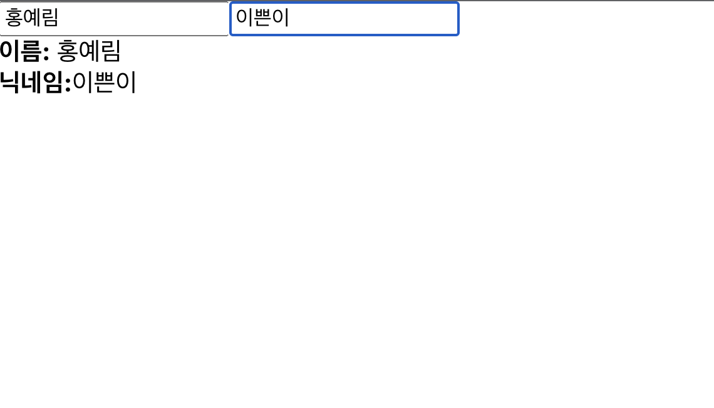

# 8장 Hooks

<mark style="background-color:pink"><i>Hooks가 뭘까 ? ^^</i></mark>

> 함수형 컴포넌트에서도 상태 관리를 할 수 있는 useState, 렌더링 직후 작업을 설정하는 useEffect 등의 기능을 제공 -> 기존의 함수형 컴포넌트에서 할수 없었던..다양한 작업을 할 수 있게 해줌

- 오늘의 실습은 ? 다음과 같은 흐름
  > 리액트 내장 Hooks 사용하기 -> 커스텀 Hooks 만들기

#### 먼저, 터미널에 creat-react-app을 사용하여 새로운 프로젝트를 생성

> yarn create react-app hooks-tutorial

안될경우에 ↓

> npm create react-app hooks-tutorial

## 8.1 useState(3장 참고)

- useState는 가장 기본적인 Hook이며 함수형 컴포넌트에서도 가변적인 상태를 지닐 수 있게 해줌
- 함수 형 컴포넌트에서 상태를 관리해야 할 때 -> 사용

<b><i>useState 기능을 통한 숫자 카운터 구현</i></b>

```js
import React, { useState } from "react"; //useState는 코드 상단에서 import 구문을 통해 불러옴

const Counter = () => {
  const [value, setValue] = useState(0); // 이와 같이 사용 -> 파라미터에는 상태의 기본값인 '0'을 설정하여 넣어준다
  // 그 배열의 첫 번째 원소는 상태 값, 두 번째 원소는 상태를 설정하는 함수

  return (
    <div>
      <p>
        현재 카운터 값은 <b>{value}</b> 입니다.
      </p>
      <button onClick={() => setValue(value + 1)}>+1</button>
      <button onClick={() => setValue(value - 1)}>-1</button>
    </div>
  );
};

export default Counter; // 호출시 배열을 반환한다
```

- 이 함수에 파라미터를 넣어서 호출시 전달받은 파라미터로 값이 바뀜 -> 컴포넌트가 정상적으로 리렌더링됨

- 다음과 같이 App.js에 렌더링 해보자^^

```js
import React from "react";
import Counter from "./Counter";

const App = () => {
  return <Counter />;
};

export default App;
// 터미널에 1. 또는 2. 입력 하여 개발서버 구동
// 1. yarn start
// 2. npm start
```

- (컴포넌트 코드를 궅이 클래스 형태로 변환할 필요가 없어서 매우 편리함)

### 8.1.1 useState 여러번 사용하기

- 하나의 useState 함수는 -> 하나의 상태 값만 관리 가능
- 관리해야할 상태가 여러개라면? -> useState를 여러번 사용함

- src 디렉터리에 Info.js 파일 생성

```js
import React, { useState } from "react";

const Info = () => {
  const [name, setName] = useState("");
  const [nickname, setNickname] = useState("");
  // 다음과 같이 useState를 여러개 사용하여 관리할수 있음

  const onChangeName = (e) => {
    setName(e.target.value);
  };

  const onChangeNickname = (e) => {
    setNickname(e.target.value);
  };

  return (
    <div>
      <div>
        <input value={name} onChange={onChangeName} />
        <input value={nickname} onChange={onChangeNickname} />
      </div>
      <div>
        <div>
          <b>이름:</b> {name}
        </div>
        <div>
          <b>닉네임:</b>
          {nickname}
        </div>
      </div>
    </div>
  );
};

export default Info;
```

- 다음과 같이 App.js에 렌더링

```js
import React from "react";
import Info from "./Info";

const App = () => {
  return <Info />;
};

export default App;
```

> 출력되는 화면
> 

## 8.2 useEffect

<mark style="background-color:pink"><i>useEffect 란 ? ^^</i></mark>

> 리액트 컴포넌트가 렌더링 될때마다 특정 작업을 수행하도록 설정할 수 있는 Hook
> 클래스형 컴포넌트의 componentDidMount + componentDidUpdate = useEffect

- 기존 Info 컴포넌트 useEffect 적용

```js
import React, { useState, useEffect } from "react";

const Info = () => {
  const [name, setName] = useState("");
  const [nickname, setNickname] = useState("");

  useEffect(() => {
    console.log("렌더링 완료 ~ !");
    console.log({
      name,
      nickname,
    });
  });

  const onChangeName = (e) => {
    setName(e.target.value);
  };

  const onChangeNickname = (e) => {
    setNickname(e.target.value);
  };

  return (
    <div>
      <div>
        <input value={name} onChange={onChangeName} />
        <input value={nickname} onChange={onChangeNickname} />
      </div>
      <div>
        <div>
          <b>이름:</b> {name}
        </div>
        <div>
          <b>닉네임:</b>
          {nickname}
        </div>
      </div>
    </div>
  );
};

export default Info;
```

### 8.2.1 마운트될 떄만 실행하고 싶을 때

- 화면 맨처음 렌더링 될때만 실행, 업데이트 될 때는 실행하지 않으려면 ? -> 함수 두번째 파라미터로 비어있는 배열을 넣어줌

```js
import React, { useState, useEffect } from "react";

const Info = () => {
  const [name, setName] = useState("");
  const [nickname, setNickname] = useState("");

  useEffect(() => {
    console.log("마운트될 때만 실행됩니다.");
  }, []); // useEffect 코드를 다음과 같이 변경

  const onChangeName = (e) => {
    setName(e.target.value);
  };

  const onChangeNickname = (e) => {
    setNickname(e.target.value);
  };

  return (
    <div>
      <div>
        <input value={name} onChange={onChangeName} />
        <input value={nickname} onChange={onChangeNickname} />
      </div>
      <div>
        <div>
          <b>이름:</b> {name}
        </div>
        <div>
          <b>닉네임:</b>
          {nickname}
        </div>
      </div>
    </div>
  );
};

export default Info;
// 콘솔창에 한번만 실행된다.
```

### 8.2.2 특정 값이 업데이트 될때만 실행하고 싶을 때

- useEffect 를 사용시 특정 값이 변경 될 때만 호출하고 싶을때는?

- 클래스형 컴포넌트 라면?

```js
componentDidUpdate(prevProps, prevState) {
if (prevProps.value !== this.props.value) {
  doSomething();
}
}
// props 안에 들어 있는 value 값이 바뀔 때만 특정 작업을 수행함
```

- 이 작업을 useEffect 에서 적용한다면 ??
  > useEffect의 두번째 파라미터로 전달되는 배열안에 검사하고 싶은 값을 넣어줌

```js
import React, { useState, useEffect } from "react";

const Info = () => {
  const [name, setName] = useState("");
  const [nickname, setNickname] = useState("");

  useEffect(() => {
    console.log(name);
  }, [name]); // useEffect 코드를 다음과 같이 수정

  const onChangeName = (e) => {
    setName(e.target.value);
  };

  const onChangeNickname = (e) => {
    setNickname(e.target.value);
  };

  return (
    <div>
      <div>
        <input value={name} onChange={onChangeName} />
        <input value={nickname} onChange={onChangeNickname} />
      </div>
      <div>
        <div>
          <b>이름:</b> {name}
        </div>
        <div>
          <b>닉네임:</b>
          {nickname}
        </div>
      </div>
    </div>
  );
};

export default Info;
// 콘솔창에 한번만 실행된다.
```

### 8.2.3 뒷정리

- useEffect는 기본적으로 렌더링되고 난 직후마다 실행됨
- 두번째 파라미터 배열에 무엇을 넣는지에 따라 실행조건이 달라짐
- 컴포넌트가 언마운트 되기 전이나 업데이트 직전에 어떠한 작업을 수행하고 싶다면? useEffect에서 뒷정리 함수(cleanup)를 반환

- useEffect 부분을 다음과 같이 수정

```js
import React, { useState, useEffect } from "react";

const Info = () => {
  const [name, setName] = useState("");
  const [nickname, setNickname] = useState("");

  useEffect(() => {
    console.log("effect");
    console.log(name);
    return () => {
      console.log("Cleanup");
      console.log(name);
    };
  }); // useEffect 코드를 다음과 같이 수정

  const onChangeName = (e) => {
    setName(e.target.value);
  };

  const onChangeNickname = (e) => {
    setNickname(e.target.value);
  };

  return (
    <div>
      <div>
        <input value={name} onChange={onChangeName} />
        <input value={nickname} onChange={onChangeNickname} />
      </div>
      <div>
        <div>
          <b>이름:</b> {name}
        </div>
        <div>
          <b>닉네임:</b>
          {nickname}
        </div>
      </div>
    </div>
  );
};

export default Info;
// 콘솔창에 한번만 실행된다.
```

- App 컴포넌트에서 Info 컴포넌트의 가시성을 바꿀수 있게 해보자

```js
import React, { useState } from "react";
import Info from "./Info";

const App = () => {
  const [visible, setVisible] = useState(false);
  return (
    <div>
      <button
        onClick={() => {
          setVisible(!visible);
        }}
      >
        {visible ? "숨기기" : "보이기"}
      </button>
      <hr />
      {visible && <Info />}
    </div>
  );
};

export default App;

// 컴포넌트가 나타날시 -> 콘솔에 effect
// 컴포넌트가 사라질때 -> 콘솔에 cleanup
```

- 렌더링될 때마다 뒷정리 함수가 계속 나타남
- 뒷정리 함수가 호출될시 업데이트되기 직전의 값을 보여줌

- 언마운트 될때만 뒷정리 함수를 호출하고 싶다면 ? ?
  > useEffect 함수의 두번째 파라미터에 비어있는 배열을 넣어주자

```js
useEffect(() => {
  console.log("effect");
  console.log(name);
  return () => {
    console.log("Cleanup");
    console.log(name);
  };
}, []); // 두번째 파라미터에 비어있는 배열 추가
```

## 8.3 useReducer

<mark style="background-color:pink"><i>useReducer 이란 ?</i></mark>

> useState 보다 더 다양한 컴포넌트 상황에 따른 다양한 상태를 다른 값으로 업데이트해 주고 싶을 때 사용하는 Hook(17장 reducer 개념참고)

> <i>Reducer 이란 ?</i>
> 현재 상태, 그리고 업데이트를 위해 필요한 정보를 담은 액션값을 전달받아 새로운 상태를 반환하는 함수 -> 불변성을 지켜주자

```js
function reducer(state, action) {
return { … }; // 불변성을 지키면서 업데이트한 새로운 상태를 반환
}
```

- 액션값은 다음과 형태로 이루어져있음

```js
{
  type: ‘INCREMENT‘,
  // 다른 값들이 필요하다면 추가로 들어감
}
```

- useReducer에서 사용하는 액션 객체는 반드시 type을 지니고 있을 필요가 없음, 객체가 아닌 문자열이나 숫자도 상관 x

### 8.3.1 카운터 구현

```js
import React, { useReducer } from "react";

function reducer(state, action) {
  // action.type에 따라 다른 작업 수행
  switch (action.type) {
    case "INCREMENT":
      return { value: state.value + 1 };
    case "DECREMENT":
      return { value: state.value - 1 };
    default:
      // 아무것도 해당되지 않을 때 기존 상태 반환
      return state;
  }
}
const Counter = () => {
  const [state, dispatch] = useReducer(reducer, { value: 0 }); // 첫번째 파라미터에는 리듀서 함수, 두번째 파라미터에는 해당 리듀서의 기본값을 넣어줌
  // state는 현재 가리키고 있는상태
  // dispatch는 액션을 발생시키는 함수 -> ex) dispatch(action)함수 내 파라미터로 액션 값을 넣어주면 리듀서 함수가 호출

  return (
    <div>
      <p>
        현재 카운터 값은 <b>{state.value}</b> 입니다.
      </p>
      <button onClick={() => dispatch({ type: "INCREMENT" })}>+1</button>
      <button onClick={() => dispatch({ type: "DECREMENT" })}>-1</button>
    </div>
  );
};

export default Counter;
```

- 가장 큰 장점은 ? 컴포넌트 업데이트 로직을 컴포넌트 바깥으로 빼낼수 있다는 것
- App.js 로 렌더링 해보자

```js
import React from "react";
import Counter from "./Counter";

const App = () => {
  return <Counter />;
};

export default App;
```

### 8.3.2 인풋 상태 관리하기

- useReducer 사용 -> Info 컴포넌트에서 인풋상태 관리

  > useReducer 사용시 -> input 태그에 name 값을 할당 -> e.target.name 을 참조 -> setState를 해준것과 유사한 방식으로 작업을 처리

- Info.js 다음과 같이 수정

```js
import React, { useReducer } from "react";
// useReducer에서의 액션은 그 어떤 값도 사용 가능

function reducer(state, action) {
  return {
    ...state,
    [action.name]: action.value,
  };
}

const Info = () => {
  const [state, dispatch] = useReducer(reducer, {
    name: "",
    nickname: "",
  });
  const { name, nickname } = state;
  const onChange = (e) => {
    dispatch(e.target); // 액션값으로 e.target 값 자체를 사용
  };

  return (
    <div>
      <div>
        <input name="name" value={name} onChange={onChange} />
        <input name="nickname" value={nickname} onChange={onChange} />
      </div>
      <div>
        <div>
          <b>이름:</b> {name}
        </div>
        <div>
          <b>닉네임: </b>
          {nickname}
        </div>
      </div>
    </div>
  );
};

export default Info;
```

## 8.4 useMemo

<mark style="background-color:pink"><i>useMemo를 왜 사용하니? </i></mark>

- 함수형 컴포넌트 내부에서 발생하는 연산을 최적화할 수 있음.
- Average.js 파일 생성

```js
import React, { useState } from "react";

const getAverage = (numbers) => {
  console.log("평균값 계산 중..");
  if (numbers.length === 0) return 0;
  const sum = numbers.reduce((a, b) => a + b);
  return sum / numbers.length;
};
// getAverage 함수가 호출되는 것을 확인할 수 있음

const Average = () => {
  const [list, setList] = useState([]);
  const [number, setNumber] = useState("");

  const onChange = (e) => {
    setNumber(e.target.value);
  };
  const onInsert = (e) => {
    const nextList = list.concat(parseInt(number));
    setList(nextList);
    setNumber("");
  };

  return (
    <div>
      <input value={number} onChange={onChange} />
      <button onClick={onInsert}>등록</button>
      <ul>
        {list.map((value, index) => (
          <li key={index}>{value}</li>
        ))}
      </ul>
      <div>
        <b>평균값:</b> {getAverage(list)}
      </div>
    </div>
  );
};

export default Average;
```

- App.js 에서 렌더링

```js
import React from "react";
import Average from "./Average";

const App = () => {
  return <Average />;
};

export default App;
```

- useMemo Hook 사용 -> 작업을 최적화 할 수 있음
- 렌더링하는 과정에서 특정값이 바뀌었을 때만 -> 연산을 실행

- Average.js 파일 수정

```js
import React, { useState, useMemo } from "react";

const getAverage = (numbers) => {
  console.log("평균값 계산 중..");
  if (numbers.length === 0) return 0;
  const sum = numbers.reduce((a, b) => a + b);
  return sum / numbers.length;
};

const Average = () => {
  const [list, setList] = useState([]);
  const [number, setNumber] = useState("");

  const onChange = (e) => {
    setNumber(e.target.value);
  };
  const onInsert = () => {
    const nextList = list.concat(parseInt(number));
    setList(nextList);
    setNumber("");
  };

  const avg = useMemo(() => getAverage(list), [list]);

  return (
    <div>
      <input value={number} onChange={onChange} />
      <button onClick={onInsert}>등록</button>
      <ul>
        {list.map((value, index) => (
          <li key={index}>{value}</li>
        ))}
      </ul>
      <div>
        <b>평균값:</b> {avg}
      </div>
    </div>
  );
};

export default Average;
// list 배열의 내용이 바뀔때만 getAverage 함수가 호출
```

## 8.5 useCallback

<mark style="background-color:pink"><i>useCallback 이란 ? </i></mark>

> useMemo와 상당히 비슷한 함수
> 렌더링 성능을 최적화해야하는 상황에서 사용함
> 이벤트 핸들러 함수를 필요할 때만 생성할 수 있음

- useCallback을 사용하여 Average.js 컴포넌트 최적화(onChange, onInsert라는 함수, 리렌더링될 때마다 이 함수들이 새로 생성됨 -> 이것을 최적화)

```js
import React, { useState, useMemo, useCallback } from "react";

const getAverage = (numbers) => {
  console.log("평균값 계산 중..");
  if (numbers.length === 0) return 0;
  const sum = numbers.reduce((a, b) => a + b);
  return sum / numbers.length;
};

const Average = () => {
  const [list, setList] = useState([]);
  const [number, setNumber] = useState("");

  const onChange = useCallback((e) => {
    //첫번째 파라미터에는 생성하고 싶은 함수, 두번째 파라미터에는 배열을 넣음
    setNumber(e.target.value);
  }, []); // 컴포넌트가 처음 렌더링될 때만 함수생성
  const onInsert = useCallback(() => {
    const nextList = list.concat(parseInt(number));
    setList(nextList);
    setNumber("");
  }, [number, list]); //number 혹은 list가 바뀌었을 때만 함수 생성

  const avg = useMemo(() => getAverage(list), [list]);

  return (
    <div>
      <input value={number} onChange={onChange} />
      <button onClick={onInsert}>등록</button>
      <ul>
        {list.map((value, index) => (
          <li key={index}>{value}</li>
        ))}
      </ul>
      <div>
        <b>평균값:</b> {avg}
      </div>
    </div>
  );
};

export default Average;
```

- useCallback은 결국 useMemo로 함수를 반환하는 상황에서 더 편하게 사용할 수 있는 Hook
- 숫자, 문자열, 객체처럼 일반 값을 재사용하려면 -> useMemo
- 함수를 재사용하려면 -> useCallback

```js
// 위 아래 같은 코드라고 할 수 있음
useCallback(() => {
  console.log("hello world!");
}, []);

useMemo(() => {
  const fn = () => {
    console.log("hello world!");
  };
  return fn;
}, []);
```

## 8.6 useRef
<mark style="background-color:pink"><i>useRef 이란 ? </i></mark>
- Hook은 함수형 컴포넌트에서 ref를 쉽게 사용할 수 있도록 해줌
- Average 컴포넌트에서 등록 버튼을 눌렀을때 포커스가 인풋으로 넘어가도록 수정

```js
import React, { useState, useMemo, useCallback, useRef } from "react";

const getAverage = (numbers) => {
  console.log("평균값 계산 중..");
  if (numbers.length === 0) return 0;
  const sum = numbers.reduce((a, b) => a + b);
  return sum / numbers.length;
};

const Average = () => {
  const [list, setList] = useState([]);
  const [number, setNumber] = useState("");
  const inpuyEl = useRef(null);


  const onChange = useCallback(e => {
    setNumber(e.target.value);
  }, []); // 컴포넌트가 처음 렌더링될 때만 함수생성
  const onInsert = useCallback(() => {
    const nextList = list.concat(parseInt(number));
    setList(nextList);
    setNumber("");
  }, [number, list]); //number 혹은 list가 바뀌었을 때만 함수 생성

  const avg = useMemo(() => getAverage(list), [list]);

  return (
    <div>
      <input value={number} onChange={onChange}ref={inputEl} />
      <button onClick={onInsert}>등록</button>
      <ul>
        {list.map((value, index) => (
          <li key={index}>{value}</li>
        ))}
      </ul>
      <div>
        <b>평균값:</b> {avg}
      </div>
    </div>
  );
};

export default Average;
```
- useRef 사용하여 ref를 설정하면 useRef를 통해 만든 객체안의 current 값이 실제 엘리먼트를 가리킴

### 8.6.1 로컬 변수 사용하기
- 추가로 컴포넌트 로컬 변수를 사용할 때에도 useRef 활용가능
> <mark><i>로컬 변수란?</i></mark>
렌더링과 상관없이 바뀔수 있는 값을 의미

- 클래스 형태로 작성된 컴포넌트의 경우 -> 로컬변수를 사용해야 할 시

```js
import React, { Component } from 'react';


class MyComponent extends Component {
  id = 1
  setId = (n) => {
    this.id = n;
  }
  printId = () => {
    console.log(this.id);
  }
  render() {
    return (
      <div>
        MyComponent
      </div>
    );
  }
}


export default MyComponent;
```
- 이러한 코드를 함수형 컴포넌트로 작정한다면 ?
```js
import React, { useRef } from 'react';
 
const RefSample = () => {
  const id = useRef(1);
  const setId = (n) => {
    id.current = n;
  }
  const printId = () => {
    console.log(id.current);
  }
  return (
    <div>
      refsample
    </div>
  );
};
 
export default RefSample;
```
- ref 안의 값이 바뀌어도 컴포넌트가 렌더링되지 않음
- 렌더링과 관련되지 않은 값을 관리할 때만 이러한 방식으로 작성하셈

## 8.7 커스텀 Hooks 만들기
- 기존에 Info 컴포넌트에서 여러개의 인풋을 관리하기 위해 useReducer로 작성했던 로직을 -> useInputs라는 Hook으로 분리 하겠음

- useInputs.js 파일 생성
```js
import { useReducer } from 'react';
 
function reducer(state, action) {
  return {
    ...state,
    [action.name]: action.value
  };
}
 
export default function useInputs(initialForm) {
  const [state, dispatch] = useReducer(reducer, initialForm);
  const onChange = e => {
    dispatch(e.target);
  };
  return [state, onChange];
}
```
↓ Info 컴포넌트에서 사용
```js
import React from 'react';
import useInputs from './useInputs';
 
const Info = () => {
  const [state, onChange] = useInputs({
    name: '',
    nickname: ''
  });
  const { name, nickname } = state;
 
  return (
    <div>
      <div>
        <input name="name" value={name} onChange={onChange} />
        <input name="nickname" value={nickname} onChange={onChange} />
      </div>
      <div>
        <div>
          <b>이름:</b> {name}
        </div>
        <div>
          <b>닉네임: </b>
          {nickname}
        </div>
      </div>
    </div>
  );
};
 
export default Info;
```

## 8.8 다른 Hooks
- 다른 개발자가 만든 Hooks도 라이브러리로 설치하여 사용할 수 있음(아래와 같이)
- https://nikgraf.github.io/react-hooks/
- https://github.com/rehooks/awesome-react-hooks

## 8.9 정리

- 리액트에서 Hooks 패턴을 사용하면 클래스형 컴포넌트를 작성하지 않고도 대부분의 기능을 구현할 수 있음
- 매뉴얼에서는 새로 작성하는 컴포넌트의 경우 함수형 컴포넌트와 Hooks를 사용할 것을 권장하고 있음
- 앞으로 프로젝트를 개발할 때는 함수형 컴포넌트의 사용을 첫 번째 옵션으로 두고, 꼭 필요한 상황에서만 클래스형 컴포넌트를 구현하셈